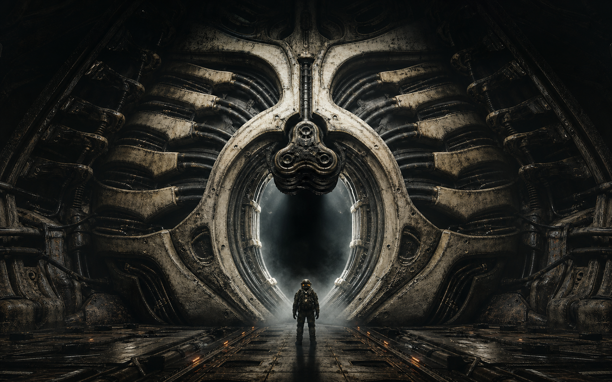
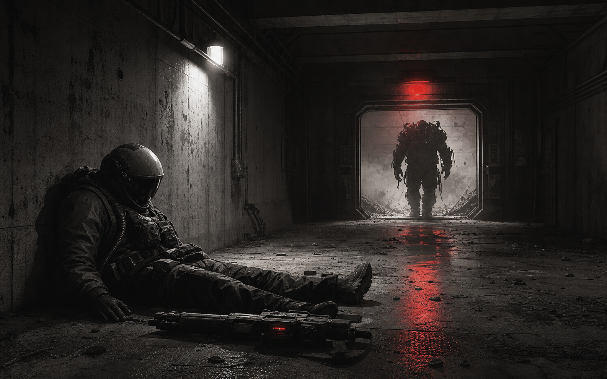

<p align="center">
  
</p>

# HUNKER BUNKER

<p align="center">
  <a href="https://github.com/grounded-play/hunker-bunker/actions/workflows/presubmit.yml"></a>
  <a href="https://app.netlify.com/projects/hunkerbunker/deploys"></a>
  <a href="https://discord.gg/XXwwz3rauu"></a>
  <a href="https://opensource.org/licenses/MIT"></a>
  <a href="https://threejs.org/"></a>
  <a href="https://vitest.dev/"></a>
</p>

> **Crash in. Scavenge O2. Upgrade your suit. Survive the depths.**  
> **Hunker Bunker** is a retro-futuristic tactical survival game where you navigate ice-locked subterranean corridors, balance failing life support, uncover lost telemetry, and decide what leaves the planet with you.

🎮 **[Play Live Browser Build](https://hunkerbunker.netlify.app/)** • 💬 **[Join Discord Server](https://discord.gg/XXwwz3rauu)** • 📜 **[Steam Readiness Specs](docs/steam-docs-master-index.md)**

---

## 📸 Sector Zero Teaser

| Ice-Locked Perimeter | Subterranean Tactical Run | Hostile Sector Contacts |
| :---: | :---: | :---: |
|  |  |  |

---

## ⚡ Core Features

- **Procedural Bunker Runs**: WebGL-powered isometric corridors with dynamic fog of war, environmental hazards, and O2 survival pressure.
- **3 Exosuit Classes**: Distinct playstyles for **Scout** (Speed & Recon), **Tank** (Endurance & Armor), and **Engineer** (Systems & Terminals).
- **Deep Progression**: Bank salvage between runs, research skill tree nodes, craft specialized medkits, and unlock weapons.
- **Branching Decisions & Extraction**: Navigate survivor encounters, discover underground signals, and determine your mission outcome.
- **Live Steamworks Integration**: 5 trusted backend leaderboards, Steam Cloud Auto-Cloud saves, Steam Vault Inventory Service, and 23 Steam Achievements.
- **In-Game Dev & QA Console (`~`)**: Real-time diagnostic telemetry, event interceptors, audio/network monitors, and QA cheat commands (`resetachievements`).

---

## 🛡️ Specialist Classes

| SCOUT | TANK | ENGINEER |
| :---: | :---: | :---: |
|  |  |  |
| **Active Ability**: Sprint Burst<br>Fast recon & high-risk salvage runs. | **Active Ability**: Heavy Brace<br>Absorbs punishment & clears corridors. | **Active Ability**: Systems Reroute<br>Hacks terminals & maximizes extraction. |

---

## 🕹️ Controls

| Action | Keyboard / Mouse | Gamepad / Touch |
| --- | --- | --- |
| **Move** | `WASD` / Arrow Keys | Left Stick / Touch Joystick |
| **Aim & Fire** | Mouse Aim + Left Click | Right Stick / Fire Trigger |
| **Interact** | `E` | Action / Confirm Button |
| **Reload** | `R` | Reload Button |
| **Class Ability** | `F` | Special Ability Button |
| **Radar Scan** | `Q` | Sub-weapon / Scan |
| **Sprint** | `Shift` | Left Stick Click / Sprint Toggle |
| **Dev Telemetry** | `~` (Tilde) | Open Diagnostic Overlay |

---

## 🚀 Quickstart & Setup

### Prerequisites
- **Node.js**: v20 or newer
- **npm**: v9+

```bash
# Clone the repository
git clone https://github.com/grounded-play/hunker-bunker.git
cd hunker-bunker

# Install dependencies & launch dev server
npm install
npm run dev
```
> Open **`http://localhost:5173`** in your browser.

### 🧪 Verification & Build

```bash
npm test         # Run unit test suite (83 files | 677 tests)
npm run lint     # Check formatting & code safety
npm run build    # Compile production WebGL bundle
```

---

## 🛠️ Tech Architecture

- **WebGL 3D Engine**: Powered by **Three.js** (r184) with procedural dungeon generation, dynamic fog of war, and WebAudio spatial soundscapes.
- **Desktop & Steam Shell**: Built with **Electron** featuring native **Steamworks** integration for Steam Cloud saves, Steam Input, and 23 Steam Achievements.
- **Trusted Relay Server**: Node.js & Express server running in **Docker Compose** behind **Caddy** (`steam.tuesdaycinema.club`), enforcing verified score validation for 5 Steam Leaderboards.


---

## 📄 License & Contact

Distributed under the **MIT License**. Built with ❤️ by **Tuesday Cinema Club**.

- 💬 **Discord**: [Join Server](https://discord.gg/XXwwz3rauu)
- 📧 **Support & Contact**: [Support@TuesdayCinema.Club](mailto:Support@TuesdayCinema.Club)

