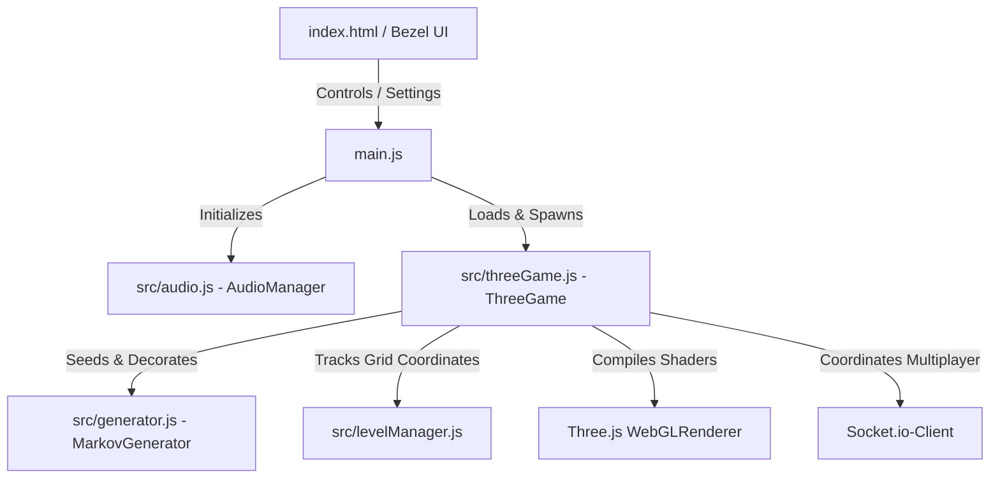

# 🛡️ HUNKER BUNKER | TACTICAL COMMAND v2.0

[](https://github.com/grounded-play/hunker-bunker/actions/workflows/presubmit.yml)
[](https://opensource.org/licenses/MIT)
[](https://threejs.org/)
[](https://phaser.io/)
[](https://socket.io/)
[](https://vitest.dev/)

**HUNKER BUNKER: Tactical Command v2.0** is an immersive, high-performance, retro-futuristic arcade tactics game. Built on a custom 3D WebGL engine utilizing **Three.js** and **Phaser**, players command modular tactical units through an infinite, procedurally generated network of subterranean metallic bunker corridors. 

Featuring an authentic retro CRT arcade aesthetic, custom triplanar shaders, co-prime texture blending, and deep ambient soundscapes, *Hunker Bunker* is engineered for visual splendor, tactile satisfaction, and high replayability.

---

## 🖥️ System Preview (Tactical Console)


> [!NOTE]
> *Hero image captured directly from the Tactical Diagnostic Bezel, showing the 3D Orthographic WebGL corridor maze, Radar Scan Module, and Unit Selection Matrix.*

---

## 🛠️ Key Technical Features

### 🌀 1. Infinite Procedural Maze Generation
Instead of pre-authored maps, *Hunker Bunker* creates seamless, infinite environments at runtime using advanced mathematical algorithms:
* **DFS Maze Carving**: A coordinate-seeded Depth-First Search algorithm constructs 19x19 chunks dynamically as the player moves.
* **Markov-Chain Replacement (MarkovGenerator)**: A sophisticated rule-based 2D replacement engine pattern-matches grid corridors and places tactical obstacles, barriers, and environmental decorations dynamically.
* **Corridor Widening & Portal stitching**: Chunks utilize seeded-hash portal endpoints, ensuring seamless corridor connectivity and pathfinding across adjacent chunk boundaries without dead ends.

### 🧪 2. Advanced WebGL Shaders & Materials
To deliver AAA-grade visuals in a lightweight WebGL package, the engine modifies standard Three.js materials through custom `onBeforeCompile` vertex and fragment shaders:
* **Dynamic Shader-Based Chroma-Keying (Spritesheets)**: To support retro green screen asset pipelines, the game features a custom GLSL chroma-keying shader that samples sprite sheets and discards pure green pixels (`#00FF00` where `g > 0.85 && r < 0.15 && b < 0.15`) in the fragment processor. This enables high-performance transparency masking without pre-baked checkerboard artifacts.
* **Coprime Scale Blending (Floor)**: Blends base metal plates (`bunker_base_metal.png`), grunge rust (`bunker_grunge_rust.png`), and mechanical scratches (`bunker_tech_scratches.png`) at non-repeating co-prime scales. This completely eliminates visual tiling repetitions over infinite maps.
* **Triplanar World-Space Projection (Walls)**: Standard UV mapping stretches textures on custom-proportions mesh blocks. Our triplanar shader projects vertical steel bulkheads along the `ZY` and `XY` planes, and blends them seamlessly with the floor plates projected on the `XZ` plane. The result is perfectly aligned, seamless joints.
* **Glowing Emissive Stencils**: Detail map green/blue channels are sampled inside the fragment shader to produce glowing cyan cybernetic floor circuits, animated with high-intensity pulse states.

### 🎮 3. Tactical Unit Classes
Players select and deploy three distinct specialist units, each mapped to high-quality multi-directional 2D spritesheet animations on 3D billboard planes:
* 🟢 **SCOUT (Agile/Recon)**: High speed, low silhouette, glowing neon green point light signature.
* 🟡 **TANK (Heavy/Armored)**: Heavy protective plates, glowing amber signature, slower movement velocity.
* 🔵 **ENGINEER (Utility/Tech)**: Interactive toolsets, high tech signature, glowing tactical cyan point light.

### 🔊 4. Expressive Audio Design (`audio.js`)
An asset-cached, multi-layered sound engine powered by the Web Audio API:
* **Procedural Transitions**: Vertical door slams, horizontal bulkhead slides, and heavy industrial gear rotations align dynamically with visual UI animations.
* **Dynamic Spatial Ambience**: Heavy tactical hum loops, dripping water, and industrial metal stress sound effects trigger at randomized intervals, immersing players in a desolate subterranean atmosphere.

### 📡 5. Interactive Telemetry Terminals & Exosuit Upgrades
Integrated around the starting sector, crashed ship wreckage nodes function as tactical telemetry bases:
* **Real-time Diagnostic Consoles**: Players can access consoles with direct feedback displays indicating Reactor Stability, Shield Intensity, and Exosuit energy levels.
* **Modular Upgrades**: Dynamically spend collected salvage points to upgrade exosuit properties like hull integrity and radar range.
* **Live Suit Synchronization**: Seamlessly hot-swap between Scout, Tank, and Engineer classes directly inside the active sector with visual smoke poof feedback.

### 💎 6. Seeded Loot Pipelines & Magnetic Attractor Mechanics
To reward subterranean exploration, sectors are populated with drop caches and materials:
* **Coarse-to-Fine Rarity System**: Items spawn across four distinct rarity tiers (Basic, Uncommon, Rare, Legendary) using weighted seed-based probability tables.
* **Magnetic Trajectory Attractor**: Items automatically polarize and pull towards the player within a specific magnetic radius using smooth kinematic interpolation.
* **Dynamic Item Classes**: Collect specialized gear categorized into Health, Ammo, Weapon, and Coin/Salvage units to update the persistent HUD counters.

### 🐌 7. Cybernetic Flora, Fauna & Ambient Decor
Subterranean metallic corridors are decorated with procedurally scattered debris and organisms:
* **Bioluminescent Bio-Spores**: Glowing fungal growths in Green, Blue, and Amber variants scattered across dark corners.
* **Cybernetic Cyber-Snails**: Cyber-enhanced snails crawling around the corridors, contributing to the desolate retro-arcade atmosphere.
* **Salvageable Junk Piles**: Interactable debris clusters that burst into loot caches and scrap items upon proximity or impact.

### 🕹️ 8. Hybrid Touch Controls & Tactical HUD Compass
Optimized for cross-platform deployments with zero configuration:
* **Dynamic Device Detection**: Automatic UI morphing adjusts layout styling for touchscreens, activating the virtual analog joystick.
* **Radar Spawn Compass**: A high-contrast HUD compass pointing back to the sector's main telemetry console, showing real-time distance and angle metrics.
* **Audio Mixer Overlay**: Full control over volume channels (Master, Music, SFX/VFX) via an interactive settings mixer panel.

---

## 📐 Project Architecture



### Key Modules
* [main.js](./main.js): Orchestrates UI splash transitions, debug/calibration grids, fullscreen toggles, and state syncing.
* [src/threeGame.js](./src/threeGame.js): Core WebGL renderer, setup for lighting, triplanar wall/floor shaders, sprite animator, and collision boundaries.
* [src/generator.js](./src/generator.js): Seeded-random number generator and the rules-based Markov pattern replacements.
* [src/audio.js](./src/audio.js): Decodes and manages multi-channel audio nodes, including volume smoothing and unlock triggers.

---

## ⚡ Quick Start

### Prerequisites
* [Node.js](https://nodejs.org/) (v20+ recommended)
* `npm` (Node Package Manager)

### Installation
1. Clone the repository:
   ```bash
   git clone https://github.com/grounded-play/hunker-bunker.git
   cd hunker-bunker
   ```
2. Install all development and core dependencies:
   ```bash
   npm install
   ```

### Running Locally
* **Launch Client (Vite Dev Server)**:
  ```bash
  npm run dev
  ```
  *This spins up the game server. Open `http://localhost:5173` (or the host IP shown in terminal) in your browser.*

* **Launch Multiplayer Relay Server (Optional)**:
  ```bash
  npm run server
  ```
  *Runs the Socket.io node server at `http://localhost:3000` to handle peer synchronization.*

### Running Diagnostics & Tests
* **Run Unit Tests (Vitest)**:
  ```bash
  npm run test
  ```
* **Generate Code Coverage Report**:
  ```bash
  npm run coverage
  ```
* **Lint Source Code**:
  ```bash
  npm run lint
  ```

## 🎮 Controls & Console Interface

| Command / Action | Desktop Inputs | Touch/Mobile Inputs |
| :--- | :--- | :--- |
| **Movement** | `W`, `A`, `S`, `D` or `Arrow Keys` | Virtual Analog Joystick |
| **Interact / Access Console** | `E` key near wreckage terminals | "TAP TO ACCESS" HUD Prompt |
| **Upgrade Attributes** | Click interface cards in Console | Tap interface cards in Console |
| **Class Hot-Swap** | Trigger suit synchronizer in Console | Trigger suit synchronizer in Console |
| **Open Menu / Settings** | Click `SETTINGS` button | Tap `SETTINGS` button |
| **Adjust Audio Channels** | Drag Mixer Sliders in settings | Drag Mixer Sliders in settings |

---

## 📈 Backing / Funding & Commercial Roadmap

We are seeking strategic backing and development funding to expand *Hunker Bunker* from a high-fidelity prototype into a commercial multiplayer tactical experience. Our vision includes:

### Phase 1: Dynamic Multiplayer Synchronization
* Full Socket.io peer state-replication allowing up to 4 players to explore the infinite procedural bunkers simultaneously.
* P2P collision matrix and specialized roles (e.g. Engineer hacking doors open while Tank holds off threats).

### Phase 2: Expanded Tactical Arsenal
* Integrated weaponry, turret deployments, and deployable shields.
* Diverse rogue-like enemy classes governed by state-machine tactical AI.

### Phase 3: Commercial WebGL & Native Distribution
* High-optimization builds targeted at Steam WebGL integration, itch.io, and mobile native wrappers (e.g. Capacitor/Cordova).
* Dedicated visual upgrades including Triplanar Bump Mapping, customizable bulkhead parts, and cinematic lighting filters.

---

## 🤝 Contributing & Support

*Hunker Bunker* is developed by the **Tuesday Cinema Club**. We welcome contributions from developers, artists, and sound designers!

* **Website / Contact**: [Tuesday Cinema Club Linktree](http://linktr.ee/Tuesday_Cinema_Club)
* **Issues / Feature Requests**: Please submit a ticket via our Github Issues page.

---

### 📄 License
This project is licensed under the MIT License - see the [LICENSE](./LICENSE) file for details.
