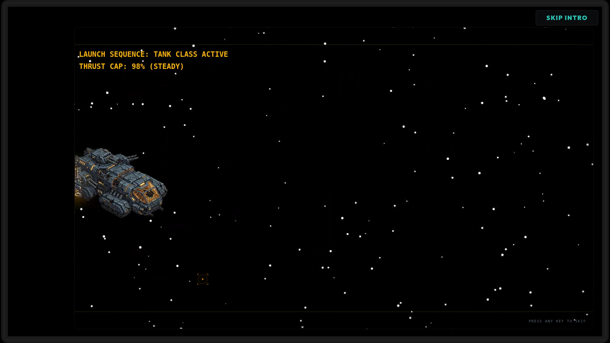
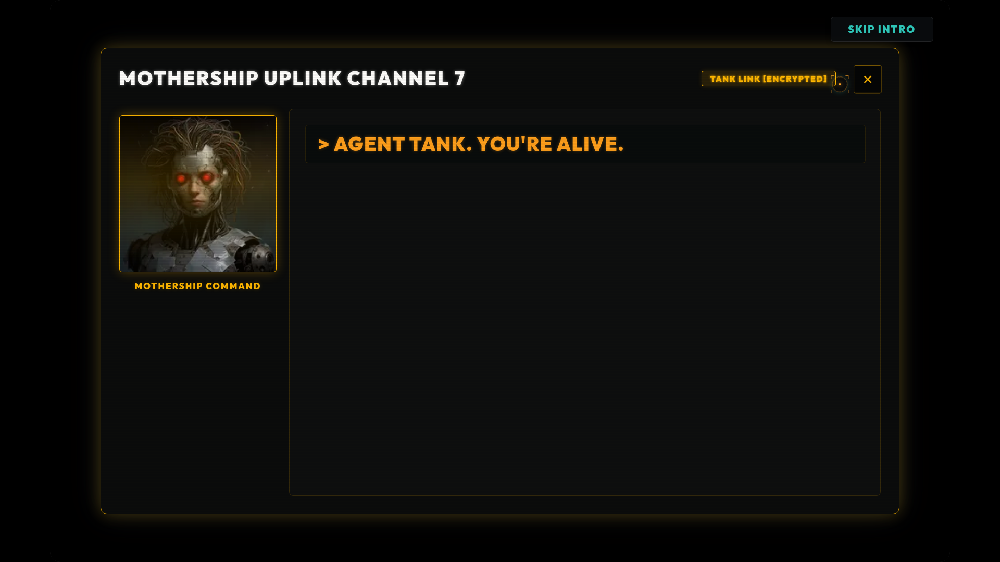
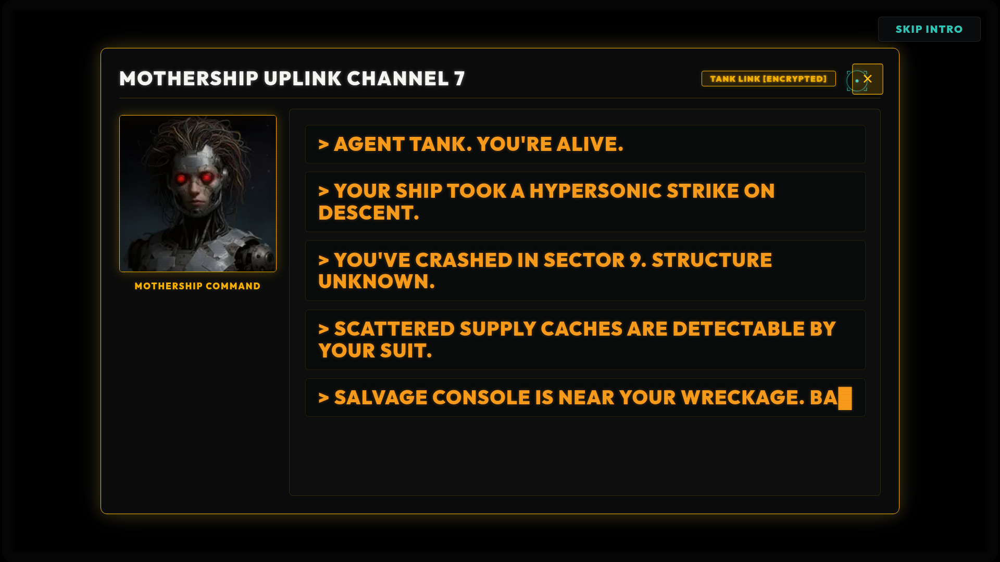
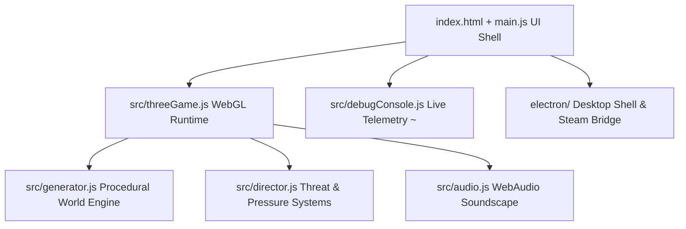

<p align="center">
  
</p>

# HUNKER BUNKER

<p align="center">
  <a href="https://github.com/grounded-play/hunker-bunker/actions/workflows/presubmit.yml"></a>
  <a href="https://app.netlify.com/projects/hunkerbunker/deploys"></a>
  <a href="https://discord.gg/XXwwz3rauu"></a>
  <a href="https://opensource.org/licenses/MIT"></a>
  <a href="https://threejs.org/"></a>
  <a href="https://vitest.dev/"></a>
</p>

> **Crash in. Scavenge O2. Upgrade your suit. Survive the depths.**  
> **Hunker Bunker** is a retro-futuristic tactical survival game where you navigate ice-locked subterranean corridors, balance failing life support, recover lost black boxes, and choose what leaves the planet with you.

🎮 **[Play Live Browser Build](https://hunkerbunker.netlify.app/)** • 💬 **[Join Discord Server](https://discord.gg/XXwwz3rauu)** • 📜 **[Steam Readiness Specs](docs/steam-docs-master-index.md)**

---

## 📸 Tactical Gallery

| Field Combat & Oxygen Depletion | Bunker Tech & Upgrade Tree | Survivor Camps & Factions |
| :---: | :---: | :---: |
|  |  |  |

| Black Box Archive Recovery | Hive Sites & Specimen-0047 |
| :---: | :---: |
|  |  |

---

## ⚡ Core Features

- **Procedural Bunker Runs**: WebGL-powered isometric corridors with dynamic fog of war, environmental hazards, and O2 survival pressure.
- **3 Exosuit Classes**: Distinct playstyles for **Scout** (Speed & Recon), **Tank** (Endurance & Armor), and **Engineer** (Systems & Terminals).
- **Deep Progression**: Bank salvage between runs, research skill tree nodes, craft specialized medkits, and unlock weapons.
- **Multiple Factions & Endings**: Navigate survivor camps (Meridian, Tallow, Vesper), decide the fate of alien hives, and choose your extraction manifest.
- **In-Game Dev Console (`~`)**: Real-time diagnostic telemetry, event interceptors, input logs, and audio/network monitors.
- **Steam & Desktop Ready**: Built-in Electron wrapper, Steam Input binding layer, Steam Cloud saves, and Steam Vault inventory scaffolding.

---

## 🛡️ Specialist Classes

| SCOUT | TANK | ENGINEER |
| :---: | :---: | :---: |
|  |  |  |
| **Active Ability**: Sprint Burst<br>Fast recon & high-risk salvage runs. | **Active Ability**: Heavy Brace<br>Absorbs punishment & clears corridors. | **Active Ability**: Systems Reroute<br>Hacks terminals & maximizes extraction. |

---

## 👁️ Factions of Sector Zero

| Queen | Meridian | Tallow | Vesper |
| :---: | :---: | :---: | :---: |
|  |  |  |  |
| *The hivemind below.* | *Tech-scavengers & order.* | *Hydro-cultists & mercy.* | *Barricade mercenaries.* |

---

## 🕹️ Controls

| Action | Keyboard / Mouse | Gamepad / Touch |
| --- | --- | --- |
| **Move** | `WASD` / Arrow Keys | Left Stick / Touch Joystick |
| **Aim & Fire** | Mouse Aim + Left Click | Right Stick / Fire Trigger |
| **Interact** | `E` | Action / Confirm Button |
| **Reload** | `R` | Reload Button |
| **Class Ability** | `F` | Special Ability Button |
| **Radar Scan** | `Q` | Sub-weapon / Scan |
| **Sprint** | `Shift` | Left Stick Click / Sprint Toggle |
| **Dev Telemetry** | `~` (Tilde) | Open Diagnostic Overlay |

---

## 🚀 Quickstart & Setup

### Prerequisites
- **Node.js**: v20 or newer
- **npm**: v9+

```bash
# Clone the repository
git clone https://github.com/grounded-play/hunker-bunker.git
cd hunker-bunker

# Install dependencies & launch dev server
npm install
npm run dev
```
> Open **`http://localhost:5173`** in your browser.

### 🧪 Verification & Build

```bash
npm test         # Run unit test suite (83 files | 677 tests)
npm run lint     # Check formatting & code safety
npm run build    # Compile production WebGL bundle
```

---

## 🛠️ Tech Architecture



---

## 📄 License & Community

Distributed under the **MIT License**. Built with ❤️ by **Tuesday Cinema Club**.

Join our community on **[Discord](https://discord.gg/XXwwz3rauu)** to report bugs, discuss builds, and test upcoming releases!
