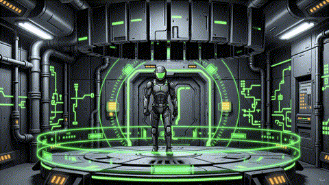
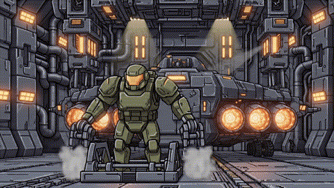

<p align="center">
  
</p>

# HUNKER BUNKER

<p align="center">
  <a href="https://github.com/grounded-play/hunker-bunker/actions/workflows/presubmit.yml?query=branch%3Amothership"></a>
  <a href="https://github.com/grounded-play/hunker-bunker/actions/workflows/steam-build.yml?query=branch%3Amothership"></a>
  <a href="https://github.com/grounded-play/hunker-bunker/actions/workflows/codeql.yml?query=branch%3Amothership"></a>
  <a href="https://github.com/grounded-play/hunker-bunker/actions/workflows/lighthouse.yml?query=branch%3Amothership"></a>
  <a href="https://app.netlify.com/projects/hunkerbunker/deploys"></a>
  <a href="https://discord.gg/XXwwz3rauu"></a>
  <a href="https://opensource.org/licenses/MIT"></a>
  <a href="https://threejs.org/"></a>
</p>

> **Crash in. Scavenge O2. Upgrade your suit. Survive the depths.**  
> **Hunker Bunker** is a biomechanical survival roguelike set beneath the frozen surface of Cocytus IV, built for desktop and Steam Deck with an Electron/Steamworks release path.

🎮 **[Play Live Browser Build](https://hunkerbunker.netlify.app/)** • 💬 **[Join Discord](https://discord.gg/XXwwz3rauu)** • 📚 **[Documentation Index](docs/README.md)** • 🚢 **[Steam / Repo Roadmap](docs/repo-roadmap.md)**

> **Current status — Sprint 30 (2026-08-24):** the project is in a convergence and Steam-readiness phase. Sprint 29's automated presentation/integration gates closed green at **2,150 tests across 255 files**, but important acceptance work remains: packaged desktop/Deck visual verification, physical-hardware frame pacing, a full two-real-Steam-account co-op certification route, and runtime connection of Wanderer quest-objective progression.
>
> The working package version remains **`2.3.1-beta`** while Sprint 30 locks its ship scope. See [`PRODUCT_STATE.md`](PRODUCT_STATE.md) for current truth and [`docs/sprints/sprint-30-plan.md`](docs/sprints/sprint-30-plan.md) for active work.

---

## Core Features

- **Procedural bunker runs** with authored-set-piece support, dynamic hazards, fog of war, O2 pressure, and escalating depth.
- **Three exosuit classes** — Scout, Tank, and Engineer — with distinct movement, durability, systems, weapons, and ability profiles.
- **Buildcraft and progression** across weapons, relics, salvage, research, cosmetics, achievements, and Season 0 rewards.
- **One More Ring / Depth Contract** risk-reward escalation tied into oxygen pressure, salvage value, and director aggression.
- **Act 1 + Act 2 consequence paths** including camps, hives, queen/end-state logic, factions, companions, and multiple endings.
- **Co-op and PvP networking** through Steam/native lobby integration plus a trusted Socket.IO relay/backend path.
- **Steamworks integration** for stats, achievements, inventory/economy surfaces, Cloud bridge, Steam Input, lobby flows, and release packaging.
- **Steam Deck-first controls** with twin-stick aiming, right-stick menu pointer behavior, 1280×800 presentation targets, and GPU diagnostics.
- **In-game QA telemetry** for performance, presentation, networking, weapons, audio, lighting, and developer diagnostics.

---

## Specialist Classes

| SCOUT | TANK | ENGINEER |
| :---: | :---: | :---: |
|  |  |  |
| Fast recon, mobility, and high-risk salvage. | Heavy endurance, armor, and corridor control. | Systems manipulation, hacking, and utility. |

---

## Controls

| Action | Keyboard / Mouse | Gamepad / Steam Deck |
| --- | --- | --- |
| **Move** | `WASD` / Arrow Keys | Left Stick |
| **Aim & Fire** | Mouse Aim + Left Click | Right Stick + Fire Trigger |
| **Interact** | `E` | Action / Confirm |
| **Reload** | `R` | Reload |
| **Class Ability** | `F` | Special Ability |
| **Radar Scan** | `Q` | Sub-weapon / Scan |
| **Sprint** | `Shift` | Sprint binding |
| **Dev Telemetry** | `~` | Diagnostic overlay where mapped |

---

## Quickstart

### Prerequisites

- **Node.js 22** — CI was standardized on Node 22 during Sprint 29 to match the current Electron/tooling engine requirements.
- **npm** compatible with Node 22.

```bash
# Clone the repository
git clone https://github.com/grounded-play/hunker-bunker.git
cd hunker-bunker

# Install the lockfile exactly
npm ci

# Launch the Vite dev server
npm run dev
```

Open the local URL printed by Vite, normally `http://localhost:5173`.

### Verification

```bash
npm run lint          # ESLint
npm test              # Vitest unit/integration suite
npm run presubmit     # Generated/content/asset/catalog audits
npm run build         # Production Vite build + media audit
npm run coverage      # Coverage run
npm run test:e2e      # Playwright E2E suite
```

For Steam/Electron work, use the release and packaging commands in `package.json` and the platform documentation under `docs/` / `steam/`. A passing browser test is not a substitute for packaged-build acceptance when the feature depends on Electron, Steamworks, physical hardware, audio/media unpacking, or multiple real Steam accounts.

---

## Architecture at a Glance

- **Three.js / WebGL runtime** for the 3D bunker world, procedural generation, actors, lighting, effects, and overlays.
- **Electron desktop shell** with native Steamworks integration and packaged asset handling.
- **Node/Express + Socket.IO backend/relay** for trusted multiplayer and Steam-adjacent server behavior.
- **Self-hosted production backend path** using Docker Compose + Caddy at `steam.tuesdaycinema.club`; other deployment configs in the repo are being classified during Sprint 30 so legacy paths are not mistaken for production requirements.
- **Vite + Vitest + Playwright + ESLint** for build/test/development workflow.

The repository is mature enough that several root runtime files have become large. Sprint 30's roadmap favors gradual, test-backed extraction by responsibility rather than a risky wholesale rewrite. See [`docs/repo-roadmap.md`](docs/repo-roadmap.md).

---

## Documentation

Start here instead of searching sprint filenames:

- [`PRODUCT_STATE.md`](PRODUCT_STATE.md) — what is true today.
- [`docs/README.md`](docs/README.md) — documentation lifecycle and navigation rules.
- [`docs/repo-roadmap.md`](docs/repo-roadmap.md) — prioritized path toward a Steam-quality game.
- [`docs/sprints/sprint-30-plan.md`](docs/sprints/sprint-30-plan.md) — current sprint.
- [`docs/releases/`](docs/releases/) — release history.
- [`docs/versioning-and-release-roadmap.md`](docs/versioning-and-release-roadmap.md) — versioning/release process.

Historical sprint plans, audits, prompts, and transcripts are evidence of decisions at a point in time; they are not automatically current product truth.

---

## Contributing

Hunker Bunker is developed in the open under the MIT License.

1. Read [`CONTRIBUTING.md`](CONTRIBUTING.md).
2. Read [`PRODUCT_STATE.md`](PRODUCT_STATE.md) and the current sprint plan before choosing work.
3. Prefer work from [`docs/repo-roadmap.md`](docs/repo-roadmap.md) so new breadth does not outrank older Steam acceptance gates.
4. Run the relevant automated gates before opening a PR.
5. For player-facing, packaged, Steam, or hardware-specific changes, record the acceptance evidence the change actually requires.

💬 **Discord:** [Join Server](https://discord.gg/XXwwz3rauu)

---

## License & Contact

Distributed under the **MIT License**. Built by **Tuesday Cinema Club**.

- **Support:** Support@TuesdayCinema.Club
- **Discord:** [Join Server](https://discord.gg/XXwwz3rauu)
