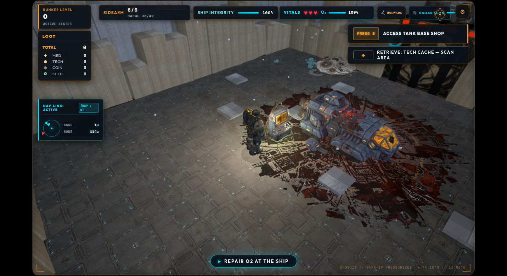
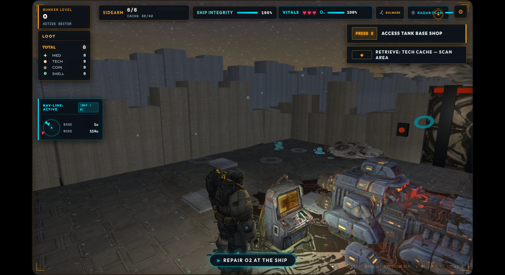
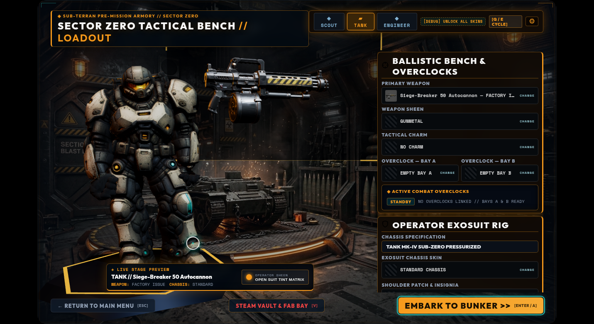
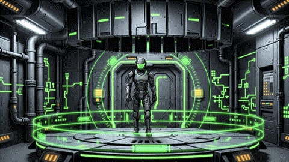
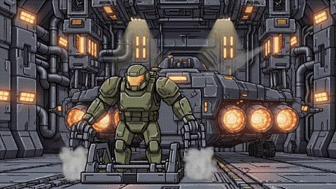
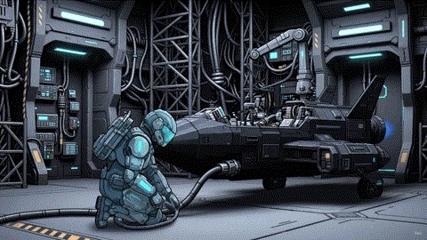

<p align="center">
  
</p>

# HUNKER BUNKER

<p align="center">
  <a href="https://github.com/grounded-play/hunker-bunker/actions/workflows/presubmit.yml?query=branch%3Amothership"></a>
  <a href="https://github.com/grounded-play/hunker-bunker/actions/workflows/steam-build.yml?query=branch%3Amothership"></a>
  <a href="https://github.com/grounded-play/hunker-bunker/actions/workflows/codeql.yml?query=branch%3Amothership"></a>
  <a href="https://github.com/grounded-play/hunker-bunker/actions/workflows/lighthouse.yml?query=branch%3Amothership"></a>
  <a href="https://app.netlify.com/projects/hunkerbunker/deploys"></a>
  <a href="https://discord.gg/XXwwz3rauu"></a>
  <a href="https://opensource.org/licenses/MIT"></a>
  <a href="https://threejs.org/"></a>
</p>

> **Crash in. Scavenge O2. Upgrade your suit. Survive the depths.**  
> **Hunker Bunker** is a retro-futuristic tactical survival game where you navigate ice-locked subterranean corridors, balance failing life support, uncover lost telemetry, and decide what leaves the planet with you.

🎮 **[Play Live Browser Build](https://hunkerbunker.netlify.app/)** • 💬 **[Join Discord Server](https://discord.gg/XXwwz3rauu)** • 📚 **[Documentation Map](docs/README.md)**

> **Status (2026-09-24):** Sprint 47 is on `dev/sprint-47` at `v2.4.12-beta`, prepared for release PR into `mothership` pending tonight's QA session. This release completes **Invisible Essentials Phase 4** (pure pneumatic transit network, milestone boss defeat extraction terminal unlocking, sanctuary return teleportation, and tactical map breadcrumbs) and provides rigorous verification suites proving readiness for closure of 4 milestone issues: Persistence (#78), Fabrication Bay (#80), Hero Selection (#81), and Armory (#82).
>
> Verified locally on 2026-09-24: **4,201 passing tests across 469 files** (100% green), clean lint (`eslint .` 0 errors), `npm run audit:docs` passing, and all 19 milestone verification tests green. Hardware testing checklist for tonight covers Steam Deck 60 FPS thermal limits, two-account co-op relay transit sync, and cross-device Steam Cloud save persistence. See [`docs/releases/v2.4.12-beta.md`](docs/releases/v2.4.12-beta.md), [`docs/planning/invisible-essentials-2026-09-24.md`](docs/planning/invisible-essentials-2026-09-24.md), and [Product State](PRODUCT_STATE.md).

---

## 📸 Sector Zero Visual Showcase

### 🎮 Recent Playthrough Captures

| Tactical Bunker Run (Isometric) | Hostile Sector Engagement (Perspective) | 3D Armory & Weapon Bench |
| :---: | :---: | :---: |
|  |  |  |

### 🌌 Deep Crust Lore & Interstitials

| Warmth Beneath the Ice | Gigawatt Goliath (Apex Threat) | The Cave Was Breathing |
| :---: | :---: | :---: |
|  |  |  |

---

## ⚡ Core Features

- **Persistent Campaigns, Seeded Expeditions**: A campaign keeps one world — its rings, gates, camps and hives — while every deployment rolls its own condition (gale, spore bloom, resin surge, geothermal arc, stillness) with real gameplay effects, fresh corridor rubble and a briefing. New campaigns get their own route shape, gate challenges and an optional objective package for each ship goal, with a reward and a lasting consequence.
- **A World That Remembers**: Bridge the canyon, fortify a camp's perimeter, bond with or harvest a hive — each choice changes the map for the rest of the campaign. Overnight, hive creep spreads and camps strain; radar scans lift the fog on the tactical map as they sweep.
- **Deep Localization (7 Languages)**: Complete localization across **English (`en`)**, **German (`de`)**, **Latin American Spanish (`es-419`)**, **Japanese (`ja`)**, **Brazilian Portuguese (`pt-BR`)**, **Russian (`ru`)**, and **Simplified Chinese (`zh-CN`)** — 0 unannotated markup, 0 unlocalized runtime strings, 1,898 keys per locale at exact parity, live in-session switching, and a coverage ratchet (`npm run i18n:audit`) that fails CI if any of those regress.
- **Alternate Radio Voice Banks & Personas**: Equip the grizzled Soviet Sub-Commander (`4148`) or tactical AI AURA (`4149`) with 104 callout slots (208 authentic takes), intro cutscene HUD persona cards, and customized opening crash dialogue.
- **10 Branching Motion Endings**: Survivor encounters, faction standing with the Meridian/Tallow/Vesper camps, and hive diplomacy determine which of ten fully-rendered 3D motion cinematic endings with dedicated audio beds you achieve.
- **AgX Tone Mapping & Reflective IBL**: High-dynamic-range reflection probes, space HDRI lighting, selective bloom, and upgraded tilt-shift diorama bokeh for gritty biomechanical depth.
- **3 Exosuit Classes**: Distinct playstyles for **Scout** (Speed & Recon), **Tank** (Endurance & Armor), and **Engineer** (Systems & Terminals).
- **Deep Progression**: Bank salvage between runs, research a full combat skill tree, craft specialized gear, and level a **50-tier Season 0 Battle Pass**.
- **Real Multiplayer**: Socket.IO relay lobby with LAN and online play — drop in with a friend or run solo against AI.
- **Steamworks Integration**: Code-backed support for trusted leaderboards, Steam Cloud saves, Steam lobbies, the Steam Vault economy, and 24 achievements. Production acceptance varies by feature and is tracked in [Product State](PRODUCT_STATE.md).
- **In-Game Dev & QA Console (`~`)**: Real-time diagnostic telemetry, event interceptors, audio/network monitors, and QA cheat commands (`resetachievements`).

---

## 🛡️ Specialist Classes

| SCOUT | TANK | ENGINEER |
| :---: | :---: | :---: |
|  |  |  |
| **Active Ability**: Sprint Burst<br>Fast recon & high-risk salvage runs. | **Active Ability**: Heavy Brace<br>Absorbs punishment & clears corridors. | **Active Ability**: Systems Reroute<br>Hacks terminals & maximizes extraction. |

---

## 🕹️ Controls

| Action | Keyboard / Mouse | Gamepad / Touch |
| --- | --- | --- |
| **Move** | `WASD` / Arrow Keys | Left Stick / Touch Joystick |
| **Aim & Fire** | Mouse Aim + Left Click | Right Stick / Fire Trigger |
| **Interact** | `E` | Action / Confirm Button |
| **Reload** | `R` | Reload Button |
| **Class Ability** | `F` | Special Ability Button |
| **Radar Scan** | `Q` | Sub-weapon / Scan |
| **Sprint** | `Shift` | Left Stick Click / Sprint Toggle |
| **Dev Telemetry** | `~` (Tilde) | Open Diagnostic Overlay |

---

## 🚀 Quickstart & Setup

### Prerequisites
- **Node.js**: v22 or newer (matches CI)
- **npm**: the version bundled with Node.js 22 or newer

```bash
# Clone the repository
git clone https://github.com/grounded-play/hunker-bunker.git
cd hunker-bunker

# Install dependencies & launch dev server
npm install
npm run dev
```
> Open **`http://localhost:5173`** in your browser.

For the desktop shell, `npm run electron:dev` runs Electron against the dev server with DevTools detached and the F12 / Ctrl+Shift+I and F5 / Ctrl+R shortcuts. Set `HB_DEVTOOLS_OPEN=0` to keep DevTools closed, or list Chrome Web Store extension IDs in `HB_DEVTOOLS_EXTENSIONS` (comma-separated) to install them.

### 🧪 Verification & Build

```bash
npm test         # Run the complete unit and integration test suite
npm run coverage # Run tests and generate the coverage report
npm run lint     # Check formatting & code safety
npm run build    # Compile production WebGL bundle
npx playwright test tests/e2e/<spec>.spec.js  # Browser specs (each cold-boots the game; allow ~30s–3m per test)
```

Other agents or editors changing `src/` make a watched Vite server reload the page mid-test; run browser specs against a server without HMR when the tree is busy.

The badges above report the latest merged `mothership` workflow results. Pull
request checks may be newer; use the PR checks view when validating an
unmerged branch.

---

## 🛠️ Tech Architecture

- **WebGL 3D Engine**: Powered by **Three.js** (r186) with procedural dungeon generation, dynamic fog of war, and WebAudio spatial soundscapes.
- **Desktop & Steam Shell**: Built with **Electron** featuring native **Steamworks** integration for Steam Cloud saves, Steam Input, real Steam Lobbies (Friends invite, Join Game, Rich Presence), and 24 Steam Achievements.
- **Trusted Relay Server**: Node.js & Express server running in **Docker Compose** behind **Caddy** (`steam.tuesdaycinema.club`), enforcing verified score validation for 5 Steam Leaderboards and Steam-session-authenticated multiplayer.

---

## 🤝 Join the Team

Hunker Bunker is built in the open. Whether you write code or just want first
crack at every new drop, there's a seat for you.

**Playtesters & community** — the fastest way in. Jump into Discord, play the
live browser build, break things, and tell us what you found. Community
feedback has directly shaped classes, endings, and the economy in this repo.

**Contributors** — this is a real MIT-licensed open-source project, not a
mirror. Bug fixes, balance tuning, new content, tooling — all welcome.
1. Read [`CONTRIBUTING.md`](.github/CONTRIBUTING.md) for the fork/branch/PR workflow.
2. Check [open issues](https://github.com/grounded-play/hunker-bunker/issues) for
   something to grab, or file a [bug report](https://github.com/grounded-play/hunker-bunker/issues/new?template=bug_report.md) /
   [feature request](https://github.com/grounded-play/hunker-bunker/issues/new?template=feature_request.md).
3. `npm test && npm run lint` before you open a PR — CI runs the same checks.

- 💬 **Discord**: [Join Server](https://discord.gg/XXwwz3rauu)
- 🛠️ **Issues & PRs**: [github.com/grounded-play/hunker-bunker](https://github.com/grounded-play/hunker-bunker)

---

## 📄 License & Contact

Distributed under the **MIT License**. Built with ❤️ by **Tuesday Cinema Club**.

- 💬 **Discord**: [Join Server](https://discord.gg/XXwwz3rauu)
- 📧 **Support & Contact**: [Support@TuesdayCinema.Club](mailto:Support@TuesdayCinema.Club)
