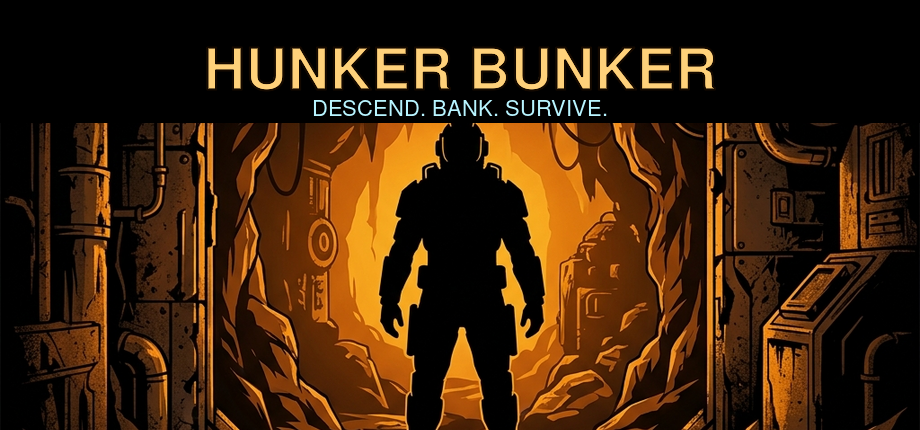
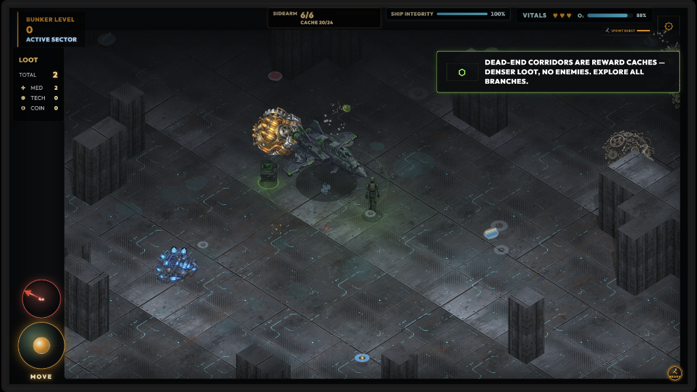
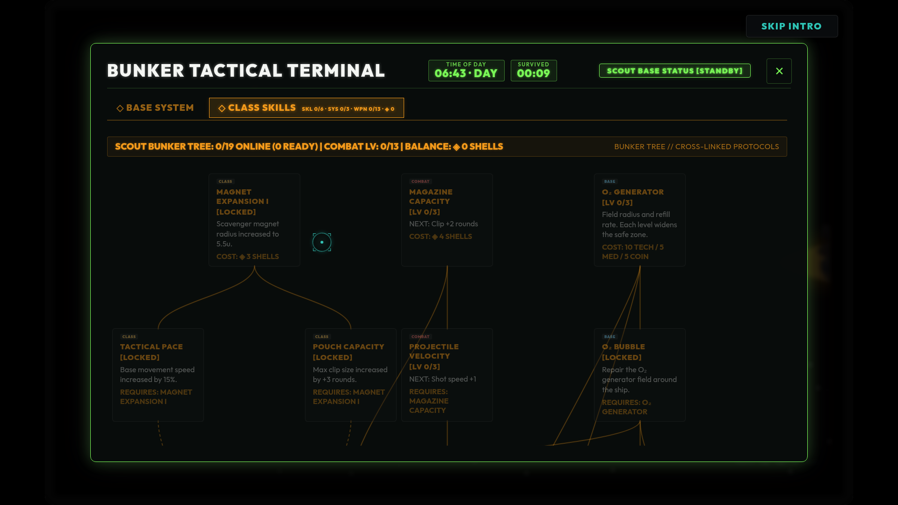
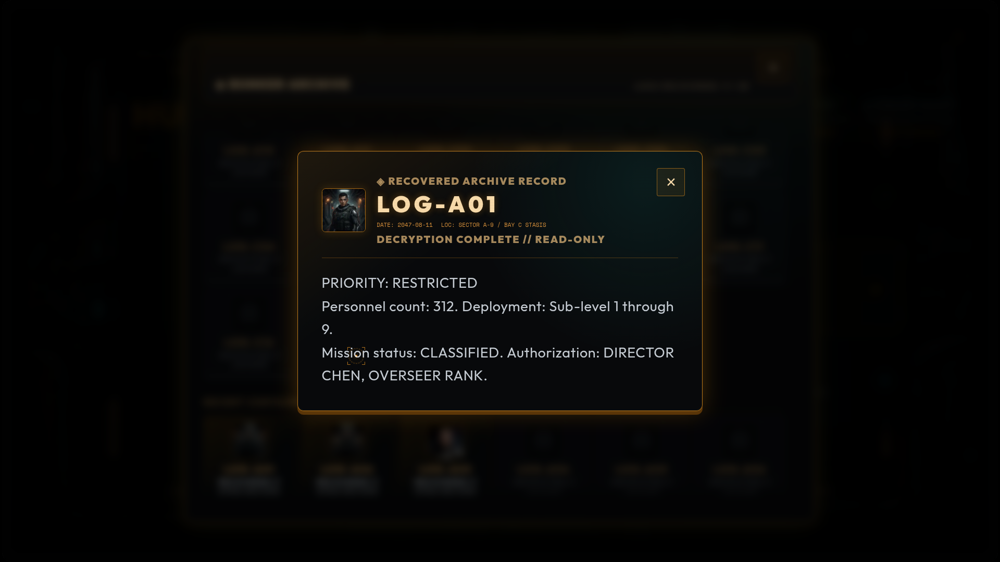
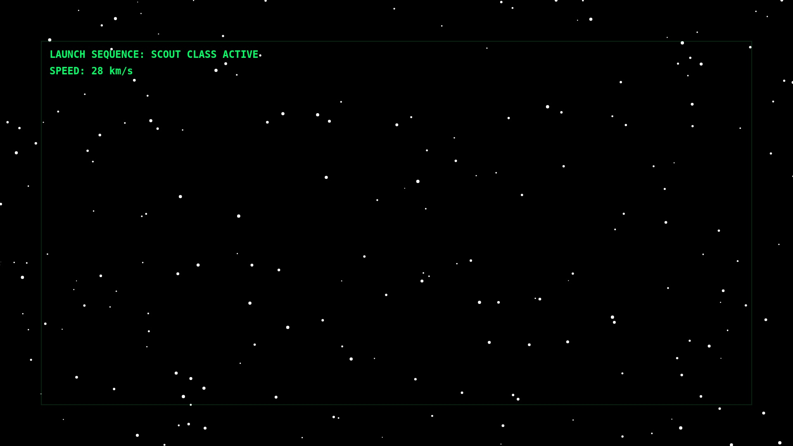
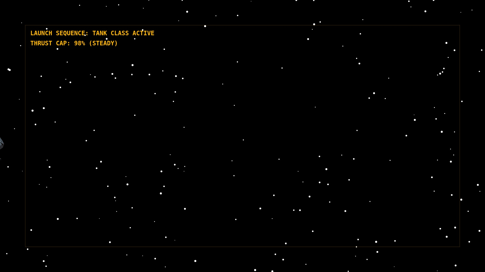
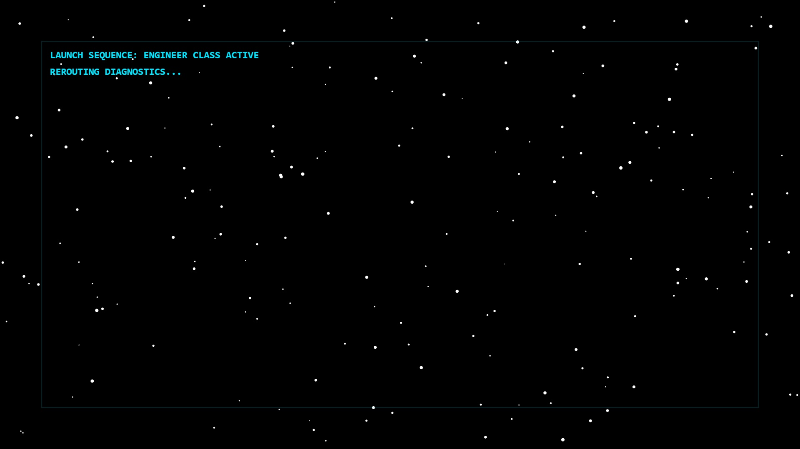
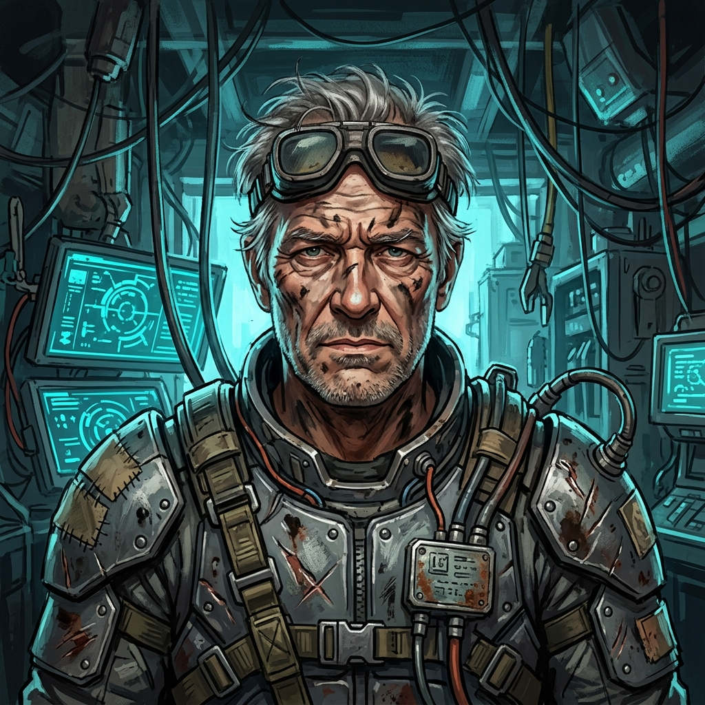
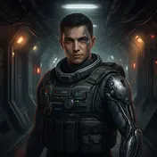
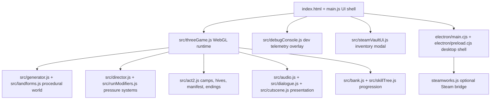

<p align="center">
  
</p>

# Hunker Bunker

[](https://github.com/grounded-play/hunker-bunker/actions/workflows/presubmit.yml)
[](https://app.netlify.com/projects/hunkerbunker/deploys)
[](https://opensource.org/licenses/MIT)
[](https://threejs.org/)
[](https://www.electronjs.org/)
[](https://vitest.dev/)

**Hunker Bunker** is a retro-futuristic tactical survival game about crashing
into an ice-locked bunker, keeping a failing exosuit alive, and deciding what
gets to leave the planet with you.

[Play the live browser build](https://hunkerbunker.netlify.app/) | [Steam planning index](docs/steam-docs-master-index.md) | [Current open gaps](docs/things-we-missed.md)

You command Scout, Tank, and Engineer operators through procedural bunker
corridors, hostile biomes, survivor camps, alien hives, black-box recovery
runs, and a branching Queen/manifest endgame. The web build is playable now;
the Electron/Steam build path is in active preparation and still needs live
Steamworks, hardware, and backend acceptance before release claims are final.

## Screens

| Field Run | Bunker Tree | Lore / Archive |
| --- | --- | --- |
|  |  |  |

## What You Do

- Push deeper through seeded WebGL bunker runs with oxygen, ammo, and salvage
  pressure.
- Choose between three specialist suits: Scout for speed, Tank for endurance,
  Engineer for systems work.
- Repair ship systems, bank salvage, unlock the bunker tree, and survive long
  enough to extract.
- Recover prior contractors' black boxes, then deal with what followed them.
- Discover lore terminals, physical drops, camps, hives, Queen signals, and
  multiple ending vectors.
- Monitor background events and performance using the integrated **Dev Telemetry Console (`~`)**.
- Access **Steam Vault** inventory items, achievements, and Steamworks integration features.

## Current Status

| Area | Status | Notes |
| --- | --- | --- |
| Browser game | Playable | Vite/Three.js build runs on Netlify and locally. |
| Core extraction loop | Implemented | O2 pressure, salvage banking, upgrades, black-box recovery, bosses, and run summaries are active. |
| Classes | Implemented | Scout uses Sprint Burst, Tank uses Brace, Engineer uses Reroute. |
| Story state | Implemented and expanding | Camps, hives, Queen status, eggs, manifest rules, and ending selection are modeled in code. |
| Dev & Diagnostics (`~`) | Implemented | Live telemetry console with category filters (`INPUT`, `LOAD`, `AUDIO`, `GAME`, `STEAM`, `FETCH`, `SYS`, `UNCAUGHT`), DOM click capture, hotkey tracking, and fetch latency timing. |
| Audio & Cutscenes | Implemented | Seamless WebAudio sound engine, video intro crossfades, and smooth blast-door audio fade-outs. |
| Steam Vault / UI | Implemented | Modal catalog UI, Steam drop toasts, milestone grants, and item inventory scaffolding. |
| Steam/Electron | Code-backed | Electron shell, Steam Input, save bridge, achievements/stats forwarding, and backend helpers exist. |
| Multiplayer | Experimental only | Socket.io relay exists for local prototyping. Shipped game is single-player. |

## Operators

| Scout | Tank | Engineer |
| --- | --- | --- |
|  |  |  |
| Fast recon, wide salvage coverage, high-risk oxygen profile. | Heavy survival, stronger shots, slower but steadier under pressure. | System utility, terminal work, and safer recovery windows. |

## Factions And Signals

| Queen | Meridian | Tallow | Vesper |
| --- | --- | --- | --- |
|  |  |  |  |
| The voice under Sector Zero. | Tech-scavengers and systems faith. | Hydro-cultists, care, infection, and mercy. | Security survivors, weapons, barricades, and suspicion. |

## Run Locally

Prerequisites:

- Node.js 20 or newer
- npm

```bash
git clone https://github.com/grounded-play/hunker-bunker.git
cd hunker-bunker
npm install
npm run dev
```

Open the Vite URL printed by the terminal, usually `http://localhost:5173`.

Optional local modes:

```bash
npm run electron:dev      # Electron shell against the Vite dev server
npm run server:start      # Optional Socket.io/backend server
npm run preview           # Preview a production web build
```

## Validation

```bash
npm test                  # Vitest unit tests (14 test suites, 112+ tests passing)
npm run test:e2e          # Playwright browser tests
npm run lint              # ESLint
npm run build             # Production web build
npm run coverage          # Vitest coverage report
```

Steam/deployment helpers:

```bash
npm run steam:dashboard-handoff
npm run steam:audit-backend
npm run steam:audit-backend:strict
npm run steam:audit-depot
npm run electron:build
```

## Controls

Controls can be remapped in-game.

| Action | Keyboard / Mouse | Controller / Touch |
| --- | --- | --- |
| Move | `WASD` or arrow keys | Left stick / touch joystick |
| Aim and fire | Mouse aim + click | Right stick / fire action |
| Interact | `E` | Confirm / tap prompt |
| Reload | `R` | Reload action |
| Class ability | `F` | Ability action |
| Radar scan | `Q` | Scan action |
| Sprint | `Shift` | Sprint action / touch sprint |
| Dev Console / Telemetry | `~` (Tilde) | Toggle diagnostic log overlay |
| Settings / menus | Mouse or keyboard focus | Controller menu navigation where supported |

## Architecture



Key directories:

| Path | Purpose |
| --- | --- |
| `main.js` | Browser UI, HUDs, menus, dialogue surfaces, Steam/frontend event glue. |
| `src/threeGame.js` | Core Three.js game runtime, world mounting, combat, camps, hives, and interactions. |
| `src/debugConsole.js` | In-game tactical dev console (`~`), DOM/hotkey input capture, fetch interceptors, and background logging. |
| `src/steamVaultUi.js` | Steam Vault inventory modal, catalog rendering, and Steam drop toasts. |
| `src/audio.js` | WebAudio sound engine, soundtrack crossfading, SFX buses, and mute controls. |
| `src/data/` | Dialogue, codex, enemies, missions, loot, quests, and run modifier data. |
| `server/` | Backend routes for Steam auth, leaderboards, inventory, store, and persistence. |
| `electron/` | Desktop shell, Steamworks bridge, save-file bridge, and preload API. |
| `steam/` | SteamPipe, inventory schema, dashboard handoff output, and store assets. |
| `public/` | Runtime sprites, portraits, textures, cutscene posters, audio, and store-ready art. |
| `docs/` | Current planning, Steam readiness, design reviews, compliance notes, and runbooks. |
| `tests/e2e/` | Playwright acceptance coverage. |

## Useful Docs

| Doc | Why read it |
| --- | --- |
| [docs/steam-docs-master-index.md](docs/steam-docs-master-index.md) | Best starting point for Steam, UX, and launch-readiness docs. |
| [docs/things-we-missed.md](docs/things-we-missed.md) | Audit of underplanned, unexplored, and dropped work. |
| [docs/ux-and-game-feel-punch-list-2026-07-16.md](docs/ux-and-game-feel-punch-list-2026-07-16.md) | Gameplay and UX punch list for first-hour feel, objectives, combat, and navigation. |
| [docs/steam-launch-readiness-master-plan.md](docs/steam-launch-readiness-master-plan.md) | Canonical Steam readiness plan and acceptance ladder. |
| [docs/steam-deck-first-display-and-input-spec.md](docs/steam-deck-first-display-and-input-spec.md) | Canonical 1280×800 display, Steam Input, desktop parity, and mobile-removal requirements. |
| [docs/steam-portal-copy.md](docs/steam-portal-copy.md) | Store-page copy and feature-claim guardrails. |
| [docs/implementation_plan.md](docs/implementation_plan.md) | Historical multi-ending/faction implementation plan. |

## Contributing

This project moves quickly and has a lot of active planning notes. Before
taking on larger work, skim [docs/things-we-missed.md](docs/things-we-missed.md)
and [docs/steam-docs-master-index.md](docs/steam-docs-master-index.md) so new
changes line up with the current design and release constraints.

Good contribution areas:

- Focused bug fixes with tests.
- UX acceptance improvements from the punch list.
- Small public asset/state-variant additions that improve consequence
  readability.
- Steam/deployment hardening that can be validated locally.
- Documentation that turns vague plans into acceptance-ready tasks.

## License

This project is licensed under the MIT License. See [LICENSE](LICENSE).
