<p align="center">
  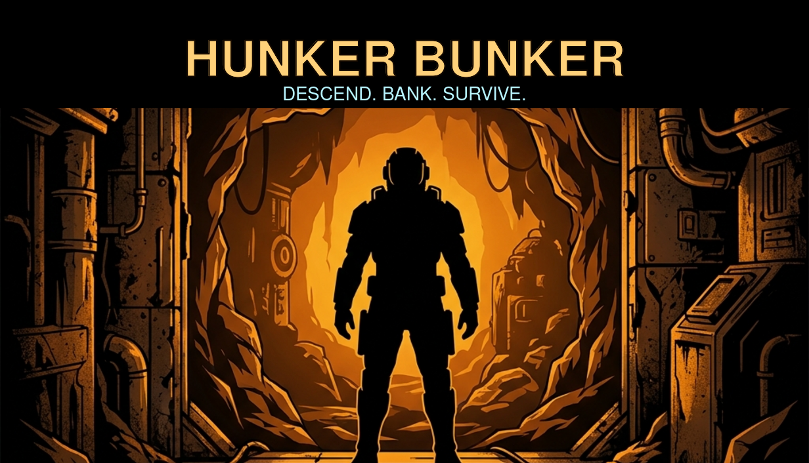
</p>

# HUNKER BUNKER

<p align="center">
  <a href="https://github.com/grounded-play/hunker-bunker/actions/workflows/presubmit.yml?query=branch%3Amothership"></a>
  <a href="https://github.com/grounded-play/hunker-bunker/actions/workflows/steam-build.yml?query=branch%3Amothership"></a>
  <a href="https://github.com/grounded-play/hunker-bunker/actions/workflows/codeql.yml?query=branch%3Amothership"></a><br>
  <a href="https://github.com/grounded-play/hunker-bunker/actions/workflows/lighthouse.yml?query=branch%3Amothership"></a>
  <a href="https://app.netlify.com/projects/hunkerbunker/deploys"></a>
  <a href="https://discord.gg/XXwwz3rauu"></a>
  <a href="https://opensource.org/licenses/MIT"></a>
  <a href="https://threejs.org/"></a>
</p>

> **Crash in. Scavenge O2. Upgrade your suit. Survive the depths.**  
> **Hunker Bunker** is a retro-futuristic tactical survival game where you navigate ice-locked subterranean corridors, balance failing life support, uncover lost telemetry, and decide what leaves the planet with you.

🎮 **[Play Live Browser Build](https://hunkerbunker.netlify.app/)** • 💬 **[Join Discord Server](https://discord.gg/XXwwz3rauu)** • 📚 **[Documentation Map](docs/README.md)**

> **Status (2026-10-06):** Sprint 49 is ready to merge: `dev/sprint-49` at `v2.4.14-beta`, release PR #100 into `mothership`. The Steam `beta` branch runs this release (`f9093289`), and so does the relay server.
>
> New since 2026-10-04:
> - **The Steam store works end to end.**
>   - BUY opens Steam's approval dialog, the keys land in your inventory, and every outcome shows under the buttons.
>   - Beta builds buy through Valve's no-charge sandbox, for listed testers only.
>   - Verified live: a cancel, then two purchases granting 16 keys.
> - **Season 1 is held by the server.** Dossier ranks, directives and fragments are tracked by the backend per Steam account, so rank rewards reach Steam inventory instead of staying "Pending". Verified live: an imported Rank 12 granted its five rank items and three rare fragments. The Dossier opens on your rank, and the Fragment Workshop crafts through Steam.
> - **Records & Leaderboards:** Archive → RECORDS shows a service record, personal bests and per-class records, plus the five Steam boards.
> - **Fixes:**
>   - walls that were invisible on many Windows PCs
>   - a black gameplay screen
>   - placeholder props that are now 3D models
>   - interactable props that paid out on every press
>   - the cache reveal, which played in a hidden window
>   - tab bars that skipped tabs
>   - the PvP winner screen
>
> Already in this release:
> - **Voiced narrative** in seven languages, with developer commentary in the developer's own voice.
> - **Filtered player chat** in co-op and PvP, with mute, block and report.
> - **Lived-in rooms:** modular gateways, dense instanced dressing that can be destroyed (and stays destroyed), and cathedral, cryo-medical and biomech room grammar.
> - **3D overhaul:**
>   - 80 modular kit pieces
>   - 35 restored props
>   - new rigged enemies
>   - hive leaders in 3D
>   - camps, hives and corpses as models
> - **Economy compliance:** Belgium paid-key restriction, Steam price tiers, `GetReport` reconciliation, durable paid grants, and 7-day trade holds.
> - **Co-op and PvP fixes,** and the isometric camera as the default.
>
> **Still open:**
> - a completed two-account co-op expedition (#85)
> - PvP certification (#51), which includes a remote-health drift found on 2026-10-06
> - a physical Deck controller-only route (#53)
> - frame pacing (#52)
>
> See [`docs/releases/v2.4.14-beta.md`](docs/releases/v2.4.14-beta.md) and PR #100.
>
> `v2.4.13-beta` answered Steam build review 25475189 in code:
> - **Multiplayer:** now on the title menu.
> - **Developer commentary:** you can see it, and read all of it.
> - **Controller:** the whole menu set works with a controller, Achievements included.
> - **Content Guide:** in Settings.
> - **Vault store:** sells through the Steam Item Store and Microtransactions, reconciled with `GetReport`.
>
> It also ships:
> - the unified Foundry (one item catalog, the Foundry hub, server-authoritative trade-ups);
> - host-authoritative co-op companions, Ring 1 events and pings;
> - lit, dressed and cut-away bunker rooms;
> - the dock HUD as the default.
>
> Hardware, two-account and Steamworks acceptance are tracked in [Sprint 49](docs/planning/sprint-49.md). See [`docs/releases/v2.4.13-beta.md`](docs/releases/v2.4.13-beta.md) and [Product State](PRODUCT_STATE.md).

---

## 📸 Sector Zero Visual Showcase

### 🎮 Recent Playthrough Captures

| Tactical Bunker Run (Isometric) | Hostile Sector Engagement (Perspective) | 3D Armory & Weapon Bench |
| :---: | :---: | :---: |
| 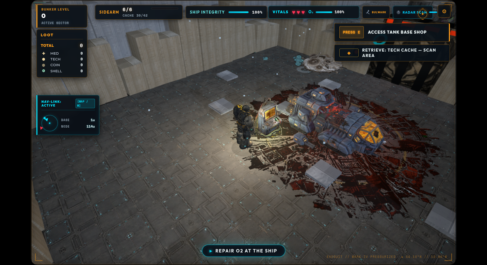 | 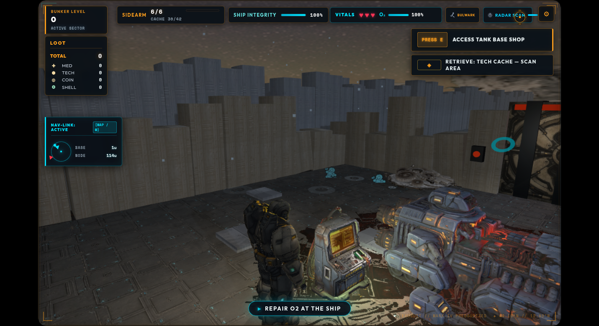 | 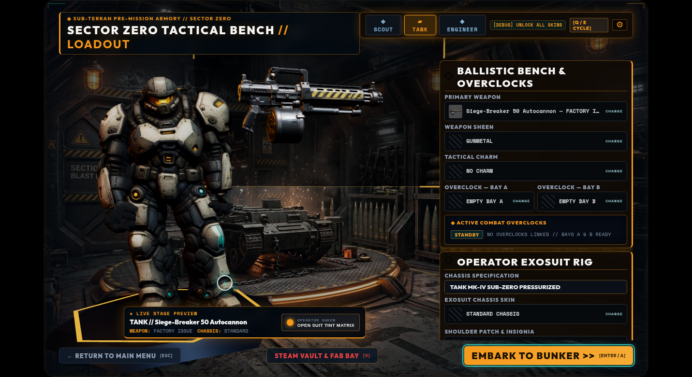 |

### 🌌 Deep Crust Lore & Interstitials

| Warmth Beneath the Ice | Gigawatt Goliath (Apex Threat) | The Cave Was Breathing |
| :---: | :---: | :---: |
| 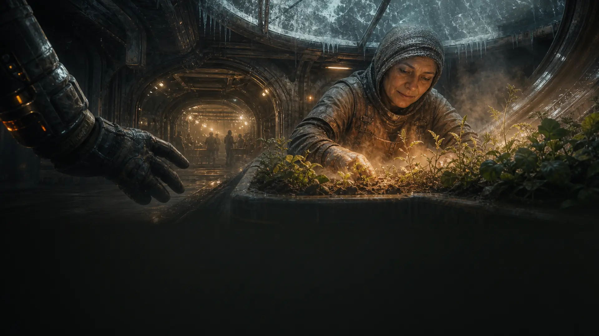 | 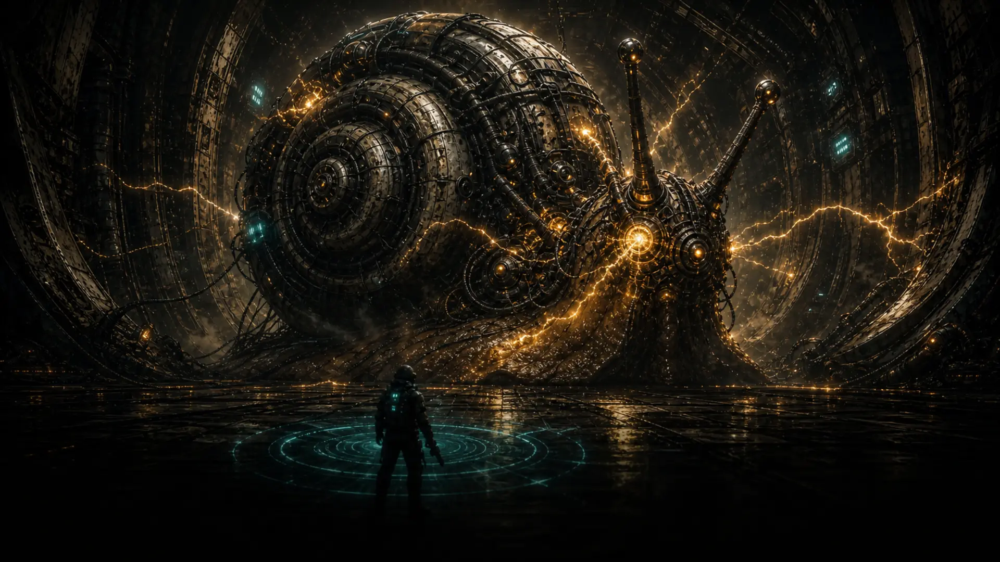 | 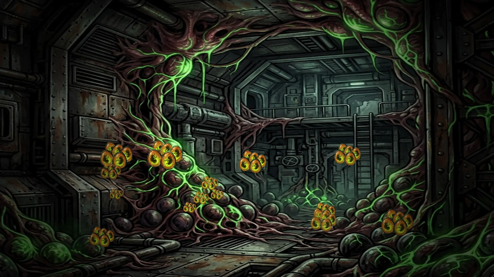 |

---

### 🖼️ Steam Store & Library Art

<p align="center">
  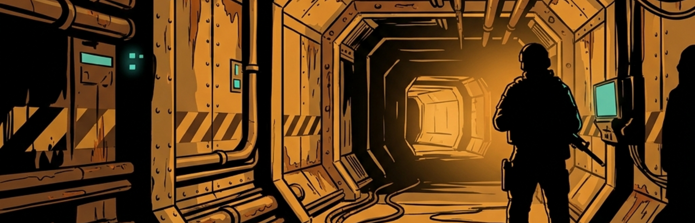
</p>

| Library Capsule | Vertical Capsule | Small Capsule & Logo |
| :---: | :---: | :---: |
| 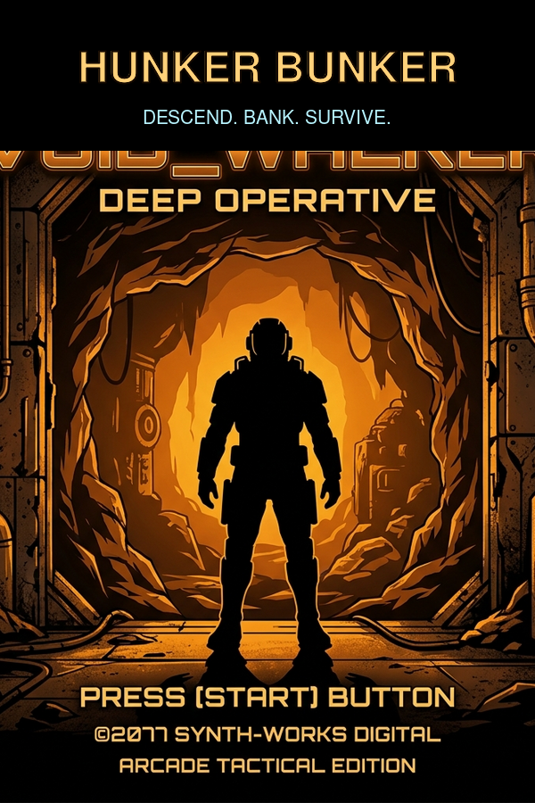 | 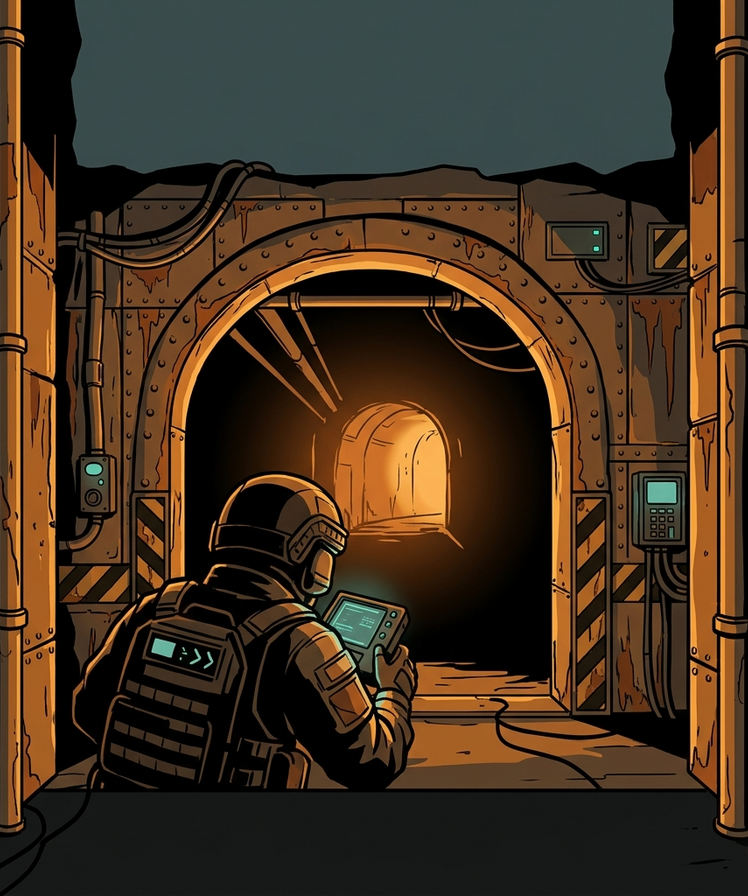 | 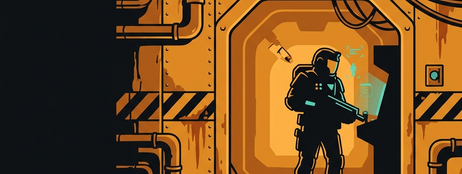<br><br>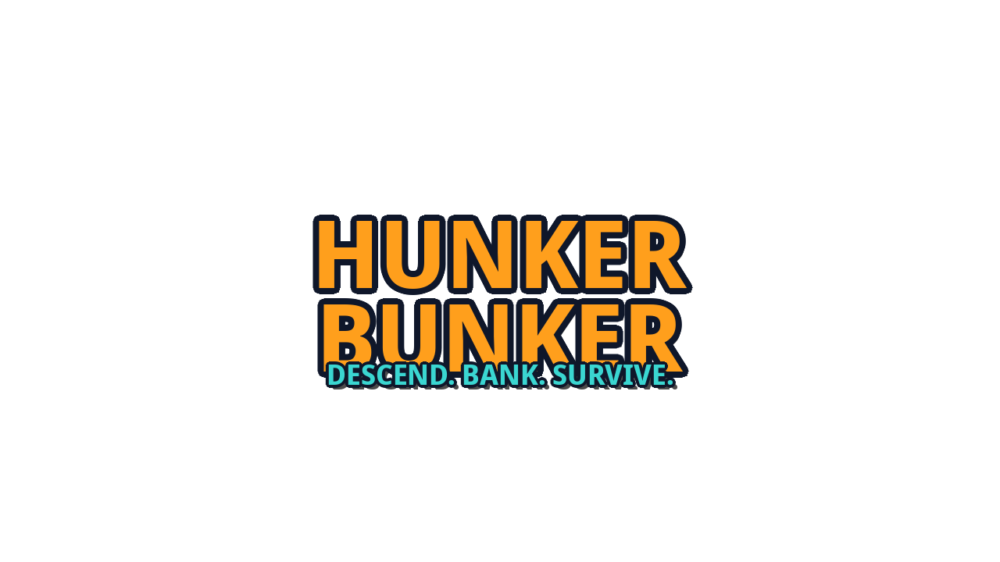 |

All store and library art lives in [`steam/store/`](steam/store/) (English slots; replacements use the same file names).

---

## ⚡ Core Features

- **Persistent Campaigns, Seeded Expeditions**: A campaign keeps one world — its rings, gates, camps and hives — while every deployment rolls its own condition (gale, spore bloom, resin surge, geothermal arc, stillness) with real gameplay effects, fresh corridor rubble and a briefing. New campaigns get their own route shape, gate challenges and an optional objective package for each ship goal, with a reward and a lasting consequence.
- **A World That Remembers**: Bridge the canyon, fortify a camp's perimeter, bond with or harvest a hive — each choice changes the map for the rest of the campaign. Overnight, hive creep spreads and camps strain; radar scans lift the fog on the tactical map as they sweep.
- **Deep Localization (7 Languages)**: Complete localization across **English (`en`)**, **German (`de`)**, **Latin American Spanish (`es-419`)**, **Japanese (`ja`)**, **Brazilian Portuguese (`pt-BR`)**, **Russian (`ru`)**, and **Simplified Chinese (`zh-CN`)** — 0 unannotated markup, 0 unlocalized runtime strings, 1,898 keys per locale at exact parity, live in-session switching, and a coverage ratchet (`npm run i18n:audit`) that fails CI if any of those regress.
- **Alternate Radio Voice Banks & Personas**: Equip the grizzled Soviet Sub-Commander (`4148`) or tactical AI AURA (`4149`) with 104 callout slots (208 authentic takes), intro cutscene HUD persona cards, and customized opening crash dialogue.
- **10 Branching Motion Endings**: Survivor encounters, faction standing with the Meridian/Tallow/Vesper camps, and hive diplomacy determine which of ten fully-rendered 3D motion cinematic endings with dedicated audio beds you achieve.
- **Lit, Readable Bunkers**: Procedural rooms carry their own ceiling strips, role screens, door headers and wet floors, and walls toward the camera are cut down so you can see inside, under AgX tone mapping, IBL reflections and selective bloom.
- **3 Exosuit Classes**: Distinct playstyles for **Scout** (Speed & Recon), **Tank** (Endurance & Armor), and **Engineer** (Systems & Terminals).
- **Deep Progression**: Bank salvage between runs, research a full combat skill tree, craft specialized gear, and level a **50-tier Season 0 Battle Pass**.
- **Online Co-op & PvP**: Title menu → **MULTIPLAYER**. Steam lobbies (public list, friend invites, room codes) over our relay server; the host runs companions, Ring 1 events and drops, and tactical pings work from a controller. Solo runs stay fully offline-capable.
- **The Foundry**: One window for your stash, loadout, fabrication, 5→1 trade-ups and the store. One item catalog means every item looks and reads the same on every screen, and trade-ups on your Steam inventory are decided by the server.
- **Steamworks Integration**: Code-backed support for trusted leaderboards, Steam Cloud saves, Steam lobbies, 24 achievements, and a cosmetic-only Steam Vault economy. That economy covers inventory drops, trade-ups, the Steam Item Store and Microtransactions checkout with `GetReport` reconciliation. It is free to play and never pay to win ([economy plan](docs/planning/economy-master-plan-2026-09-30.md)). Production acceptance varies by feature and is tracked in [Product State](PRODUCT_STATE.md).
- **Developer Commentary**: Settings → Audio → Developer Commentary shows designer notes as you reach the moments they discuss, over the menus as well as in a run; **Read All** lists every note.
- **In-Game Dev & QA Console (`~`)**: Real-time diagnostic telemetry, event interceptors, audio/network monitors, and QA cheat commands (`resetachievements`).
- **3D Asset Museum**: `window.__DEBUG__.openMuseum()` lays out every shipped 3D model at its in-game size and facing (weapons, chassis, NPCs, props, kits, enemies); `window.__DEBUG__.museumReport()` lists each exhibit's load result and measured size.

---

## 🛡️ Specialist Classes

| SCOUT | TANK | ENGINEER |
| :---: | :---: | :---: |
| 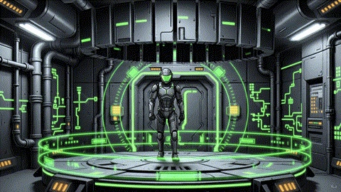 | 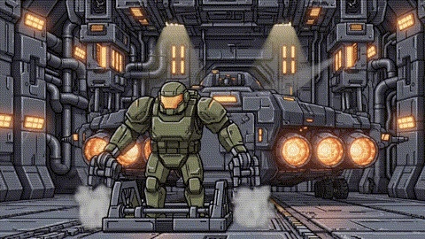 | 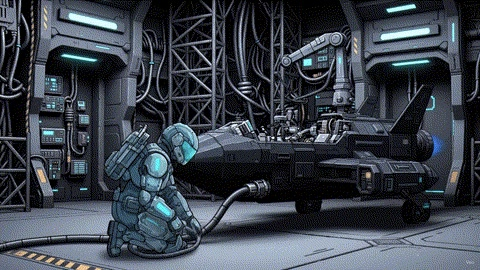 |
| **Active Ability**: Sprint Burst<br>Fast recon & high-risk salvage runs. | **Active Ability**: Heavy Brace<br>Absorbs punishment & clears corridors. | **Active Ability**: Systems Reroute<br>Hacks terminals & maximizes extraction. |

---

## 🕹️ Controls

Full map of every menu, sub-menu and tab, the input model and the UI
improvement plan: [`docs/design/ui-surfaces-menu-map-and-controller-navigation.md`](docs/design/ui-surfaces-menu-map-and-controller-navigation.md).

### Gameplay Controls

| Action | Keyboard / Mouse | Steam Deck / Gamepad (official layout) |
| --- | --- | --- |
| **Move** | `WASD` / Arrow keys | Left stick |
| **Aim & Fire** | Mouse + left click | Right stick or trackpad + **RT** |
| **Interact** | `E` (or `Enter`) | **A** |
| **Dodge** | — | **B** |
| **Reload** | `R` | **X** / D-pad ◀ |
| **Smash / Class Ability** | `F` | **Y** / D-pad ▶ |
| **Scan** | `Q` | **LB** / D-pad ▼ |
| **Tactical Map** | `M` or `Tab` | **RB** / D-pad ▲ / View |
| **Sprint** | `Shift` | Left stick click |
| **Melee** | `V` | — |
| **Tactical Ping** | `T` (with a squadmate in the room, `T` also opens trade) | — |
| **Pause / Settings** | `Esc` | ☰ Menu |
| **Chat** | HUD **CHAT** button, or Pause → Settings → Session → Room Chat | Pause → Settings → Session → Room Chat |
| **Dev Telemetry** | `~` | — |

### 🎮 Controller Navigation & Menu Accessibility

Every menu is built for the Steam Deck stage (1280×800) and driven by one
focus system shared by the pad, the keyboard and the mouse. Every surface is
registered in `MENU_FOCUS_ROOT_IDS` (`src/inputActions.js`) and covered by the
`menu-reachability`, `controller-focus` and `menu-tab-switching` browser suites.

| Action | Steam Deck / Gamepad | Keyboard | Function |
| :--- | :--- | :--- | :--- |
| **Navigate** | D-pad / left stick | `W` `A` `S` `D` or arrows | Spatial focus across buttons, cards and slots; wraps at the edges. |
| **Activate** | **A** or **RT** | `Enter` / `Space` | Equips gear, buys upgrades, selects an operative; A on a dropdown opens its full list. |
| **Back / Close** | **B** | `Esc` | Closes the topmost surface and returns focus to the button that opened it. |
| **Switch Tabs** | **LB** / **RB** (also **X** / **Y**) | `Q` / `E` | Settings, Archive, Foundry hub / Vault, Dossier, ship terminal; class cards on the operator menu and in the Armory. |
| **Adjust Values** | D-pad ◀ ▶ (focused) | `A` / `D` or ◀ ▶ | Sliders, volume, UI scale, dropdowns. |
| **Scroll Text** | D-pad ▲ ▼ | `W` / `S` or ▲ ▼ | Scrolls lore, codex detail and commentary text that has nothing to focus. |
| **Enter Text** | **A** (Steam keyboard; in-game keyboard fallback) | type | Callsign and chat. |
| **Pointer** | Right trackpad / stick cursor + **A** | Mouse | Optional; never the only way to reach a control. |

--- | :--- | :--- | :--- |
| **Navigate Menus & Grids** | **D-Pad** / **Left Stick** | `W`, `A`, `S`, `D` or Arrows | Visual spatial roving focus across buttons, cards, and slots. |
| **Activate / Select** | **A** or **Right Trigger (RT)** | `Enter` or `Space` | Equips gear, confirms upgrades, selects operative. |
| **Back / Cancel** | **B** | `Escape` | Closes topmost modal or returns to previous briefing screen. |
| **Switch Tabs** | **Left Bumper (LB)** / **Right Bumper (RB)** | `Q` / `E` | Cycles tabs in Settings, Armory, Archives, and Terminals. |
| **Adjust Values** | **D-Pad Left** / **Right** (focused) | `Left` / `Right` Arrows | Adjusts sliders, audio volume, UI scale, and dropdown options. |
| **Scroll Text Panels** | **D-Pad Up** / **Down** (text views) | `Page Up` / `Page Down` | Scrolls lore logs, transcripts, and commentary text. |
| **Open Chat** | **View / Select** (or HUD Chat button) | `Enter` or `T` (in gameplay) | Opens the filtered in-game and lobby tactical chat. |
| **Tactical Pointer** | **Right Stick** + **A** click | Mouse Move + Left Click | Optional virtual mouse cursor for freeform pointing. |

---

## 🚀 Quickstart & Setup

### Prerequisites
- **Node.js**: v22 or newer (matches CI)
- **npm**: the version bundled with Node.js 22 or newer

```bash
# Clone the repository
git clone https://github.com/grounded-play/hunker-bunker.git
cd hunker-bunker

# Install dependencies & launch dev server
npm install
npm run dev
```
> Open **`http://localhost:5173`** in your browser.

For the desktop shell, `npm run electron:dev` runs Electron against the dev server with DevTools detached and the F12 / Ctrl+Shift+I and F5 / Ctrl+R shortcuts. Set `HB_DEVTOOLS_OPEN=0` to keep DevTools closed, or list Chrome Web Store extension IDs in `HB_DEVTOOLS_EXTENSIONS` (comma-separated) to install them.

### 🧪 Verification & Build

```bash
npm test         # Run the complete unit and integration test suite
npm run coverage # Run tests and generate the coverage report
npm run lint     # Check formatting & code safety
npm run build    # Compile production WebGL bundle
npx playwright test tests/e2e/<spec>.spec.js  # Browser specs (each cold-boots the game; allow ~30s–3m per test)
```

Other agents or editors changing `src/` make a watched Vite server reload the page mid-test; run browser specs against a server without HMR when the tree is busy.

The badges above report the latest merged `mothership` workflow results. Pull
request checks may be newer; use the PR checks view when validating an
unmerged branch.

---

## 🛠️ Tech Architecture

- **WebGL 3D Engine**: Powered by **Three.js** (r186) with procedural dungeon generation, dynamic fog of war, and WebAudio spatial soundscapes.
- **Desktop & Steam Shell**: Built with **Electron** featuring native **Steamworks** integration for Steam Cloud saves, Steam Input, real Steam Lobbies (Friends invite, Join Game, Rich Presence), and 24 Steam Achievements.
- **Trusted Relay Server**: Node.js & Express server running in **Docker Compose** behind **Caddy** (`steam.tuesdaycinema.club`), enforcing verified score validation for 5 Steam Leaderboards and Steam-session-authenticated multiplayer.

---

## 🤝 Join the Team

Hunker Bunker is built in the open. Whether you write code or just want first
crack at every new drop, there's a seat for you.

**Playtesters & community** — the fastest way in. Jump into Discord, play the
live browser build, break things, and tell us what you found. Community
feedback has directly shaped classes, endings, and the economy in this repo.

**Contributors** — this is a real MIT-licensed open-source project, not a
mirror. Bug fixes, balance tuning, new content, tooling — all welcome.
1. Read [`CONTRIBUTING.md`](.github/CONTRIBUTING.md) for the fork/branch/PR workflow.
2. Check [open issues](https://github.com/grounded-play/hunker-bunker/issues) for
   something to grab, or file a [bug report](https://github.com/grounded-play/hunker-bunker/issues/new?template=bug_report.md) /
   [feature request](https://github.com/grounded-play/hunker-bunker/issues/new?template=feature_request.md).
3. `npm test && npm run lint` before you open a PR — CI runs the same checks.

- 💬 **Discord**: [Join Server](https://discord.gg/XXwwz3rauu)
- 🛠️ **Issues & PRs**: [github.com/grounded-play/hunker-bunker](https://github.com/grounded-play/hunker-bunker)

---

## 📄 License & Contact

Distributed under the **MIT License**. Built with ❤️ by **Tuesday Cinema Club**.

- 💬 **Discord**: [Join Server](https://discord.gg/XXwwz3rauu)
- 📧 **Support & Contact**: [Support@TuesdayCinema.Club](mailto:Support@TuesdayCinema.Club)
