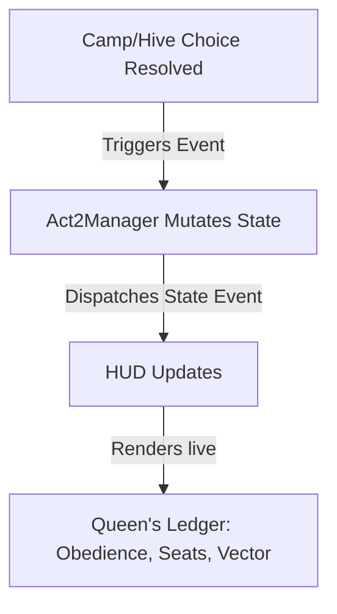

# Sprint 19 Proposal: The Legibility & Boarding Climax Pass

Prepared by: **Antigravity**  
Date: 2026-07-10  
Related Documents:
- [sprint-19-state-and-next.md](file:///home/caveman/Desktop/icecave/hunker-bunker/docs/sprint-19-state-and-next.md)
- [PR_OUTLINE.md](file:///home/caveman/Desktop/icecave/hunker-bunker/PR_OUTLINE.md)
- [game-wide-review-and-solution-plan.md](file:///home/caveman/Desktop/icecave/hunker-bunker/docs/game-wide-review-and-solution-plan.md)

---

## Executive Summary

Having reviewed the current state of Sprint 19, the **consequence engine** is structurally complete. The game knows how to run camp quests, track culls, and evaluate the ending manifest vectors. However, the player is currently blind to this depth: the UI lacks feedback on their moral alignment, the boarding process feels like a generic camp dialogue option rather than a climax, and the ending derivation is completely invisible.

I propose to focus our efforts on the **Legibility Layer** and the **Boarding Climax**. By making the underlying systems communicate clearly with the player, we transform the experience from a series of arbitrary choices into a tense, calculated strategic narrative.

---

## Proposed Milestones

### ♛ Milestone 1: The Queen's Ledger HUD Chip
Make the faction system visible. We will build a persistent, sleek UI widget in the HUD that tracks live alignment data.

*   **Location**: Positioned cleanly below or adjacent to the `#vitals-panel` in the HUD top-bar.
*   **Visuals**:
    *   **Obedience Gauge**: Displays the Queen's alignment (`♛ +2` / `♛ −1`).
    *   **Manifest Seats**: Compact indicator of filled seats (e.g., `Seats: ■■■□` / `3/4`).
    *   **Ending Vector**: Minimal text string showing the currently projected ending family (e.g., `VECT: MIXED CREW`).
*   **Reactivity**: Listens to custom window events (`camp-choice-resolved`, `hive-choice-resolved`, etc.) and animates changes using clean CSS transitions and HSL color coding (cyan for human alignment, amber/green for hive alignment).

---

### 🛈 Milestone 2: Consequence Previews on Choices
The player should never make a run-ending decision blindly. We will update the choice modal so every option displays its mechanical cost and narrative weight *before* confirmation.

*   ** camp-choice-modal Options**:
    *   *Steal Stockpile*: Red text warns of hostility, suspicion spikes, and loss of recruit viability.
    *   *Breach and Cull*: Shows `♛ OBEDIENCE +1`, `SEATS −1`, and the resulting ending vector shift.
    *   *Recruit Humans*: Shows `♛ OBEDIENCE −1`, `SEATS +1`, and warns of suspicion/humanity costs.
    *   *Turn Survivors*: Shows `♛ OBEDIENCE +1`, `SEATS +1` (as hybrid passengers).
*   **Implementation**: Enhance `buildCampChoiceOptions(camp)` and `buildHiveChoiceOptions(hive)` in [threeGame.js](file:///home/caveman/Desktop/icecave/hunker-bunker/src/threeGame.js) to dynamically inject consequence strings derived from `pickAct2Ending` and `buildAct2Manifest`.

---

### ⛟ Milestone 3: Manifest Forecast & Boarding Modal
Boarding the vessel is the climax of Act 2. It needs to look and feel like a pre-flight checklist.

*   **Visual Representation**: A dedicated 4-slot cargo diagram representing the vessel's layout:
    *   **Seat 1**: Player (Carrier / Human).
    *   **Seat 2**: Queen (Aboard / Rejected / Slain).
    *   **Seat 3**: Clutch / Eggs (Aboard / Purged).
    *   **Seat 4**: Recruits / Allied Beings (Martha, Briggs, Kaelen, or Hive Allies).
*   **Block Warnings**: Red alerts if the manifest is invalid (e.g., `OVER CAPACITY` or `UNSTABLE EGG: Requires Nahl or Queen aboard`).
*   **UI Hook**: Interacting with the Boarding console opens this distinct fullscreen grid overlay, bypassing generic text boxes.

---

### 📋 Milestone 4: Run Summary Card
At the end of a run (via exosuite failure or successful departure), we will present a detailed mission report card showing the exact progression of their ending.

*   **Metrics Rendered**:
    *   *Humanity Preserved*: final % and classification.
    *   *Queen Obedience*: final score and relationship.
    *   *Survival Log*: Status of each camp (Meridian, Tallow, Vesper) and hive site.
    *   *Ending Explanation*: A paragraph detailing the fallout of their choices (e.g., why their cargo holds became an outbreak site).

---

## Verification Plan

### 1. Automated Regression Suite
We will protect the existing 229 unit tests and add new target scenarios in `src/act2.test.js` and `scratch/smoke_act2.js`:
*   **Test**: Verify that `pickAct2Ending()` returns correct vectors under complex scenarios (e.g. full alien exodus, Outed Escape).
*   **Test**: Ensure the manifest calculation accurately handles seats under all choices (latent seeds, turned hybrids).

### 2. Manual Verification
*   **UI Smoke Tests**: Trigger `camp-choice-open` with loaded states to verify rendering alignment and styling inside standard layout views.
*   **Boot Tests**: Perform a headless test run of the game using `scratch/smoke_act2.js` to assert successful execution of the ending sequence for every branch.
