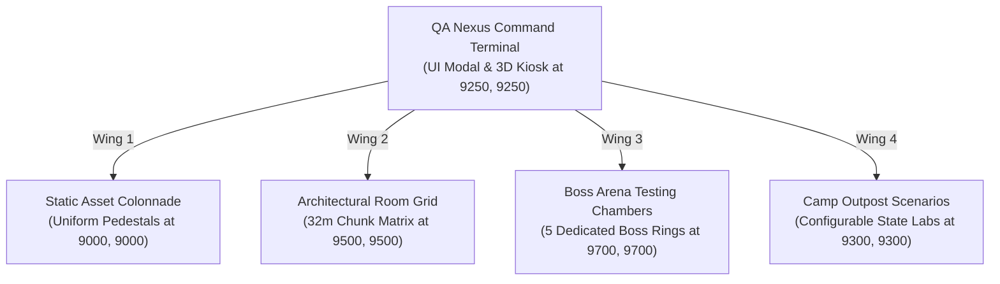

# QA Proving Grounds: Interactive Scenarios & Boss Testing Guide

**Status**: Scenario Test Matrix & Interaction Validation Specification  
**Companion Document**: [`docs/debug-gallery-and-architectural-grid-expansion-plan.md`](debug-gallery-and-architectural-grid-expansion-plan.md)  
**Target Systems**: `src/debugScenarioRunner.js`, `src/qaNexusUi.js`, `main.js`, `src/threeGame.js`  

---

## 1. Overview & Purpose

This guide defines the complete interactive test paths for every **Boss Encounter**, **Survivor Camp Outpost State**, **Hazard Interaction**, and **Mechanic Trigger** in Hunker Bunker. Developers and QA can spawn directly into isolated, pre-configured test chambers to validate mechanics under controlled runtime conditions.



---

## 2. Interactive Boss Fight Test Chambers

Each boss is isolated in a standard $64\text{m} \times 64\text{m}$ circular battle arena with arena-specific lighting, hazard props, and a debug control pedestal to reset health, trigger specific phases, or toggle invincible player shields.

| Boss Encounter | Arena Coordinates | Configurable Test Parameters | Mechanics Validated |
| :--- | :--- | :--- | :--- |
| **1. Cybersnail Prime** | `(9700, 9700)` | Speed multiplier, laser charge delay, slime trail duration | Slime trail slip, laser beam sweep, shell retract phase |
| **2. Cryosnail Behemoth** | `(9780, 9700)` | Frost armor HP, cryo shard volley count, freeze radius | Ice wall destruction, cryo freeze player stun, frost aura |
| **3. Sporesnail Acid Mortar** | `(9860, 9700)` | Spore burst rate, toxic puddle lifespan, acid damage DOT | Spore cloud AOE, mortar trajectory arc, fungal vent spawn |
| **4. Corrupted Operatives**<br>*(Scout / Tank / Engineer)* | `(9940, 9700)` | Class archetype select, shield recharge rate, dash cooldown | Operative clone duels, cybernetic abilities, shield burst |
| **5. Sub-Terran Cave Queen** | `(10020, 9700)` | Phase 1 (Eggs), Phase 2 (Swarm), Phase 3 (Enrage) | 3-phase progression, egg hatching, hive collapse hazard |

### Quick Console Commands
- `boss cybersnail` $\rightarrow$ Teleport to Cybersnail chamber with full loadout
- `boss cryosnail` $\rightarrow$ Teleport to Cryosnail chamber
- `boss sporesnail` $\rightarrow$ Teleport to Sporesnail chamber
- `boss rogue` $\rightarrow$ Teleport to Corrupted Operative arena
- `boss queen` $\rightarrow$ Teleport to Cave Queen 3-phase arena
- `boss phase <1|2|3>` $\rightarrow$ Force active boss into designated phase

---

## 3. Survivor Camp Outpost Scenario Labs

Camp testing chambers allow validating survivor outpost systems under varied resource, power, and structural integrity states:

```
┌────────────────────────────────────────────────────────────────────────┐
│                   CAMP OUTPOST STATE TEST MATRIX                       │
├────────────────────────────────────────────────────────────────────────┤
│ Scenario A: NOMINAL OPERATING STATE                                    │
│ • O₂ Generator: 100% (Green glow, ambient hum, clean aura)             │
│ • Fabricator Workstation: Tier 3 (All blueprint recipes unlocked)      │
│ • Security Barricades: Fully Intact (100% hull integrity)              │
│ • Survivors: Relaxed idle chatter, resting in medical pods            │
├────────────────────────────────────────────────────────────────────────┤
│ Scenario B: CRITICAL OXYGEN DEPLETION                                  │
│ • O₂ Generator: 0% / Damaged (Flashing red beacon, siren klaxon)       │
│ • Ambient Aura: Oxygen countdown active on HUD (30s emergency timer)   │
│ • Objective Trigger: Repair with Coolant Scrap or Alloy Plate          │
├────────────────────────────────────────────────────────────────────────┤
│ Scenario C: OUTPOST SIEGE & DEFENSE WAVE                               │
│ • Security Barricades: Breached / Damaged                              │
│ • Snail Swarm Incursion: 12 cyber/spore snails attacking perimeter     │
│ • Sentry Turrets: Activated with automated target acquisition          │
├────────────────────────────────────────────────────────────────────────┤
│ Scenario D: NPC DIALOGUE & LORE DISCOVERY                              │
│ • NPC Operatives: Interactive prompt [E] opens dialogue modal          │
│ • Audio Transcripts: Plays voiceover line and updates Tactical Dossier │
└────────────────────────────────────────────────────────────────────────┘
```

### Quick Console Commands
- `camp nominal` $\rightarrow$ Load Camp in fully powered, healthy state
- `camp low_o2` $\rightarrow$ Load Camp in 0% O2 emergency repair state
- `camp siege` $\rightarrow$ Spawn active defense wave attacking barricades
- `camp npc <id>` $\rightarrow$ Trigger interactive NPC conversation flow

---

## 4. Environmental Hazard & Interaction Proving Strip

A dedicated linear test strip at `(9300, 9500)` featuring isolated interactive mechanics:

1. **Autodoors & Vault Gates**:
   - Proximity sensor trigger radius test ($4\text{m}$ approach $\rightarrow$ auto open).
   - Keycard required door (Security Level 1/2/3).
   - Lockdown override terminal bypass.
2. **Environmental Traps**:
   - Laser beam grid (damage tick and shield deflection).
   - Bio-sphincter trap & sticky slime puddle (slow movement modifier).
   - Fungal spore vent & coolant geyser (timed eruption cycles).
3. **Player Mechanics**:
   - Downed operative rescue & revive beacon test.
   - 5:1 Smelter trade-up interaction test.
   - Player-to-player trade lockbox confirmation test.

---

## 5. QA Nexus Command Center Modal (`#qa-nexus-modal`)

The QA Nexus Terminal is accessible via keybind, dev command (`nexus`/`qa`), or physical 3D kiosk at `(9250, 9250)`:

### Visual Design Specifications
- **Theme**: Cybernetic Glassmorphism matching Steam Vault and Pre-Mission Armory.
- **Color Tokens**:
  - Background: `rgba(8, 14, 22, 0.97)` with `backdrop-filter: blur(10px)`
  - Primary Border: `1.5px solid rgba(0, 229, 255, 0.45)` (Cyan Glow `#22d3ee`)
  - Accent RGB: `0, 229, 255`
  - Shadow: `0 0 35px rgba(0, 229, 255, 0.22), 0 0 70px rgba(0, 0, 0, 0.9)`
- **Header Structure**:
  - Kicker: `◈ QA NEXUS // COMBAT SIMULATION & SCENARIO CONTROL`
  - Title: `PROVING GROUNDS <span class="qa-title-accent">// COMMAND CENTER</span>`
  - Telemetry Chips: `COORDS: (X, Z)`, `ACTIVE SEED`, `FPS / GC LOAD`
- **Navigation Tabs**:
  1. `[ASSET COLONNADE]` (Teleport to Wing 1)
  2. `[ROOM & TILE MATRIX]` (Teleport to Wing 2)
  3. `[BOSS ENCOUNTERS]` (1-click launch into any of the 5 boss arenas)
  4. `[CAMP SCENARIOS]` (Launch Nominal, Low O2, Siege, or Dialogue states)
  5. `[SYSTEM CHEATS & OVERRIDES]` (God Mode, Infinite Ammo, Instant Scrap, Biome Overrides)
