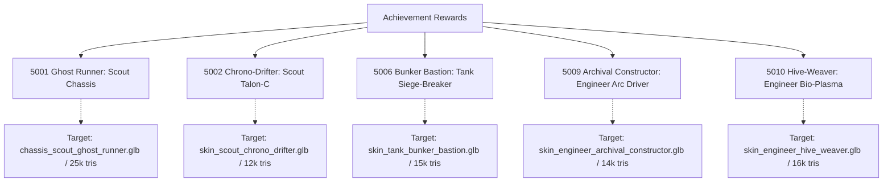
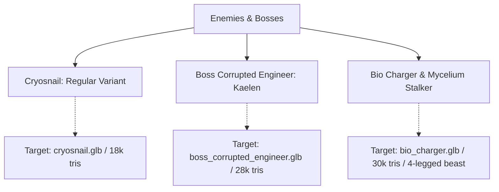

# Missing 3D Assets & Cutscene Cinematics Master Guide

> **Status:** Production Reference · **Owner:** Art, Animation & Presentation · **Date:** 2026-10-01  
> **Related Documents:**
> - [3D Asset Audit 2026-10-01](../reports/3d-asset-audit-2026-10-01.md)
> - [Art Style Bible: Nordic Cathedral Biomech](art-style-bible.md)
> - [Asset Gap Audit (Cinematics)](asset-gap-audit-2026-09-11.md)
> - [Sprint 49 Plan (S49-37)](../planning/sprint-49.md)
> - [3D Asset Master Backlog](../3d-asset-master-backlog-and-prompts.md)

---

## 1. Executive Summary & Purpose

This document provides complete production specifications and generation prompts for two critical presentation areas in *Hunker Bunker*:

1. **Missing & Stand-in 3D Assets (Itemdefs 5001–5010, Enemies & Props):**
   - The in-engine visual audit ([3d-asset-audit-2026-10-01.md](../reports/3d-asset-audit-2026-10-01.md)) cataloged achievement rewards using factory duplicates and enemies using player skins.
   - For automated 2D-to-3D meshing tools (Tripo3D, Meshy, Rodin, CSM), prompts are structured for **exactly one single person/creature centered in frame** (no multi-view turnaround sheets or collages, which confuse 3D mesh synthesis).
2. **Cutscene Cinematics Audit & Prompt Suite:**
   - **The O2 Generator Upgrade Bug:** The runtime currently maps `event-o2-generator-upgraded` to `int_04_warmth_beneath_the_ice` (Sister Martha tending hydroponics in a greenhouse at Camp Tallow), which is completely wrong for a subterranean life-support startup.
   - **Missing Act 2 Endings:** Half the campaign endings (`MOTHERSHIP_INFECTION`, `ALIEN_EXODUS`, `OUTED_ESCAPE`, `FAILED_CARRIER`, `EMPTY_HUSK`) lack video assets and currently fall back to mismatched cutscenes.
   - For every missing or misattributed scene, this document provides the **First Frame Prompt**, **Last Frame Prompt**, and **Image-to-Video Action Prompt** in the canonical **Nordic Cathedral Biomech** keyart style.

---

## 2. 2D-to-3D Image Generation Standards (Single Subject Focus)

Modern 2D-to-3D diffusion mesh generators require a clean, isolated hero image of a single subject. Multi-panel turnaround sheets (front/side/back in one image) cause AI 3D generators to stitch duplicate limbs and create warped geometry.

### 2.1 Technical Formatting Rules

| Criterion | Requirement for AI Image Prompts |
| :--- | :--- |
| **Subject Count** | **Strictly ONE subject / ONE person / ONE object.** Never generate turnaround sheets, collages, or split panels. |
| **Framing** | Full object/character in frame, centered, with 10% margin on all sides. Never cropped at canvas borders. |
| **Background** | Clean, solid, flat neutral studio grey (`#808080`). Zero floor cast shadows, zero gradients, zero vignettes. |
| **Lighting** | Soft, diffuse, omnidirectional studio lighting. High surface readability. **No harsh directional rim shadows, no lens flare.** |
| **Perspective** | **Orthographic projection** (telephoto lens perspective, zero fish-eye or wide-angle distortion). |
| **Characters & Monsters** | Symmetrical **T-Pose** (arms outstretched horizontally, legs straight with slight A-separation, head facing directly forward). |
| **Weapons & Firearms** | Pure horizontal **side profile** (muzzle pointing directly left, ejection port visible, flat plane, no hands holding weapon). |

### 2.2 Shared Style Block (Mandatory Style Prefix for 3D Assets)

```text
"Nordic Cathedral Biomech" style for the game "Hunker Bunker": the hard-line beauty of Nordic Jugendstil / National Romantic architecture — monumental stepped granite massing, deep round arches with heavy keystones, blackened-iron strap bindings and ring clasps, carved bone and stone relief, abstract serpentine interlace carving, frost-etched leaded glass, restrained taut curves — transposed into the sacred bunkers of a dead megacorporation's space-god cult and DECAYED: spalled granite, rust-bled iron, verdigris bronze, lichen and soot, failing lanterns. From WITHIN that design, H.R. Giger-like biology takes form: ribs, vertebrae, tendons, tubes and wet membranes grow out of joints, bindings and cracks, and deeper in adopt the design — vertebrae following the arches, carved interlace becoming living tendrils. Sensual organic curvature carried by form only (no nudity). Beautiful, dark, decorative decay; the juxtaposition of hard-line craft and organic form is the subject. 2D concept illustration: heavy black contours, woodcut/etching hatching on stone and iron, looser organic hatching with wet highlights on the biology, soft cel shading with painted texture. Mostly darkness; amber lantern light, pale cold light on stone, teal only for screens, bioluminescent green only on the biology.
```

### 2.3 Shared Negative Prompt Block

```text
turnaround sheet, multiple views, front and back, split screen, collage, two people, crowd, readable text, typography, fonts, watermark, signature, artist logo, photorealism, CGI 3D render preview, noisy background, ground shadows, heavy perspective distortion, wide-angle lens, foreshortening, camera tilt, depth of field, blur, bokeh, human hands holding weapon, character wearing prop, nudity, sexual imagery, Viking horned helmets, crude gore, saturated rainbow colors, flat minimalism.
```

---

## 3. Missing Achievement Rewards (Single-Subject Prompts)



### 3.1 Itemdef 5001 — Ghost Runner Recon Rig (Scout Legendary Chassis)
- **Current Runtime State:** Reuses community skin `Corpo Shadow Runner` (civilian woman in leather jacket and high heels).
- **Target File:** `public/3d/runtime/new3ds/chassis_scout_ghost_runner.glb` (25k tris, < 3.5 MB meshopt, rigged to Mixamo skeleton).
- **Single-Person Prompt:**
  > `"Nordic Cathedral Biomech" style for "Hunker Bunker": Full-length single character concept art of ONE Scout operator in the Ghost Runner Recon Rig exosuit. Single subject, centered in frame, front-facing symmetrical T-pose with arms outstretched horizontally and legs slightly parted, full body from helmet to boots visible. The suit is an austere, stealth-oriented deep-bunker infiltrator chassis. Matte pitch-black carbon-composite armor plating fastened with blackened-iron strap bindings and recessed rivets. Segmented bone-ivory spinal vertebrae run along the back, housing dark purple and ultraviolet power conduits that pulse faintly. The helmet is a smooth, featureless faceless dome of polished dark granite-like material with a single razor-thin horizontal visor emitting a faint cold violet glow. The limbs feature tight, flexible rubberized under-mesh layered with sinew-like dampening tendons along the calves and forearms. Exactly one person in the image, zero extra figures, no turnaround sheet, no split panels, centered on solid neutral studio grey background (#808080), uniform diffuse illumination, no cast shadows, clean contours for 3D modeling.`

---

### 3.2 Itemdef 5002 — Chrono-Drifter Talon-C (Scout Epic Weapon)
- **Current Runtime State:** Byte-identical to the untextured 2k grey blockout `gun_scout_talon_c.glb`.
- **Target File:** `public/3d/runtime/new3ds/skin_scout_chrono_drifter.glb` (12k tris, < 1.5 MB meshopt).
- **Single-Weapon Prompt:**
  > `"Nordic Cathedral Biomech" style for "Hunker Bunker": Side-profile concept art of ONE Chrono-Drifter Talon-C carbine firearm, muzzle pointing directly left. Single object, centered horizontally. Compact bullpup scout rifle silhouette. Receiver constructed from angular stepped blackened iron plates (#141516) and brushed gunmetal, secured with heavy strap hinges and flush brass rivets. Mounted above the upper receiver is a cylindrical, frost-etched quartz vacuum tube glowing with a vibrant electric-cyan (#71cddf) tachyon induction filament and miniature copper coils. The stock features a skeletonized Nordic arch cutout with carved ivory inlay details. A digital ammo counter with teal LED numerals is embedded into the side housing. Solid flat dark grey studio background (#808080), perfectly horizontal orientation, diffuse studio illumination, zero perspective distortion, clean sharp edges for 2D-to-3D conversion.`

---

### 3.3 Itemdef 5006 — Bunker Bastion Siege-Breaker (Tank Epic Weapon)
- **Current Runtime State:** Reuses the base factory gun `gun_tank_siege_breaker50.glb`.
- **Target File:** `public/3d/runtime/new3ds/skin_tank_bunker_bastion.glb` (15k tris, < 1.8 MB meshopt).
- **Single-Weapon Prompt:**
  > `"Nordic Cathedral Biomech" style for "Hunker Bunker": Side-profile concept art of ONE Bunker Bastion Siege-Breaker heavy anti-materiel cannon, muzzle pointing directly left. Single object, centered horizontally. Massive, brutalist heavy weapon for a Tank class. Long, thick hexagonal steel barrel enveloped in a blackened-iron blast shroud with rectangular ventilation louvers. Flanking the breach are twin heavy hydraulic recoil buffer cylinders with exposed brass piston rods and braided steel pressure lines. The receiver is styled like a miniature vaulted bunker arch with heavy iron reinforcement straps and distressed hazard-yellow diagonal warning stripes chipped by shrapnel. A folding heavy bipod is tucked neatly under the handguard. Solid neutral grey background (#808080), perfectly horizontal side elevation, even diffuse studio lighting, no depth of field, sharp silhouette for 3D photogrammetry.`

---

### 3.4 Itemdef 5009 — Archival Constructor Arc Driver (Engineer Legendary Weapon)
- **Current Runtime State:** Reuses the base factory gun `gun_engineer_tesla_lock.glb`.
- **Target File:** `public/3d/runtime/new3ds/skin_engineer_archival_constructor.glb` (14k tris, < 1.6 MB meshopt).
- **Single-Weapon Prompt:**
  > `"Nordic Cathedral Biomech" style for "Hunker Bunker": Side-profile concept art of ONE Archival Constructor Arc Driver weapon for an Engineer class, muzzle pointing directly left. Single object, centered horizontally. Sacred technological arc projector blending early-industrial electrical engineering with cathedral reliquary craftsmanship. Built from dark weathered cast iron, tarnished brass fixtures (#947047), and dark walnut grip accents. The front emitter features a tuning-fork dual electrode prong separated by circular ceramic insulator rings and visible coiled copper magnet wire. Embedded along the buttstock is an arched brass bezel holding a circular miniature green oscilloscope CRT display showing a live sine wave. Vacuum capacitor tubes glow with warm amber filament light along the top housing. Flat neutral grey studio background, perfectly level horizontal side profile, diffuse lighting, crisp lines for 2D-to-3D meshing.`

---

### 3.5 Itemdef 5010 — Hive-Weaver Bio-Plasma Emitter (Engineer Legendary Weapon)
- **Current Runtime State:** Reuses 4110 Queen's Carapace Carbine (a 321k-triangle display pedestal mesh).
- **Target File:** `public/3d/runtime/new3ds/skin_engineer_hive_weaver.glb` (16k tris, < 2.0 MB meshopt).
- **Single-Weapon Prompt:**
  > `"Nordic Cathedral Biomech" style for "Hunker Bunker": Side-profile concept art of ONE Hive-Weaver Bio-Plasma Emitter weapon, muzzle pointing directly left. Single object, centered horizontally. Alien-human symbiotic arc weapon. The core structure of an industrial plasma rifle is completely entwined with living biomechanical organisms: dark iridescent green-black chitin plates (#2c3d30) form the upper shroud, held by calcified bone rib clasps. Suspended in a muscular organic cradle beneath the receiver is a translucent, glowing emerald-green bio-plasma sac (#10b981) webbed with pulsating capillary veins. Two ribbed bio-conduits run from the sac into twin bone-plated emitter tines at the muzzle. Droplets of amber resin bead along the lower vents. Flat neutral grey background, crisp side elevation, uniform soft studio lighting, high contrast PBR surface details, no perspective distortion.`

---

## 4. Key Enemies & Bosses (Single-Subject Prompts)



### 4.1 Regular Cryosnail (`cryosnail`)
- **Current Runtime State:** Renders using `cyber-snail.glb` with code tinting. Lacks a dedicated ice-encrusted mesh.
- **Target File:** `public/3d/runtime/new3ds/cryosnail.glb` (18k tris, < 2.2 MB meshopt, animated with crawl/idle loop).
- **Single-Creature Prompt:**
  > `"Nordic Cathedral Biomech" style for "Hunker Bunker": Concept art of a SINGLE Cryosnail subterranean biomechanical enemy creature, centered in frame in three-quarter hero elevation. A cybernetic snail creature roughly 1 meter in length. The shell is an ancient cast-iron spiral housing cracked by sub-zero cold, heavily encrusted with thick translucent glacial ice spikes, frost rime, and sharp icicles (#82a1bb). Pale cyan bioluminescent coolant leaks through fractures in the shell. The slug body underneath is pale rubbery grey-blue flesh fused with ribbed hydraulic fluid lines, trailing frozen slime. Two articulated mechanical sensor stalks with faint blue ocular LEDs extend from its head above a maw lined with small grinding steel teeth. Exactly one creature in the image, zero extra panels, no turnaround sheet, centered on solid neutral grey background (#808080), diffuse even lighting, no ground shadows, crisp contours for 3D modeling.`

---

### 4.2 Corrupted Engineer Kaelen Boss (`boss_corrupted_engineer`)
- **Current Runtime State:** Reuses friendly NPC camp leader `npc_kaelen.glb` with a red tint.
- **Target File:** `public/3d/runtime/new3ds/boss_corrupted_engineer.glb` (28k tris, < 3.8 MB meshopt, rigged to Mixamo skeleton).
- **Single-Person Prompt:**
  > `"Nordic Cathedral Biomech" style for "Hunker Bunker": Full-length single character concept art of ONE Corrupted Engineer Kaelen boss in a front-facing symmetrical T-pose with arms outstretched horizontally. Single subject, centered in frame. Heavy human engineer exosuit violently consumed by parasitic biomechanical infection. The left side retains the torn remains of a heavy orange-and-charcoal hazard suit, tool belts, and brass diagnostic gauges. The right side and chest have mutated horrifically: the ribcage has split outward into sharp bone spikes, exposing a pulsating mass of dark crimson and violet necrotic tissue with weeping fluid ducts. Sprouting from the industrial backpack are four articulated mechanical servo-welding arms fused with jagged chitinous insect mantis limbs, trailing loose sparking copper wire. His helmet visor is cracked open, revealing a dark biomechanical eye cluster. Exactly one person in the image, zero extra figures, no turnaround sheet, centered on neutral studio grey background (#808080), even diffuse lighting, no cast shadows, clean edge borders for 3D conversion.`

---

### 4.3 Bio-Charger & Mycelium Stalker Quadruped (`bio_charger`, `mycelium_stalker`)
- **Current Runtime State:** Both render a human-shaped community player skin (`scout_xeno_stalker.glb`).
- **Target File:** `public/3d/runtime/new3ds/bio_charger.glb` (30k tris, < 3.8 MB meshopt, quadruped rig).
- **Single-Creature Prompt:**
  > `"Nordic Cathedral Biomech" style for "Hunker Bunker": Concept art of a SINGLE Bio-Charger xenomorphic predator beast, centered in frame in a direct side profile neutral stance. A massive quadrupedal subterranean carnivore built like a heavy biomechanical bull or lion. Body covered in overlapping plates of dark iridescent beetle chitin (#141516) and petrified ivory bone armor (#a79f86). The head is a solid sloping battering ram skull with no eyes, flanked by four scythe-like mandibles dripping green digestive enzymes. Flanking its muscular shoulders are three pairs of ribbed chimney-like fungal spore vents that emit faint bioluminescent green vapor (#10b981). Four powerful muscular legs end in steel-like claws anchored into the ground. Exactly one beast in the image, no turnaround sheet, no split panels, centered on solid flat grey background (#808080), soft uniform studio lighting, clean contours for 2D-to-3D meshing.`

---

## 5. Baseline Weapons & Compromised Modules

### 5.1 Scout Base Talon-C Frame (`gun_scout_talon_c.glb`)
- **Current Runtime State:** Grey untextured 2k-triangle blockout placeholder.
- **Target File:** `public/3d/runtime/gun_scout_talon_c.glb` (8k tris, < 900 KB meshopt).
- **Single-Weapon Prompt:**
  > `"Nordic Cathedral Biomech" style for "Hunker Bunker": Side-profile concept art of ONE base factory Talon-C submachine gun, muzzle pointing directly left. Single object, centered horizontally. Standard-issue military tactical firearm for subterranean scouts. Stamped matte gunmetal steel receiver with clean industrial weld seams and recessed hex screws. Ergonomic textured composite pistol grip, folding wireframe buttstock, curved box magazine inserted forward of the trigger guard, and a ventilated barrel shroud. A single small amber LED status diode glows faintly near the ejection port. Utilitarian, functional, weathered sci-fi weapon with subtle scuffs and metal edge highlights. Perfectly horizontal orientation, centered on solid neutral grey background (#808080), uniform diffuse illumination, zero perspective distortion, clean silhouette.`

---

### 5.2 Itemdef 4162 — Queen's Bane (Forearm Rig Module)
- **Current Runtime State:** Modeled as an airborne pistol rather than a wearable gauntlet.
- **Target File:** `public/3d/runtime/new3ds/mod_queens_bane.glb` (6k tris, < 800 KB meshopt).
- **Single-Object Prompt:**
  > `"Nordic Cathedral Biomech" style for "Hunker Bunker": Side-profile concept art of ONE Queen's Bane forearm gauntlet module, isolated on a neutral grey background. Single object, centered horizontally. Wearable mechanical bracer designed to clamp around an operator's left arm. Heavy blackened-iron chassis with dual ratcheting leather-and-steel strap buckles. Mounted on the dorsal plate is a curved crest of polished iridescent Queen carapace chitin, housing three small amber vacuum tube conduits that pulse with faint psychic energy. Miniature copper grounding wire weaves through the bone trim. Flat neutral grey background (#808080), clean isolated mechanical prop, even diffuse lighting, no hand or mannequin inside.`

---

## 6. Damaged / Over-Decimated Environment Props

These sprint-34 environment props were decimated from 30–50 MB raw scans down to ~1,000 triangles, rendering as unrecognizable dark slabs. They need clean 3D replacements:

| Asset Name | Target GLB Path | Single-Subject Concept & Replacement Prompt Summary | Target Budget |
| :--- | :--- | :--- | :--- |
| **`fixture_sconce_vine`** | `fixture_sconce_vine.glb` | **Nordic Wall Sconce with Biomech Vines:** Arched blackened-iron wall sconce lantern holding a glowing amber candle-bulb, overrun by calcified bone-white creepers and wet ivy tendrils. Single prop, centered front elevation. | 4k tris, 600 KB |
| **`prop_conduit_junction_box`** | `prop_conduit_junction_box.glb` | **High-Voltage Junction Box:** Sturdy rectangular industrial electrical box with its hinged steel door ajar. Inside reveals colorful bundled wiring harnesses, glowing vacuum relays, copper terminal blocks, and black fungal spore veining. Single prop, centered. | 5k tris, 750 KB |
| **`prop_flesh_steel_cradle`** | `prop_flesh_steel_cradle.glb` | **Flesh-Steel Synthesis Cradle:** A medical pedestal where heavy industrial iron I-beams curve into an arched cradle supporting a pulsating bed of calcified spinal vertebrae and leathery organic membranes. Single prop, centered. | 8k tris, 1.1 MB |
| **`prop_fungal_tendril_altar`** | `prop_fungal_tendril_altar.glb` | **Subterranean Spore Altar:** Stepped granite church altar table cracked through the center, from which thick bioluminescent green fungal tendrils and shelf mushrooms emerge, draping over carved stone corporate liturgy tablets. Single prop, centered. | 7k tris, 950 KB |
| **`prop_pipe_rupture`** | `prop_pipe_rupture.glb` | **Burst Cryo Pipe Flange:** Heavy cast-iron industrial steam/coolant pipe section with a violent jagged breach, flanked by frozen icicle formations, dangling severed bolts, and frosty white condensation coating the flanges. Single prop, centered. | 5k tris, 700 KB |

---

## 7. Automated 2D-to-3D Conversion Workflow for Agents

```mermaid
sequenceDiagram
    autonumber
    actor Agent as Concept Agent
    participant Gen as 2D Diffusion Model
    participant AI3D as 2D-to-3D Tooling (Tripo / Meshy)
    participant Opt as gltf-transform & meshopt
    participant Game as Hunker Bunker Engine

    Agent->>Gen: Submit Single-Subject Prompt (Style Block + Spec)
    Gen-->>Agent: High-res Single Centered Image (#808080 bg)
    Agent->>AI3D: Submit Image for Mesh & PBR Generation
    AI3D-->>Agent: Raw GLB (100k+ tris, uncompressed textures)
    Agent->>Opt: Decimate (tris budget), Bake PBR, Apply meshopt
    Opt-->>Agent: Optimized Runtime GLB (< 2-4 MB)
    Agent->>Game: Drop in public/3d/runtime/new3ds/ & Run Tests
    Game-->>Agent: Verification Passed (0 regressions, budget maintained)
```

1. **Step 1 — 2D Image Generation:** Run the single-subject prompt in Imagen 3, Midjourney v6, or Flux.1 on a solid `#808080` studio background.
2. **Step 2 — 3D Synthesis:** Pass the clean centered image into Tripo3D or Meshy API to synthesize watertight 3D geometry and PBR materials.
3. **Step 3 — Optimization:** Decimate geometry to target budgets and run:
   ```bash
   gltf-transform optimize raw_model.glb public/3d/runtime/new3ds/output.glb --compress meshopt --texture-compress webp
   ```
4. **Step 4 — Verification:** Check with `npx vitest run` and `node scripts/audit-retail-assets.js`.

---

## 8. Cutscene Cinematics Audit & Production Prompts

### 8.1 Cutscene Audit Findings

The game's cinematic engine supports both video playback (`playCutsceneVideo`) and a high-fidelity two-frame animated still fallback (`playCinematicStill`, managed by `src/cinematicFallback.js` and built via `scripts/build-cinematic-still-videos.js`).

1. **The O2 Generator Upgrade Defect (`event-o2-generator-upgraded`):**
   - **Current Bug:** In `main.js:6007` and `main.js:8621`, `event-o2-generator-upgraded` is wired to `videoBase: 'int_04_warmth_beneath_the_ice'`.
   - **Why it is wrong:** `int_04` is an atmospheric camp dialogue scene depicting **Sister Martha tending hydroponic plants in a greenhouse at Camp Tallow**. When players build or upgrade the life-support generator at the crashed ship, the game jarringly shows a peaceful gardening scene instead of an industrial life-support reboot in the deep ice!
   - **Remediation:** Author a bespoke life-support generator startup cutscene (`firstImage` + `lastImage` + action prompt) showing the frozen turbine bursting to life, igniting radiant warmth and an atmospheric oxygen dome, while seismic rumbles awaken the boss outside.
2. **Missing Act 2 Campaign Endings (5 of 10):**
   - Documented in [asset-gap-audit-2026-09-11.md](asset-gap-audit-2026-09-11.md), five endings lack bespoke videos and currently fall back to mismatched scenes (`mothership_infection`, `alien_exodus`, `outed_escape`, `failed_carrier`, `empty_husk`).
3. **Key Milestone & Boss Encounters:**
   - Retaliatory boss threats (`event-boss-encounter-cybersnail`, `event-boss-encounter-cryosnail`, `event-boss-encounter-sporesnail`) and critical death states (`death-oxygen`).

---

### 8.2 Production Cinematic Prompts (First Frame, Last Frame & Action Prompt)

All cutscene concepts use the canonical **Nordic Cathedral Biomech Keyart Style**:
- Aspect Ratio: **16:9 widescreen** (1920×1080 or 1280×800).
- Visual Texture: Monumental granite nave architecture, blackened-iron strap bindings, amber lantern glows, pale cold northern illumination, bio-luminescent emerald and teal fluid conduits, soft cel shading over rich painted woodcut/etching line textures.

---

#### Scene 1: O2 Generator Milestone Startup (`event-o2-generator-upgraded`)
*Replacing the incorrect Sister Martha gardening clip with the true life-support reboot beat.*

- **Narrative Context:** Deep inside the ship wreck, the operator throws the master life-support bypass. Frozen turbines shudder awake, vents blast superheated steam, and a radiant oxygen atmospheric dome expands across the cathedral floor.
- **First Frame Prompt:**
  > `"Nordic Cathedral Biomech" keyart style for "Hunker Bunker", 16:9 widescreen: Subterranean life-support vault beneath the crashed ship. Monumental stepped granite chamber with blackened-iron structural arches. In the center sits the massive O2 generator turbine, completely dormant, frozen, and choked with thick white frost and hanging icicles. A lone operator in a worn, frost-coated exosuit stands with both hands gripping a heavy blackened-iron breaker lever on an arched console. Dark, freezing atmosphere; only a faint dying amber pilot filament illuminates the operator's visor. Deep cold blue shadows, silent dead machinery, thick hoarfrost covering the deck plates.`
- **Last Frame Prompt:**
  > `"Nordic Cathedral Biomech" keyart style for "Hunker Bunker", 16:9 widescreen: The O2 generator roaring at maximum power in the grand granite nave. The massive blackened-iron turbine spins in a high-speed blur behind glowing amber quartz inspection ports. High-pressure steam and oxygen vapor billow from exhaust manifolds, melting ice into cascading torrents of water. A radiant, humming emerald-and-cyan oxygen atmospheric dome pulses outward across the bunker floor, pushing back the shadows. High above in the ceiling crevices, awakened crimson bio-sensor eye clusters glow menacingly in response to the vibrations.`
- **Image-to-Video Action Prompt:**
  > `Cinematic slow push-in. The operator wrenches the heavy iron breaker lever downward. Bright electrical sparks shower from the contact points, followed by a violent mechanical shudder. Hydraulic pistons slam with visible shockwaves; high-pressure steam vents burst open, blowing dense clouds of warm vapor across the frozen floor that rapidly melt the frost into steaming water. The central turbine accelerates to a blur as amber vacuum tubes blaze with warm incandescent light. A pulsating spherical wave of cyan-and-emerald breathable atmosphere expands outward, illuminating the vaulted ceiling where red predator eyes snap open in the darkness.`

---

#### Scene 2: Hypoxia / Asphyxiation Death (`death-oxygen`)
*The scrubbers fail; the black box records what happened in the dark.*

- **Narrative Context:** Oxygen reserves hit zero. The suit's internal air recycling ceases. The operator collapses onto the cold stone floor as breath freezes on the inside of the faceplate.
- **First Frame Prompt:**
  > `"Nordic Cathedral Biomech" keyart style for "Hunker Bunker", 16:9 widescreen: An operator in a battered heavy exosuit crawling forward on hands and knees through a pitch-black granite bunker hallway. The operator's right arm reaches out desperately toward an emergency oxygen recharge station on the wall, just inches out of grasp. The helmet faceplate displays flickering red digital emergency HUD telemetry: "O2: 0% // CRITICAL HYPOXIA // SCRUBBER OFFLINE". Harsh red strobe lights flash from the suit's shoulder beacon, casting long frantic shadows across the ice-slick floor.`
- **Last Frame Prompt:**
  > `"Nordic Cathedral Biomech" keyart style for "Hunker Bunker", 16:9 widescreen: Low-angle close-up of the fallen operator lying motionless on the frost-covered stone floor. The suit's chest has stopped heaving. The glass faceplate of the helmet is completely frosted over from the inside with delicate, opaque white ice rime and frozen condensation crystals. The HUD displays are dead. Only a single faint, rhythmic red distress diode blinks on the suit collar, surrounded by infinite encroaching pitch darkness.`
- **Image-to-Video Action Prompt:**
  > `Low tracking camera sliding along the cold floor. The crawling operator gasps, the suit's chest bellows heaving in rapid, shallow spasms. The camera slowly pushes in toward the helmet visor as internal breath moisture rapidly crystallizes across the glass in real-time, spreading like frost flowers until the interior is completely obscured. The operator's outstretched fingers claw weakly into the stone, shudder once, and fall completely limp. The flickering red HUD glyphs buzz, glitch, and shut off, leaving only a slow, silent beacon pulse in the frozen tomb.`

---

#### Scene 3: Ending — Mothership Infection (`ending-mothershipinfection`)
*A clean escape on the outside; the corporate gods' vessel is consumed from within.*

- **Narrative Context:** The player arrives at the orbital corporate Mothership in an extraction shuttle. In the sterile white decontamination bay, the Queen's dormant viral strain ruptures through the suit.
- **First Frame Prompt:**
  > `"Nordic Cathedral Biomech" keyart style for "Hunker Bunker", 16:9 widescreen: A sterile, pristine white decontamination chamber aboard the high-orbit corporate Mothership. Gleaming white composite bulkhead panels, clean geometric lines, and bright surgical fluorescent ceiling lights. In the center of the disinfection circle stands the player's soot-stained, rugged exosuit, motionless under automated chemical mist nozzles. Outside the reinforced observation window, corporate medical personnel in white lab suits watch with clipboards.`
- **Last Frame Prompt:**
  > `"Nordic Cathedral Biomech" keyart style for "Hunker Bunker", 16:9 widescreen: Catastrophic biomechanical takeover of the Mothership decontamination bay. Massive glistening black chitinous tendrils and segmented bone vertebrae have violently erupted through the player's suit seams, rooting deep into the floor and ripping apart the pristine white bulkheads. Sickly emerald bioluminescent spore clouds fill the air, corroding the glass. The overhead lights flicker violently in electric green, and the looming crowned shadow of the Hive Queen stretches across the shattered corporate crest.`
- **Image-to-Video Action Prompt:**
  > `Static wide shot of the sterile white airlock. Decon sprayers hiss mist over the motionless suit. Suddenly, the player's body violently arches backward with a loud structural crack. Glistening black alien tendrils and ribbed bone spines burst through the suit's back plating and limb joints, rapidly spreading like aggressive black ivy across the white walls and floor. The clean white lighting flickers violently and shifts to pulsing bio-green. Emergency sirens scream as bio-matter shatters the observation glass, filling the corridor with creeping alien vines.`

---

#### Scene 4: Ending — Alien Exodus (`ending-alienexodus`)
*Uniting all three envoys; the brood and human kin ascend together into the cosmos.*

- **Narrative Context:** Allying with envoys Rhun, Vey, and Nahl, the player leads the hives out of the dying subterranean cathedrals into the frozen alien dawn aboard an organic bioship.
- **First Frame Prompt:**
  > `"Nordic Cathedral Biomech" keyart style for "Hunker Bunker", 16:9 widescreen: Monumental subterranean cavern threshold. The player in a battle-worn exosuit stands side-by-side with tall alien envoys Rhun (ivory-boned hunter) and Vey (multi-limbed weaver). Before them rests a colossal biomechanical starship hull grown from dark iridescent chitin and blackened-iron cathedral ribs, with an open organic boarding ramp glowing with soft amber and emerald light.`
- **Last Frame Prompt:**
  > `"Nordic Cathedral Biomech" keyart style for "Hunker Bunker", 16:9 widescreen: Epic panoramic exterior vista of the alien world's frozen glacier surface at dawn. A colossal chitin-and-iron bioship ascends smoothly into a violet stratosphere framed by shimmering polar auroras and twin moons. Below, the shattered ruins of the corporate bunker smoke in the snow. Flocks of winged biomechanical brood creatures soar alongside the rising ark vessel into deep space.`
- **Image-to-Video Action Prompt:**
  > `Cinematic upward tilt. The player and the alien envoys walk in unison up the organic boarding ramp into the radiant interior. The vessel's hull seals with interlocking chitinous plates as emerald neural pathways ignite along its spine. The camera cuts to the snowy planetary surface as the massive bioship breaks through the glacier crust in a cloud of ice crystals, ascending gracefully toward the aurora-lit heavens with trails of glowing bioluminescent spores drifting into orbit.`

---

#### Scene 5: Ending — Outed Escape (`ending-outedescape`)
*Boarded the shuttle, but the infection is detected; a paranoid standoff in orbit.*

- **Narrative Context:** The player boards the extraction shuttle with the human survivor leaders. Mid-flight, the automated pathogen scanners detect the Queen's carrier strain in the player's blood.
- **First Frame Prompt:**
  > `"Nordic Cathedral Biomech" keyart style for "Hunker Bunker", 16:9 widescreen: Interior of the cramped metal passenger cabin of a military extraction shuttle. Commander Briggs, Martha, and Kaelen sit strapped into side jump-seats, exhausted and bloodstained. The player stands at the center cargo hatch. Suddenly, rotating ruby-red quarantine lights illuminate the cabin, and a bulkhead screen flashes: "BIO-THREAT CONFIRMED // CARRIER IDENTIFIED IN CABIN".`
- **Last Frame Prompt:**
  > `"Nordic Cathedral Biomech" keyart style for "Hunker Bunker", 16:9 widescreen: Intense psychological standoff inside the shaking cockpit. Commander Briggs is unstrapped, leveling a heavy combat shotgun directly at the player's face with a grim, betrayed expression. Martha clutches an emergency med-kit in horror. Through the player's cracked helmet visor, the player's human eyes have shifted to alien, segmented emerald slit pupils reflecting the red emergency strobes.`
- **Image-to-Video Action Prompt:**
  > `Handheld camera shaking with atmospheric turbulence. The cabin lighting abruptly switches from dim amber to harsh revolving red emergency strobes. Commander Briggs's eyes widen in realization; he kicks off his seat harness, drawing his shotgun and racking the slide in one fluid motion. The camera tracks fast to Martha recoiling against the bulkhead, then pushes into an extreme close-up of the player's helmet visor where subtle black veins pulse beneath the neck collar and emerald alien pupils dilate in the dark.`

---

#### Scene 6: Ending — Failed Carrier (`ending-failedcarrier`)
*The containment seals rupture in transit; the brood tears the courier vessel apart.*

- **Narrative Context:** The player attempts to smuggle the Queen's specimen off-world in a secure stasis container. Deep in space, the bio-specimen violently ruptures containment.
- **First Frame Prompt:**
  > `"Nordic Cathedral Biomech" keyart style for "Hunker Bunker", 16:9 widescreen: The cold, dark cargo bay of a courier starship drifting in deep space. In the center of the hold sits a heavy cylindrical cryogenic stasis canister bound in titanium straps. Pressure dials on the canister are vibrating violently in the red danger zone, and deep structural stress fractures are rapidly cracking across the frosted glass viewport.`
- **Last Frame Prompt:**
  > `"Nordic Cathedral Biomech" keyart style for "Hunker Bunker", 16:9 widescreen: Catastrophic zero-gravity decompression in the cargo hold. The stasis safe has exploded outward in sheared metal shards. The starship's outer hull is torn open to the starry void of space. Loose cargo crates, frozen coolant crystals, and massive thrashing chitinous tentacle limbs drift weightlessly through the breached airlock amid silent space decompression.`
- **Image-to-Video Action Prompt:**
  > `Creeping slow zoom toward the vibrating stasis canister. The pressure gauge needles peg against the glass pins. Suddenly, the canister violently detonates outward with a blinding flash of pressurized liquid nitrogen. Enormous razor-sharp chitin claws burst through the hull plating, tearing the metal like paper. Internal air rapidly decompresses in a swirling vortex of ice crystals and debris, sucking equipment out into the star-filled black void.`

---

#### Scene 7: Ending — Empty Husk (`ending-emptyhusk`)
*Betrayed everyone; fleeing alone in an escape pod while the bunker implodes.*

- **Narrative Context:** The player triggers the bunker core purge, escaping in a solitary pod while camps and hives are incinerated beneath the glaciers.
- **First Frame Prompt:**
  > `"Nordic Cathedral Biomech" keyart style for "Hunker Bunker", 16:9 widescreen: The cramped interior of a solitary emergency escape pod. The player sits alone in the pilot seat, hands resting on the manual thruster controls. Outside the reinforced triangular quartz window, the dark launch tube is illuminated by glowing red warning indicators and descending blast blast gates.`
- **Last Frame Prompt:**
  > `"Nordic Cathedral Biomech" keyart style for "Hunker Bunker", 16:9 widescreen: Wide exterior space shot of the tiny, battered escape pod drifting silently through the cold darkness of space. In the distant background, the frozen alien planet's crust is visibly cracked, with a brilliant orange subterranean firestorm collapsing the bunker complex. Inside the pod's illuminated porthole, the player's solitary helmet silhouette stares back at the devastation.`
- **Image-to-Video Action Prompt:**
  > `The camera starts inside the pod on the player's trembling gauntlets, then smoothly dollies backward through the quartz viewport into the vacuum of space. Explosive bolts flash as the tiny pod detaches and rockets away. The camera pans slowly to reveal the colossal glacier plateau below collapsing inward as subterranean explosions ripple under the ice in silent orange flashes, leaving the pod drifting in absolute silence across the starfield.`

---

#### Scene 8: Boss Threat — Cybersnail Breach (`event-boss-encounter-cybersnail`)
*The retaliatory titan breaks through the bunker perimeter after the O2 startup.*

- **Narrative Context:** Triggered directly following the O2 generator startup. The titan smashes through the reinforced granite wall.
- **First Frame Prompt:**
  > `"Nordic Cathedral Biomech" keyart style for "Hunker Bunker", 16:9 widescreen: A heavily fortified bunker corridor with thick granite block walls and blackened-iron support pillars. Suddenly, massive cracks race across the stone wall as dust and mortar shower down. The outline of a colossal circular battering shell impacts the opposite side, buckling heavy steel reinforcement I-beams.`
- **Last Frame Prompt:**
  > `"Nordic Cathedral Biomech" keyart style for "Hunker Bunker", 16:9 widescreen: Low-angle dramatic encounter view. The massive Cybersnail Boss titan has smashed through the rubble of the collapsed wall into the corridor. Its colossal spiral shell of charred gunmetal and titanium bristles with hydraulic cylinders and smoking exhaust ports. Twin ruby-red targeting laser beams cut through the swirling dust clouds directly toward the camera.`
- **Image-to-Video Action Prompt:**
  > `Violent camera shake as the stone wall shudders under a series of massive hydraulic impacts. The granite blocks explode inward in a shower of flying debris and dust. Out of the gaping breach emerges the colossal Cybersnail titan, its heavy armored shell hissing clouds of steam. The mechanical eye stalks swivel with sharp robotic clicks, locking twin crimson laser sights directly onto the camera as a deep mechanical horn blares.`

---

#### Scene 9: Boss Threat — Cryosnail Frost Surge (`event-boss-encounter-cryosnail`)
*The frost titan emerges from the glacial abyss.*

- **First Frame Prompt:**
  > `"Nordic Cathedral Biomech" keyart style for "Hunker Bunker", 16:9 widescreen: Deep sub-zero glacial cavern. The floor is cracked blue ice over an endless dark trench. Freezing white vapor rolls across the floor like water. Two small blue lights glow faintly in the depths of the trench beneath the ice shelf.`
- **Last Frame Prompt:**
  > `"Nordic Cathedral Biomech" keyart style for "Hunker Bunker", 16:9 widescreen: The colossal Cryosnail Boss rises from the trench. Its shell is a towering mountain of jagged glacial ice spikes and frozen iron conduits, glowing with intense internal cyan bio-electricity. Sub-zero mist cascades off its jagged shell as frost instantly creeps across the camera lens.`
- **Image-to-Video Action Prompt:**
  > `Slow camera push toward the trench edge. The ice beneath begins to groan and crack. With a thunderous boom, a massive column of freezing white mist erupts as the colossal Cryosnail titan breaches the surface. Huge chunks of ice tumble from its frozen shell. As its glowing blue ocular stalks sweep upward, a wave of frost rapidly crystallizes across the edges of the screen.`

---

#### Scene 10: Boss Threat — Sporesnail Bloom (`event-boss-encounter-sporesnail`)
*The fungal titan stalks through the deep nave.*

- **First Frame Prompt:**
  > `"Nordic Cathedral Biomech" keyart style for "Hunker Bunker", 16:9 widescreen: A dimly lit cathedral nave overgrown with alien mycorrhizal tendrils. Stepped granite pillars are covered in creeping fungal shelves. In the distance, an enormous silhouette shifts amidst hanging spore webs under a faint green glow.`
- **Last Frame Prompt:**
  > `"Nordic Cathedral Biomech" keyart style for "Hunker Bunker", 16:9 widescreen: Confrontation with the Sporesnail Boss titan. The gargantuan creature's shell is an overgrown bio-reactor of pulsating green fungus, shelf mushrooms, and chimney vents spewing luminescent emerald spore clouds. Its eyeless head flares with bioluminescent sensory tendrils dripping acidic bile.`
- **Image-to-Video Action Prompt:**
  > `Low creeping camera tracking forward through hanging spore strands. The giant silhouette shifts as chimney vents atop its fungal shell pulse and erupt in rolling waves of bioluminescent emerald smoke. The beast turns toward the camera, its spore clouds engulfing the chamber in a radioactive green haze while organic mandibles flex and click in the gloom.`
