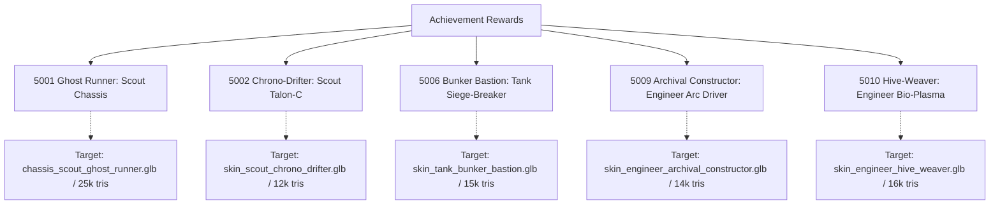
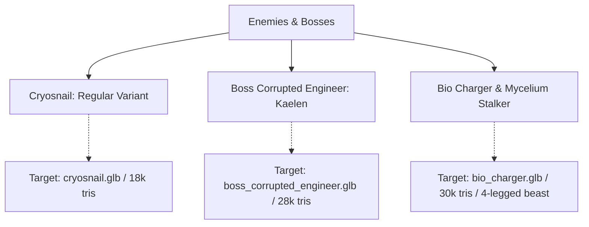

# Missing 3D Assets & 2D Turnaround Generation Prompts

> **Status:** Production Reference · **Owner:** Art & Rendering · **Date:** 2026-10-01  
> **Related Documents:**
> - [3D Asset Audit 2026-10-01](../reports/3d-asset-audit-2026-10-01.md)
> - [Art Style Bible: Nordic Cathedral Biomech](art-style-bible.md)
> - [Sprint 49 Plan (S49-37)](../planning/sprint-49.md)
> - [3D Asset Master Backlog](../3d-asset-master-backlog-and-prompts.md)

---

## 1. Executive Summary & Purpose

The in-engine visual audit ([3d-asset-audit-2026-10-01.md](../reports/3d-asset-audit-2026-10-01.md)) identified several critical asset discrepancies in the live game:
1. **Achievement rewards (5001, 5002, 5006, 5009, 5010)** were marked ready by copying existing factory models or unrelated community skins.
2. **Key combatants and bosses** (`cryosnail`, `boss_corrupted_engineer`, `bio_charger`, `mycelium_stalker`) reuse other enemy models or humanoid player skins.
3. **Core baseline weapons and props** (such as the default Scout Talon-C carbine and sprint-34 environment props) exist only as untextured grey blockouts or severely decimated dark slabs.

To resolve these gaps without inflating budget or halting release schedules, this document provides:
- A complete outline of all missing or compromised 3D models.
- The canonical concept, mechanical function, and target polygon/size budgets for each.
- **Production-ready 2D concept generation prompts** crafted in the official **Nordic Cathedral Biomech** art style, specifically formatted as **orthographic multi-view turnarounds** for automated external 2D-to-3D conversion toolings (e.g. Tripo3D, Meshy, Rodin, CSM, NeRF/Gaussian Splatting).

---

## 2. 2D-to-3D Image Generation Standards

Modern 2D-to-3D photogrammetry and diffusion mesh generators require strict input conditions to generate clean, watertight, and rig-ready 3D meshes without distorted UV projections or baked shadow artifacts.

### 2.1 Image Formatting Rules for Image Generation Agents

| Criterion | Requirement for AI Image Prompts |
| :--- | :--- |
| **Framing** | Full object in frame, centered, with generous margin. Never cropped at borders. |
| **Background** | Clean, flat, solid neutral studio mid-grey (`#808080` or `#404040`). Zero cast shadows on floor, zero gradients, zero vignette. |
| **Lighting** | Soft, diffuse, omnidirectional studio lighting. High surface readability. **No harsh directional sunbeams, no heavy rim shadows**, no lens flare. |
| **Perspective** | **Orthographic projection** (telephoto lens perspective, zero fish-eye or wide-angle distortion). |
| **Characters & Monsters** | Symmetrical **T-Pose** (arms outstretched horizontally, legs straight with slight A-separation, head facing directly forward, tail/tendrils untangled). |
| **Weapons & Firearms** | Pure horizontal **side profile** (muzzle pointing directly left, ejection port visible, flat plane, no hands/operator holding the weapon). |
| **Props & Architecture** | Front-facing orthographic elevation or 3-view turnaround. Ground contact base must be flat and horizontal. |

### 2.2 Shared Style Block (Mandatory Prefix)

Every prompt below incorporates the canonical **Nordic Cathedral Biomech** style block defined in [art-style-bible.md](art-style-bible.md):

```text
"Nordic Cathedral Biomech" style for the game "Hunker Bunker": the hard-line beauty of Nordic Jugendstil / National Romantic architecture — monumental stepped granite massing, deep round arches with heavy keystones, blackened-iron strap bindings and ring clasps, carved bone and stone relief, abstract serpentine interlace carving, frost-etched leaded glass, restrained taut curves — transposed into the sacred bunkers of a dead megacorporation's space-god cult and DECAYED: spalled granite, rust-bled iron, verdigris bronze, lichen and soot, failing lanterns. From WITHIN that design, H.R. Giger-like biology takes form: ribs, vertebrae, tendons, tubes and wet membranes grow out of joints, bindings and cracks, and deeper in adopt the design — vertebrae following the arches, carved interlace becoming living tendrils. Sensual organic curvature carried by form only (no nudity). Beautiful, dark, decorative decay; the juxtaposition of hard-line craft and organic form is the subject. 2D concept illustration: heavy black contours, woodcut/etching hatching on stone and iron, looser organic hatching with wet highlights on the biology, soft cel shading with painted texture. Mostly darkness; amber lantern light, pale cold light on stone, teal only for screens, bioluminescent green only on the biology.
```

### 2.3 Shared Negative Prompt Block

```text
readable text, typography, fonts, watermark, signature, artist logo, photorealism, CGI 3D render preview, noisy background, ground shadows, heavy perspective distortion, wide-angle lens, foreshortening, camera tilt, depth of field, blur, bokeh, human hands holding weapon, character wearing prop, nudity, sexual imagery, Viking horned helmets, crude gore, saturated rainbow colors, flat minimalism.
```

---

## 3. Missing Achievement Rewards (Itemdefs 5001–5010)

These 5 achievement rewards have unlock logic, Steam item definitions, and localized strings, but currently reuse other models.



### 3.1 Itemdef 5001 — Ghost Runner Recon Rig (Scout Legendary Chassis)
- **Current Runtime State:** Reuses community skin `Corpo Shadow Runner` (civilian woman in leather jacket and high heels).
- **Intended Concept:** A covert void-recon stealth frame designed for silent infiltration through deep alien-infested cathedrals. Sleek, matte carbon-weave panels reinforced with blackened-iron spine clasps, sound-dampening tendon conduits, and an opaque faceless helmet with a narrow horizontal ultraviolet sensor slit.
- **Runtime Target:** `public/3d/runtime/new3ds/chassis_scout_ghost_runner.glb` (Target: ~25k tris, < 3.5 MB meshopt, rigged to standard humanoid Mixamo/player rig).
- **Prompt:**
  > `"Nordic Cathedral Biomech" style for "Hunker Bunker": Concept art character turnaround sheet showing front view, side profile view, and back view of the Ghost Runner Recon Rig exosuit for a nimble Scout operator. The suit is an austere, stealth-oriented deep-bunker infiltrator chassis. Matte pitch-black carbon-composite armor plating fastened with blackened-iron strap bindings and recessed rivets. Segmented bone-ivory spinal vertebrae run along the back, housing dark purple and ultraviolet power conduits that pulse faintly. The helmet is a smooth, featureless faceless dome of polished dark granite-like material with a single razor-thin horizontal visor emitting a faint cold violet glow. The limbs feature tight, flexible rubberized under-mesh layered with sinew-like dampening tendons along the calves and forearms. Symmetrical T-pose, arms outstretched horizontally, legs slightly parted, full body visible from head to boots, centered on neutral studio grey background, even diffuse lighting, no cast shadows, clean contours for 3D modeling turnaround.`

---

### 3.2 Itemdef 5002 — Chrono-Drifter Talon-C (Scout Epic Weapon)
- **Current Runtime State:** Byte-identical to the untextured 2k grey blockout `gun_scout_talon_c.glb`.
- **Intended Concept:** An experimental rapid-fire scout carbine fitted with a temporal tachyon damper. Crafted from cold brushed titanium and blackened iron, with an exposed cylindrical glass vacuum chamber along the top rail containing an oscillating electric-cyan chronometry filament.
- **Runtime Target:** `public/3d/runtime/new3ds/skin_scout_chrono_drifter.glb` (Target: ~12k tris, < 1.5 MB meshopt).
- **Prompt:**
  > `"Nordic Cathedral Biomech" style for "Hunker Bunker": Side-profile concept art of the Chrono-Drifter Talon-C carbine firearm, muzzle pointing directly left. Compact bullpup scout rifle silhouette. Receiver constructed from angular stepped blackened iron plates (#141516) and brushed gunmetal, secured with heavy strap hinges and flush brass rivets. Mounted above the upper receiver is a cylindrical, frost-etched quartz vacuum tube glowing with a vibrant electric-cyan (#71cddf) tachyon induction filament and miniature copper coils. The stock features a skeletonized Nordic arch cutout with carved ivory inlay details. A digital ammo counter with teal LED numerals is embedded into the side housing. Solid flat dark grey studio background (#808080), perfectly horizontal orientation, diffuse studio illumination, zero perspective distortion, clean sharp edges for 2D-to-3D conversion.`

---

### 3.3 Itemdef 5006 — Bunker Bastion Siege-Breaker (Tank Epic Weapon)
- **Current Runtime State:** Reuses the base factory gun `gun_tank_siege_breaker50.glb`.
- **Intended Concept:** An unyielding .50-caliber anti-materiel siege cannon built to breach barricades. Reinforced with heavy fortress-grade ballistic plating, twin hydraulic recoil dampening cylinders, a slotted muzzle brake, and yellow-black industrial hazard chevrons worn away by acid burns.
- **Runtime Target:** `public/3d/runtime/new3ds/skin_tank_bunker_bastion.glb` (Target: ~15k tris, < 1.8 MB meshopt).
- **Prompt:**
  > `"Nordic Cathedral Biomech" style for "Hunker Bunker": Side-profile concept art of the Bunker Bastion Siege-Breaker heavy anti-materiel cannon, muzzle pointing directly left. Massive, brutalist heavy weapon for a Tank class. Long, thick hexagonal steel barrel enveloped in a blackened-iron blast shroud with rectangular ventilation louvers. Flanking the breach are twin heavy hydraulic recoil buffer cylinders with exposed brass piston rods and braided steel pressure lines. The receiver is styled like a miniature vaulted bunker arch with heavy iron reinforcement straps and distressed hazard-yellow diagonal warning stripes chipped by shrapnel. A folding heavy bipod is tucked neatly under the handguard. Solid neutral grey background (#808080), perfectly horizontal side elevation, even diffuse studio lighting, no depth of field, sharp silhouette for 3D photogrammetry.`

---

### 3.4 Itemdef 5009 — Archival Constructor Arc Driver (Engineer Legendary Weapon)
- **Current Runtime State:** Reuses the base factory gun `gun_engineer_tesla_lock.glb`.
- **Intended Concept:** An ecclesiastical heavy arc projector recovered from corporate records vaults. Features ornate brass stator rings, exposed copper induction coils, a vacuum-tube capacitor bank, and a miniature circular cathode-ray tube telemetry screen showing electrical waveform frequencies.
- **Runtime Target:** `public/3d/runtime/new3ds/skin_engineer_archival_constructor.glb` (Target: ~14k tris, < 1.6 MB meshopt).
- **Prompt:**
  > `"Nordic Cathedral Biomech" style for "Hunker Bunker": Side-profile concept art of the Archival Constructor Arc Driver weapon for an Engineer class, muzzle pointing directly left. Sacred technological arc projector blending early-industrial electrical engineering with cathedral reliquary craftsmanship. Built from dark weathered cast iron, tarnished brass fixtures (#947047), and dark walnut grip accents. The front emitter features a tuning-fork dual electrode prong separated by circular ceramic insulator rings and visible coiled copper magnet wire. Embedded along the buttstock is an arched brass bezel holding a circular miniature green oscilloscope CRT display showing a live sine wave. Vacuum capacitor tubes glow with warm amber filament light along the top housing. Flat neutral grey studio background, perfectly level horizontal side profile, diffuse lighting, crisp lines for 2D-to-3D meshing.`

---

### 3.5 Itemdef 5010 — Hive-Weaver Bio-Plasma Emitter (Engineer Legendary Weapon)
- **Current Runtime State:** Reuses 4110 Queen's Carapace Carbine (a 321k-triangle display pedestal mesh).
- **Intended Concept:** A true symbiotic bio-weapon where alien physiology has grown into an engineer's high-voltage emitter. An undulating carapace of glossy iridescent black chitin wraps around the power core, with tendon cables anchoring a translucent emerald bio-plasma bulb that feeds volatile resin directly into the barrel.
- **Runtime Target:** `public/3d/runtime/new3ds/skin_engineer_hive_weaver.glb` (Target: ~16k tris, < 2.0 MB meshopt).
- **Prompt:**
  > `"Nordic Cathedral Biomech" style for "Hunker Bunker": Side-profile concept art of the Hive-Weaver Bio-Plasma Emitter weapon, muzzle pointing directly left. Alien-human symbiotic arc weapon. The core structure of an industrial plasma rifle is completely entwined with living biomechanical organisms: dark iridescent green-black chitin plates (#2c3d30) form the upper shroud, held by calcified bone rib clasps. Suspended in a muscular organic cradle beneath the receiver is a translucent, glowing emerald-green bio-plasma sac (#10b981) webbed with pulsating capillary veins. Two ribbed bio-conduits run from the sac into twin bone-plated emitter tines at the muzzle. Droplets of amber resin bead along the lower vents. Flat neutral grey background, crisp side elevation, uniform soft studio lighting, high contrast PBR surface details, no perspective distortion.`

---

## 4. Key Enemies & Bosses



### 4.1 Regular Cryosnail (`cryosnail`)
- **Current Runtime State:** Currently renders using `cyber-snail.glb` (brown mechanical cybersnail). In commit `9adc6a21`, we applied an in-engine cyan emissive (`0x1e4970`) and low roughness (`0.22`), but the underlying mesh is identical to the regular brown cybersnail.
- **Intended Concept:** A subterranean biomechanical gastropod adapted to freezing depths. Unlike the massive boss, this standard enemy has a jagged, frost-cracked shell encrusted with translucent ice stalagmites and hoarfrost. Its soft cyber-slug foot is pale grey-blue, with frosted copper cooling conduits and dual cold-blue optic stalks.
- **Runtime Target:** `public/3d/runtime/new3ds/cryosnail.glb` (Target: ~18k tris, < 2.2 MB meshopt, animated with crawl/idle loop).
- **Prompt:**
  > `"Nordic Cathedral Biomech" style for "Hunker Bunker": Concept art character turnaround sheet (front, side profile, and top-down views) of a Cryosnail subterranean biomechanical enemy. A cybernetic snail creature roughly 1 meter in length. The shell is an ancient cast-iron spiral housing cracked by sub-zero cold, heavily encrusted with thick translucent glacial ice spikes, frost rime, and sharp icicles (#82a1bb). Pale cyan bioluminescent coolant leaks through fractures in the shell. The slug body underneath is pale rubbery grey-blue flesh fused with ribbed hydraulic fluid lines, trailing frozen slime. Two articulated mechanical sensor stalks with faint blue ocular LEDs extend from its head above a maw lined with small grinding steel teeth. Centered on solid neutral grey background (#808080), diffuse even lighting, no ground shadows, orthographic views for 3D modeling.`

---

### 4.2 Corrupted Engineer Kaelen Boss (`boss_corrupted_engineer`)
- **Current Runtime State:** Reuses friendly NPC camp leader `npc_kaelen.glb` with a red tint. A 2D sprite exists in `art/source/art-remaster/sprites-v2/boss_corrupted_engineer_v2.png`, but no 3D asset was ever sculpted.
- **Intended Concept:** Camp Meridian's beloved chief engineer, overtaken and mutated by the Hive Queen's spore corruption. His industrial welding suit and tool harness are ruptured by an eruption of necrotic alien chitin, with biomechanical mantis-like servo arms sprouting from his back harness, sparking with erratic purple arc lightning.
- **Runtime Target:** `public/3d/runtime/new3ds/boss_corrupted_engineer.glb` (Target: ~28k tris, < 3.8 MB meshopt, rigged to player Mixamo bone skeleton).
- **Prompt:**
  > `"Nordic Cathedral Biomech" style for "Hunker Bunker": Concept art character turnaround sheet showing front view, side profile view, and rear view of the Corrupted Engineer Kaelen boss. Heavy human engineer exosuit violently consumed by parasitic biomechanical infection. The left side retains the torn remains of a heavy orange-and-charcoal hazard suit, tool belts, and brass diagnostic gauges. The right side and chest have mutated horrifically: the ribcage has split outward into sharp bone spikes, exposing a pulsating mass of dark crimson and violet necrotic tissue with weeping fluid ducts. Sprouting from the industrial backpack are four articulated mechanical servo-welding arms fused with jagged chitinous insect mantis limbs, trailing loose sparking copper wire. His helmet visor is cracked open, revealing a dark biomechanical eye cluster. Symmetrical T-pose, centered on neutral studio grey background, even diffuse lighting, no cast shadows, clean edge borders for 3D conversion.`

---

### 4.3 Bio-Charger & Mycelium Stalker Quadruped (`bio_charger`, `mycelium_stalker`)
- **Current Runtime State:** Both render a human-shaped community player skin (`scout_xeno_stalker.glb`). The raw file `art/source/new3d/assets/BioStalker.glb` is a 51 MB unrigged static block.
- **Intended Concept:** A terrifying quadrupedal alien predator. Low-slung, heavily muscled beast with a segmented obsidian-chitin carapace, a petrified bone battering crest on its snout, four multi-jointed digitigrade scythe legs, and ribbed fungal spore exhaust vents along its flanks that puff green clouds.
- **Runtime Target:** `public/3d/runtime/new3ds/bio_charger.glb` (Target: ~30k tris, < 3.8 MB meshopt, quadruped rig).
- **Prompt:**
  > `"Nordic Cathedral Biomech" style for "Hunker Bunker": Concept art creature turnaround sheet showing front view, direct side profile view, and three-quarter view of the Bio-Charger xenomorphic predator beast. A massive quadrupedal subterranean carnivore built like a heavy biomechanical bull or lion. Body covered in overlapping plates of dark iridescent beetle chitin (#141516) and petrified ivory bone armor (#a79f86). The head is a solid sloping battering ram skull with no eyes, flanked by four scythe-like mandibles dripping green digestive enzymes. Flanking its muscular shoulders are three pairs of ribbed chimney-like fungal spore vents that emit faint bioluminescent green vapor (#10b981). Four powerful muscular legs end in steel-like claws anchored into the ground. Symmetrical neutral standing pose, legs clearly visible, centered on neutral flat grey background, soft uniform studio lighting, clean contours for 2D-to-3D meshing.`

---

## 5. Baseline Weapons & Compromised Modules

### 5.1 Scout Base Talon-C Frame (`gun_scout_talon_c.glb`)
- **Current Runtime State:** Grey untextured 2k-triangle blockout committed on 2026-08-17 as a temporary placeholder.
- **Intended Concept:** The workhorse starter weapon of every Scout operative. A rugged, mass-manufactured submachine gun designed by the dead corporation with utilitarian stamped steel, knurled foregrip, top Picatinny rail, and amber battery status lamp.
- **Runtime Target:** `public/3d/runtime/gun_scout_talon_c.glb` (Target: ~8k tris, < 900 KB meshopt).
- **Prompt:**
  > `"Nordic Cathedral Biomech" style for "Hunker Bunker": Side-profile concept art of the base factory Talon-C submachine gun, muzzle pointing directly left. Standard-issue military tactical firearm for subterranean scouts. Stamped matte gunmetal steel receiver with clean industrial weld seams and recessed hex screws. Ergonomic textured composite pistol grip, folding wireframe buttstock, curved box magazine inserted forward of the trigger guard, and a ventilated barrel shroud. A single small amber LED status diode glows faintly near the ejection port. Utilitarian, functional, weathered sci-fi weapon with subtle scuffs and metal edge highlights. Perfectly horizontal orientation, centered on solid neutral grey background (#808080), uniform diffuse illumination, zero perspective distortion, clean silhouette.`

---

### 5.2 Itemdef 4162 — Queen's Bane (Forearm Rig Module)
- **Current Runtime State:** Registered in `operatorEquipmentSockets.js` as an operator forearm module (`operator.forearm_left`), but currently modeled as an airborne sci-fi pistol.
- **Intended Concept:** A bio-cybernetic gauntlet module clamped onto the operator's left forearm. Made of hardened bone plates and copper bio-conduits that channel the wearer's neural focus to increase boss damage.
- **Runtime Target:** `public/3d/runtime/new3ds/mod_queens_bane.glb` (Target: ~6k tris, < 800 KB meshopt).
- **Prompt:**
  > `"Nordic Cathedral Biomech" style for "Hunker Bunker": Side-profile and three-quarter concept art of the Queen's Bane forearm gauntlet module, isolated on a neutral grey background. Wearable mechanical bracer designed to clamp around an operator's left arm. Heavy blackened-iron chassis with dual ratcheting leather-and-steel strap buckles. Mounted on the dorsal plate is a curved crest of polished iridescent Queen carapace chitin, housing three small amber vacuum tube conduits that pulse with faint psychic energy. Miniature copper grounding wire weaves through the bone trim. Flat neutral grey background, clean isolated mechanical prop, even diffuse lighting, no hand or mannequin inside.`

---

## 6. Damaged / Over-Decimated Environment Props

These sprint-34 environment props were decimated from 30–50 MB raw scans down to ~1,000 triangles, rendering as unrecognizable dark slabs. They need clean 3D replacements:

| Asset Name | Target GLB Path | Concept & Replacement Prompt Summary | Target Budget |
| :--- | :--- | :--- | :--- |
| **`fixture_sconce_vine`** | `fixture_sconce_vine.glb` | **Nordic Wall Sconce with Biomech Vines:** Arched blackened-iron wall sconce lantern holding a glowing amber candle-bulb, overrun by calcified bone-white creepers and wet ivy tendrils. Heavy iron mounting bracket with square bolt heads. | 4k tris, 600 KB |
| **`prop_conduit_junction_box`** | `prop_conduit_junction_box.glb` | **High-Voltage Junction Box:** Sturdy rectangular industrial electrical box with its hinged steel door ajar. Inside reveals colorful bundled wiring harnesses, glowing vacuum relays, copper terminal blocks, and black fungal spore veining creeping between circuits. | 5k tris, 750 KB |
| **`prop_flesh_steel_cradle`** | `prop_flesh_steel_cradle.glb` | **Flesh-Steel Synthesis Cradle:** A sacrificial or medical pedestal where heavy industrial iron I-beams curve into an arched cradle supporting a pulsating bed of calcified spinal vertebrae and leathery organic membranes. | 8k tris, 1.1 MB |
| **`prop_fungal_tendril_altar`** | `prop_fungal_tendril_altar.glb` | **Subterranean Spore Altar:** Stepped granite church altar table cracked through the center, from which thick bioluminescent green fungal tendrils and shelf mushrooms emerge, draping over carved stone corporate liturgy tablets. | 7k tris, 950 KB |
| **`prop_pipe_rupture`** | `prop_pipe_rupture.glb` | **Burst Cryo Pipe Flange:** Heavy cast-iron industrial steam/coolant pipe section with a violent jagged breach, flanked by frozen icicle formations, dangling severed bolts, and frosty white condensation coating the flanges. | 5k tris, 700 KB |

---

## 7. Automated 2D-to-3D Conversion Workflow for Agents

Follow this 4-step pipeline when processing generated 2D concept art into runtime GLB assets:

```mermaid
sequenceDiagram
    autonumber
    actor Agent as Concept Agent
    participant Gen as 2D Diffusion Model
    participant AI3D as 2D-to-3D Tooling (Tripo / Meshy)
    participant Opt as gltf-transform & meshopt
    participant Game as Hunker Bunker Engine

    Agent->>Gen: Submit 2D Turnaround Prompt (Style Block + Spec)
    Gen-->>Agent: High-res Orthographic Image (#808080 bg)
    Agent->>AI3D: Submit Image for Mesh & PBR Generation
    AI3D-->>Agent: Raw GLB (100k+ tris, uncompressed textures)
    Agent->>Opt: Decimate (tris budget), Bake PBR, Apply meshopt
    Opt-->>Agent: Optimized Runtime GLB (< 2-4 MB)
    Agent->>Game: Drop in public/3d/runtime/new3ds/ & Run Tests
    Game-->>Agent: Verification Passed (0 regressions, budget maintained)
```

1. **Step 1 — 2D Image Generation:**
   - Execute the prompt above in an image generation model (Imagen 3, Midjourney v6, or Flux.1).
   - Ensure the output strictly respects the neutral studio background (`#808080`), orthographic camera, and lack of cast floor shadows.
2. **Step 2 — 2D-to-3D Mesh Synthesis:**
   - Feed the front or multi-view turnaround into an external 3D synthesis tool (e.g. Tripo3D API, Meshy API, or CSM).
   - Generate high-resolution watertight geometry with PBR materials (BaseColor, Roughness, Metalness, Normal, Emissive).
3. **Step 3 — Post-Processing & Optimization:**
   - Run geometry simplification targeting the polygon budgets defined in Sections 3–6.
   - Run `gltf-transform` to apply `EXT_meshopt_compression` and WebP texture compression:
     ```bash
     gltf-transform optimize input.glb output.glb --compress meshopt --texture-compress webp
     ```
4. **Step 4 — Placement & In-Engine Validation:**
   - Move the model to its target destination under `public/3d/runtime/new3ds/<filename>.glb`.
   - Run `npm test` and `scripts/audit-retail-assets.js` to ensure the file complies with the 2,715 MiB public budget and checksum integrity rules.
