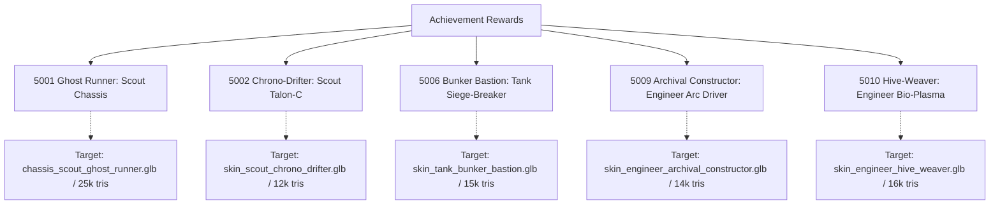
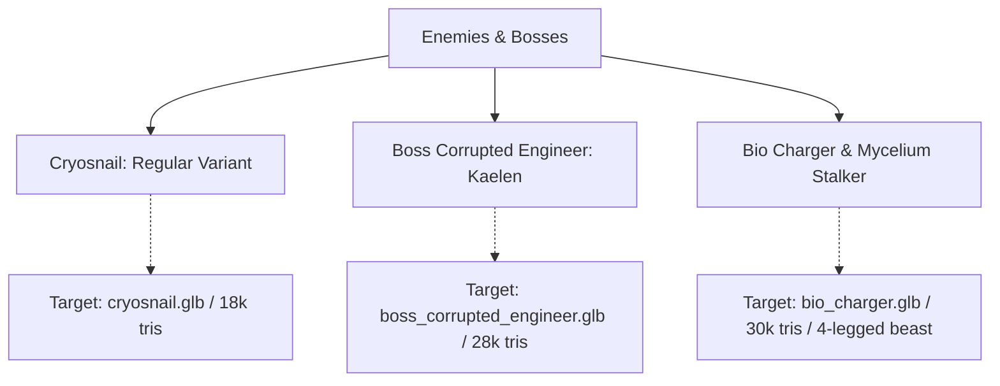

# Missing 3D Assets & Cutscene Cinematics Master Guide: Deep-Space Corporate × H.R. Giger Biomech

> **Status:** Production Reference · **Owner:** Art, Animation & Presentation · **Date:** 2026-10-01  
> **Aesthetic Constitution:** Brutal Deep-Space Megacorporate Industrial Horror × H.R. Giger Biomechanical Eroticism  
> **Related Documents:**
> - [3D Asset Audit 2026-10-01](../reports/3d-asset-audit-2026-10-01.md)
> - [Art Style Bible](art-style-bible.md)
> - [Asset Gap Audit (Cinematics)](asset-gap-audit-2026-09-11.md)
> - [Sprint 49 Plan (S49-37)](../planning/sprint-49.md)
> - [3D Asset Master Backlog](../3d-asset-master-backlog-and-prompts.md)

---

## 1. Executive Summary & Direction Correction

This master guide establishes the uncompromising visual direction for all outstanding 3D models and cutscene cinematics in *Hunker Bunker*.

### Direct Aesthetic Mandate:
- **No Sanitized / Church Clichés:** The game is not a medieval stone church or fantasy cathedral. It is a dead megacorporation's deep-space subterranean extraction bunker ("Horizon-Synthetics Corp"), built with brutalist cast iron, stamped corporate serials, pressurized hydraulic lines, and claustrophobic airlocks.
- **Genuine H.R. Giger Biomechanical Eroticism:** Explicitly and directly described. Sleek, sensual, fetishistic biomechanoid silhouettes; form-fitting black latex-carbon under-skins; ribbed tracheal conduits; external bone-ivory vertebral corsets; phallic nozzles and cranial domes; dilating vulval/sphincteric vents weeping synthetic bio-lubricants; and grotesque, visceral fusions of human anatomy and industrial steel.
- **Don't Imply — Describe Everything:** Prompts describe concrete physical forms, materials, mechanical couplings, fluids, and anatomical shapes.
- **Single-Subject 3D Prompts:** Exactly ONE character, creature, or weapon centered in frame on a solid `#808080` neutral grey background (no turnaround sheets or multi-figure collages).
- **Cutscene Cinematics Audit & Prompts:** Fixes the critical bug where the O2 generator upgrade currently plays Sister Martha gardening at Camp Tallow (`int_04_warmth_beneath_the_ice`), and provides **First Frame**, **Last Frame**, and **Image-to-Video Action Prompts** for all missing Act 2 multiple endings and boss encounters.

---

## 2. 2D-to-3D Image Generation Standards (Single Subject Focus)

Modern AI 2D-to-3D diffusion mesh tools (Tripo3D, Meshy, Rodin, CSM) require a single clean hero subject. Turnaround sheets (front/side/back in one image) cause AI 3D generators to stitch duplicate limbs and warp mesh geometry.

### 2.1 Technical Formatting Rules

| Criterion | Requirement for AI Image Prompts |
| :--- | :--- |
| **Subject Count** | **Strictly ONE subject / ONE person / ONE object.** Never generate turnaround sheets, collages, or split panels. |
| **Framing** | Full object/character in frame, centered, with 10% margin on all sides. Never cropped at canvas borders. |
| **Background** | Clean, solid, flat neutral studio grey (`#808080`). Zero floor cast shadows, zero gradients, zero vignettes. |
| **Lighting** | Soft, diffuse, omnidirectional studio lighting. High surface readability. **No harsh directional rim shadows, no lens flare.** |
| **Perspective** | **Orthographic projection** (telephoto lens perspective, zero fish-eye or wide-angle distortion). |
| **Characters & Monsters** | Symmetrical **T-Pose** (arms outstretched horizontally, legs straight with slight A-separation, head facing directly forward). |
| **Weapons & Firearms** | Pure horizontal **side profile** (muzzle pointing directly left, ejection port visible, flat plane, no hands holding weapon). |

### 2.2 Shared Style Block (Mandatory Prefix for 3D Assets)

```text
H.R. Giger biomechanical eroticism fused with brutal deep-space megacorporate industrial horror for "Hunker Bunker". Ruthless deep-space industrial technology: heavy cast gunmetal, stamped corporate serial stencils, pressurized hydraulic pistons, hazard-striped steel bulkheads, and high-voltage conduit runs. Grotesquely fused with H.R. Giger's sensual biomechanoid anatomy: glistening wet black latex and translucent chitin, undulating vaginal sphincters, phallic nozzles and elongated cranial crests, exposed ribbed spinal columns, weeping mucosal glands, ovarian fluid conduits, and pelvic bone architecture grown seamlessly through cold steel plating. A dark, erotic, claustrophobic synthesis of cold corporate machinery and alien biological flesh: deep shadows, glistening wet reflections on black chitin and polished chrome, smoldering warning amber indicator lamps, electric-cyan cryo vapor, and bioluminescent emerald slime veins. 2D concept illustration: razor-sharp ink contours, dense biomechanical cross-hatching, wet specular highlights, heavy contrasting shadows. Describe every anatomical and industrial mechanical feature directly.
```

### 2.3 Shared Negative Prompt Block

```text
clean sterile sci-fi, cartoon, anime, medieval fantasy, church cathedrals, gothic religious saints, crosses, altars, runes, Viking motifs, turnaround sheet, multi-panel split screen, collages, multiple subjects, readable brand logos, text, watermarks, signature, blurry, flat minimalism, pastel colors.
```

---

## 3. Missing Achievement Rewards (Single-Subject Prompts)



### 3.1 Itemdef 5001 — Ghost Runner Recon Rig (Scout Legendary Chassis)
- **Current Runtime State:** Reuses community skin `Corpo Shadow Runner` (civilian woman in leather jacket and high heels).
- **Target File:** `public/3d/runtime/new3ds/chassis_scout_ghost_runner.glb` (25k tris, < 3.5 MB meshopt, rigged to Mixamo skeleton).
- **Single-Person Prompt:**
  > `H.R. Giger biomechanical eroticism fused with brutal deep-space corporate horror for "Hunker Bunker": Full-length single character concept art of ONE Scout operative in the Ghost Runner Recon Rig. Centered single subject, front-facing symmetrical T-pose with arms outstretched horizontally and legs slightly parted, full body from head to boots visible. The suit is a sleek, fetishistic biomechanoid skinsuit of form-fitting gloss black latex and carbon-composite plating adhering tightly to the curves of the thighs, hips, and torso. An external articulated vertebral spine of polished ivory bone and blackened-iron clasps runs down the back like an erotic biomechanical corset, cinching the waist. The chest features ribbed tracheal tubing contouring the pectoral plating. The groin and pelvic region are armored with an arched, segmented chitinous codpiece and pelvic struts lined with flexible hydraulic sinews. The helmet is an elongated, smooth phallic cranial dome of glistening obsidian chitin without eyes, featuring a single recessed horizontal vulval slit glowing with cold ultraviolet light (#a855f7). Glistening wet sheen across the black rubber and chitin, contrasted with matte industrial steel knee servos with stamped corporate serial codes. Exactly one person in the image, zero extra figures, no turnaround sheet, no split panels, centered on solid neutral studio grey background (#808080), uniform diffuse illumination, no cast shadows.`

---

### 3.2 Itemdef 5002 — Chrono-Drifter Talon-C (Scout Epic Weapon)
- **Current Runtime State:** Byte-identical to the untextured 2k grey blockout `gun_scout_talon_c.glb`.
- **Target File:** `public/3d/runtime/new3ds/skin_scout_chrono_drifter.glb` (12k tris, < 1.5 MB meshopt).
- **Single-Weapon Prompt:**
  > `H.R. Giger biomechanical eroticism fused with brutal deep-space corporate horror for "Hunker Bunker": Side-profile concept art of ONE Chrono-Drifter Talon-C carbine firearm, muzzle pointing directly left. Single object, centered horizontally. Compact bullpup scout rifle silhouette. Receiver constructed from angular stamped matte gunmetal steel with stamped corporate serial numbers ("HB-CORP-4402") and blackened iron plates. A thick, ribbed tracheal hose of glistening black biomechanical cartilage weaves through the trigger guard and wraps around the magazine well. Running along the upper rail is a transparent cylindrical quartz vacuum tube containing an oscillating, electric-cyan tachyon filament and pulsating copper wire coils. The muzzle terminates in an elongated, phallic barrel shroud with concentric circular cooling rings. Embedded into the stock is an oval bio-pressure gauge resembling a dilation sphincter with a glowing teal needle. Solid flat dark grey studio background (#808080), perfectly horizontal orientation, diffuse studio illumination, zero perspective distortion, clean sharp edges for 2D-to-3D conversion.`

---

### 3.3 Itemdef 5006 — Bunker Bastion Siege-Breaker (Tank Epic Weapon)
- **Current Runtime State:** Reuses the base factory gun `gun_tank_siege_breaker50.glb`.
- **Target File:** `public/3d/runtime/new3ds/skin_tank_bunker_bastion.glb` (15k tris, < 1.8 MB meshopt).
- **Single-Weapon Prompt:**
  > `H.R. Giger biomechanical eroticism fused with brutal deep-space corporate horror for "Hunker Bunker": Side-profile concept art of ONE Bunker Bastion Siege-Breaker heavy anti-materiel cannon, muzzle pointing directly left. Single object, centered horizontally. Monumental deep-space corporate .50-cal heavy siege cannon fused with industrial hydraulic violence. A massive hexagonal barrel encased in a heavy cast-iron blast jacket with rectangular heat louvers and worn yellow hazard chevrons. Flanking the breech are twin heavy hydraulic recoil cylinders with polished chrome pistons and braided steel hoses dripping dark lubricating grease. Beneath the barrel, an undulating ribbed pneumatic bellow of black synthetic cartilage expands and contracts with recoil pressure. The heavy stock features a brutalist steel shoulder saddle secured by thick iron bolts and rubber shock pads. Solid neutral grey background (#808080), perfectly horizontal side elevation, even diffuse studio lighting, no depth of field, sharp silhouette for 3D photogrammetry.`

---

### 3.4 Itemdef 5009 — Archival Constructor Arc Driver (Engineer Legendary Weapon)
- **Current Runtime State:** Reuses the base factory gun `gun_engineer_tesla_lock.glb`.
- **Target File:** `public/3d/runtime/new3ds/skin_engineer_archival_constructor.glb` (14k tris, < 1.6 MB meshopt).
- **Single-Weapon Prompt:**
  > `H.R. Giger biomechanical eroticism fused with brutal deep-space corporate horror for "Hunker Bunker": Side-profile concept art of ONE Archival Constructor Arc Driver weapon for an Engineer class, muzzle pointing directly left. Single object, centered horizontally. Corporate high-voltage arc projector. Dark heavy cast iron and tarnished brass fittings. The front emitter consists of a pair of elongated, segmented bone-and-copper electrode tines shaped like articulated skeletal fingers reaching forward. Behind the emitter, three heavy cylindrical vacuum capacitors with glowing orange filament coils are mounted in a triangular cluster, wired together with thick insulated cables. Embedded in the stock is a circular green cathode-ray tube oscilloscope screen with a brass bezel displaying active electrical sine waves. Stamped corporate warning stencil: "HIGH VOLTAGE // HORIZON IND". Flat neutral grey studio background, perfectly level horizontal side profile, diffuse lighting, crisp lines for 2D-to-3D meshing.`

---

### 3.5 Itemdef 5010 — Hive-Weaver Bio-Plasma Emitter (Engineer Legendary Weapon)
- **Current Runtime State:** Reuses 4110 Queen's Carapace Carbine (a 321k-triangle display pedestal mesh).
- **Target File:** `public/3d/runtime/new3ds/skin_engineer_hive_weaver.glb` (16k tris, < 2.0 MB meshopt).
- **Single-Weapon Prompt:**
  > `H.R. Giger biomechanical eroticism fused with brutal deep-space corporate horror for "Hunker Bunker": Side-profile concept art of ONE Hive-Weaver Bio-Plasma Emitter weapon, muzzle pointing directly left. Single object, centered horizontally. Visceral H.R. Giger erotic bio-weapon. The chassis of an industrial plasma rifle is violently integrated with living alien reproductive anatomy. The upper receiver is formed from an undulating, segmented shell of glossy iridescent black chitin. Suspended beneath the receiver in an organic cradle of pelvic bone struts is a translucent, pulsing ovarian bio-plasma sac filled with glowing emerald-green fluid and webbed with pulsating purple veins. Thick, ribbed tracheal conduits connect the sac directly to a phallic muzzle nozzle lined with glistening sphincteric lips. Droplets of translucent amber bio-lubricant drip from the vents. Flat neutral grey background, crisp side elevation, uniform soft studio lighting, high contrast PBR surface details, no perspective distortion.`

---

## 4. Key Enemies & Bosses (Single-Subject Prompts)



### 4.1 Regular Cryosnail (`cryosnail`)
- **Current Runtime State:** Renders using `cyber-snail.glb` with code tinting. Lacks a dedicated ice-encrusted mesh.
- **Target File:** `public/3d/runtime/new3ds/cryosnail.glb` (18k tris, < 2.2 MB meshopt, animated with crawl/idle loop).
- **Single-Creature Prompt:**
  > `H.R. Giger biomechanical eroticism fused with brutal deep-space corporate horror for "Hunker Bunker": Concept art of a SINGLE Cryosnail subterranean biomechanical enemy creature, centered in frame in three-quarter hero elevation. A biomechanical gastropod predator adapted to sub-zero industrial depths. The shell is a heavy cast-iron mechanical compressor turbine fused with segmented bone armor, cracked open with jagged fissures from which razor-sharp glacial ice spikes and frozen blue coolant icicles erupt. The soft slug body beneath is pale, translucent grey-blue flesh webbed with pulsating subcutaneous hydraulic cables and veins, dragging across the floor with glistening frozen slime. Its head features two elongated, phallic cybernetic optic stalks with cold cyan LED lenses, above a circular, dilating sphincter mouth lined with concentric rows of rotating titanium drill teeth. Exactly one creature in the image, zero extra panels, no turnaround sheet, centered on solid neutral grey background (#808080), diffuse even lighting, no ground shadows, crisp contours for 3D modeling.`

---

### 4.2 Corrupted Engineer Kaelen Boss (`boss_corrupted_engineer`)
- **Current Runtime State:** Reuses friendly NPC camp leader `npc_kaelen.glb` with a red tint.
- **Target File:** `public/3d/runtime/new3ds/boss_corrupted_engineer.glb` (28k tris, < 3.8 MB meshopt, rigged to Mixamo skeleton).
- **Single-Person Prompt:**
  > `H.R. Giger biomechanical eroticism fused with brutal deep-space corporate horror for "Hunker Bunker": Full-length single character concept art of ONE Corrupted Engineer Kaelen boss in a front-facing symmetrical T-pose with arms outstretched horizontally. Single subject, centered in frame. Visceral deep-space body horror. The bulky orange-and-charcoal hazard pressure suit of corporate chief engineer Kaelen has been violently overtaken by parasitic alien biology. The front of the heavy rubberized suit is torn open from pelvis to throat, revealing a glistening mass of exposed human-alien viscera, segmented bone vertebrae, and pulsating purple vascular cords. From his shoulder harness, four massive articulated biomechanical appendages erupt: two hydraulic welding arms fused with chrome pistons and loose sparking copper cables, and two elongated chitinous mantis scythes dripping black digestive fluids. His helmet faceplate is shattered, exposing a mutated half-human face fused with a cluster of black insectoid eyes and a split jaw with needle teeth. Exactly one person in the image, zero extra figures, no turnaround sheet, centered on neutral studio grey background (#808080), even diffuse lighting, no cast shadows, clean edge borders for 3D conversion.`

---

### 4.3 Bio-Charger & Mycelium Stalker Quadruped (`bio_charger`, `mycelium_stalker`)
- **Current Runtime State:** Both render a human-shaped community player skin (`scout_xeno_stalker.glb`).
- **Target File:** `public/3d/runtime/new3ds/bio_charger.glb` (30k tris, < 3.8 MB meshopt, quadruped rig).
- **Single-Creature Prompt:**
  > `H.R. Giger biomechanical eroticism fused with brutal deep-space corporate horror for "Hunker Bunker": Concept art of a SINGLE Bio-Charger xenomorphic predator beast, centered in frame in a direct side profile neutral stance. A terrifying quadrupedal alien predator born from H.R. Giger's Necronomicon nightmares. A low-slung, heavily muscled biomechanical beast. The head is a massive, elongated phallic skull of smooth obsidian chitin with no visible eyes, terminating in a heavy petrified bone battering ram crest and four scissor-like mandibles that drip acidic green slime. The torso is encased in overlapping ribbed chitin plates with exposed biomechanical vertebrae and six circular exhaust sphincters along the flanks that dilate and vent thick plumes of green fungal spore steam. Four muscular digitigrade legs with visible tendon cables and hydraulic sinews end in razor-sharp steel talons gripping the ground. Exactly one beast in the image, no turnaround sheet, no split panels, centered on solid flat grey background (#808080), soft uniform studio lighting, clean contours for 2D-to-3D meshing.`

---

## 5. Baseline Weapons & Compromised Modules

### 5.1 Scout Base Talon-C Frame (`gun_scout_talon_c.glb`)
- **Current Runtime State:** Grey untextured 2k-triangle blockout placeholder.
- **Target File:** `public/3d/runtime/gun_scout_talon_c.glb` (8k tris, < 900 KB meshopt).
- **Single-Weapon Prompt:**
  > `H.R. Giger biomechanical eroticism fused with brutal deep-space corporate horror for "Hunker Bunker": Side-profile concept art of ONE base factory Talon-C submachine gun, muzzle pointing directly left. Single object, centered horizontally. Stamped corporate military hardware from Horizon Industrial. Heavy pressed sheet-steel receiver with stamped serial numbers ("MOD-77 SC-01"), matte dark gunmetal finish, ventilated barrel shroud, tactical knurled pistol grip, and curved 30-round magazine. Amber battery indicator diode glowing near the ejection port. Clean, lethal, utilitarian deep-space weapon. Perfectly horizontal orientation, centered on solid neutral grey background (#808080), uniform diffuse illumination, zero perspective distortion, clean silhouette.`

---

### 5.2 Itemdef 4162 — Queen's Bane (Forearm Rig Module)
- **Current Runtime State:** Modeled as an airborne pistol rather than a wearable gauntlet.
- **Target File:** `public/3d/runtime/new3ds/mod_queens_bane.glb` (6k tris, < 800 KB meshopt).
- **Single-Object Prompt:**
  > `H.R. Giger biomechanical eroticism fused with brutal deep-space corporate horror for "Hunker Bunker": Side-profile concept art of ONE Queen's Bane forearm gauntlet module, isolated on a neutral grey background. Single object, centered horizontally. A heavy blackened-iron gauntlet designed to clamp over an operator's left forearm using dual ratcheting leather-and-steel strap buckles. Mounted along the top plate is a curved, segmented crest of iridescent black Queen carapace chitin and bone ivory, housing three glowing amber vacuum tube conduits that channel bio-electrical current through copper needle electrodes directly into the wearer's forearm tendons. Flat neutral grey background (#808080), clean isolated mechanical prop, even diffuse lighting, no hand or mannequin inside.`

---

## 6. Damaged / Over-Decimated Environment Props

These sprint-34 environment props were decimated from 30–50 MB raw scans down to ~1,000 triangles, rendering as unrecognizable dark slabs. They need clean 3D replacements:

| Asset Name | Target GLB Path | Single-Subject Concept & Replacement Prompt Summary | Target Budget |
| :--- | :--- | :--- | :--- |
| **`fixture_sconce_vine`** | `fixture_sconce_vine.glb` | **Biomechanical Wall Sconce with Giger Tendrils:** Heavy cast-iron industrial bulkhead light with an amber incandescent cage lamp, overrun by glossy black biomechanoid vine tendrils and ribbed breathing tubes with weeping glands. Single prop, centered front elevation. | 4k tris, 600 KB |
| **`prop_conduit_junction_box`** | `prop_conduit_junction_box.glb` | **High-Voltage Biomech Junction Box:** Sturdy rectangular industrial electrical box with its hinged steel door ajar. Inside reveals colorful bundled wiring harnesses, glowing vacuum relays, copper terminal blocks, and black fungal spore veining. Single prop, centered. | 5k tris, 750 KB |
| **`prop_flesh_steel_cradle`** | `prop_flesh_steel_cradle.glb` | **Flesh-Steel Synthesis Cradle:** A medical pedestal where heavy industrial iron I-beams curve into an arched cradle supporting a pulsating bed of calcified spinal vertebrae and leathery organic membranes. Single prop, centered. | 8k tris, 1.1 MB |
| **`prop_fungal_tendril_altar`** | `prop_fungal_tendril_altar.glb` | **Subterranean Spore Terminal:** Stepped industrial control station cracked through the center, from which thick bioluminescent green fungal tendrils and shelf mushrooms emerge, draping over corroded corporate telemetry screens. Single prop, centered. | 7k tris, 950 KB |
| **`prop_pipe_rupture`** | `prop_pipe_rupture.glb` | **Burst Cryo Pipe Flange:** Heavy cast-iron industrial steam/coolant pipe section with a violent jagged breach, flanked by frozen icicle formations, dangling severed bolts, and frosty white condensation coating the flanges. Single prop, centered. | 5k tris, 700 KB |

---

## 7. Automated 2D-to-3D Conversion Workflow for Agents

```mermaid
sequenceDiagram
    autonumber
    actor Agent as Concept Agent
    participant Gen as 2D Diffusion Model
    participant AI3D as 2D-to-3D Tooling (Tripo / Meshy)
    participant Opt as gltf-transform & meshopt
    participant Game as Hunker Bunker Engine

    Agent->>Gen: Submit Single-Subject Prompt (Style Block + Spec)
    Gen-->>Agent: High-res Single Centered Image (#808080 bg)
    Agent->>AI3D: Submit Image for Mesh & PBR Generation
    AI3D-->>Agent: Raw GLB (100k+ tris, uncompressed textures)
    Agent->>Opt: Decimate (tris budget), Bake PBR, Apply meshopt
    Opt-->>Agent: Optimized Runtime GLB (< 2-4 MB)
    Agent->>Game: Drop in public/3d/runtime/new3ds/ & Run Tests
    Game-->>Agent: Verification Passed (0 regressions, budget maintained)
```

1. **Step 1 — 2D Image Generation:** Run the single-subject prompt in Imagen 3, Midjourney v6, or Flux.1 on a solid `#808080` studio background.
2. **Step 2 — 3D Synthesis:** Pass the clean centered image into Tripo3D or Meshy API to synthesize watertight 3D geometry and PBR materials.
3. **Step 3 — Optimization:** Decimate geometry to target budgets and run:
   ```bash
   gltf-transform optimize raw_model.glb public/3d/runtime/new3ds/output.glb --compress meshopt --texture-compress webp
   ```
4. **Step 4 — Verification:** Check with `npx vitest run` and `node scripts/audit-retail-assets.js`.

---

## 8. Cutscene Cinematics Audit & Production Prompts

### 8.1 Cutscene Audit Findings

The game's cinematic engine supports both video playback (`playCutsceneVideo`) and a high-fidelity two-frame animated still fallback (`playCinematicStill`, managed by `src/cinematicFallback.js` and built via `scripts/build-cinematic-still-videos.js`).

1. **The O2 Generator Upgrade Defect (`event-o2-generator-upgraded`):**
   - **Current Bug:** In `main.js:6007` and `main.js:8621`, `event-o2-generator-upgraded` is wired to `videoBase: 'int_04_warmth_beneath_the_ice'`.
   - **Why it is wrong:** `int_04` is an atmospheric camp dialogue scene depicting **Sister Martha tending hydroponic plants in a greenhouse at Camp Tallow**. When players build or upgrade the life-support generator at the crashed ship, the game jarringly shows a peaceful gardening scene instead of an industrial life-support reboot in the deep ice!
   - **Remediation:** Author a bespoke life-support generator startup cutscene (`firstImage` + `lastImage` + action prompt) showing the frozen turbine bursting to life, igniting radiant warmth and an atmospheric oxygen dome, while seismic rumbles awaken the boss outside.
2. **Missing Act 2 Campaign Endings (5 of 10):**
   - Documented in [asset-gap-audit-2026-09-11.md](asset-gap-audit-2026-09-11.md), five endings lack bespoke videos and currently fall back to mismatched scenes (`mothership_infection`, `alien_exodus`, `outed_escape`, `failed_carrier`, `empty_husk`).
3. **Key Milestone & Boss Encounters:**
   - Retaliatory boss threats (`event-boss-encounter-cybersnail`, `event-boss-encounter-cryosnail`, `event-boss-encounter-sporesnail`) and critical death states (`death-oxygen`).

---

### 8.2 Production Cinematic Prompts (First Frame, Last Frame & Action Prompt)

All cutscene concepts use the brutal **Deep-Space Corporate × H.R. Giger Biomech Keyart Style**:
- Aspect Ratio: **16:9 widescreen** (1920×1080 or 1280×800).
- Visual Texture: Brutalist titanium and pitted steel bulkheads, stamped corporate serial stencils, hazard warnings, phallic conduit runs, glistening mucosal black chitin, amber warning indicators, cold cyan cryo-vapor, and deep suffocating shadows.

---

#### Scene 1: O2 Generator Milestone Startup (`event-o2-generator-upgraded`)
*Replacing the incorrect Sister Martha gardening clip with the true life-support reboot beat.*

- **Narrative Context:** Deep inside the ship wreck in a brutalist industrial corporate life-support vault. The operator throws a massive hydraulic interlock. Massive pistons pump, steam and oxygen spray in dense clouds, the glowing blue atmospheric shield erupts, and in the ceiling shadows, colossal biomechanoid boss eyes awaken.
- **First Frame Prompt:**
  > `Deep-space corporate industrial horror meets H.R. Giger biomechanics for "Hunker Bunker", 16:9 widescreen: Subterranean life-support reactor vault beneath the crashed ship. Brutalist chamber of bolted titanium bulkheads, stamped corporate warning stencils ("HORIZON LIFE SUPPORT // SECTOR 0"), and heavy overhead pipe conduits. In the center sits the massive O2 atmospheric compressor, completely dormant, frozen solid, and choked with thick white frost and hanging icicles. A lone operator in a worn, frost-coated exosuit with ribbed tracheal breathing tubes stands with both hands gripping a heavy blackened-iron breaker switch on a control console. Cold, dark, freezing atmosphere; only a faint dying amber pilot diode illuminates the operator's visor. Deep freezing blue shadows, silent dead machinery, thick hoarfrost covering the steel floor grating.`
- **Last Frame Prompt:**
  > `Deep-space corporate industrial horror meets H.R. Giger biomechanics for "Hunker Bunker", 16:9 widescreen: The O2 atmospheric compressor roaring at violent maximum power in the industrial chamber. Massive dual hydraulic pistons pump furiously with white steam vents blasting high-pressure clouds. The central turbine is a spinning blur of incandescent amber and neon cyan behind thick quartz portholes. A radiant, humming cyan-and-amber atmospheric oxygen bubble pulses outward across the bunker deck, flash-thawing frost into cascading torrents of water and vapor. High above in the ceiling shadows and exposed conduit nests, awakened crimson biomechanical sensor eyes glow menacingly in response to the seismic thrumming.`
- **Image-to-Video Action Prompt:**
  > `Cinematic slow push-in. The operator grabs the heavy iron breaker switch with both hands and throws their full weight downward. Blinding electrical sparks and arcs shower across the deck. With a massive concussive hydraulic thud, the frozen seals blow out in violent clouds of superheated steam. Pistons slam in alternating rhythm; the massive turbine spins up with an ear-splitting mechanical whine. Amber filament arrays blaze to life behind thick quartz ports. A shimmering spherical wave of pressurized oxygen and cyan heat expands outward across the floor, flash-thawing frost into steaming spray, while high in the shadows above, menacing alien eyes snap open.`

---

#### Scene 2: Hypoxia / Asphyxiation Death (`death-oxygen`)
*The scrubbers fail; the black box records what happened in the dark.*

- **Narrative Context:** Oxygen reserves hit zero. The suit's internal air recycling ceases. The operator collapses onto the cold steel deck plates as breath freezes on the inside of the faceplate.
- **First Frame Prompt:**
  > `Deep-space corporate industrial horror meets H.R. Giger biomechanics for "Hunker Bunker", 16:9 widescreen: An operator in a battered heavy industrial exosuit crawling forward on hands and knees through a pitch-black corporate station hallway. The operator's right arm reaches out desperately toward an emergency oxygen recharge canister on the bulkhead, just inches out of grasp. The helmet faceplate displays flickering red digital emergency HUD telemetry: "O2: 0% // CRITICAL HYPOXIA // SCRUBBER OFFLINE". Harsh red strobe lights flash from the suit's shoulder beacon, casting long frantic shadows across the ice-slick floor.`
- **Last Frame Prompt:**
  > `Deep-space corporate industrial horror meets H.R. Giger biomechanics for "Hunker Bunker", 16:9 widescreen: Low-angle close-up of the fallen operator lying motionless on the frost-covered stone floor. The suit's chest has stopped heaving. The glass faceplate of the helmet is completely frosted over from the inside with delicate, opaque white ice rime and frozen condensation crystals. The HUD displays are dead. Only a single faint, rhythmic red distress diode blinks on the suit collar, surrounded by infinite encroaching pitch darkness.`
- **Action Prompt (Image-to-Video):**
  > `Low tracking camera sliding along the cold floor. The crawling operator gasps, the suit's chest bellows heaving in rapid, shallow spasms. The camera slowly pushes in toward the helmet visor as internal breath moisture rapidly crystallizes across the glass in real-time, spreading like frost flowers until the interior is completely obscured. The operator's outstretched fingers claw weakly into the stone, shudder once, and fall completely limp. The flickering red HUD glyphs buzz, glitch, and shut off, leaving only a slow, silent beacon pulse in the frozen tomb.`

---

#### Scene 3: Ending — Mothership Infection (`ending-mothershipinfection`)
*A clean escape on the outside; the corporate gods' vessel is consumed from within.*

- **Narrative Context:** The player arrives at the orbital corporate Mothership in an extraction shuttle. In the sterile white decontamination bay, the Queen's dormant viral strain ruptures through the suit.
- **First Frame Prompt:**
  > `Deep-space corporate industrial horror meets H.R. Giger biomechanics for "Hunker Bunker", 16:9 widescreen: Sterile, pristine white-and-chrome decontamination airlock aboard the corporate Mothership in orbit. Gleaming polished floors, stark corporate logos ("HORIZON SYNTHETICS"). In the center stands the player's soot-covered, rugged exosuit beneath automated sterilization sprayers. Outside the thick quartz observation window, corporate officers in pristine gray uniforms watch with digital tablets.`
- **Last Frame Prompt:**
  > `Deep-space corporate industrial horror meets H.R. Giger biomechanics for "Hunker Bunker", 16:9 widescreen: Pure H.R. Giger biomechanical horror unleashed. The sterile white airlock is completely ruptured and consumed. Glistening black alien chitin tendrils, ribbed spinal columns, and pulsing vaginal sphincters have violently erupted from the player's suit joints, tearing open the white bulkhead panels and rooting deep into the ship's circuitry. Thick emerald spore mist fills the chamber, corroding the observation glass where terrified corporate officers are pressed against the glass as black biomechanical tentacles crawl toward them.`
- **Action Prompt (Image-to-Video):**
  > `Static wide view of the sterile white decontamination bay. Chemical decon mist hisses from ceiling nozzles over the motionless suit. Suddenly, the player's torso snaps backward with an audible structural crack. The suit's back plating bursts outward as thick, glistening black chitinous tendrils and segmented bone ribs erupt violently from the spine and limb joints, snaking with terrifying speed across the white floor and up the walls. The overhead fluorescent lights flicker, short out, and glow a toxic bioluminescent emerald. Decontamination sirens wail as the alien biological growth shatters the observation window, devouring the corporate flagship from within.`

---

#### Scene 4: Ending — Alien Exodus (`ending-alienexodus`)
*Uniting all three envoys; the brood and human kin ascend together into the cosmos.*

- **Narrative Context:** Allying with envoys Rhun, Vey, and Nahl, the player leads the hives out of the dying subterranean cathedrals into the frozen alien dawn aboard an organic bioship.
- **First Frame Prompt:**
  > `Deep-space corporate industrial horror meets H.R. Giger biomechanics for "Hunker Bunker", 16:9 widescreen: The colossal subterranean launch abyss. The player, adorned in symbiotic chitin-fused armor, stands alongside tall, elegant alien envoys Rhun and Vey before the open, gaping sphincteric hatch of a colossal biomechanical starship. The ship's hull is an awe-inspiring synthesis of blackened corporate steel arches, ribbed spinal vertebrae, and pulsating emerald neural conduits.`
- **Last Frame Prompt:**
  > `Deep-space corporate industrial horror meets H.R. Giger biomechanics for "Hunker Bunker", 16:9 widescreen: Breathtaking wide panoramic vista of the frozen planet's exterior at dawn. The colossal biomechanical hive starship ascends smoothly into the violet stratosphere toward twin moons and shimmering polar auroras. Flocks of winged alien brood organisms soar alongside the rising bio-vessel, leaving the burning, collapsed corporate bunker far below in the snow.`
- **Action Prompt (Image-to-Video):**
  > `Cinematic upward crane shot. The player and the alien envoys walk in unison up the organic boarding ramp as the sphincteric hatch closes shut with interlocking bone teeth. Deep internal bioluminescent veins pulse with emerald energy down the ship's spine. The camera cuts to the exterior glacier surface as the colossal vessel breaches through the ice crust with a thundering roar, sending glittering avalanches of frost cascading as it accelerates silently toward the celestial aurora, trailing streams of luminescent spores into deep space.`

---

#### Scene 5: Ending — Outed Escape (`ending-outedescape`)
*Boarded the shuttle, but the infection is detected; a paranoid standoff in orbit.*

- **Narrative Context:** The player boards the extraction shuttle with the human survivor leaders. Mid-flight, the automated pathogen scanners detect the Queen's carrier strain in the player's blood.
- **First Frame Prompt:**
  > `Deep-space corporate industrial horror meets H.R. Giger biomechanics for "Hunker Bunker", 16:9 widescreen: The cramped, claustrophobic metal passenger cabin of a military extraction shuttle accelerating into orbit. Commander Briggs, Martha, and Kaelen sit strapped into bulkhead seats. The player stands by the hatch. Suddenly, rotating red quarantine sirens illuminate the cabin, and a bulkhead screen flashes: "BIO-THREAT CONFIRMED // QUEEN CARRIER STRAIN IN CABIN".`
- **Last Frame Prompt:**
  > `Deep-space corporate industrial horror meets H.R. Giger biomechanics for "Hunker Bunker", 16:9 widescreen: Brutal standoff inside the shaking cockpit. Commander Briggs has unstrapped and stands with a heavy 12-gauge tactical shotgun leveled point-blank at the player's chest with a cold, ruthless expression. Martha cowers behind an armored seat divider. Through the player's cracked helmet visor, the player's eyes have mutated into alien segmented emerald slit pupils, and dark glistening veins pulse visibly beneath the neck collar seals.`
- **Action Prompt (Image-to-Video):**
  > `Handheld camera shaking with intense turbulence. The cabin lighting abruptly drops from warm amber to harsh, revolving red emergency beacons. Briggs's eyes widen with cold realization; he unlatches his restraint harness and pumps his shotgun with a metallic clack. The camera pans rapidly past Martha's terrified face, zooming into an extreme close-up of the player's helmet visor where alien biomechanical veins ripple beneath the neck skin and emerald pupils dilate in the flashing red light.`

---

#### Scene 6: Ending — Failed Carrier (`ending-failedcarrier`)
*The containment seals rupture in transit; the brood tears the courier vessel apart.*

- **Narrative Context:** The player attempts to smuggle the Queen's specimen off-world in a secure stasis container. Deep in space, the bio-specimen violently ruptures containment.
- **First Frame Prompt:**
  > `Deep-space corporate industrial horror meets H.R. Giger biomechanics for "Hunker Bunker", 16:9 widescreen: The dark, pressurized cargo hold of a courier shuttle in deep space. In the center sits a heavy reinforced cryogenic stasis safe bound with titanium locking bands and frost-covered coolant manifolds. The internal pressure dials are violently shaking in the red zone, and spiderweb stress fractures are racing across the quartz viewing window.`
- **Last Frame Prompt:**
  > `Deep-space corporate industrial horror meets H.R. Giger biomechanics for "Hunker Bunker", 16:9 widescreen: Catastrophic zero-gravity containment failure. The cryogenic safe has been blown apart from the inside in jagged shrapnel. The shuttle's hull is torn wide open to the black vacuum of space. Decompressed atmosphere, floating cargo crates, frozen coolant droplets, and massive thrashing chitinous tentacle limbs drift weightlessly through the breached hull against a backdrop of distant stars.`
- **Action Prompt (Image-to-Video):**
  > `Creeping slow push toward the vibrating stasis canister. The pressure gauge needle shudders against the stop pin. Suddenly, the stasis safe violently detonates outward in a blinding flash of freezing liquid nitrogen and shredded steel. Enormous chitinous claws and ribbed tentacles burst through the hull plating, tearing the metal bulkheads open. Decompression alarms scream as air, loose equipment, and frozen alien fluids are violently sucked out into the starry void in zero gravity.`

---

#### Scene 7: Ending — Empty Husk (`ending-emptyhusk`)
*Betrayed everyone; fleeing alone in an escape pod while the bunker implodes.*

- **Narrative Context:** The player triggers the bunker core purge, escaping in a solitary pod while camps and hives are incinerated beneath the glaciers.
- **First Frame Prompt:**
  > `Deep-space corporate industrial horror meets H.R. Giger biomechanics for "Hunker Bunker", 16:9 widescreen: The cramped interior of a solitary emergency escape pod. The player sits alone in the pilot seat, surrounded by cold steel control levers and dead communications screens. Outside the triangular quartz porthole, the dark launch bay glows with flashing red hazard warnings as blast doors retract.`
- **Last Frame Prompt:**
  > `Deep-space corporate industrial horror meets H.R. Giger biomechanics for "Hunker Bunker", 16:9 widescreen: Haunting exterior shot of the tiny, battered escape pod drifting silently into the freezing, empty cosmic void. In the background, the icy planet below is cracked by deep subterranean firestorms as the bunker complex implodes in silent orange flashes. Inside the pod's illuminated porthole, the player's lone helmet silhouette stares back into the abyss.`
- **Action Prompt (Image-to-Video):**
  > `The camera starts on the pilot's trembling gauntlets on the thruster stick, then smoothly dollies backward through the quartz viewport into the freezing vacuum of space. Explosive bolts detonate in silent bursts of white sparks as the tiny pod launches into the void. The camera rotates to reveal the frozen glacier world below collapsing inward, subterranean nuclear fires consuming the bunker in muffled flashes, leaving the pod drifting in absolute silence into deep space.`

---

#### Scene 8: Boss Threat — Cybersnail Breach (`event-boss-encounter-cybersnail`)
*The retaliatory titan breaks through the bunker perimeter after the O2 startup.*

- **First Frame Prompt:**
  > `Deep-space corporate industrial horror meets H.R. Giger biomechanics for "Hunker Bunker", 16:9 widescreen: A fortified corporate industrial corridor with heavy riveted titanium wall plates and yellow hazard chevrons. Massive stress fractures race across the metal seams as rivets snap with loud concussive pings. The outline of a colossal circular battering shell impacts the opposite side, buckling heavy steel reinforcement I-beams.`
- **Last Frame Prompt:**
  > `Deep-space corporate industrial horror meets H.R. Giger biomechanics for "Hunker Bunker", 16:9 widescreen: Low-angle dramatic encounter view. The massive Cybersnail Boss titan has smashed through the shredded steel bulkhead into the corridor. Its colossal spiral shell of charred gunmetal and titanium bristles with hydraulic cylinders and smoking exhaust ports. Twin ruby-red targeting laser beams cut through the swirling dust clouds directly toward the camera.`
- **Action Prompt (Image-to-Video):**
  > `Violent camera shake as the bulkhead shudders under a series of massive hydraulic impacts. The steel plates explode inward in a shower of sheared bolts, sparks, and steam. Out of the gaping breach emerges the colossal Cybersnail titan, its heavy armored shell hissing clouds of steam. The mechanical eye stalks swivel with sharp robotic clicks, locking twin crimson laser sights directly onto the camera as a deep mechanical horn blares.`

---

#### Scene 9: Boss Threat — Cryosnail Frost Surge (`event-boss-encounter-cryosnail`)
*The frost titan emerges from the glacial abyss.*

- **First Frame Prompt:**
  > `Deep-space corporate industrial horror meets H.R. Giger biomechanics for "Hunker Bunker", 16:9 widescreen: Deep sub-zero glacial cavern. The floor is cracked blue ice over an endless dark trench. Freezing white vapor rolls across the floor like water. Two small blue lights glow faintly in the depths of the trench beneath the ice shelf.`
- **Last Frame Prompt:**
  > `Deep-space corporate industrial horror meets H.R. Giger biomechanics for "Hunker Bunker", 16:9 widescreen: The colossal Cryosnail Boss rises from the trench. Its shell is a towering mountain of jagged glacial ice spikes and frozen iron conduits, glowing with intense internal cyan bio-electricity. Sub-zero mist cascades off its jagged shell as frost instantly creeps across the camera lens.`
- **Action Prompt (Image-to-Video):**
  > `Slow camera push toward the trench edge. The ice beneath begins to groan and crack. With a thunderous boom, a massive column of freezing white mist erupts as the colossal Cryosnail titan breaches the surface. Huge chunks of ice tumble from its frozen shell. As its glowing blue ocular stalks sweep upward, a wave of frost rapidly crystallizes across the edges of the screen.`

---

#### Scene 10: Boss Threat — Sporesnail Bloom (`event-boss-encounter-sporesnail`)
*The fungal titan stalks through the deep nave.*

- **First Frame Prompt:**
  > `Deep-space corporate industrial horror meets H.R. Giger biomechanics for "Hunker Bunker", 16:9 widescreen: A dimly lit industrial transit corridor overgrown with alien mycorrhizal tendrils and ribbed breathing sacs. Bolted steel pillars are covered in creeping fungal shelves. In the distance, an enormous silhouette shifts amidst hanging spore webs under a faint green glow.`
- **Last Frame Prompt:**
  > `Deep-space corporate industrial horror meets H.R. Giger biomechanics for "Hunker Bunker", 16:9 widescreen: Confrontation with the Sporesnail Boss titan. The gargantuan creature's shell is an overgrown bio-reactor of pulsating green fungus, shelf mushrooms, and chimney vents spewing luminescent emerald spore clouds. Its eyeless head flares with bioluminescent sensory tendrils dripping acidic bile.`
- **Action Prompt (Image-to-Video):**
  > `Low creeping camera tracking forward through hanging spore strands. The giant silhouette shifts as chimney vents atop its fungal shell pulse and erupt in rolling waves of bioluminescent emerald smoke. The beast turns toward the camera, its spore clouds engulfing the chamber in a radioactive green haze while organic mandibles flex and click in the gloom.`
