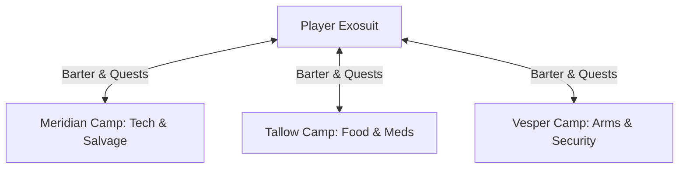
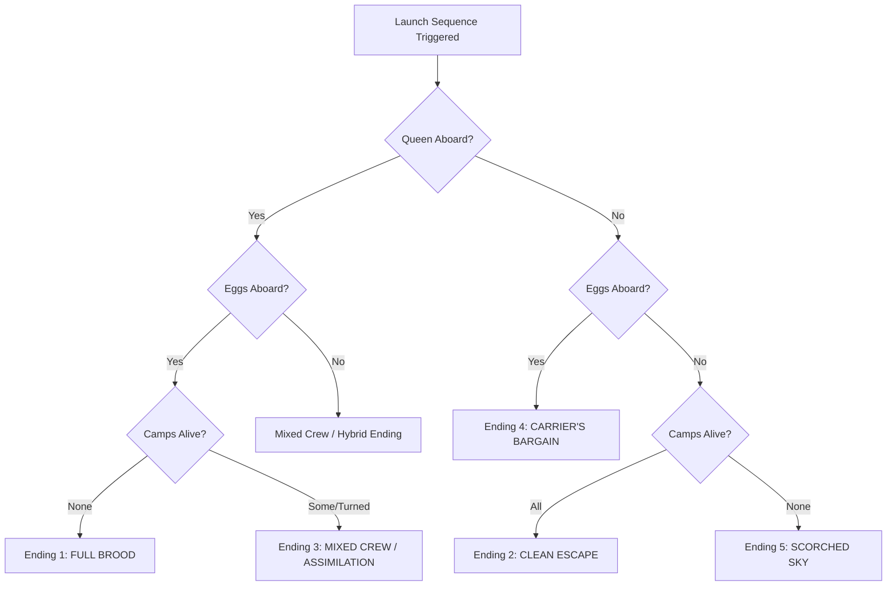

# Hunker Bunker: Expanded Universe & Narrative Design Bible
*Target Sprints: 20+ | Narrative Expansion Plan*

This design document builds upon the core mechanics of [story-arc-endings-design.md](file:///home/caveman/Desktop/icecave/hunker-bunker/docs/story-arc-endings-design.md). It outlines the expanded universe of the ice world, detailed camp lore, optional Act 1 quests, Act 2 choice dynamics, and the multi-ending narrative paths that make the story "wide" and deep.

---

## 🌌 The Lore & The Universe

### 1. The Planet: Cocytus IV ("The Icecave")
A forgotten, tidally locked glacier world on the Outer Rim. Surface temperatures hover around -120°C, making the surface uninhabitable without pressurized exosuits. The atmosphere is thin and corrosive. 
All life, commerce, and horror happen beneath the ice sheets in the **Horizon Corporation's Subterranean Bunker Network**—an infinite maze of industrial steel corridors, steam pipes, and forgotten reactor nodes.

### 2. The Alien Presence: The PregAlien Hive
Deep within the core reactor room (Sector Zero, "The Cave") lies a biomechanical organism of unknown origin:
* **The Queen**: A colossal, telepathic bio-mechanical matriarch. She doesn't just breed; she assimilates. She views the human survivors as raw biomass for her brood or as organic hosts. She communicates with the player via direct neural static on the Tactical Console.
* **The Amber Eggs**: Translucent, pulsing clutches glowing with warm bio-luminescence. Inside them, embryos fuse with corporate technology.
* **The Green Infection**: Sickly bioluminescent green veins (#8CFF96) that crawl over metal bulkheads, converting standard computer terminals into organic "mimics" and humans into cyber-hybrids.

---

## 🤝 Act 1: The Survivor Camps

Three distinct survivor camps exist within the active sector network. In Act 1, they serve as your trading partners and quest givers.



### 1. Meridian Camp (The Tech-Scavengers)
* **Location**: Sector A-9 (High-voltage power grid ruins).
* **Identity**: Former engineers, maintenance crews, and salvage operators. They are tech-worshippers who believe the bunker's central computer is a sleeping god. Led by **Overseer Kaelen**.
* **Economy**: High demand for raw shells and energy cells; surplus of computer parts and technology modules.
* **Aesthetic**: Sparking capacitors, cable bundles hanging like vines, cyan diagnostic screens.

### 2. Tallow Camp (The Hydro-Cultists)
* **Location**: Sector B-4 (Geothermal steam vents).
* **Identity**: Agrarian outcasts who cultivate mutated bioluminescent flora in the hot steam shafts. They are deeply spiritual and pacifist. Led by **Sister Martha**.
* **Economy**: High demand for metal plates and medical tech; surplus of bio-vaccines and synthetic rations.
* **Aesthetic**: Thick steam mist, orange heat lamps, metal pipes wrapped in moss and bio-spores.

### 3. Vesper Camp (The Iron Guild)
* **Location**: Sector C-7 (High-security armory vault).
* **Identity**: Horizon Corp's former security guards and mercenary contractors. Highly militarized, suspicious of outsiders, and heavily armed. Led by **Commander Briggs**.
* **Economy**: High demand for medical supplies and rations; surplus of ammunition and weapon upgrades.
* **Aesthetic**: Sandbag barricades, heavy automated turrets, red alert strobes, and steel blast doors.

---

## 🔄 Act 1 Gameplay Loops: Grow, Barter & Bond

### 1. Bartering Economy
Camps trade resources based on their specialty. Trade rates improve depending on your **Camp Level** and **Bond Level**. 

* **Meridian**: Tech Modules ➡️ 30 Shells | Shells ➡️ 20 Coins
* **Tallow**: Bio-Vaccines ➡️ 20 Rations | Coins ➡️ 15 Rations
* **Vesper**: Ammo Crates ➡️ 25 Shells | Shells ➡️ Weapon Upgrades

*Class Affinity*:
* **Engineer** gets a 20% discount/bonus at **Meridian**.
* **Scout** gets a 20% discount/bonus at **Tallow** (can negotiate using rare herbs found in deep corridors).
* **Tank** gets a 20% discount/bonus at **Vesper**.

### 2. Camp Growth (Levels 1–3)
Spending collected Shells at a camp's terminal upgrades its infrastructure:
* **Level 1**: Basic camp. Offers basic barter rates.
* **Level 2**: Unlocks an **O₂ Sanctuary** (standing inside the camp bounds refills oxygen). Basic defense turrets are built.
* **Level 3**: Unlocks advanced class blueprints, best barter rates, and a full automatic defense grid.

### 3. Optional Bonding Quests (Story Paths)
Completing these optional quests raises `campBond` values, unlocking branching paths and narrative choices.

| Camp | Quest Name | Objective | Story Impact |
| --- | --- | --- | --- |
| **Meridian** | *Reactor Venting* | Defuse a pressure build-up in Sector A-9's cooling lines. | Unlocks the *Substation Keycard* to bypass Act 2 hazard rooms. |
| **Meridian** | *The Lost Probe* | Retrieve a corporate telemetry probe from a hazard zone. | Unlocks the *Radar Shroud* upgrade, hiding your ship from Queen detection. |
| **Tallow** | *Spore Cleansing* | Purge an invasive red mold from the hydro-beds without damaging the crops. | Sister Martha gives you a *Bio-Dampener* that slows down infection rate. |
| **Tallow** | *The Lost Cultist* | Find and escort a young cultivator trapped in a dark, cold ventilation shaft. | Deepens trust; the cultists will volunteer to board your ship in Act 2. |
| **Vesper** | *Armory Breach* | Clear a horde of cyber-snails and bio-mutants from a weapons locker. | Unlocks the *Heavy Munitions* upgrade for your exosuit. |
| **Vesper** | *Bunker Holdout* | Defend Vesper's outer gate from three waves of incoming patrols. | Vesper integrates their automated turrets with your ship's defense systems. |

---

## ⚡ Act 2: The Splitting Paths

Act 2 begins once the escape vessel is complete. The MotherShip / Queen commands you to **cull the survivors** to feed the hive or secure the ship. You have three ways to handle each camp:

```
                  ┌────────► STEAL ────────► (Hostile Camp, High Resources)
                  │
CAMP STATE ───────┼────────► DESTROY ──────► (Culled, Sprints 19+ loot drops)
                  │
                  └────────► SPARE/RECRUIT ─► (Gated by Bond; Boarding / Turning)
```

1. **Steal**:
   * *Action*: Hacking the camp's main vault.
   * *Consequence*: The camp survives but turns permanently hostile. You receive a massive amount of Salvage and Coins, but they will fire on you if you re-enter their sector, and they cannot be recruited.
2. **Destroy (Cull)**:
   * *Action*: Initiating a wipe protocol.
   * *Consequence*: You must fight the defenses you helped build. If the camp was Level 3, you face heavy automated turrets and guards. Slaying them yields high-tier scrap and pleases the Queen (`queenObedience` increases).
3. **Spare / Recruit (Gated by Bond)**:
   * *Action*: Defying the Queen to save the camp.
   * *Consequence*: Requires `campBond >= 4`. If met, you can persuade the survivors to board the ship.
     * *The Human Path*: Sneak them into the cargo hold as passengers.
     * *The Turned Path (Dark Bargain)*: Offer them to the Queen's spores. They are mutated into compliant cyber-hybrids who serve as your crew, locked in absolute obedience.

---

## 🎬 The Wide Multi-Ending Matrix

The game's finale is evaluated when the player triggers the launch sequence. The ending is computed using the following vector:
`Ending = f(queenObedience, campsAlive, campsTurned, queenAboard, eggsAboard)`

Below is the detailed endings matrix, ranging from absolute obedience to full defiance.



### 1. Ending A: FULL BROOD (Obedient Queen-Slave)
* **Difficulty**: Hardest Path A (Absolute Obedience)
* **Conditions**: All three camps destroyed (culled), `queenObedience` at maximum, Queen and eggs safely loaded onto the vessel.
* **Narrative**:
  The player has fully submitted to the neural link. The escape vessel blasts off from the glacier wall, carrying the Queen and her incubation pods. As the ship reaches orbit, the player's visor turns from cyan/green to a static amber glow. The final shot shows the ship setting a course for the densely populated Core Worlds, carrying the seed of the next hive.
* **Cinematic Asset Needed**: `ending-fullbrood.webm`

### 2. Ending B: CLEAN ESCAPE (Defiant Survivors)
* **Difficulty**: Hardest Path B (Absolute Defiance)
* **Conditions**: All camps spared (Level 3 + Max Bond), Queen rejected and defeated in a final boss battle, eggs destroyed, all survivors boarded alive and human.
* **Narrative**:
  After purging the reactor room and severing the Queen's neural link, the player defends the launch pad from a final wave of corrupted patrols. The ship launches with Meridian, Tallow, and Vesper survivors crowded into the cabin. The mood is tense but hopeful. The final scene shows the vessel ascending into the stars, leaving the burning, silent glacier behind.
* **Cinematic Asset Needed**: `ending-cleanescape.webm`

### 3. Ending C: MIXED CREW (The Hive Syndicate)
* **Difficulty**: Medium
* **Conditions**: At least one camp spared, at least one camp "turned" (mutated), Queen aboard.
* **Narrative**:
  A compromised escape. The ship cabin is split by forcefields: on one side, terrified human survivors; on the other, their former friends mutated into bioluminescent cyber-hybrids. The Queen watches from the engine room, her telepathic presence keeping a cold, fragile peace. The ship sails into the void as a floating petri dish of coexistence.
* **Cinematic Asset Needed**: `ending-mixedcrew.webm`

### 4. Ending D: CARRIER'S BARGAIN (The Silent Host)
* **Difficulty**: Medium
* **Conditions**: Queen killed, eggs loaded, survivors boarded, player has high infection rate.
* **Narrative**:
  The Queen is dead, but her legacy is not. To save the survivors, the player hides the eggs in the ship's coolant cells and conceals their own developing infection. As the ship leaves orbit, the player stares out the viewport, feeling the cyber-veins crawling up their neck under their armor. They saved their friends, but they are bringing the seed of the end with them.
* **Cinematic Asset Needed**: `ending-carriersbargain.webm`

### 5. Ending E: SCORCHED SKY (Nihilist Sweep)
* **Difficulty**: Medium
* **Conditions**: All camps dead/destroyed, Queen killed, all eggs destroyed. The player escapes alone.
* **Narrative**:
  The ultimate pyrrhic victory. The bunker network is dark and empty. The survivors are dead, and the hive is ashes. The player launches the ship alone, sitting in a silent cockpit built for four. The final shot is the ship drifting into the black space, a ghost ship carrying the last survivor of a dead world.
* **Cinematic Asset Needed**: `ending-scorchedsky.webm`

---

## 🔄 Dynamic Camp & Class Faction Wheel (Rock-Paper-Scissors)

To tie player choice to class identity, the order in which you discover the survivor camps and the classes of the leaders you meet follow a **Rock-Paper-Scissors (RPS)** mapping. The first two camps house the classes you are *not* playing as. The third and final camp houses your *own* class, led by a commander who has been corrupted and inverted into the final act's camp boss.

```
       SCOUT (Sister Martha / Tallow)
               ▲             │
               │ (defeats)   │ (defeats)
               │             ▼
ENGINEER (Kaelen / Meridian) ◄─── TANK (Briggs / Vesper)
```

### 1. Faction Encounter Matrices by Player Class

#### Path A: Player is a Scout 🟢
* **Camp 1 (Vesper)**: Led by **Commander Briggs** (Tank class). Faction specializes in heavy defenses and firepower.
* **Camp 2 (Meridian)**: Led by **Overseer Kaelen** (Engineer class). Faction specializes in technology and power grids.
* **Camp 3 (Tallow - Final/Boss)**: Led by **Sister Martha** (Corrupted Scout). The hydro-beds are infested; Sister Martha has been taken by the Queen and fights as a high-speed bio-predator.

#### Path B: Player is a Tank 🟡
* **Camp 1 (Meridian)**: Led by **Overseer Kaelen** (Engineer class). Faction specializes in repair systems and O₂ tech.
* **Camp 2 (Tallow)**: Led by **Sister Martha** (Scout class). Faction specializes in scouting pathways and bio-remedies.
* **Camp 3 (Vesper - Final/Boss)**: Led by **Commander Briggs** (Corrupted Tank). The armory has fallen; Briggs is fused with a heavy combat mainframe, acting as a massive biomechanical titan.

#### Path C: Player is an Engineer 🔵
* **Camp 1 (Tallow)**: Led by **Sister Martha** (Scout class). Faction specializes in resource gathering and navigation logs.
* **Camp 2 (Vesper)**: Led by **Commander Briggs** (Tank class). Faction specializes in barricades and turret support.
* **Camp 3 (Meridian - Final/Boss)**: Led by **Overseer Kaelen** (Corrupted Engineer). The power substation is overtaken; Kaelen is fused into the grid as a cybernetic terminal intelligence.

---

## 🚶 In-World NPCs: Ambient Camp Behaviors

To make the bunker camps feel alive, the camp leaders are rendered as active, animated 2.5D billboard sprites that walk around and perform tasks in their camps.

```
+--------------------------------------------------------+
|                      CAMP BOUNDS                       |
|   [O2 Sanctuary Vent]              [Trade Terminal]    |
|            ▲                              ▲            |
|            │                              │            |
|            └───────► [NPC Node] ◄─────────┘            |
|                          │                             |
|                          ▼                             |
|                  [Weapon Rack/Flora]                   |
+--------------------------------------------------------+
```

### 1. Pathfinding & Idle Actions
Camp leaders pathfind between 3–4 specific interactable nodes in their camps:
* **The Scout (Sister Martha)**: Walks to the hydro-beds to inspect plants (crouches, green leaf particles spawn), dashes quickly to the camp perimeter to check the darkness with a searchlight cone, and rests by the steam vents.
* **The Tank (Commander Briggs)**: Walks to the barricades to stand guard (arms crossed, breathing smoke puffs), cleans the automatic gun emplacements with a wrench, and checks the weapon racks.
* **The Engineer (Overseer Kaelen)**: Walks to the main camp console to input data (typing animations, sparks fly), inspects hanging cables (plasma torch effect), and calibrates the O₂ generator.

### 2. State-Driven NPC Behaviors
The characters react dynamically to the player's choices and status:
* **Normal / Aided**: Friendly animations. They salute the player on approach, face the player during dialogue, and walk normally.
* **Robbed**: Hostile stance. The leader draws their weapon (Sister Martha aims her rifle, Briggs raises his shield, Kaelen brandishes his plasma torch). If the player steps inside the camp boundary, they yell warnings, and security drones spawn to attack.
* **Turned**: Biomechanical horror animations. The sprites are replaced with infected versions featuring glowing green eyes and ropey flesh growing over their armor. They move with jerky, erratic pathing, twitching occasionally, and emit green bio-spore dust as they walk. They communicate via telepathic terminal popups.

---

## 👹 The Inverted Boss Battles (Act 2 Climax)

When confronting the final, corrupted camp in Act 2, the leader acts as a major mechanical boss, subverting your own class abilities against you.

### 1. Corrupted Scout Boss (Tallow Camp)
* **Mechanics**: Utilizes infinite Sprint Bursts. Sister Martha dashes across the screen, leaving glowing green visual duplicates that explode after a delay. She is highly agile, dodging slower attacks.
* **Attack Profile**: Fires rapid toxic spore darts that deal damage over time and slow your movement. She periodically teleports into the darkness, requiring you to track her glowing green trail.

### 2. Corrupted Tank Boss (Vesper Camp)
* **Mechanics**: Utilizes an overgrown organic shield. Briggs is immune to head-on attacks unless staggered. He walks slowly but is unstoppable when charging.
* **Attack Profile**: Launches a heavy ground-pound slam that causes ice stalactites to fall from the ceiling in a radius. He fires triple-burst explosive spore canisters from his shoulder launcher.

### 3. Corrupted Engineer Boss (Meridian Camp)
* **Mechanics**: Fused into the central server stack. Kaelen does not move; instead, he controls the room. He hacks your tactical console, reversing movement inputs or periodically jamming your scanner.
* **Attack Profile**: Activates floor-grid electrical currents that damage you if you stand on active tiles. He spawns mechanical cyber-snails that carry explosive charges toward you.

---

## 💾 State Groundwork & Save Vector

To support this multi-branching story, the game's state management must track the following variables in the save-state system (`hb_state`):

```json
{
  "storyState": {
    "act": 2,
    "queenObedience": -3,
    "queenStatus": "hostile",
    "eggsDestroyed": true,
    "camps": {
      "meridian": {
        "level": 3,
        "bond": 5,
        "status": "recruited"
      },
      "tallow": {
        "level": 2,
        "bond": 4,
        "status": "recruited"
      },
      "vesper": {
        "level": 1,
        "bond": 1,
        "status": "robbed"
      }
    }
  }
}
```

### Script Pipeline Hooks
1. **Scene Generation**: `node scratch/generate_cave_scenes.js` will compile the custom video overlays for the final endings (`ending-fullbrood.webm`, `ending-cleanescape.webm`, etc.) using images placed in `public/`.
2. **Ending Picker**: The `main.js` departure sequence will read the `storyState` vector on launch and trigger the corresponding WebM cutscene.
