# Interstitial Movie Prompts & Asset Gallery

This reference document catalogs all 38 soundtrack and narrative interstitials in *Hunker Bunker*. 

Each entry includes:
- **Master Image**: The first-frame key illustration (`public/interstitials/int_<id>_<slug>_key_v1.webp`).
- **Target Video**: The motion cutaway path (`public/interstitials/motion/int_<id>_<slug>_motion_v1.webm`).
- **Narrative Context & In-Game Trigger**: When and why the scene appears.
- **Image-to-Video Action Prompt**: High-fidelity prompt ready to be pasted into AI video generation models (Runway Gen-3, Luma Dream Machine, Kling, Sora, Google Veo, etc.).
- **Fallback Ken Burns Direction**: The automated pan/zoom choreography used when rendering the still image.

---

## Technical Runtime Contract

1. **Movie Playback**: `SongInterstitialController` (`src/songInterstitials.js`) automatically probes `public/interstitials/motion/int_<id>_<slug>_motion_v1.webm`. When present, it plays the WebM video in place of the still.
2. **Ken Burns Fallback**: If the motion WebM is absent, the controller presents `public/interstitials/int_<id>_<slug>_key_v1.webp` with a Ken Burns camera drift and CSS door wipes.
3. **Audio Synchronization**: Audio cue starts at the first transition frame simultaneously with the door wipe.

---

## 1. Conversations & Characters (Tracks 01–12)

### 01 — Someone Is Still Alive
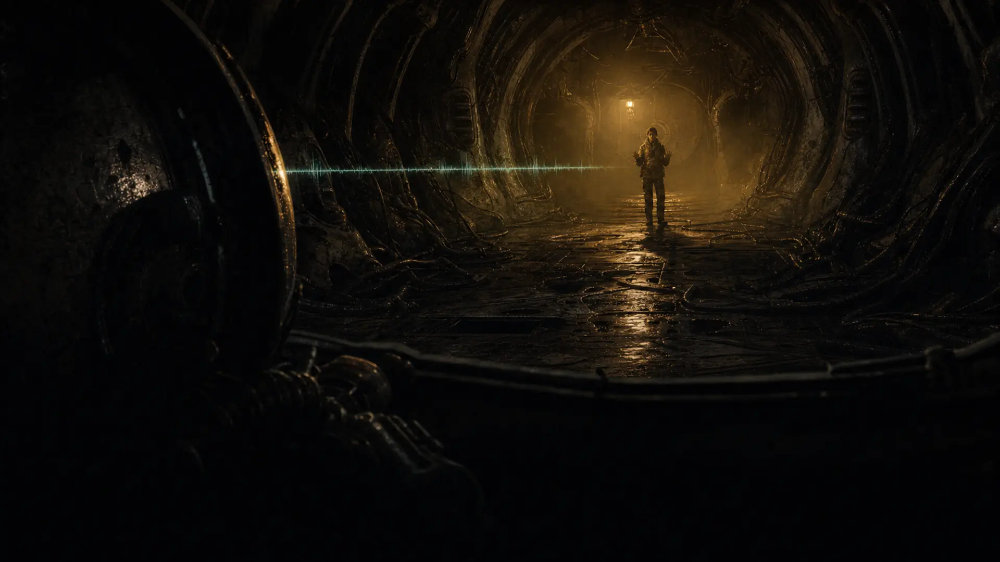
- **Key Master**: `public/interstitials/int_01_someone_is_still_alive_key_v1.webp`
- **Target Video**: `public/interstitials/motion/int_01_someone_is_still_alive_motion_v1.webm`
- **Trigger**: First survivor conversation; interactive campaign introduction.
- **Scene Context**: The player's helmet rim in foreground; a lone survivor sits beneath a failing amber lamp in the cavernous dark bunker.
- **Image-to-Video Action Prompt**:
  > Slow cinematic push-in from behind the player's helmet rim. The overhead amber lamp gently sways and flickers, casting moving shadows across the metal girders. Thin cyan radio waveforms subtly pulse between the survivor and the player. Cold breath vapor rises slowly from the survivor's mouth into the damp air. Subtle particulate dust drifting in the beam of light. 24fps, atmospheric retro sci-fi.
- **Ken Burns Direction**: Slow push-in 100% → 107% centered slightly above the lamp.

---

### 02 — Kaelen's Sleeping Machine
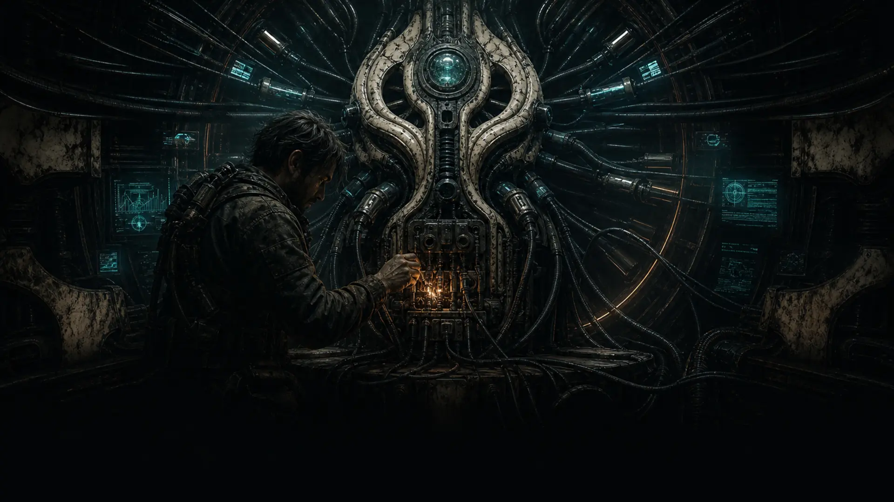
- **Key Master**: `public/interstitials/int_02_kaelen_s_sleeping_machine_key_v1.webp`
- **Target Video**: `public/interstitials/motion/int_02_kaelen_s_sleeping_machine_motion_v1.webm`
- **Trigger**: Standard Overseer Kaelen conversation at Meridian.
- **Scene Context**: Kaelen in profile beside a transformer shrine, cables forming a circuit halo; tired hands tuning dials.
- **Image-to-Video Action Prompt**:
  > Slow subtle dolly right. Micro-arcs of electricity and soft cyan indicator LEDs pulse sequentially along the hanging cables behind Kaelen's head. Kaelen's tired eyelids blink slowly as he turns a dial with grease-stained hands. A gentle heat shimmer rises from the copper transformer coils.
- **Ken Burns Direction**: Slow horizontal pan left-to-right with 103% scale.

---

### 03 — The Math Is Beautiful Now
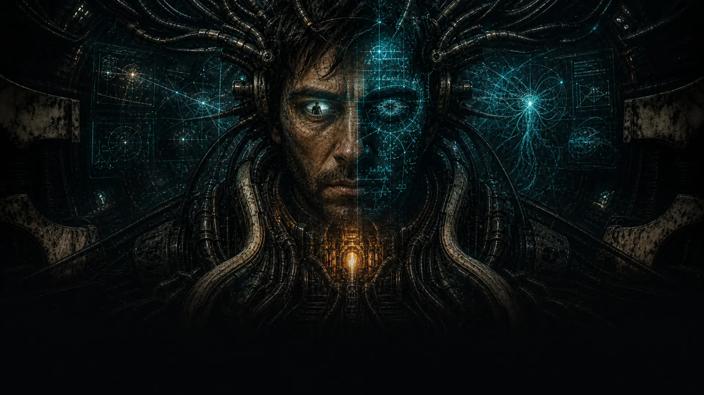
- **Key Master**: `public/interstitials/int_03_the_math_is_beautiful_now_key_v1.webp`
- **Target Video**: `public/interstitials/motion/int_03_the_math_is_beautiful_now_motion_v1.webm`
- **Trigger**: Kaelen detects infection or hears the Director.
- **Scene Context**: Kaelen's face divided by a translucent equation; one eye reflects the player, the other an electrical hive organism.
- **Image-to-Video Action Prompt**:
  > Slow, hypnotic push-in directly toward Kaelen's eyes. Glowing geometric equations and vector diagrams slowly scroll and shift across his skin. The electrical reflection in his left eye pulses with erratic orange neural sparks while his human eye stares forward unblinking. Subtle digital chromatic aberration shimmering at the edges.
- **Ken Burns Direction**: Direct zoom-in 100% → 110% into the bisected eye.

---

### 04 — Warmth Beneath the Ice
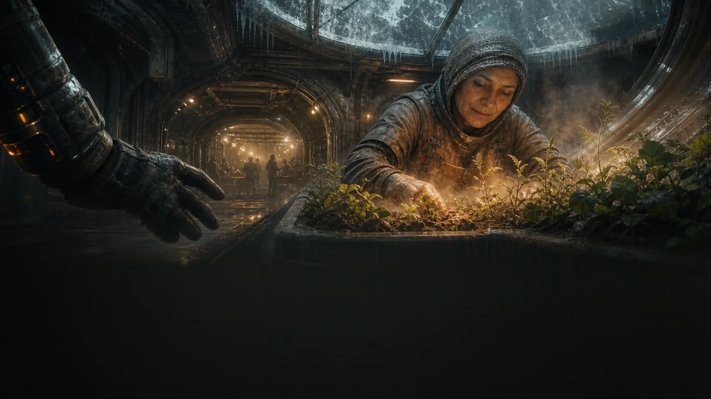
- **Key Master**: `public/interstitials/int_04_warmth_beneath_the_ice_key_v1.webp`
- **Target Video**: `public/interstitials/motion/int_04_warmth_beneath_the_ice_motion_v1.webm`
- **Trigger**: Peaceful Sister Martha conversation at Tallow.
- **Scene Context**: Martha tending a steaming hydroponic planter beneath fractured glacier ice, orange condensation around her hands.
- **Image-to-Video Action Prompt**:
  > Gentle camera pan up from Martha's soil-covered gloves to her calm face. Thick, warm orange steam rolls off the geothermal soil bed, condensing into droplets on the cold green leaves and overhead ice roof. Water droplets fall from the thawing ice above in slow motion, rippling the moisture in the soil.
- **Ken Burns Direction**: Smooth vertical pan upward from hands to face.

---

### 05 — The Pipes Are Singing
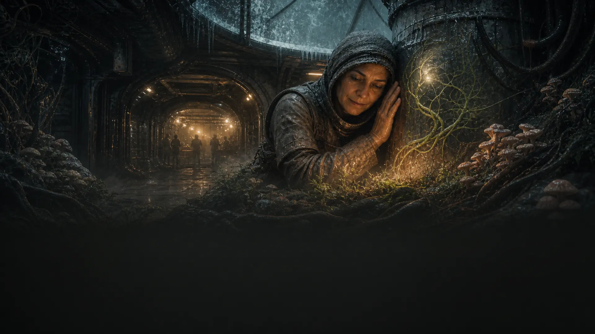
- **Key Master**: `public/interstitials/int_05_the_pipes_are_singing_key_v1.webp`
- **Target Video**: `public/interstitials/motion/int_05_the_pipes_are_singing_motion_v1.webm`
- **Trigger**: Spores, missing children, or Queen influence enters Martha's dialogue.
- **Scene Context**: Martha listening to a wall pipe as root-like veins inside it suggest an organic silhouette.
- **Image-to-Video Action Prompt**:
  > Slow creepy push-in toward the junction pipe. Bioluminescent green and purple veins beneath the tarnished metal expand and contract in a slow breathing rhythm. Martha's expression shifts into a dreamy, entranced smile. Faint fungal spores drift out of a hairline pipe fracture like glowing green smoke.
- **Ken Burns Direction**: Slow zoom-in 100% → 108% focusing on the ear-to-pipe contact point.

---

### 06 — Briggs Keeps the Ledger
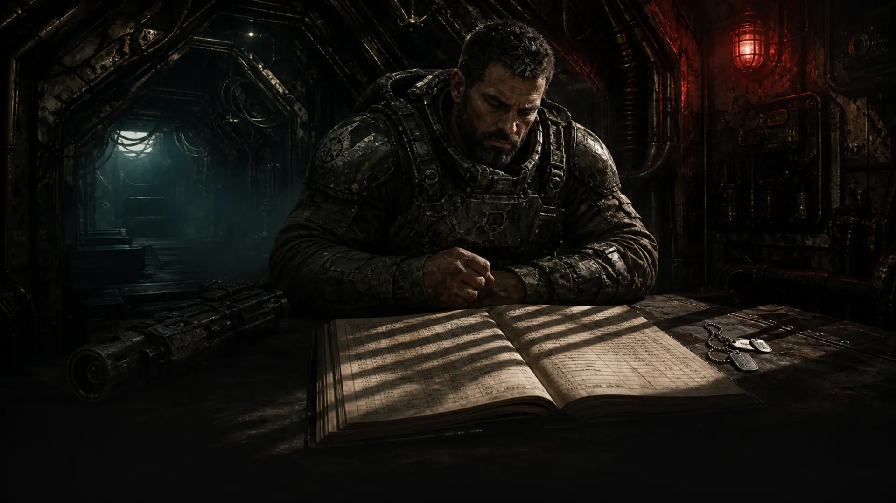
- **Key Master**: `public/interstitials/int_06_briggs_keeps_the_ledger_key_v1.webp`
- **Target Video**: `public/interstitials/motion/int_06_briggs_keeps_the_ledger_motion_v1.webm`
- **Trigger**: Routine Commander Briggs conversation at Vesper.
- **Scene Context**: Briggs at a steel table with a casualty ledger open, turret shadows crossing the page like prison bars.
- **Image-to-Video Action Prompt**:
  > Low-angle slow tracking shot across the scratched steel table. Revolving red emergency beacon lights cast rhythmic sweeping shadows through the grated ceiling. Briggs taps a heavy pen onto the paper ledger, his weathered knuckles tensing. Heavy brass dog tags clink gently against the desk as the bunker floor shudders faintly.
- **Ken Burns Direction**: Diagonal pan from ledger up to Briggs's eyes.

---

### 07 — Your Name Was Written Twice
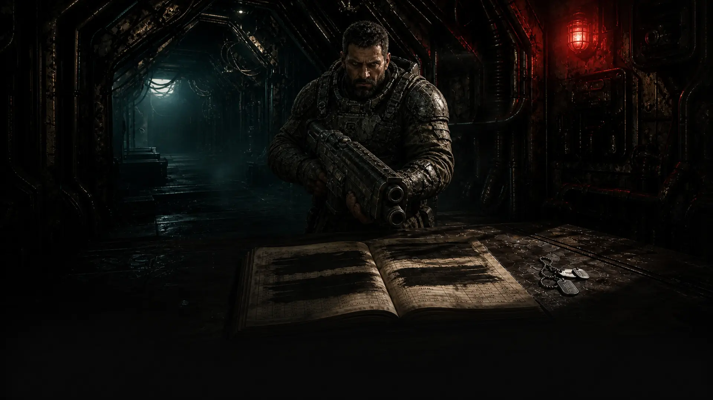
- **Key Master**: `public/interstitials/int_07_your_name_was_written_twice_key_v1.webp`
- **Target Video**: `public/interstitials/motion/int_07_your_name_was_written_twice_motion_v1.webm`
- **Trigger**: Briggs suspects the player's infection.
- **Scene Context**: Briggs aiming low but ready; the ledger displays blacked-out entries resembling the player's silhouette.
- **Image-to-Video Action Prompt**:
  > Tight static tension shot with a slow 1% push-in. Red bunker warning strobe sweeps across Briggs's narrowed eyes. His index finger twitches against the holster latch. Smoke from an extinguished cigar curls slowly in the harsh side-lighting. Deep psychological standoff atmosphere.
- **Ken Burns Direction**: Slow high-tension push-in directly onto Briggs's weapon hand.

---

### 08 — Dr. Nahl Remembers the Tissue
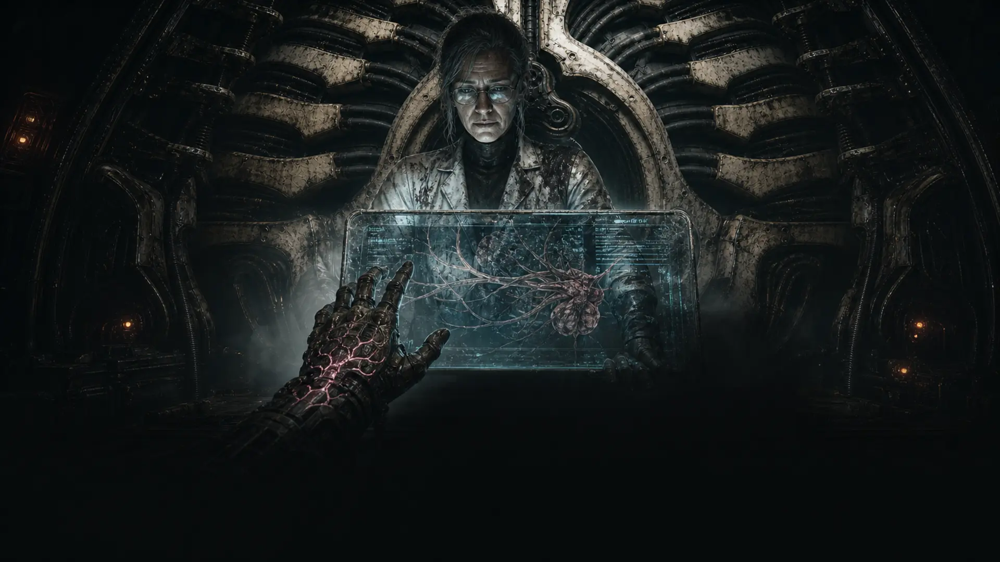
- **Key Master**: `public/interstitials/int_08_dr_nahl_remembers_the_tissue_key_v1.webp`
- **Target Video**: `public/interstitials/motion/int_08_dr_nahl_remembers_the_tissue_motion_v1.webm`
- **Trigger**: Medical consultation with Dr. Nahl.
- **Scene Context**: Nahl behind a scratched specimen screen; a preserved tissue sample mirrors the branching vessels in the player's wrist.
- **Image-to-Video Action Prompt**:
  > Slow orbital camera pan around the glowing cylindrical specimen container. The suspended organic tissue inside floats and flexes, sending luminescent magenta pulses through its tendrils. Dr. Nahl's glasses reflect the alien glow as his gloved fingers take notes on a scratched diagnostic tablet.
- **Ken Burns Direction**: Slow drift from Nahl's face to the suspended specimen jar.

---

### 09 — Mothership Customer Support
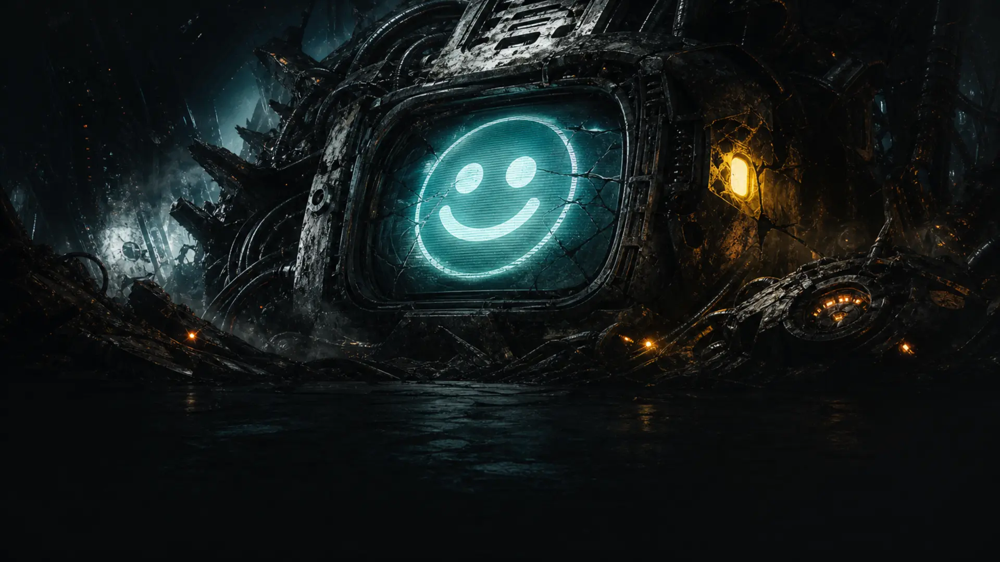
- **Key Master**: `public/interstitials/int_09_mothership_customer_support_key_v1.webp`
- **Target Video**: `public/interstitials/motion/int_09_mothership_customer_support_motion_v1.webm`
- **Trigger**: Standard suit terminal interaction.
- **Scene Context**: Cheerful obsolete help-terminal mascot on a cracked CRT, surrounded by a destroyed cockpit.
- **Image-to-Video Action Prompt**:
  > Camera jitter and subtle electrical hum. The cracked CRT screen flickers with horizontal raster scanlines. The smiling corporate mascot icon bobs and blinks mechanically with dropped animation frames while yellow and red warning dialogue boxes pop up and glitch out around it. Sparks drop from overhead dangling wires.
- **Ken Burns Direction**: Subtle camera shake with 102% scale hold.

---

### 10 — Mothership Is Not Feeling Well
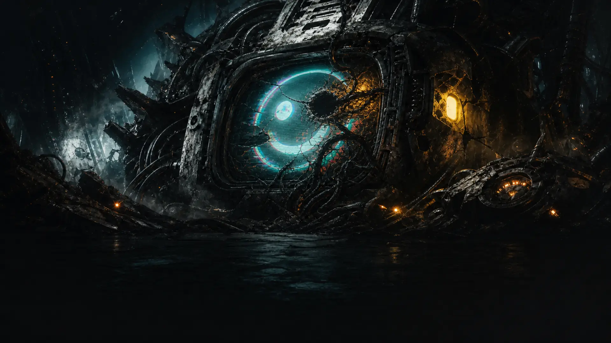
- **Key Master**: `public/interstitials/int_10_mothership_is_not_feeling_well_key_v1.webp`
- **Target Video**: `public/interstitials/motion/int_10_mothership_is_not_feeling_well_motion_v1.webm`
- **Trigger**: Glitched suit dialogue or infection spike.
- **Scene Context**: Helmet HUD reflected recursively; customer-service mascot face missing one eye and melting into organic static.
- **Image-to-Video Action Prompt**:
  > Slow zoom into the visor HUD. The digital mascot's face melts into corrupt amber code blocks and twitching biological pixels. Static snow bursts intermittently across the HUD display. The suit oxygen readouts scramble and drop into hexadecimal errors in real-time.
- **Ken Burns Direction**: Zoom-in 100% → 109% toward the corrupted mascot eye.

---

### 11 — Her Voice Inside Your Helmet
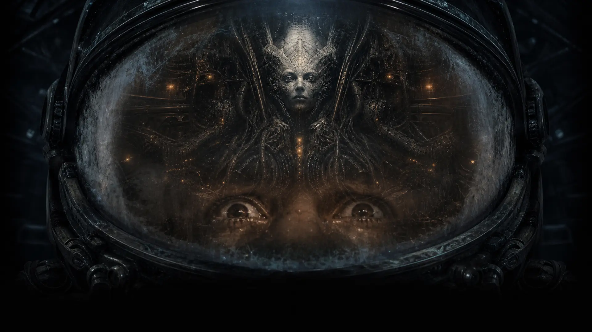
- **Key Master**: `public/interstitials/int_11_her_voice_inside_your_helmet_key_v1.webp`
- **Target Video**: `public/interstitials/motion/int_11_her_voice_inside_your_helmet_motion_v1.webm`
- **Trigger**: First direct Queen contact.
- **Scene Context**: Extreme close-up of helmet visor; behind the player's reflected eyes is a vast amber maternal silhouette made of tendrils.
- **Image-to-Video Action Prompt**:
  > Hypnotic slow push-in on the gold-tinted visor glass. The player's dilated eye reflection is enveloped by glowing amber fractal tendrils that undulate softly behind the glass. Soft golden light pulses in sync with deep telepathic breathing, illuminating microscopic fractures in the helmet visor.
- **Ken Burns Direction**: Slow zoom 100% → 112% straight into the pupil reflection.

---

### 12 — The Queen Makes a Reasonable Offer
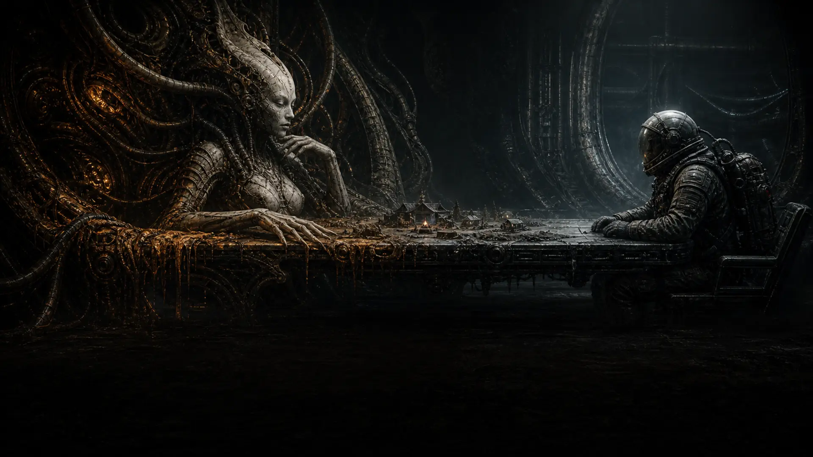
- **Key Master**: `public/interstitials/int_12_the_queen_makes_a_reasonable_offer_key_v1.webp`
- **Target Video**: `public/interstitials/motion/int_12_the_queen_makes_a_reasonable_offer_motion_v1.webm`
- **Trigger**: Assimilation or camp-culling dialogue.
- **Scene Context**: Queen and player seated across an impossible table; one half organic velvet, the other bunker steel, with a camp model between them.
- **Image-to-Video Action Prompt**:
  > Slow tracking shot along the center seam of the table. On the right side, mechanical rivets vibrate and steam vents hiss; on the left side, organic chitin and warm amber fluid breathe and swirl. The Queen's crowned silhouette slowly leans forward, offering a glowing translucent resin pod across the table.
- **Ken Burns Direction**: Horizontal pan from the player's side toward the Queen's outstretched claw.

---

## 2. Enemy Encounters & Diplomacy (Tracks 13–18)

### 13 — A Snail Blocks the Hallway
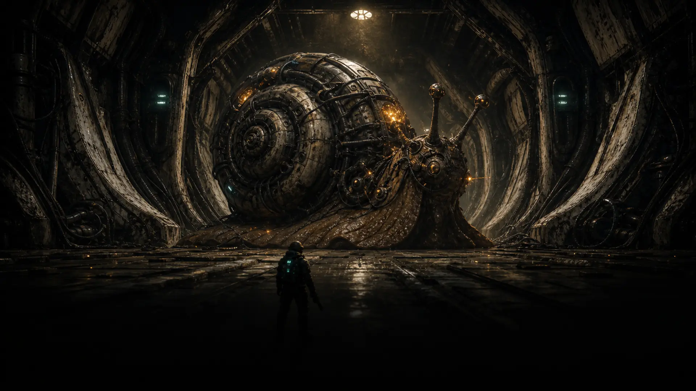
- **Key Master**: `public/interstitials/int_13_a_snail_blocks_the_hallway_key_v1.webp`
- **Target Video**: `public/interstitials/motion/int_13_a_snail_blocks_the_hallway_motion_v1.webm`
- **Trigger**: Standard Cybersnail encounter.
- **Scene Context**: Low-angle corridor view; an imposing snail centered beneath a maintenance sign, shell hardware sparking.
- **Image-to-Video Action Prompt**:
  > Low-angle push-in toward the enormous cybernetic snail. Hydraulic cylinders on its heavy steel shell hiss and vent jets of pressurized steam. Its mechanical sensor stalks rotate independently, scanning the floor with a red laser grid. Tiny sparks shower from exposed wiring on its rear capacitor bank.
- **Ken Burns Direction**: Low-angle push-in 100% → 108% focusing on the shell radar dish.

---

### 14 — Cold Enough to Think
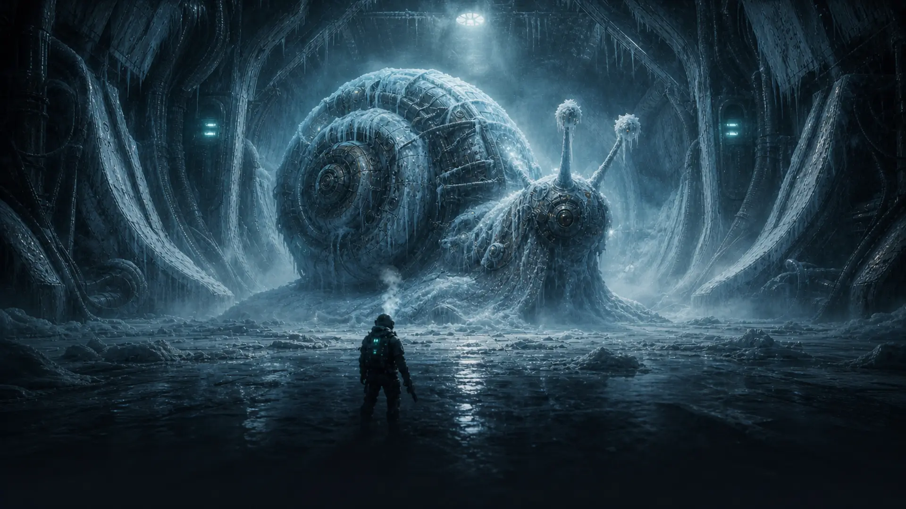
- **Key Master**: `public/interstitials/int_14_cold_enough_to_think_key_v1.webp`
- **Target Video**: `public/interstitials/motion/int_14_cold_enough_to_think_motion_v1.webm`
- **Trigger**: Cryosnail encounter.
- **Scene Context**: Frozen shell emerging from deep blue darkness, player's breath forming vapor between them.
- **Image-to-Video Action Prompt**:
  > Slow camera drift across deep blue translucent ice shelves. Frost crystals grow and creep outward. Suddenly, deep within the glacier, a massive jet-black eye dilates and focuses directly on the lens. Cracks in the ice spiderweb outward with a deep sub-bass groan.
- **Ken Burns Direction**: Lateral slide from deep ice toward the awakened dark eye.

---

### 15 — The Spores Know Your Name
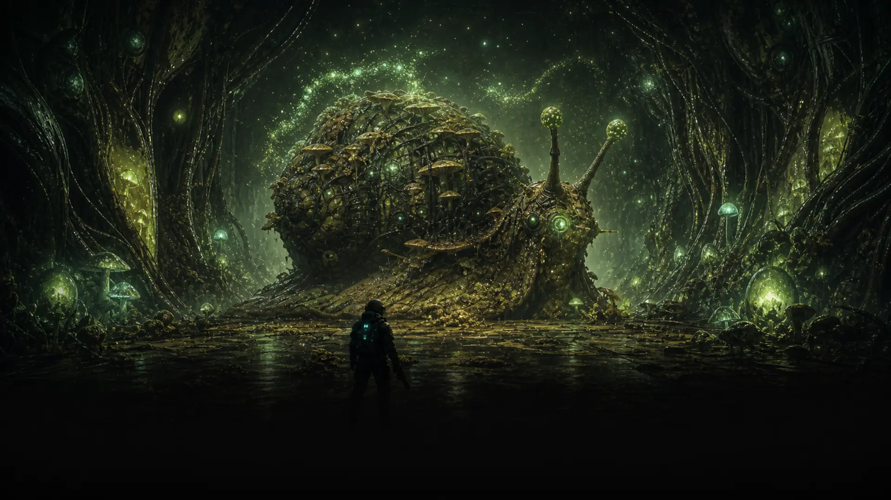
- **Key Master**: `public/interstitials/int_15_the_spores_know_your_name_key_v1.webp`
- **Target Video**: `public/interstitials/motion/int_15_the_spores_know_your_name_motion_v1.webm`
- **Trigger**: Sporesnail encounter.
- **Scene Context**: Bioluminescent snail surrounded by spore clouds forming readable glyph patterns.
- **Image-to-Video Action Prompt**:
  > Slow ethereal camera swirl. Glowing emerald spore clouds gently billow and twist through the dark cave air, briefly congregating into readable geometric shapes and glyphs before dispersing. The snail's fungal carapace pulses with waves of green and violet bioluminescence.
- **Ken Burns Direction**: Slow zoom-in 100% → 107% with clockwise rotational drift.

---

### 16 — We Could Avoid Doing This
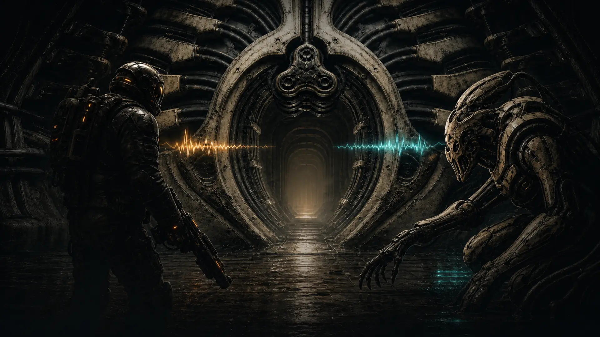
- **Key Master**: `public/interstitials/int_16_we_could_avoid_doing_this_key_v1.webp`
- **Target Video**: `public/interstitials/motion/int_16_we_could_avoid_doing_this_motion_v1.webm`
- **Trigger**: Intelligent creature negotiation layer.
- **Scene Context**: Gun barrel and alien appendage both held half-lowered across a strip of bunker light.
- **Image-to-Video Action Prompt**:
  > Slow horizontal dolly along the illuminated boundary line on the steel floor. Both the gun barrel and the biomechanical claw remain almost motionless, subtly adjusting their grip in a tense hesitation. Dust particles hang suspended in the shaft of light between them.
- **Ken Burns Direction**: Horizontal tracking pan along the floor light divide.

---

### 17 — It Understands the Gun
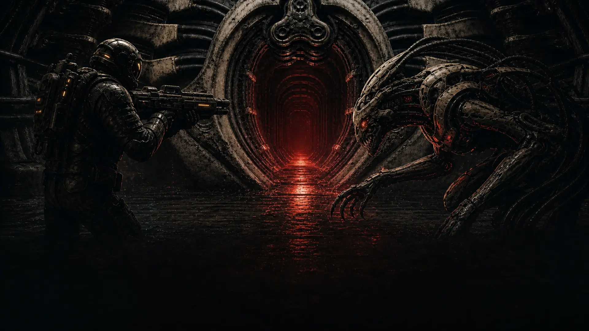
- **Key Master**: `public/interstitials/int_17_it_understands_the_gun_key_v1.webp`
- **Target Video**: `public/interstitials/motion/int_17_it_understands_the_gun_motion_v1.webm`
- **Trigger**: Failed negotiation splash before combat.
- **Scene Context**: Creature eye reflecting the raised weapon barrel as chitin plates snap shut into attack mode.
- **Image-to-Video Action Prompt**:
  > Sudden dramatic punch-in to the creature's eye. Heavy chitin armor plates snap shut around its neck with an aggressive metallic click. Threat-warning red flashes across the cave walls as the creature's body tenses and rears back to strike.
- **Ken Burns Direction**: Fast push-in 100% → 112% straight into the creature's pupil reflection.

---

### 18 — The Creature Lets You Pass
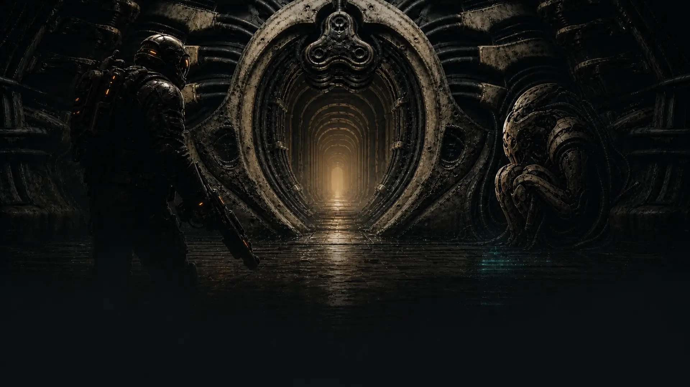
- **Key Master**: `public/interstitials/int_18_the_creature_lets_you_pass_key_v1.webp`
- **Target Video**: `public/interstitials/motion/int_18_the_creature_lets_you_pass_motion_v1.webm`
- **Trigger**: Successful diplomacy card.
- **Scene Context**: Creature folded into an alcove while a warm golden path opens up behind it.
- **Image-to-Video Action Prompt**:
  > Slow gliding forward camera motion following the golden path of light on the floor. The enormous creature smoothly tucks its segmented limbs against the rock wall into passive repose, letting out a deep resonant sigh of warm mist as the exit tunnel opens up.
- **Ken Burns Direction**: Slow forward dolly zoom along the open corridor path.

---

## 3. Camps Changing State (Tracks 19–24)

### 19 — Meridian Remembers You
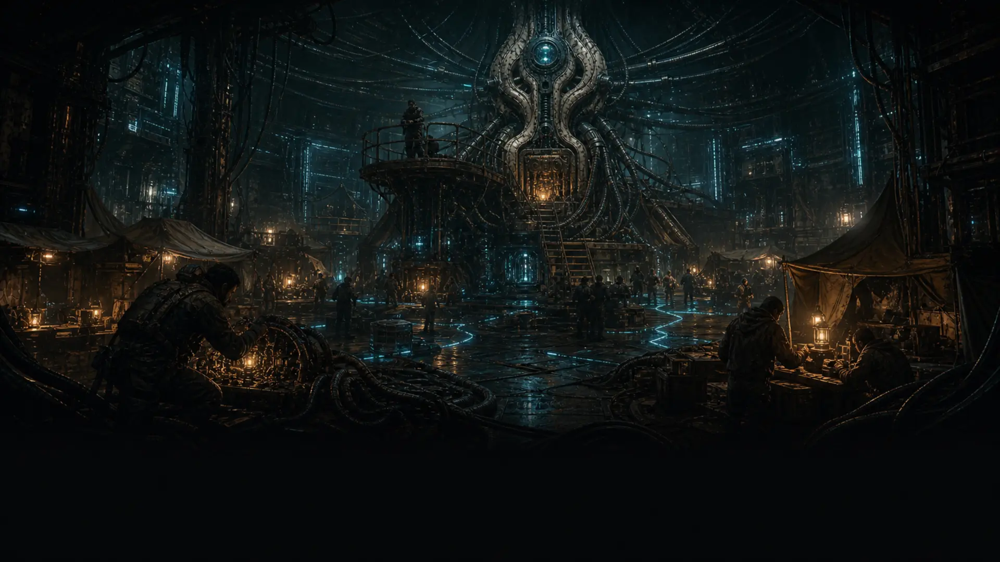
- **Key Master**: `public/interstitials/int_19_meridian_remembers_you_key_v1.webp`
- **Target Video**: `public/interstitials/motion/int_19_meridian_remembers_you_motion_v1.webm`
- **Trigger**: Entering upgraded friendly Meridian camp.
- **Scene Context**: Busy repair silhouettes beneath cyan transformers; Kaelen acknowledges the player from a catwalk.
- **Image-to-Video Action Prompt**:
  > Sweeping elevated camera move across Meridian's multi-level scaffolding. Blue and cyan welding sparks shower down from catwalks. Giant turbine wheels rotate in the background. Salvager workers wave up toward the player as steam valves release rhythmic clouds of white vapor.
- **Ken Burns Direction**: Diagonal pan upward from floor generators to elevated catwalks.

---

### 20 — Tallow Keeps the Steam
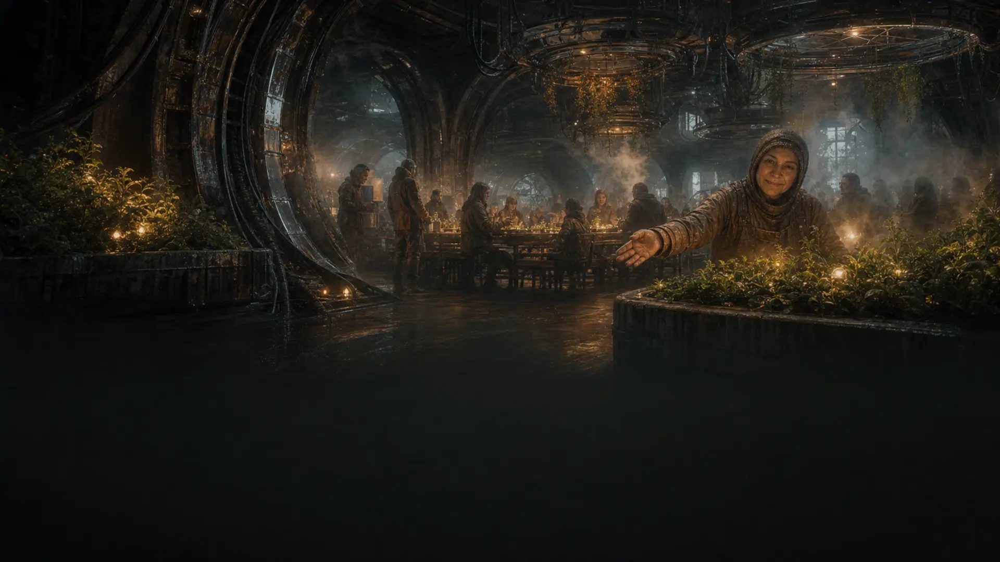
- **Key Master**: `public/interstitials/int_20_tallow_keeps_the_steam_key_v1.webp`
- **Target Video**: `public/interstitials/motion/int_20_tallow_keeps_the_steam_motion_v1.webm`
- **Trigger**: Entering upgraded friendly Tallow camp.
- **Scene Context**: Warm communal table, steam partially revealing survivor faces, living plants overhead.
- **Image-to-Video Action Prompt**:
  > Warm, cozy tracking shot through the hanging botanical vines and oil lanterns. Amber light reflects off communal soup kettles. Survivors sit around a wooden bench laughing and eating as golden steam curls lazily upward into the moss-covered cavern ceiling.
- **Ken Burns Direction**: Slow horizontal pan across the dining table survivors.

---

### 21 — Vesper Sleeps in Shifts
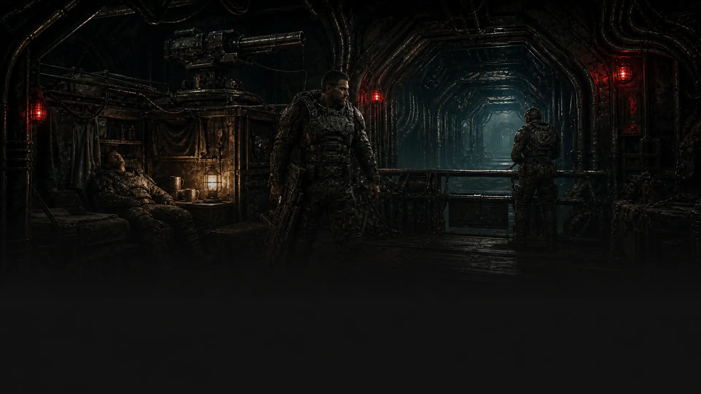
- **Key Master**: `public/interstitials/int_21_vesper_sleeps_in_shifts_key_v1.webp`
- **Target Video**: `public/interstitials/motion/int_21_vesper_sleeps_in_shifts_motion_v1.webm`
- **Trigger**: Entering upgraded friendly Vesper camp.
- **Scene Context**: One guard asleep beneath sandbags while another watches the perimeter; Briggs standing watch.
- **Image-to-Video Action Prompt**:
  > Slow pan from a sleeping sentry under wool blankets to the automated perimeter turret mounted on the bunker parapet. The motorized turret hums softly as its searchlight traverses back and forth across the frozen canyon perimeter. Snowflakes drift across the red muzzle glare.
- **Ken Burns Direction**: Pan from the bunks to the parapet turret searchlight.

---

### 22 — You Robbed the Only People Left
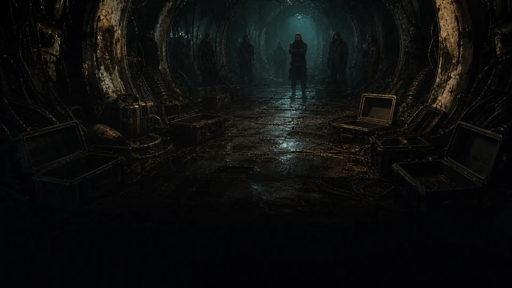
- **Key Master**: `public/interstitials/int_22_you_robbed_the_only_people_left_key_v1.webp`
- **Target Video**: `public/interstitials/motion/int_22_you_robbed_the_only_people_left_motion_v1.webm`
- **Trigger**: Returning to a camp after looting supplies.
- **Scene Context**: Familiar camp layout now stripped and empty in foreground; armed survivors watching from dark shadows.
- **Image-to-Video Action Prompt**:
  > Slow, ominous push-in on overturned, ransacked supply crates. In the deep background shadows, weapon barrels slowly emerge, catching the glint of dying emergency lights. No friendly voices—only cold, hostile stares and the metallic click of shotguns chambering.
- **Ken Burns Direction**: Push-in 100% → 107% focusing on the overturned supply crates.

---

### 23 — They Still Have Their Faces
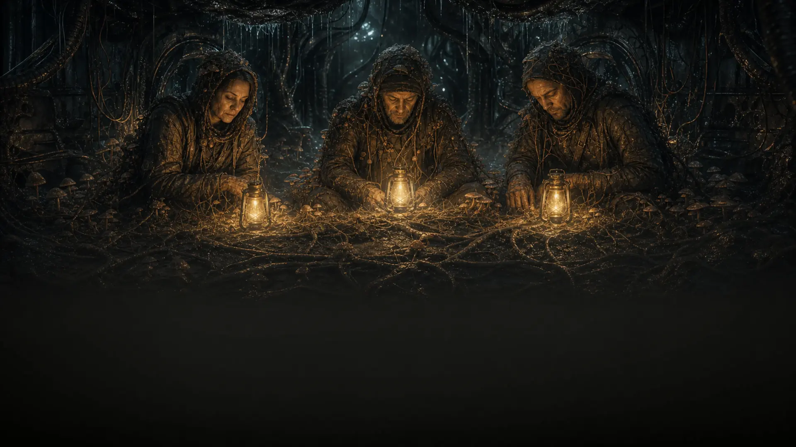
- **Key Master**: `public/interstitials/int_23_they_still_have_their_faces_key_v1.webp`
- **Target Video**: `public/interstitials/motion/int_23_they_still_have_their_faces_motion_v1.webm`
- **Trigger**: First conversation with a turned/infected camp.
- **Scene Context**: Three familiar survivor faces under warm camp light, but their wall shadows connect into a single monstrous organism.
- **Image-to-Video Action Prompt**:
  > Slow camera pan from the three smiling, motionless human faces down to their cast shadows on the back bunker wall. While their physical bodies remain unnervingly still, their wall shadows warp, merge, and wriggle with writhing alien tendrils and chitinous spikes in fluid motion.
- **Ken Burns Direction**: Pan from the human faces down to the joined wall shadow.

---

### 24 — Nobody Says Goodbye
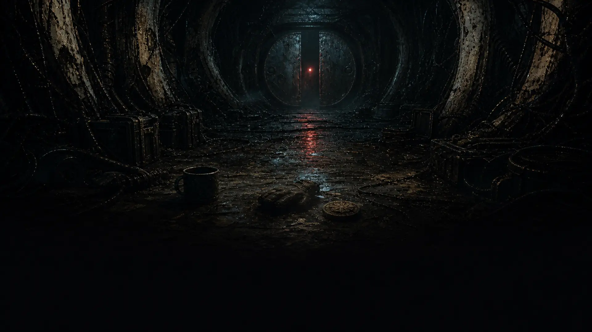
- **Key Master**: `public/interstitials/int_24_nobody_says_goodbye_key_v1.webp`
- **Target Video**: `public/interstitials/motion/int_24_nobody_says_goodbye_motion_v1.webm`
- **Trigger**: Camp culling or abandonment confirmation.
- **Scene Context**: Camp blast doors sealing shut while personal items remain in foreground; no bodies, only silence.
- **Image-to-Video Action Prompt**:
  > Slow zoom out from a child's forgotten drawing and a dented canteen on the cold floor. The heavy steel blast doors slide shut from both sides with heavy, deliberate mechanical force, gradually cutting off the dim interior bunker light until only a sliver of red indicator remains.
- **Ken Burns Direction**: Slow zoom-out 108% → 100% as the doorway closes.

---

## 4. Boss Transition Splashes (Tracks 25–31)

### 25 — Gigawatt Goliath
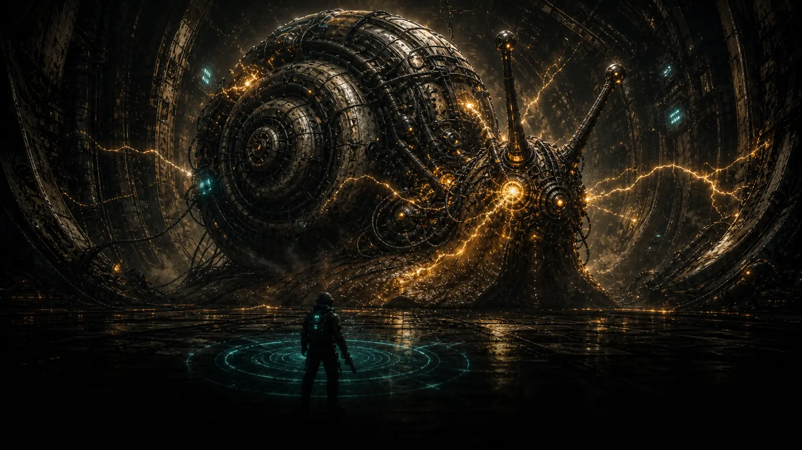
- **Key Master**: `public/interstitials/int_25_gigawatt_goliath_key_v1.webp`
- **Target Video**: `public/interstitials/motion/int_25_gigawatt_goliath_motion_v1.webm`
- **Trigger**: Boss Cybersnail encounter card.
- **Scene Context**: Colossal electrified mech-snail towering over arena; lightning arcs dancing across capacitors.
- **Image-to-Video Action Prompt**:
  > Dramatic upward tilt towards the massive cybernetic leviathan. Blinding cyan electric arcs bridge across its twin heavy railgun horns. Giant exhaust fans in its shell spin up, blowing dust storms across the arena floor as its radar array locks onto the camera with a brilliant yellow strobe.
- **Ken Burns Direction**: Upward tilt zoom 100% → 110% into the railgun horns.

---

### 26 — Absolute Zero Has a Shell
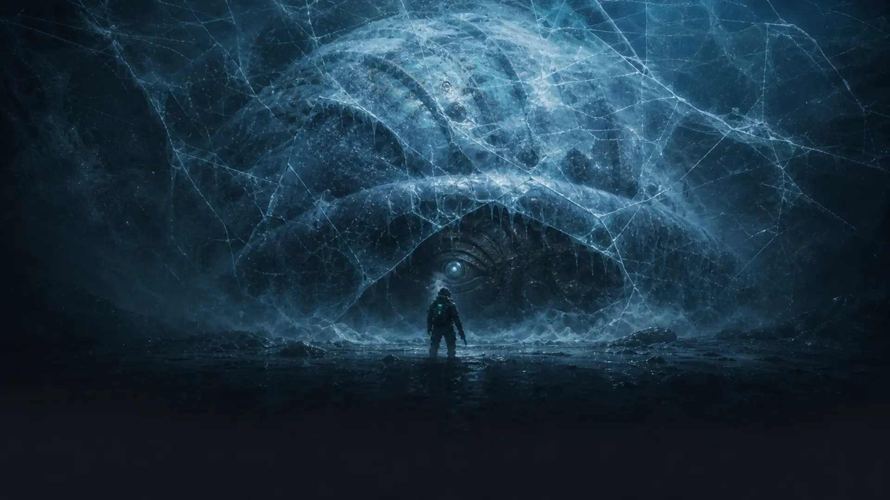
- **Key Master**: `public/interstitials/int_26_absolute_zero_has_a_shell_key_v1.webp`
- **Target Video**: `public/interstitials/motion/int_26_absolute_zero_has_a_shell_motion_v1.webm`
- **Trigger**: Boss Cryosnail encounter card.
- **Scene Context**: Ancient monolith shell emerging from translucent glacier strata, eye opening beneath the player.
- **Image-to-Video Action Prompt**:
  > Slow, heavy ground shake as giant slabs of blue glacial ice shatter and fall away from the rising ancient shell. A dense shockwave of freezing nitrogen vapor expands across the floor, flash-freezing moisture in the air into glittering ice needles.
- **Ken Burns Direction**: Slow downward tilt into the glacial eye aperture.

---

### 27 — The Bloom That Hunts
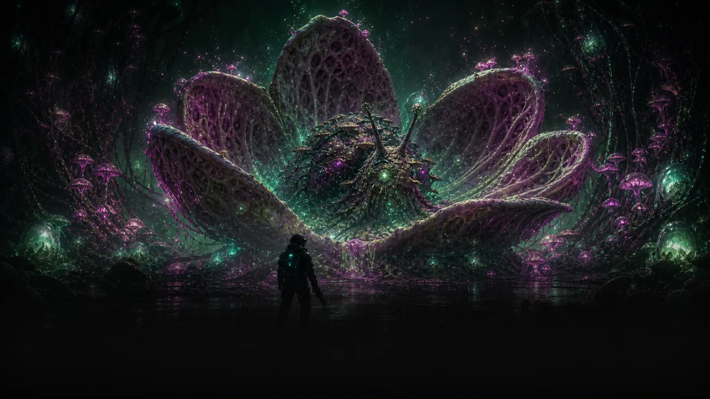
- **Key Master**: `public/interstitials/int_27_the_bloom_that_hunts_key_v1.webp`
- **Target Video**: `public/interstitials/motion/int_27_the_bloom_that_hunts_motion_v1.webm`
- **Trigger**: Boss Sporesnail encounter card.
- **Scene Context**: Giant fungal bloom opening to reveal a predatory chitin carapace at the center.
- **Image-to-Video Action Prompt**:
  > Lush, horrifying slow-motion bloom. Saturated magenta and emerald fungal petals peel back gracefully, revealing a dark, dripping serrated maw at the core that flexes open. Bioluminescent spores burst outward in a thick, swirling cloud.
- **Ken Burns Direction**: Zoom-in 100% → 111% centering on the opening floral maw.

---

### 28 — Martha Runs Faster Now
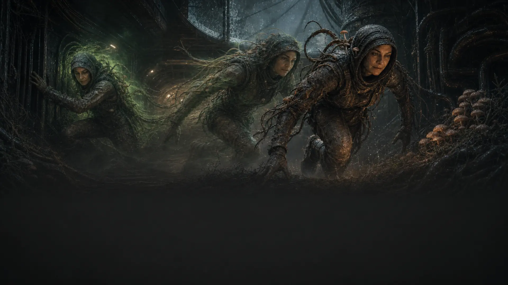
- **Key Master**: `public/interstitials/int_28_martha_runs_faster_now_key_v1.webp`
- **Target Video**: `public/interstitials/motion/int_28_martha_runs_faster_now_motion_v1.webm`
- **Trigger**: Corrupted Scout / Martha boss encounter.
- **Scene Context**: Corrupted Martha crossing three positions in one frame; marimba-like pipework trailing behind her.
- **Image-to-Video Action Prompt**:
  > High-speed shutter motion. Corrupted Martha's silhouette darts in glitching, insectoid bursts across the catwalks, leaving lingering bioluminescent green afterimages and streaming trailing vine-pipes that whip through the air.
- **Ken Burns Direction**: Rapid horizontal jitter pan across the three silhouette positions.

---

### 29 — Briggs Became the Barricade
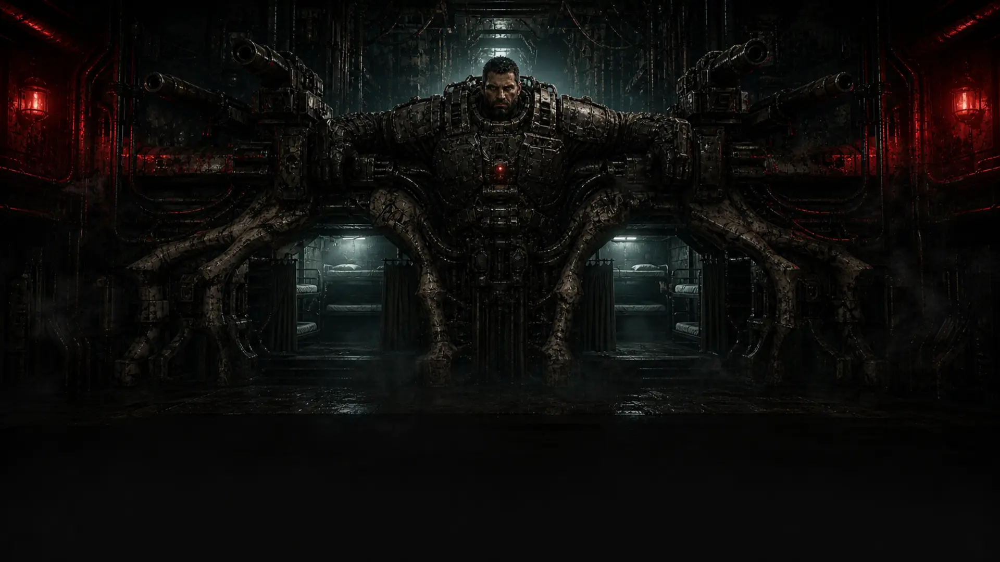
- **Key Master**: `public/interstitials/int_29_briggs_became_the_barricade_key_v1.webp`
- **Target Video**: `public/interstitials/motion/int_29_briggs_became_the_barricade_motion_v1.webm`
- **Trigger**: Corrupted Tank / Briggs boss encounter.
- **Scene Context**: Briggs fused into a wall of armor and turret bulkheads, shielding empty bunks behind him.
- **Image-to-Video Action Prompt**:
  > Low camera angle looking up at the immovable armor bulkhead. Heavy hydraulic pistons in Briggs's cybernetic shoulders expand with a loud hiss. The twin minigun barrels spin up with a deep mechanical whine, glowing red hot at the muzzles.
- **Ken Burns Direction**: Push-in 100% → 108% focusing on the glowing red minigun muzzles.

---

### 30 — Kaelen Is the Grid
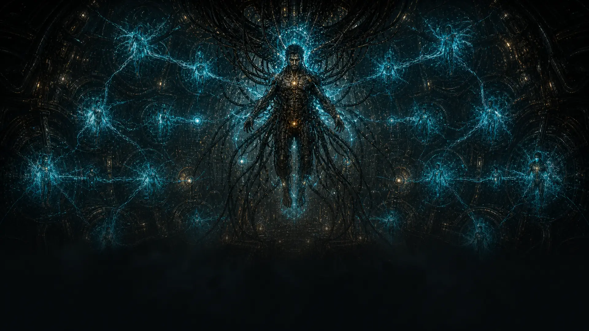
- **Key Master**: `public/interstitials/int_30_kaelen_is_the_grid_key_v1.webp`
- **Target Video**: `public/interstitials/motion/int_30_kaelen_is_the_grid_motion_v1.webm`
- **Trigger**: Corrupted Engineer / Kaelen boss encounter.
- **Scene Context**: Kaelen suspended within high-voltage cables; his body repeated at circuit junctions across the frame.
- **Image-to-Video Action Prompt**:
  > Radial push-in toward Kaelen suspended in the air by thick copper power cables. Massive electrical surges pulse in rings from his chest outward along the overhead grid lines, lighting up thousands of glowing circuit traces in the cavern rock walls.
- **Ken Burns Direction**: Centered zoom-in 100% → 110% onto Kaelen's chest node.

---

### 31 — Mother of the Last World
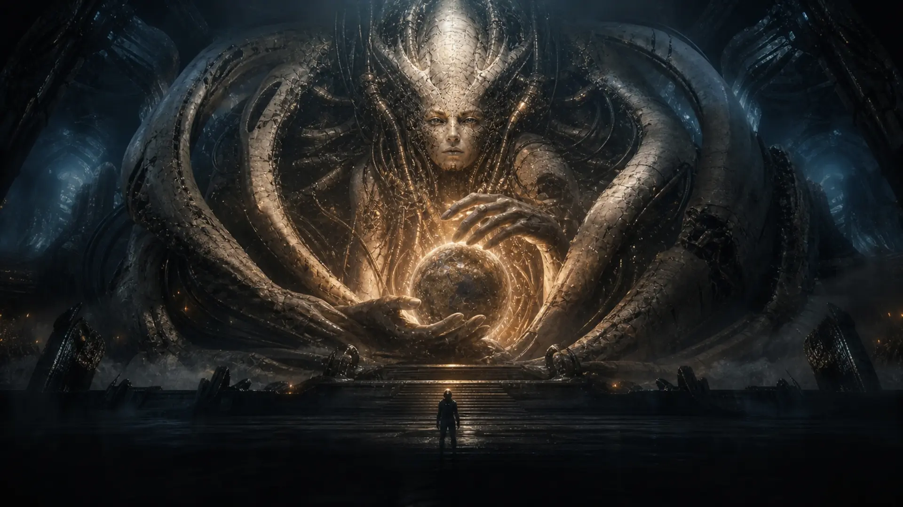
- **Key Master**: `public/interstitials/int_31_mother_of_the_last_world_key_v1.webp`
- **Target Video**: `public/interstitials/motion/int_31_mother_of_the_last_world_motion_v1.webm`
- **Trigger**: Final Queen encounter card.
- **Scene Context**: Queen curled around a planetary embryo egg while the player stands at the cathedral-cave threshold.
- **Image-to-Video Action Prompt**:
  > Epic slow crane down from the vaulted stalactite ceiling to the glowing amber nest. The colossal Queen gently shifts her golden carapace around the glowing embryonic sphere. Waves of golden telepathic light radiate through the chamber, illuminating drifting spore dust.
- **Ken Burns Direction**: Slow crane-down pan from the high stalactites to the central glowing egg.

---

## 5. Major Emotional Beats & Endings (Tracks 32–38)

### 32 — Black Box Stain
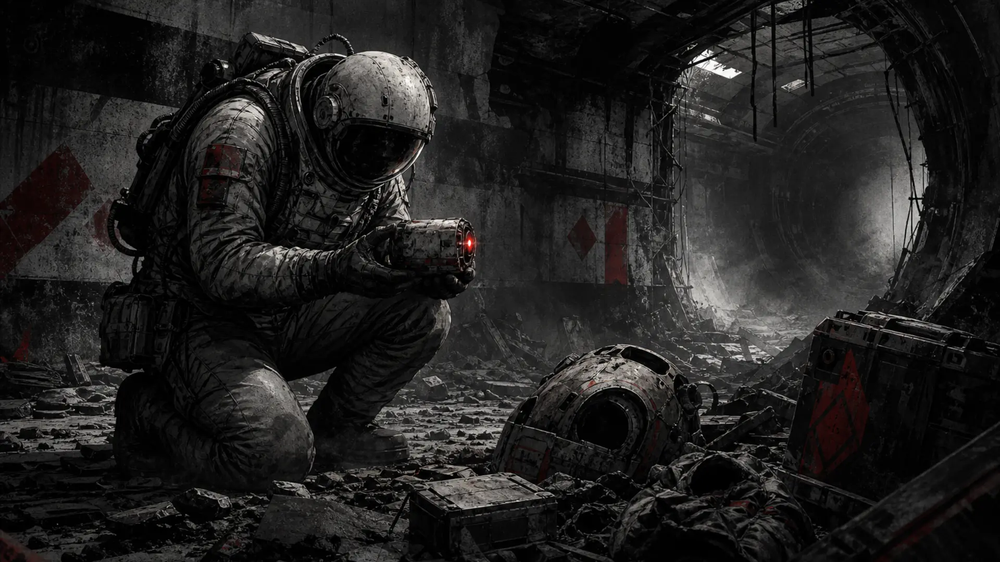
- **Key Master**: `public/interstitials/int_32_black_box_stain_key_v1.webp`
- **Target Video**: `public/interstitials/motion/int_32_black_box_stain_motion_v1.webm`
- **Trigger**: Previous-run carcass recovery.
- **Scene Context**: Previous astronaut suit slumped in snow beside a black box; current player's hand overlapping the dead hand.
- **Image-to-Video Action Prompt**:
  > Slow, reverent push-in toward the dead astronaut's frozen glove resting on the black box. The recorder's amber beacon light blinks in a rhythmic heartbeat cadence (1 Hz). Gentle blizzard snow drifts across the visor glass, partially burying the suit.
- **Ken Burns Direction**: Slow push-in 100% → 108% focusing on the blinking beacon and frozen hands.

---

### 33 — The Cave Was Breathing
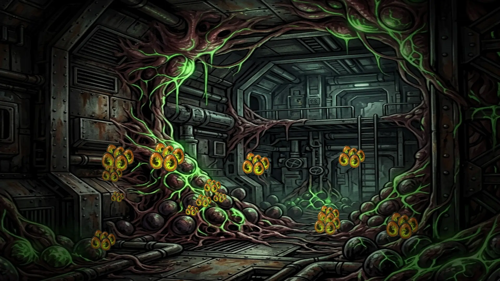
- **Key Master**: `public/interstitials/int_33_the_cave_was_breathing_key_v1.webp`
- **Target Video**: `public/interstitials/motion/int_33_the_cave_was_breathing_motion_v1.webm`
- **Trigger**: First descent into Sector Zero.
- **Scene Context**: Industrial elevator descending through rock shafts that resemble organic ribs and lungs.
- **Image-to-Video Action Prompt**:
  > Continuous vertical descent. The elevator cage rattles and descends steadily into the infinite black depth. The rib-like rock formations on either side of the shaft slowly expand outward and contract inward in a deep, rhythmic respiratory cycle, accompanied by warm gusts of mist.
- **Ken Burns Direction**: Continuous downward vertical pan.

---

### 34 — Four Seats, One Survivor (Scorched Sky Ending)
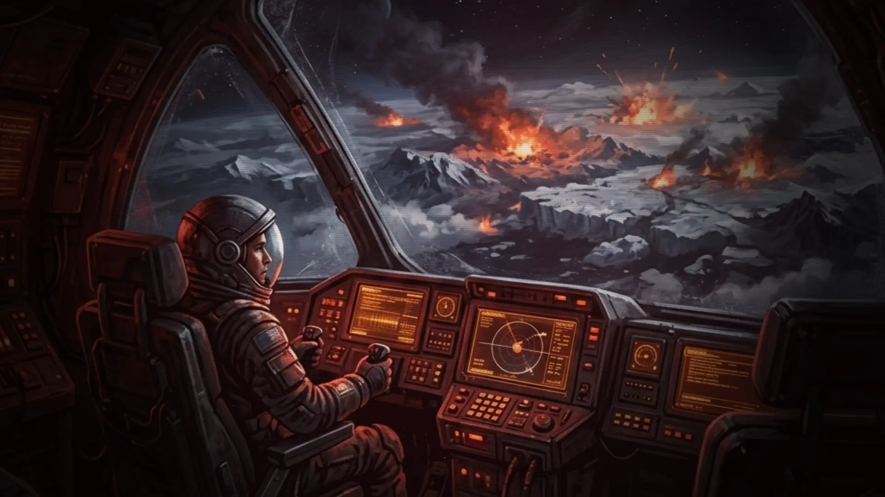
- **Key Master**: `public/interstitials/int_34_four_seats_one_survivor_key_v1.webp`
- **Target Video**: `public/interstitials/motion/int_34_four_seats_one_survivor_motion_v1.webm`
- **Trigger**: SCORCHED SKY ending card.
- **Scene Context**: Lone operator sitting in the pilot seat of a four-person cockpit; planet burning with explosions outside.
- **Image-to-Video Action Prompt**:
  > Slow cinematic tracking shot behind the three empty, unlit crash couches to the solitary pilot. Outside the cockpit glass, the distant white glacier world is pocked with silent, expanding fiery orange explosions. Red cockpit instrument lights bathe the solitary pilot's helmet in quiet isolation.
- **Ken Burns Direction**: Slow forward drift past empty seats toward the fiery planet window.

---

### 35 — Contraband Sunrise (Carrier's Bargain Ending)
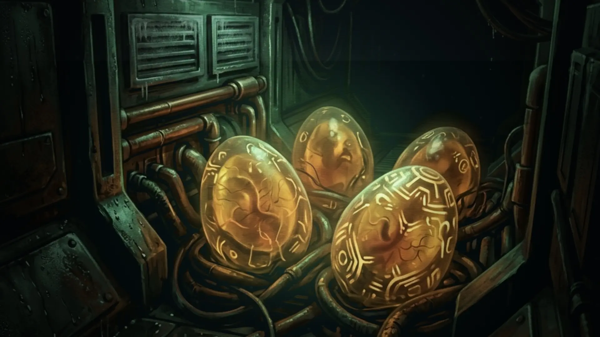
- **Key Master**: `public/interstitials/int_35_contraband_sunrise_key_v1.webp`
- **Target Video**: `public/interstitials/motion/int_35_contraband_sunrise_motion_v1.webm`
- **Trigger**: CARRIER'S BARGAIN ending card.
- **Scene Context**: Survivors watching a golden sunrise through the cockpit while hidden eggs pulse beneath the deck grates.
- **Image-to-Video Action Prompt**:
  > Slow horizontal pan across the survivors looking out the bridge viewport at the blazing golden sunrise. The camera tilts slightly down to reveal the dark cargo hold beneath their feet, where dozens of translucent amber alien eggs softly throb with embryonic movement.
- **Ken Burns Direction**: Pan from the golden sunrise window down toward the glowing deck plating.

---

### 36 — We Escaped Together, Technically (Mixed Crew Ending)
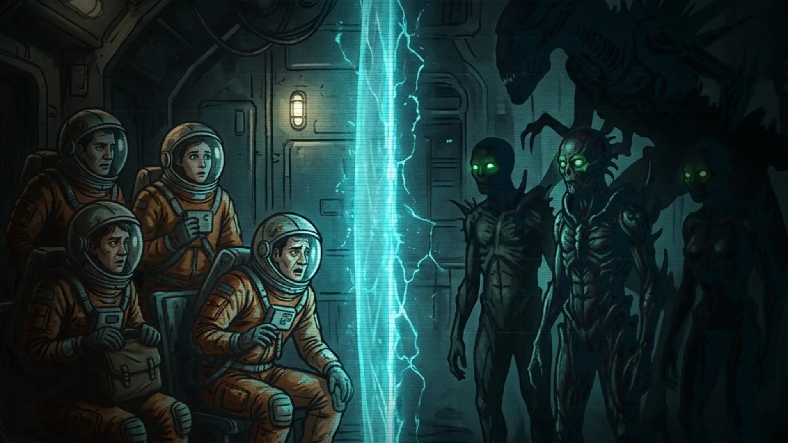
- **Key Master**: `public/interstitials/int_36_we_escaped_together_technically_key_v1.webp`
- **Target Video**: `public/interstitials/motion/int_36_we_escaped_together_technically_motion_v1.webm`
- **Trigger**: MIXED CREW ending card.
- **Scene Context**: Human survivors and altered hybrid crew members sharing the cabin, divided by the center aisle.
- **Image-to-Video Action Prompt**:
  > Slow dolly through the ship's center aisle. On the left side, human crew members sip rations under warm fluorescent lights; on the right side, hybrid crew members with glistening chitin plates adjust cabin pressure dials. Both sides share a tentative, awkward nod across the aisle.
- **Ken Burns Direction**: Symmetrical forward tracking shot down the cabin aisle.

---

### 37 — The Ice Gets Smaller (Clean Escape Ending)
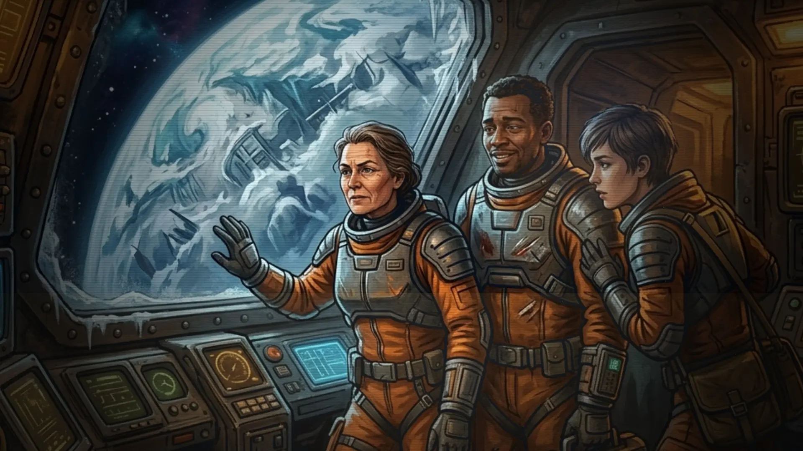
- **Key Master**: `public/interstitials/int_37_the_ice_gets_smaller_key_v1.webp`
- **Target Video**: `public/interstitials/motion/int_37_the_ice_gets_smaller_motion_v1.webm`
- **Trigger**: CLEAN ESCAPE ending card.
- **Scene Context**: Surviving camp leaders at the cockpit observation window as the frozen planet shrinks into the starry distance.
- **Image-to-Video Action Prompt**:
  > Slow pull-back through the rear observation window. The fractured white ice world steadily shrinks in the black starry void behind the ship's sub-light engine trail. Survivor silhouettes stand close together, watching their prison world disappear into the distance.
- **Ken Burns Direction**: Slow zoom-out 108% → 100% centering on the receding white planet.

---

### 38 — Destination: Core Worlds (Full Brood Ending)
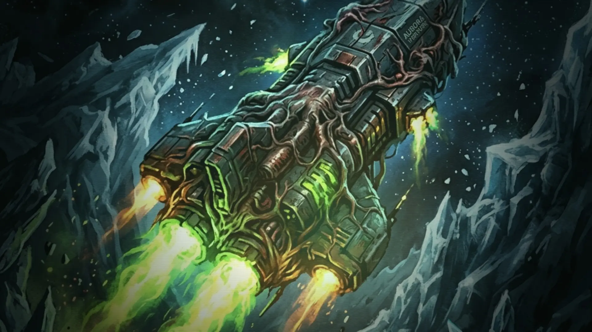
- **Key Master**: `public/interstitials/int_38_destination_core_worlds_key_v1.webp`
- **Target Video**: `public/interstitials/motion/int_38_destination_core_worlds_motion_v1.webm`
- **Trigger**: FULL BROOD ending card.
- **Scene Context**: Transformed pilot and Queen silhouette at the helm as the ship aligns with dense, populated star systems.
- **Image-to-Video Action Prompt**:
  > Slow, elegant forward push toward the ship's forward viewport. Countless golden star systems sparkle in deep space. Millions of tiny amber hive larvae reflections glisten across the cockpit window glass as the ship accelerates into warp with a silent golden flash.
- **Ken Burns Direction**: Forward warp push-in 100% → 112% toward the star clusters.

---

## 6. Companion Romance & Multi-Stage Side Story Arcs

### Sister Val: "Warmth of the Suture" (Camp Tallow)

#### val_hearth_warmth — Warmth of the Suture (Stage 1)
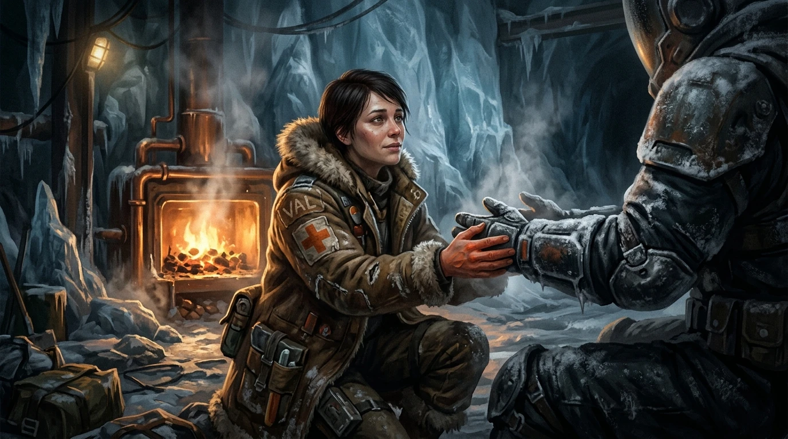
- **Key Master**: `public/interstitials/int_val_hearth_warmth_key_v1.webp`
- **Trigger**: Subzero O2 frostbite exposure / Camp Tallow Sanctuary first contact.
- **Scene Context**: Sister Val kneeling at the glowing geothermal hearth, extending warm hands toward the player's frosted exosuit.
- **Image-to-Video Action Prompt**:
  > Slow cinematic push-in toward Sister Val's compassionate eyes. The glowing copper hearth burns with warm golden embers, sending soft plumes of steam into the subzero blue glacier air. Her warm hands gently reach out to thaw the player's iced titanium gauntlets.
- **Ken Burns Direction**: Slow push-in 100% → 108% centering on the meeting hands and hearth embers.

#### val_spore_communion — Botanical Spore Oil (Stage 2)
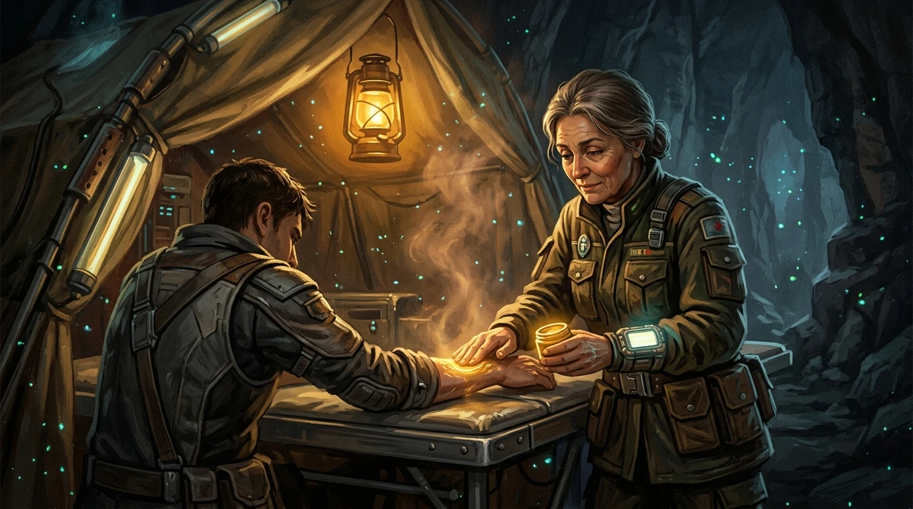
- **Key Master**: `public/interstitials/int_val_spore_communion_key_v1.webp`
- **Trigger**: Spore oil massage choice / Stage 2 Suture Communion.
- **Scene Context**: Sister Val applying warm, golden bioluminescent botanical salve to the player's exposed skin in the dim sanctuary tent.
- **Image-to-Video Action Prompt**:
  > Gentle dolly across the lantern-lit medical tent. Sister Val massages warm, glowing amber spore oil onto the player's neck and shoulders. Soft bioluminescent dust motes drift peacefully through the air. Warm steam rolls across the table in slow motion.
- **Ken Burns Direction**: Gentle horizontal pan left-to-right with subtle zoom (102% → 107%).

#### val_eternal_hearth — The Eternal Hearth (Stage 3)
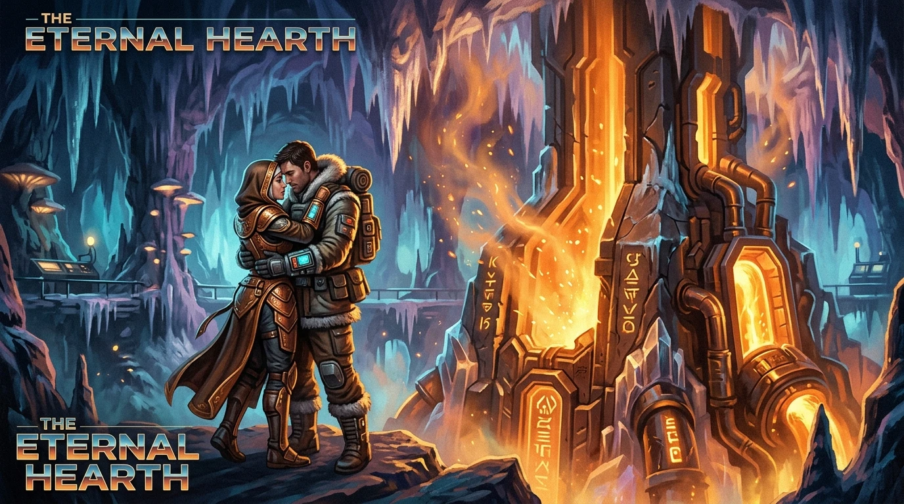
- **Key Master**: `public/interstitials/int_val_eternal_hearth_key_v1.webp`
- **Trigger**: Stage 3 Devotional Climax / Sister Val Romance Fulfillment.
- **Scene Context**: Sister Val and the player deeply embraced beside the colossal volcanic hearth deep beneath the glacial caves.
- **Image-to-Video Action Prompt**:
  > Sweeping upward tracking shot from the blazing magma pipes up to the passionate embrace between Sister Val and the player. Fiery embers rise toward the vaulted ice stalactites above, casting pulsating crimson and gold reflections across their silhouettes.
- **Ken Burns Direction**: Slow upward vertical pan 100% → 110% toward the embracing figures.

---

### Commander Briggs: "Blood & Vanguard" (Camp Vesper)

#### briggs_scorched_rig — The Scorched Rig (Stage 1)
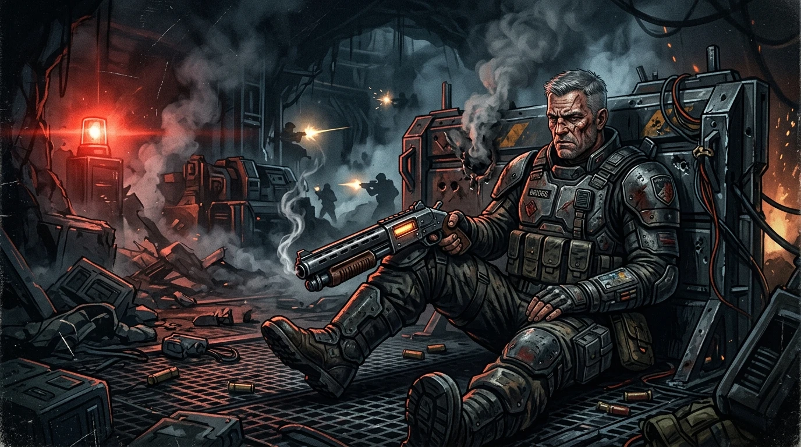
- **Key Master**: `public/interstitials/int_briggs_scorched_rig_key_v1.webp`
- **Trigger**: Surviving combat breach / Camp Vesper Barracks first contact.
- **Scene Context**: Commander Briggs resting against a smoking steel barricade after repelling a swarm assault.
- **Image-to-Video Action Prompt**:
  > Low-angle slow tracking shot past smoking spent shell casings and defeated drone debris. Revolving red emergency beacon lights slice through thick diesel exhaust. Briggs wipes sweat and grease from his rugged brow, looking up with fierce respect.
- **Ken Burns Direction**: Diagonal pan bottom-left to top-right (100% → 106%).

#### briggs_scar_tissue — Scar Tissue (Stage 2)
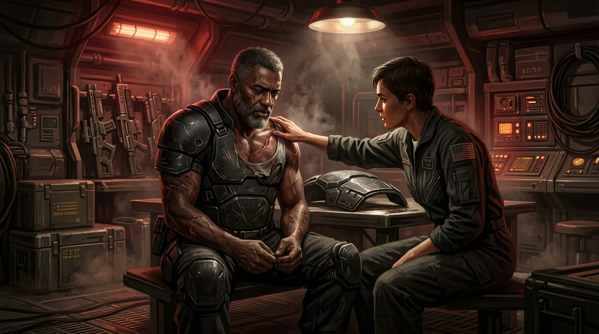
- **Key Master**: `public/interstitials/int_briggs_scar_tissue_key_v1.webp`
- **Trigger**: Unbuckling armor clasps / Stage 2 Vanguard Scar Examination.
- **Scene Context**: Briggs showing jagged shrapnel battle scars in the warm, low-lit armory, sharing vulnerable combat intimacy.
- **Image-to-Video Action Prompt**:
  > Slow push-in toward the table in the dim bunker armory. Warm tungsten work lights illuminate Briggs's muscular, scarred chest as the player's fingers gently trace a deep shrapnel mark. Briggs exhales slowly, his steady gaze locked onto the player.
- **Ken Burns Direction**: Direct zoom-in 100% → 108% focusing on the hand tracing the chest scar.

#### briggs_vanguard_fire — Vanguard Unyielding (Stage 3)
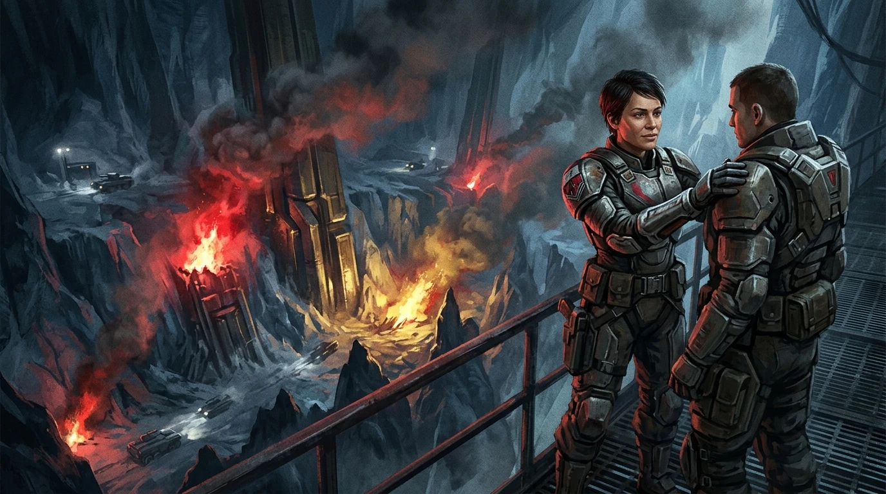
- **Key Master**: `public/interstitials/int_briggs_vanguard_fire_key_v1.webp`
- **Trigger**: Stage 3 Vanguard Climax / Commander Briggs Romance Fulfillment.
- **Scene Context**: Briggs and the player standing shoulder-to-shoulder on an elevated catwalk overlooking burning crimson vanguard flares in the subterranean abyss.
- **Image-to-Video Action Prompt**:
  > Grand cinematic pull-back along the industrial steel catwalk. Huge fiery red vanguard flares illuminate the massive frozen subterranean canyon below. Briggs places a heavy armored hand onto the player's shoulder with an unshakeable smile.
- **Ken Burns Direction**: Slow pull-back 108% → 100% revealing the grand vista and the two silhouettes.

---

### Overseer Kaelen: "Synaptic Overclock" (Camp Meridian)

#### kaelen_diagnostic_cradle — Diagnostic Cradle (Stage 1)
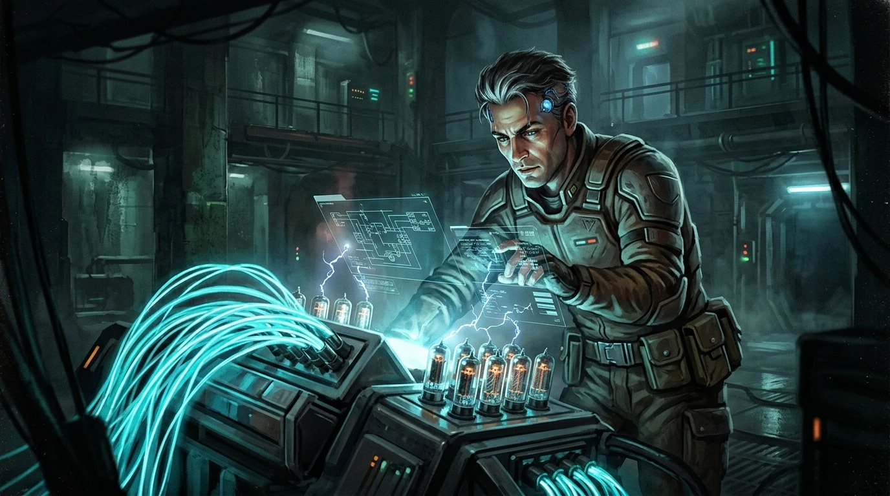
- **Key Master**: `public/interstitials/int_kaelen_diagnostic_cradle_key_v1.webp`
- **Trigger**: Holding Tech salvage / Camp Meridian Substation first contact.
- **Scene Context**: Overseer Kaelen leaning over humming high-voltage transformer coils and cyan neural conduits.
- **Image-to-Video Action Prompt**:
  > Slow dolly right across humming vacuum tubes and bundled cyan fiber-optic cables. Soft electric micro-arcs crackle over the copper terminals, casting neon turquoise highlights across Kaelen's sharp, focused features.
- **Ken Burns Direction**: Slow horizontal pan left-to-right with 104% scale.

#### kaelen_frequency_overclock — Frequency Overclock (Stage 2)
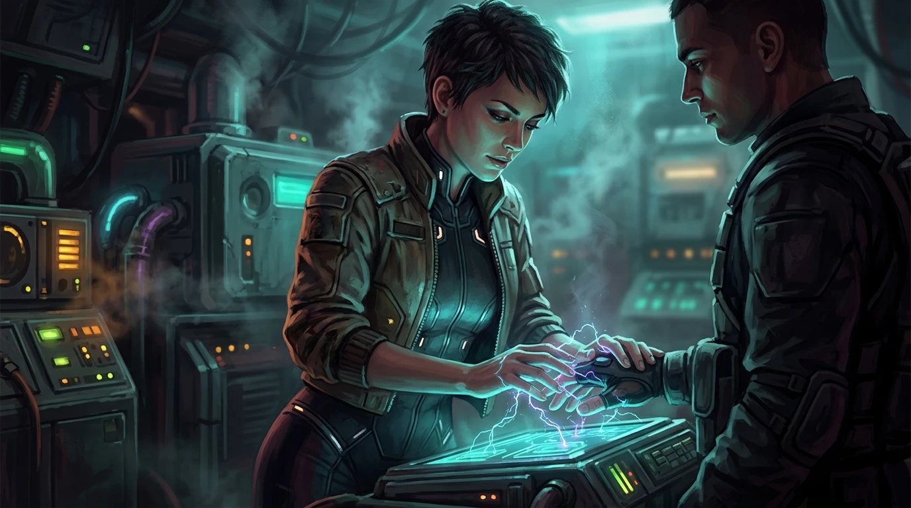
- **Key Master**: `public/interstitials/int_kaelen_frequency_overclock_key_v1.webp`
- **Trigger**: Stage 2 Neural Jack-In / Frequency Overclock choice.
- **Scene Context**: Kaelen guiding the player's hands to the glowing bio-neural terminal jack, electric currents arcing between fingertips.
- **Image-to-Video Action Prompt**:
  > Slow, intimate push-in toward their touching hands on the glowing bio-link interface. Electric violet and azure sparks dance playfully across their skin and cybernetic neural ports. Steam hisses softly from cooling vents in the background.
- **Ken Burns Direction**: Zoom-in 100% → 109% toward the electrical arcs between touching fingers.

#### kaelen_supercharged_matrix — Supercharged Matrix (Stage 3)
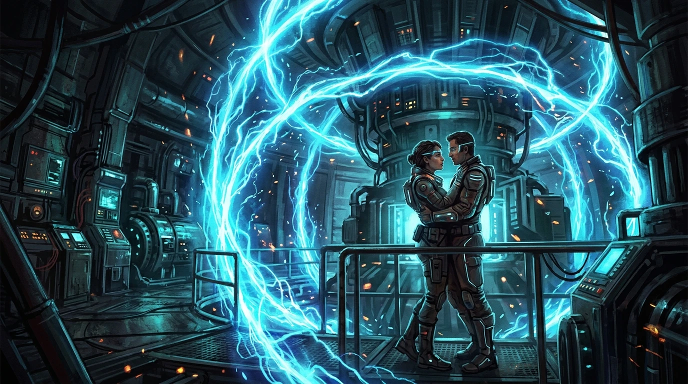
- **Key Master**: `public/interstitials/int_kaelen_supercharged_matrix_key_v1.webp`
- **Trigger**: Stage 3 Power Core Climax / Overseer Kaelen Romance Fulfillment.
- **Scene Context**: Kaelen and the player embraced inside the beating heart of the supercharged Meridian Power Reactor chamber.
- **Image-to-Video Action Prompt**:
  > Majestic rotating camera motion inside the reactor core. Brilliant rings of swirling cyan plasma energy encircle the embracing couple in a blinding, beautiful electrical aurora. Glowing sparks drift in slow motion around them.
- **Ken Burns Direction**: Slow zoom-in 100% → 110% into the center of the plasma rings.

---

### Specimen 0047-B / Aria: "The Queen's Siren Song" (The Hive Brood)

#### aria_whispers_abyss — Whispers in the Abyss (Stage 1)
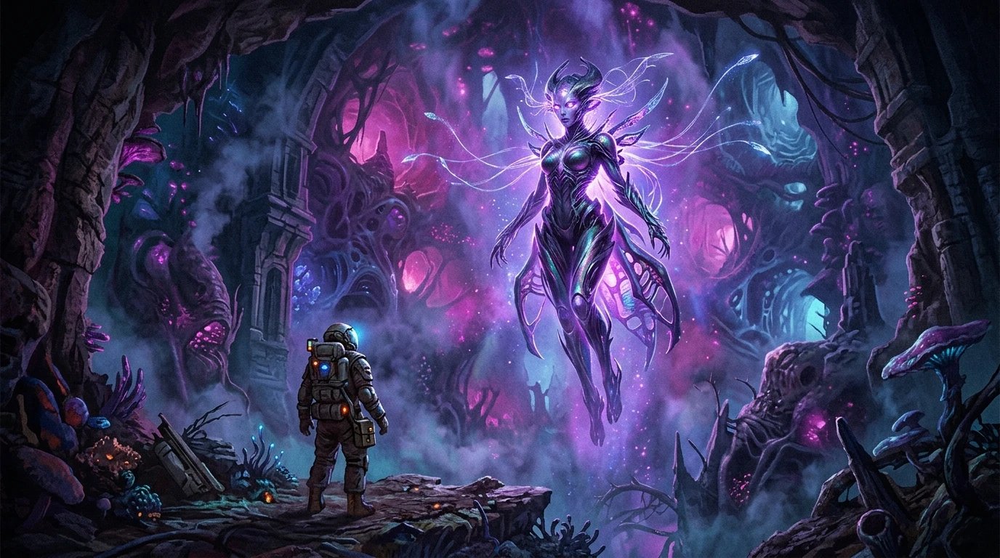
- **Key Master**: `public/interstitials/int_aria_whispers_abyss_key_v1.webp`
- **Trigger**: Exploring Deep Abyss (Ring 3+) / Touching Hive Relay.
- **Scene Context**: Aria's ethereal humanoid silhouette suspended within the glowing bioluminescent purple egg-sac chamber.
- **Image-to-Video Action Prompt**:
  > Slow hypnotic tilt-up from the lone explorer on the rocky ledge up toward Aria's luminous biomechanical queen form. Shimmering purple and magenta bioluminescent fog swirls in slow pulses. Delicate crystalline tendrils ripple gracefully like deep-sea flora.
- **Ken Burns Direction**: Upward tilt and zoom 100% → 108% toward Aria's glowing violet eyes.

#### aria_silk_trance — The Silk Trance (Stage 2)
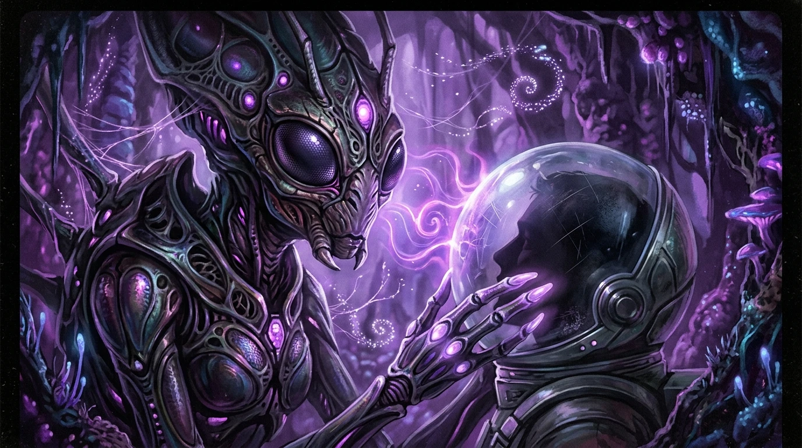
- **Key Master**: `public/interstitials/int_aria_silk_trance_key_v1.webp`
- **Trigger**: Stage 2 Psychic Communion / Silk Trance choice.
- **Scene Context**: Aria cradling the player's glass visor with iridescent chitin tendrils, transmitting psychic ecstasy and intoxicating warmth.
- **Image-to-Video Action Prompt**:
  > Hypnotic close-up push-in. Aria's delicate alien fingertips gently stroke the curved glass of the helmet visor. Glowing spiral pheromone trails and psychic violet energy ribbons weave between their faces in a dreamy, surreal dance.
- **Ken Burns Direction**: Slow push-in 100% → 109% focusing on the visor touch and swirling psychic spirals.

#### aria_queens_mark — The Queen's Mark (Stage 3)
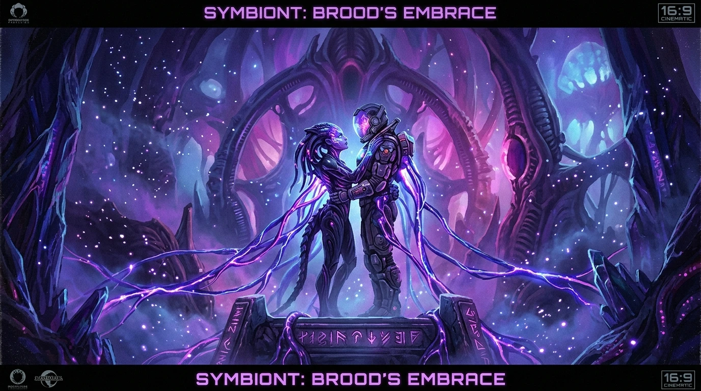
- **Key Master**: `public/interstitials/int_aria_queens_mark_key_v1.webp`
- **Trigger**: Stage 3 Symbiotic Union / Aria Romance Fulfillment.
- **Scene Context**: Full symbiotic communion on the ancient alien throne in the heart of the Brood Queen chamber.
- **Image-to-Video Action Prompt**:
  > Grand slow dolly back from the pedestal. Luminous violet bio-filaments connect Aria's regal carapace directly into the player's suit ports. Millions of glowing spore motes drift like stars in the velvet purple subterranean cathedral.
- **Ken Burns Direction**: Slow zoom-out 108% → 100% revealing the grand alien throne and cosmic spore atmosphere.
