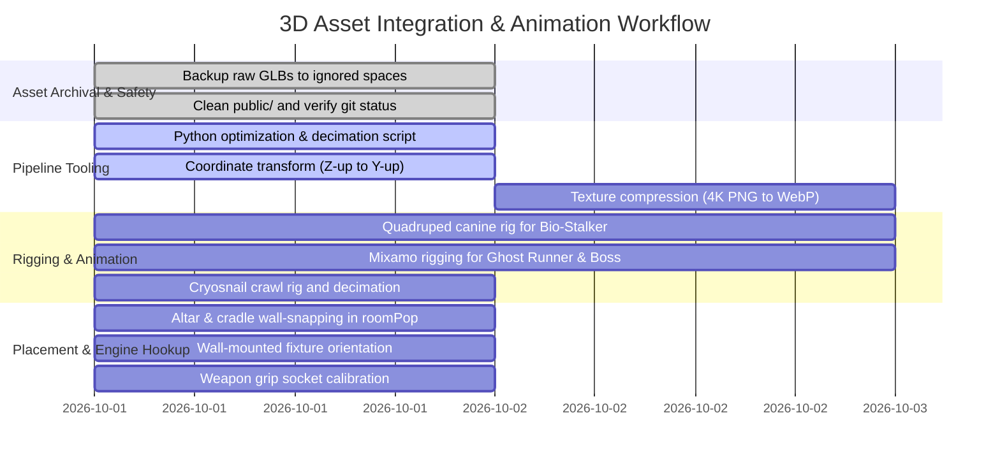

# 3D Asset Pipeline: Rigging, Optimization, and Wall-Placement Plan

> **Status:** Approved Plan · **Owner:** Gameplay & 3D Presentation · **Date:** 2026-10-01  
> **Source Directory (Ignored Space):** `art/raw/incoming_3d_20261001/` & `art/source/raw_incoming_backup_20261001/`  
> **Runtime Target Directory:** `public/3d/runtime/new3ds/`  
> **Related Documents:**
> - [Missing 3D Assets & Cutscenes Guide](../design/missing-assets-and-2d-generation-prompts.md)
> - [3D Asset Audit 2026-10-01](../reports/3d-asset-audit-2026-10-01.md)
> - [Sprint 49 Plan (S49-37)](sprint-49.md)

---

## 1. Executive Summary & Raw Ingestion Audit

On 2026-10-01, 19 high-resolution 3D models (totaling **829 MB**) were received for *Hunker Bunker*. 

### Safe Backup & Isolation
To prevent inflating git tracking or blowing the retail client budget (budget limit: 2,715 MiB), all raw files were immediately moved into `.gitignore`d spaces:
- Primary backup: `art/raw/incoming_3d_20261001/` (19 files, 829 MB)
- Secondary backup: `art/source/raw_incoming_backup_20261001/` (19 files, 829 MB)
- Working tree in `public/` is completely clean (`git status` clean).

---

## 2. Ingestion Analysis & Technical Findings

Our automated binary header parser (`scratch/inspect_incoming_glbs.py` and `scratch/inspect_model_bounds.py`) inspected all 19 models:

| Category | Model Name | Raw Size | Meshes | Tris | Rigged? | Key Issues to Fix |
| :--- | :--- | :--- | :--- | :--- | :--- | :--- |
| **Creature** | `Mycelium Stalker Quadruped.glb` | 42.7 MB | 1 | 50,000 | **No** | Needs quadruped canine/"dog" animation rig; 4K textures |
| **Creature** | `Regular Cryosnail.glb` | 88.5 MB | 1 | 1,500,000 | **No** | Needs decimation to 20k tris; gastropod crawl rig |
| **Boss** | `Corrupted Engineer Kaelen Boss.glb` | 49.3 MB | 1 | 49,982 | **No** | Needs humanoid Mixamo rig + 4 mantis back appendages |
| **Chassis** | `5001 — Ghost Runner Recon Rig Female.glb` | 38.6 MB | 1 | 50,000 | **No** | Needs humanoid Mixamo rig; 4K textures |
| **Chassis** | `5001 — Ghost Runner Recon Rig Male.glb` | 39.9 MB | 1 | 50,000 | **No** | Needs humanoid Mixamo rig; 4K textures |
| **Weapon** | `4162 — Queen's Bane.glb` | 40.5 MB | 1 | 50,008 | N/A (Static) | Forearm socket alignment; 4K textures |
| **Weapon** | `5002 Chrono-Drifter Talon-C.glb` | 35.6 MB | 1 | 50,032 | N/A (Static) | Grip pivot alignment; 4K textures |
| **Weapon** | `5006 Bunker Bastion Siege-Breaker.glb` | 40.1 MB | 1 | 50,000 | N/A (Static) | Heavy weapon pivot alignment; 4K textures |
| **Weapon** | `5009 Archival Constructor Arc Driver.glb` | 40.0 MB | 1 | 49,992 | N/A (Static) | Grip pivot alignment; 4K textures |
| **Weapon** | `5010 — Hive-Weaver Bio-Plasma Emitter v1` | 83.8 MB | 1 | 1,500,000 | N/A (Static) | Massive 1.5M polycount (superseded by v2/v3) |
| **Weapon** | `5010 — Hive-Weaver Bio-Plasma Emitter v2` | 37.2 MB | 1 | 50,000 | N/A (Static) | Grip pivot alignment; candidate variant |
| **Weapon** | `5010 — Hive-Weaver Bio-Plasma Emitter v3` | 42.7 MB | 1 | 50,000 | N/A (Static) | Grip pivot alignment; candidate variant |
| **Weapon** | `Scout Base Talon-C Frame.glb` | 28.7 MB | 1 | 50,004 | N/A (Static) | Starter scout rifle replacement; 4K textures |
| **Prop** | `fixture_sconce_vine.glb` | 32.0 MB | 1 | 50,076 | N/A (Static) | Wall-mounted prop; needs wall-flush orientation |
| **Prop** | `prop_conduit_junction_box.glb` | 39.6 MB | 1 | 50,322 | N/A (Static) | Wall-mounted electrical box; needs wall-flush |
| **Prop** | `prop_flesh_steel_cradle.glb` | 34.3 MB | 1 | 50,000 | N/A (Static) | Floor prop; needs wall-adjacent placement |
| **Prop** | `prop_fungal_tendril_altar.glb` | 37.6 MB | 1 | 49,964 | N/A (Static) | Altar; **must be placed against walls facing room** |
| **Prop** | `prop_fungal_tendril_altar v1.glb` | 39.0 MB | 1 | 49,946 | N/A (Static) | Altar alternative variant |
| **Prop** | `prop_pipe_rupture.glb` | 38.1 MB | 1 | 50,040 | N/A (Static) | Wall/floor pipe flange; needs wall-adjacent |

### Key Architectural Discoveries:
1. **Uncompressed 4K Textures:** Every file embeds three 4096×4096 PNGs (`normal`, `baseColor`, `metallicRoughness`), taking ~37 MB per model. Resizing to 2048×2048 WebP (and 2048 PNG for normal maps) reduces each file to **1.5 – 2.8 MB**, maintaining pristine visual fidelity while meeting the public bundle budget.
2. **Coordinate Orientation (Z-up vs Y-up):** The models currently have height along the Z-axis (`Min Z = -0.6 to -1.1`, `Max Z = 0.0`), meaning they lie flat in Three.js (which expects Y-up). They need a +90° X-rotation transformation so Y is Up and bottom rests on `Y = 0`.
3. **Rigging Split:**
   - **Static Assets (15 models):** Weapons and props do NOT need skeletal rigs. They need coordinate normalization, pivot/socket alignment, and texture optimization.
   - **Skinned Animated Assets (4 models):** `Mycelium Stalker Quadruped`, `5001 Ghost Runner`, `Corrupted Engineer Kaelen`, and `Regular Cryosnail`.

---

## 3. Rigging Architecture & Animation Specifications

```mermaid
graph TD
    A[Incoming Models] --> B[Animated Characters & Monsters]
    A --> C[Static Weapons & Modules]
    A --> D[Static Environment Props]
    
    B --> B1[Mycelium Stalker: Canine/Dog Rig]
    B --> B2[Ghost Runner 5001: Mixamo Humanoid Rig]
    B --> B3[Corrupted Engineer: Mixamo + 4 Mantis Arms]
    B --> B4[Regular Cryosnail: Gastropod Crawl Rig]
    
    C --> C1[Pivot at Grip (0,0,0) + Muzzle Socket]
    
    D --> D1[Wall-Adjacent Placement: Altar & Cradle]
    D --> D2[Wall-Mounted Snapping: Sconce & Junction Box]
```

### 3.1 The 4-Legged Beast: Quadruped ("Dog") Animation Rig
- **Model:** `Mycelium Stalker Quadruped.glb` (serves both `mycelium_stalker` and `bio_charger`).
- **Skeletal Structure:**
  - `Root` (at ground level between fore and hind feet)
  - `Pelvis` -> `Spine_01` -> `Spine_02` -> `Chest` -> `Neck` -> `Head` -> `Jaw`
  - **Forelegs (L/R):** `Clavicle` -> `Shoulder` -> `Elbow` -> `Wrist` -> `Paw`
  - **Hindlegs (L/R):** `Hip` -> `Femur` -> `Knee` -> `Hock` -> `Paw_Back`
  - **Spore Vents (L/R):** 3 pairs of secondary bones along the flanks to pulse when venting
- **Required Animation Clips (Baked into GLB):**
  1. `idle`: Low predatory stance, breathing, ribs and flank spore chimneys expanding/contracting.
  2. `walk`: Slinking 4-beat diagonal quadruped stalk.
  3. `run`: 2-beat rotary canine gallop with flexible spine flexion (essential for the Bio-Charger ram charge).
  4. `attack`: Rearing up on hind legs and driving foreclaws into the target.
  5. `death`: Limbs buckling outward, heavy carcass sliding to the ground.
- **Engine Hook:** `src/enemy3dOverlay.js:245` automatically detects embedded animations matching `/walk|run|idle/i` and plays them seamlessly in the locomotion mixer.

### 3.2 Humanoid Operatives & Bosses: Mixamo Humanoid Skeleton
- **Models:** `5001 Ghost Runner Female & Male`, `Corrupted Engineer Kaelen Boss`.
- **Skeletal Mapping:** Standard Mixamo bone names (`mixamorig:Hips`, `mixamorig:Spine`, `mixamorig:Spine1`, `mixamorig:Spine2`, `mixamorig:Neck`, `mixamorig:Head`, `mixamorig:LeftShoulder`..`LeftHand`, `mixamorig:LeftUpLeg`..`LeftFoot`).
- **Engine Hook:** `src/player3dOverlay.js` and `src/enemy3dOverlay.js:211-236` retarget the player's run/walk/idle animation pack directly onto any mesh carrying this skeleton.
- **Corrupted Engineer Appendages:**
  - 4 additional bone chains parented to `mixamorig:Spine2`:
    - `Servo_Arm_L_01..03` & `Servo_Arm_R_01..03` (hydraulic welding torches)
    - `Mantis_L_01..03` & `Mantis_R_01..03` (chitin scythe blades)

### 3.3 Gastropod Locomotion Rig: Regular Cryosnail
- **Model:** `Regular Cryosnail.glb`.
- **Pre-Processing:** Decimate from 1,500,000 triangles to ~22,000 triangles.
- **Skeletal Structure:** `Root` -> `Foot_Base`, `Foot_Front`, `Foot_Rear`, `Eyestalk_L_01..03`, `Eyestalk_R_01..03`.
- **Animation Clips:** `idle` (optic stalks twitching and scanning), `crawl` (rippling foot sine wave).

---

## 4. Wall Placement Architecture: Altars, Sconces, and Junction Boxes

The user directive specifies: **"the alters need to be placed agasuinst walls etc"**.

### 4.1 Prop Placement Categories

1. **Wall-Adjacent Floor Props (Must sit on floor backed against a wall, facing inward):**
   - `prop_fungal_tendril_altar` & `prop_fungal_tendril_altar v1`
   - `prop_flesh_steel_cradle`
2. **Wall-Mounted Fixtures (Snaps directly to wall face at eye/elevation height):**
   - `fixture_sconce_vine`
   - `prop_conduit_junction_box`
   - `prop_pipe_rupture`

### 4.2 Code Implementation Seams

#### Seam 1: Candidate Selection in `src/roomPopulation.js`
When placing `prop_fungal_tendril_altar`, candidate cells in the room grid must require `wallAdjacency >= 1`.
```javascript
const isWallBackedProp = (type) => (
    type === 'prop_fungal_tendril_altar' ||
    type === 'prop_flesh_steel_cradle'
);

if (isWallBackedProp(type) && wallAdjacency(cell, grid) < 1) {
    // Skip candidate: altars must back against a wall
    continue;
}
```

#### Seam 2: Offset and Orientation in `src/threeGame.js` / `src/world3dOverlay.js`
When a wall-backed prop has `wallNormal` (`{ x, z }`), orient its yaw so its back touches the wall and its interactive front faces into the room:
```javascript
// wallNormal points OUT from wall into room:
// North wall (# at z - 1): wallNormal = { x: 0, z: 1 } -> yaw = 0 (faces South)
// South wall (# at z + 1): wallNormal = { x: 0, z: -1 } -> yaw = Math.PI (faces North)
// West wall (# at x - 1): wallNormal = { x: 1, z: 0 } -> yaw = Math.PI / 2 (faces East)
// East wall (# at x + 1): wallNormal = { x: -1, z: 0 } -> yaw = -Math.PI / 2 (faces West)
const targetYaw = Math.atan2(wallNormal.x, wallNormal.z);
root.rotation.y = targetYaw;

// Offset position towards the wall:
const halfDepth = 0.32;
root.position.x -= wallNormal.x * (0.5 - halfDepth);
root.position.z -= wallNormal.z * (0.5 - halfDepth);
```

---

## 5. Static Weapon & Module Pipeline

Weapons are static props that do not require bone rigging. They require:
1. **Pivot at Grip:** Position coordinate origin `(0, 0, 0)` at the center of the grip where the operator's hand closes.
2. **Standard Alignment:** Forward barrel axis along `-Z` (or `+X` per `operatorEquipmentSockets.js`).
3. **Muzzle Socket Node:** An empty child node named `Socket_Muzzle` placed at the barrel tip for muzzle flash, projectile spawn, and laser sights.
4. **Variant Selection:**
   - For `5010 Hive-Weaver`: Adopt `v2` (50k tris, balanced silhouette) or `v3`. Retire `v1` (1.5M tris unoptimized raw sculpt).
   - For `5001 Ghost Runner`: Prepare both Female and Male rigs so players can equip on either chassis.

---

## 6. Execution Phases & Work Distribution



### Deliverable Targets & Budgets:
- All static props and weapons optimized to `< 2.5 MB` each.
- Rigged characters optimized to `< 3.8 MB` each.
- Public client bundle budget verified below 2,715 MiB limit.
- 100% test passing rate across `vitest`, `audit:docs`, and `i18n:audit`.
