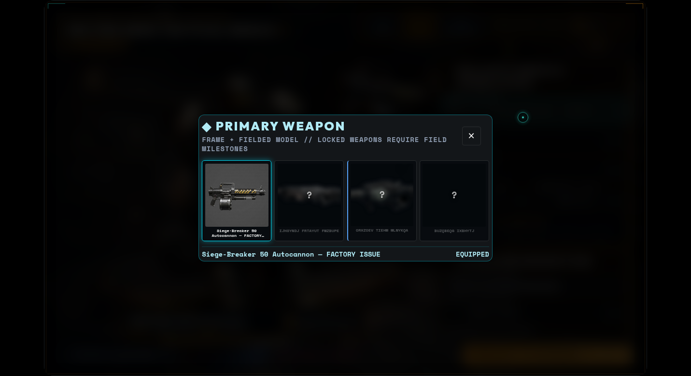
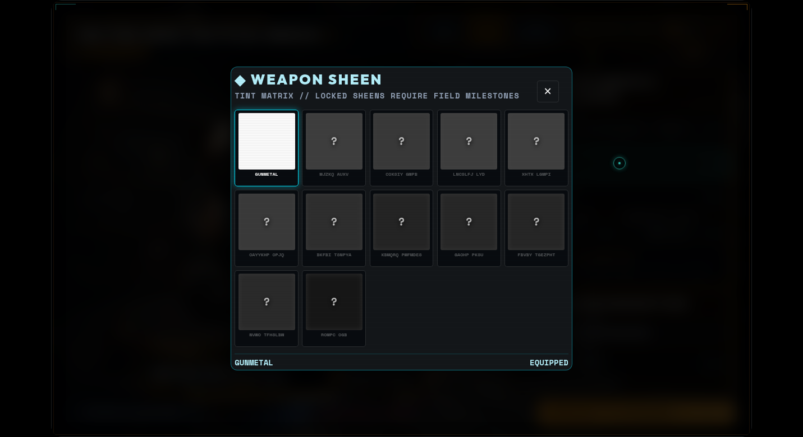
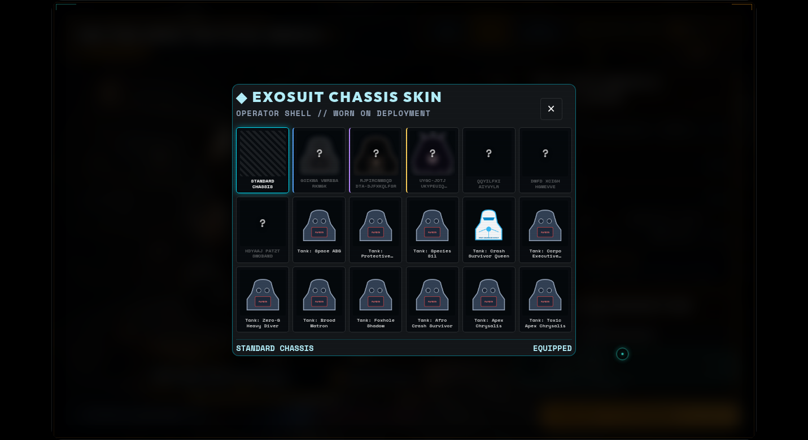

# Armory UI Overhaul — Weapon Identity, Tile Menus & Sheens

Status: in progress | Owner: Claude | Updated: 2026-09-09
| Supersedes: `~/.gemini/antigravity-ide/brain/7880ab41-.../implementation_plan.md` (Armory UI Overhaul & 3D Stage Visual Polish)
| Branch: `fix/mayor-tina-and-astra-plan` — dev branch only

## 1. Where this picks up

The original antigravity plan (six items: emoji removal, legibility, contrast
backplates, standby telemetry, holographic weapon bay, shadows) ran out of
credits partway. Verified against the working tree, **most of it landed**:

| Original item | State |
| --- | --- |
| 1. Zero emojis | Done — `grep` finds 0 emoji in `armoryUi.js`; inline SVGs in place |
| 2. Legibility / anti-clipping | Done in `style.css` |
| 3. Contrast backplates | Done |
| 4. Standby telemetry (no `+0%` wall) | Done — `STANDBY // NO OVERCLOCKS LINKED` pill |
| 5. Holographic inspection bay | Done — `rackPanel` rebuilt with `bayWidth`/`bayHeight` |
| 6. Shadows + boot contact shadow | Done — `castShadow` on operator/weapon meshes, radial contact decal |

This plan covers the **new asks** made after that work, which change the
information architecture rather than the styling.

## 2. The problem the new asks identify

`WEAPON_SKIN_MESHES` (`player3dOverlay.js`) are not finishes. The map's own
comment says so:

> "The live gen pipeline produces these as whole separate meshes rather than a
> material swap on the archetype mesh"

Twelve entries — *Sub-Zero Frostbite Talon SMG*, *Tectonic Driller Shotgun*,
*Void-Walker Beam Cannon* — are **distinct weapons**. They are currently
presented under the label `WEAPON SHEEN / TACTICAL FINISH`, while
`PRIMARY WEAPON PLATFORM` holds the four `WEAPON_ARCHETYPES` frames.

So the field labelled "sheen/finish" is the one that actually decides which
weapon the player fields and sees on the bench, and the word "finish" describes
nothing that exists. There is no real sheen anywhere in the weapon flow, even
though the operator has one (`OPERATOR_POLISHES`, 16 colours with unlock
milestones and a tile-grid picker).

## 3. Asks

| # | Ask | Reading |
| --- | --- | --- |
| A1 | "weapon platform to be the items that are currently displayed on sheen" | The weapon picker lists the actual fieldable weapons, not the frames |
| A2 | "'finish' is not the right descp for the item we are picking beneath the player, it's their weapon" | Relabel accordingly; the bench model is the weapon |
| A3 | "for sheen to be like operator sheen" | A real weapon sheen: a colour polish mirroring `OPERATOR_POLISHES` |
| A4 | "charms should add to the layout as well" | Charms get a proper place in the new layout |
| A5 | "instead of drop downs I'd like menus … like the operator sheens, greyed/blurred and `?` when locked, names unknown/hidden/scrambled, showing a picture or the model for the unlocks" | Replace every `<select>` with an operator-polish-style tile menu |

## 4. Proposed changes

> **Revised mid-implementation (user, 2026-09-09):** "I want it more so if I
> click the primary weapon frame (combined into one), a new UI box pops up with
> options like the operator sheen." So the tiles do not sit inline in the
> sidebar — each control is a **slot button** showing what is currently fitted,
> and clicking it opens a shared **modal**, exactly as the operator sheen does.
> Frame and fielded model are **one** control.

### Phase 1 — `src/armoryPicker.js` (new): the tile menu (A5)

One reusable renderer, modelled on `renderOperatorPolishUi`'s chip grid, since
that is the look being asked for.

- Input: the existing `buildEquipOptions({ ids, selectedId, ownership })` output,
  which already returns `{ id, label, owned, disabled, selected }`. No new
  ownership logic.
- **Unlocked tile**: catalog thumbnail (`getItemCatalogEntry().localImg`), real
  name, rarity accent, `is-selected` state.
- **Locked tile**: thumbnail blurred + desaturated, a `?` glyph overlay, and the
  name replaced by a **deterministic scramble** of the real one — same length and
  word shape so the grid does not reflow, seeded from the item id so it does not
  jitter between renders. `aria-label` stays honest ("Locked").
- Keyboard/controller reachable (real `<button>`s, arrow-key roving focus), and a
  readout line beneath the grid mirroring the polish modal's name/state pattern.
- Selection still routes through `equipGuard`, so a locked id cannot equip even
  if the DOM is edited.

### Phase 2 — Weapon identity (A1, A2)

- `PRIMARY WEAPON` picker lists actual weapons: for each archetype the class
  allows, its factory frame plus the skin-weapons `ARCHETYPE_SKINS` maps to it.
- Choosing one sets `archetypeId` **and** `skinId` together, so the two-step
  frame-then-skin dance disappears. `LoadoutManager.setArchetype`'s existing
  "clear the skin if it does not fit the new archetype" rule still applies.
- The `WEAPON SHEEN / TACTICAL FINISH` weapon-model dropdown is removed; the
  stage readout's `FINISH:` chip becomes `WEAPON:`.

### Phase 3 — Weapon sheen (A3)

- `src/weaponSheens.js` (new), mirroring `operatorPolishes.js`: an id/name/colour
  list with unlock milestones, `getUnlockedSheenIds`/`selectSheen` persistence.
- Applied as a tint to weapon materials in `armoryScene.js`, and to the in-run
  weapon in `player3dOverlay.js` so the bench is not lying about what deploys.
- Rendered with the same tile menu, so "sheen" finally means what it says.

### Phase 4 — Charms and layout (A4)

- Charm picker becomes a full-width tile row rather than a lone half-width
  dropdown in a two-column grid.
- Charms already mount to `charmSocket` on the weapon in `armoryScene.js`, so the
  3D side needs no change; this is layout plus the tile treatment.

## 5. Non-goals

- No change to ownership/unlock rules, itemdef ids, or the Steam catalog.
- No new weapon or charm assets.
- No gameplay stat changes; `weaponArchetype` keeps its current gameplay meaning.
- No rewrite of `armoryScene.js`'s loading pipeline.

## 6. Verification

- `npx vitest run src/armoryUi.test.js src/armoryOptions.test.js` plus new
  `src/armoryPicker.test.js` and `src/weaponSheens.test.js`
- Full suite, `npm run lint`, `npm run presubmit`, `npm run build`
- Browser: Armory across Scout / Tank / Engineer — every picker opens, locked
  tiles are blurred with `?` and scrambled names, unlocked tiles show art,
  selection updates the 3D bench, charm mounts to the weapon, sheen tints it
- Screenshots at 1431×781 and 1280×800 for layout integrity

## 7. Acceptance

- [x] No `<select>` remains in the Armory — browser check reports 0, 6 slots
- [x] Locked items are visibly locked, unnamed and unequippable — blurred art,
      `?` glyph, deterministic scrambled name, refused by both the grid and
      `equipGuard`
- [x] The weapon picker lists weapons; nothing is labelled "finish" — frame and
      fielded model are one control, and picking a skin-weapon sets its frame
- [x] Charms have a first-class place in the layout — own full-width slot
- [x] Existing loadouts still load and equip correctly — 2601 tests pass
- [x] **A weapon sheen exists, tints the weapon, and persists** —
      `src/weaponSheens.js`, 12 tints with milestone unlocks, applied over the
      weapon's own materials in `armoryScene.js`
- [x] Every picker fits its modal without scrolling
- [x] All picker chrome uses the game's own tokens, matching the operator sheen

## 8. Status

**All four phases complete and verified.**

### Layout, per the follow-up asks

> "scaled down to all fit on one layout without scroll … use the game style
> sheet for all menus so it matches the operator sheen … even boxes and clean
> layout, no scrolling"

- The picker CSS was rebuilt on the game's own tokens (`--vu`, `--font-xs`,
  Space Mono, the same modal chrome and cyan accent as
  `.operator-polish-*`), replacing the bespoke pixel values of the first pass.
- Column count is derived per-list in `armoryUi.js` from the item count, so the
  grid always fits: a four-item weapon list gets large boxes, the thirty-plus
  chassis list shrinks its boxes instead of growing a scrollbar. Tiles hold
  `aspect-ratio: 1`, so boxes stay even at any column count, and names reserve
  two lines so rows align.
- Measured in-browser at 1431×781: `scrollHeight === clientHeight` and
  `scrollWidth === clientWidth` for the weapon, sheen and chassis grids — no
  scrolling in either axis, no page errors.

### Tile art

Resolved from the item's own GLB rather than a hand-kept list: 159 economy PNGs
ship whose basenames match the models (`skin_scout_frostbite.glb` ↔
`skin_scout_frostbite.png`), where the catalog named icons for only 24 of 60
entries. Community chassis skins ship no economy art of their own, so they
borrow their class's chassis image the way the Vault's catalog entry does, and
any icon that still 404s falls back to initials rather than the browser's
broken-image glyph.

### Follow-up pass (bare ids, green art, stage framing)

- **Bare itemdef ids ("2003")** — the slot buttons read names from `armoryUi`'s
  own `CATALOG_ITEMS`, which covers skins/charms/mods/chassis but no decals, so
  a fitted decal rendered as its raw id. Names and icons now fall back to the
  shared `itemOwnership` catalog, which knows every family. 0 unnamed items
  remain.
- **Green backgrounds** — four tile icons still carry an un-keyed chroma
  backdrop. All four are on the chroma allowlist, which is why
  `npm run presubmit` reports "0 unapproved" while they still look wrong on a
  tile: the allowlist suppresses the gate, it does not fix the art.
- **Stage framing** — the weapon bay sits at `x = 0.45`, far enough right that
  the controls sidebar covered the gun. `STAGE_PAN_X` pans the camera right,
  shifting the whole composition left on screen, which preserves the
  operator/weapon/bay relationship instead of moving each piece and re-deriving
  every prop offset.
- **`npm run audit:armory-assets`** (new) reports what is missing, derived from
  the same catalogs the bench renders from so it cannot drift:
  [armory-asset-gaps.md](../reports/armory-asset-gaps.md). Current state across
  102 offered items: **0 unnamed, 24 without art, 4 green-screen, 22 without a
  3D model.**

### Not claimed

The sheen tints the Armory bench preview. It is **not** yet applied to the
in-run weapon in `player3dOverlay.js`, so a sheen chosen at the bench will not
follow the weapon into a deployment — the next piece of this.

The asset report lists the gaps; it does not fill them. The 24 missing icons, 4
green-screen re-keys and 22 missing models are art tasks. `audit:armory-assets`
is deliberately a report rather than a presubmit gate — failing the build on
missing art would block unrelated work — though `--check` fails on unnamed items
if that is ever worth enforcing.

The controls sidebar itself still scrolls when a class has many fields. The
"no scrolling" requirement was about the selection menus, which now always fit;
the sidebar's own overflow is pre-existing and untouched.
