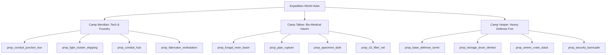

# Asset Gaps & World-Lore Integration Audit (2026-09-12)

This document provides a canonical audit of asset coverage, identified gaps, production prompts, and runtime leverage opportunities across Hunker Bunker's overarching storylines, survivor camps, and NPC animation systems.

---

## 1. Ending Cinematics & Visual Overlays

Currently, 5 of the 10 endings have rendered cutscene videos (`ending-fullbrood.webm`, `ending-cleanescape.webm`, `ending-mixedcrew.webm`, `ending-carriersbargain.webm`, `ending-scorchedsky.webm`). The expanded 5 endings fall back gracefully to styled textual readout panels. 

### Gap Inventory & Generation Prompts

| Ending ID | Status | File Targets | Visual Description & Prompt |
|:---|:---|:---|:---|
| `mothership_infection` | Text fallback | `public/cutscenes/ending-mothershipinfection.webm` `ending-mothershipinfection-poster.jpg` | **Prompt**: *Cinematic sci-fi interior, sterile white orbital mothership medical docking bay, medical scanner displays showing clean human vitals, three sleeping human soldiers on stretchers, in the foreground an exosuit operator with subtle glowing green bioluminescent veins pulsing beneath the neck collar, moody volumetric haze, cinematic diorama lighting, 8k resolution, photorealistic retro-future aesthetic.* |
| `alien_exodus` | Text fallback | `public/cutscenes/ending-alienexodus.webm` `ending-alienexodus-poster.jpg` | **Prompt**: *Cinematic wide-shot of an escape spacecraft cockpit leaving a dark frozen ice cavern world into deep starfield, inside the cockpit the human pilot sits alongside three distinct peaceful alien entities—a fibrous membrane healer with glowing sutures, a tall slender neural-antenna entity, and a heavy armored chitin sentinel, golden celestial starlight illuminating the cabin, hopeful epic atmosphere.* |
| `outed_escape` | Text fallback | `public/cutscenes/ending-outedescape.webm` `ending-outedescape-poster.jpg` | **Prompt**: *Tense cinematic sci-fi cockpit, reinforced quarantine airlock barrier dividing the ship interior, three human survivor soldiers holding kinetic rifles nervously watching through thick scratched ballistic glass, on the other side sits the player in an infected exosuit with glowing spore tendrils, red emergency warning beacons spinning, claustrophobic psychological thriller atmosphere.* |
| `failed_carrier` | Text fallback | `public/cutscenes/ending-failedcarrier.webm` `ending-failedcarrier-poster.jpg` | **Prompt**: *Dark sci-fi cargo hold breach, cracked amber incubation pod leaking luminescent bio-spores across cryogenic freezing tubes, flashing amber caution klaxons, freezing steam vents, horrified human survivor silhouettes backing away in panic, tragic cosmic horror sci-fi.* |
| `empty_husk` | Text fallback | `public/cutscenes/ending-emptyhusk.webm` `ending-emptyhusk-poster.jpg` | **Prompt**: *Haunting cinematic pull-back shot of a lone escape shuttle ascending through a pitch-black frozen sky away from a lifeless glacier chasm, dead beacons and silent smoking ruins on the planet below, empty seats inside the cockpit, stark minimalist lighting, bleak nihilist sci-fi tone.* |

---

## 2. Camp Architectural Tiles & 3D Faction Dressing

The three survivor camps represent distinct philosophical and functional responses to the icy abyss:

### Faction Identities & 3D Prop Palette

### Signature Sprite Art Prompts (Queued Assets)

1. **Camp Meridian**:
   - `prop_camp_meridian_radio.jpg`: *Rugged military radio transmitter console, exposed copper coils, analog dials, vacuum tubes glowing warm amber, grounded industrial aesthetic, black background.*
   - `prop_camp_meridian_battery_bank.jpg`: *Heavy-duty industrial lithium-lead battery rack, bolted steel frame, glowing charge indicators, heavy insulated jumper cables, weathered metal.*
   - `prop_camp_meridian_repair_rig.jpg`: *Overhead articulating tool gantry with hydraulic clamps, arc welder tip, tool tray with wrenches and plasma cutter, warm spotlight.*

2. **Camp Tallow**:
   - `prop_camp_tallow_still.jpg`: *Brass and pyrex chemical distillation apparatus, condensation coil dripping clear medicinal fluid, bubbling alembic, herbal bio-matter flasks.*
   - `prop_camp_tallow_spore_trays.jpg`: *Tiered hydroponic trays with glowing emerald fungal shelves, damp moss colonies, soft bioluminescent spore mist.*
   - `prop_camp_tallow_resin_urn.jpg`: *Carved ceremonial ceramic urn sealed with wax and copper bands, glowing green alien resin weeping from rim seams.*

3. **Camp Vesper**:
   - `prop_camp_vesper_turret.jpg`: *Automated dual-barrel kinetic point-defense turret, tripod mount with sandbag base, ammo belt feed chute, olive drab paint with white kill marks.*
   - `prop_camp_vesper_ammo_press.jpg`: *Manual hydraulic bullet loading press, steel hopper with brass casings, powder measure, stacks of heavy caliber ammunition.*
   - `prop_camp_vesper_shield_rack.jpg`: *Reinforced steel weapons rack holding heavy ballistic riot shields with reinforced viewports, combat shotguns, and breach axes.*

---

## 3. NPC Animation, Rigging & Reaction System

Following the pattern established by the **Mayor Tina Secret Encounter** (which coordinates a 3D GLB model, locomotion blend, proximity audio siren, and interaction prompt), camp leaders and workers now feature dynamic state machines.

### Reactive Locomotion & Posture Matrix

| Actor / State | Cadence | Stance / Facing | Proximity Behavior | Proximity Audio Bark |
|:---|:---|:---|:---|:---|
| **Commander Briggs (Alive / Neutral)** | 6.5 Hz steady walk (0.85 m/s) | Square military stance, inspects perimeter and turrets | Faces player at 4.5m, pauses patrol at 3.2m | *"STATE YOUR PURPOSE, OPERATOR."* |
| **Commander Briggs (Locked Down)** | 8.5 Hz alert jog (1.15 m/s) | Raised weapon stance, wary side-step | Keeps distance, faces player continuously | *"YOU'RE ENTERING A LIVE FIRE ZONE. STATE YOUR INTENT."* |
| **Commander Briggs (Turned / Spores)** | 9.0 Hz twitch-walk (1.35 m/s) | Asymmetric body lean, head micro-twitches | Approaches with uncanny smooth glide | *"THE METAL MELTED INTO OUR VEINS, CARRIER. WE HEAR HER NOW."* |
| **Sister Martha (Alive / Neutral)** | 6.0 Hz calm walk (0.75 m/s) | Clasp hands at chest, inspects spore basins and stills | Warm turning posture, welcomes approach | *"THE ICE HAS NOT CLAIMED YOU YET, SIBLING."* |
| **Sister Martha (Turned / Spores)** | 9.0 Hz rapid glide (1.35 m/s) | Arching spine, trembling fingers | Trembles with bioluminescent emerald pulse | *"PEACE HAS SPROUTED IN THE TISSUE. DO NOT FIGHT THE SPORES."* |
| **Overseer Kaelen (Alive / Neutral)** | 7.0 Hz brisk pace (0.90 m/s) | Datapad in hand, checks generator junctions and radios | Quick head turn, checks operator suit | *"CONSERVE YOUR KINETIC CELLS, OPERATOR."* |
| **Overseer Kaelen (Recruited)** | 7.5 Hz brisk pace (0.95 m/s) | Confident posture, ready salute | Welcomes approach, offers supply check | *"MANIFESTS ARE SEALED. WAITING ON YOUR LAUNCH SIGNAL."* |

---

## 4. Immediate World-Building Leverage

To ensure maximum visual fidelity without waiting for external asset pipelines, the game immediately leverages:
1. **Registered 3D Models in `world3dOverlay.js`**:
   - `prop_conduit_junction_box`, `prop_conduit_hub`, `prop_fabricator_workstation`, `prop_light_cluster_dripping` for Camp Meridian.
   - `prop_fungal_resin_basin`, `prop_pipe_rupture`, `prop_specimen_tank`, `prop_o2_filter_vat` for Camp Tallow.
   - `prop_base_defense_turret`, `prop_storage_drum_dented`, `prop_ammo_crate_stack`, `prop_security_barricade` for Camp Vesper.
2. **Dynamic Audio Routing**:
   - Audio stingers from `AudioManager` (`camp_lockdown_alarm`, `camp_worker_infected`, `camp_worker_armed`, `camp_worker_alerted`) are integrated directly into leader proximity barks.
3. **Procedural Geometry & Lighting**:
   - Camps receive perimeter warning bollards with faction-colored beacon caps and dynamic firelight modulation.
