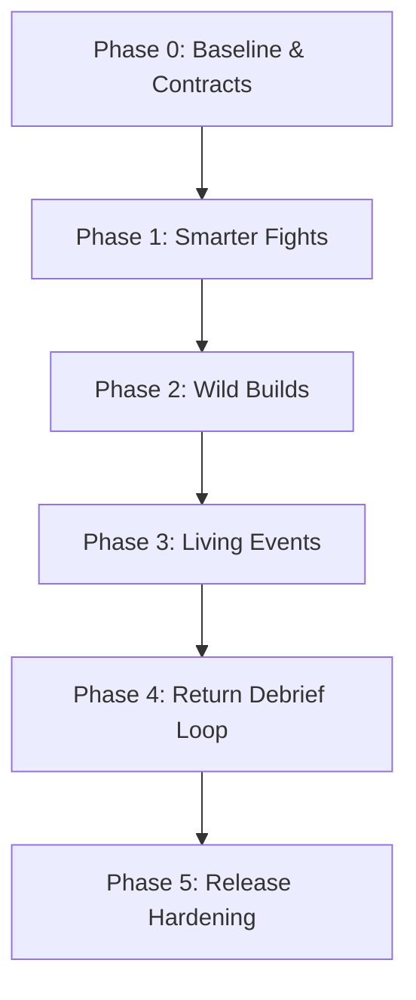

# Gameplay Feature Review — Ten Standards and Three Priorities

Status: proposal · Owner: design & repository maintainers · Updated: 2026-09-24 · Review basis: `v2.4.11-beta` · Current branch: `dev/sprint-46`

The ten features below are the benchmarks against which Hunker Bunker's moment-to-moment gameplay should be judged. Originally evaluated against `v2.4.11-beta`, each section has been reconciled with the active codebase on `dev/sprint-46`, the [master gaps register](../reports/master-known-gaps-and-debt-register-2026-09-23.md), and the empirical findings of the [Sprint 46 player experience report](../reports/sprint-46-player-experience-2026-09-24.md).

> **The ten-minute standard:** Within the first ten minutes of deployment, a player must fight an interesting, tactical enemy formation, make a meaningful build or route choice, discover a rewarding environmental surprise, and extract (or perish) with a compelling reason to discover what happens next.

---

## Priority 1

### 1. Combat — enemies that make you change tactics

#### Design standard & player experience target
Encounters must challenge players through interdependent tactical formations rather than spongey health pools or larger swarm counts. A player entering a room should immediately identify the threat geometry:
- Shield carriers (**Anchors**) locking down primary corridors and absorbing frontal salvos.
- Long-range snipers or spore mortars (**Suppressors**) punishing players who linger in open sightlines.
- Mobile ambushers or burrowers (**Flankers**) flushing the player out of cover and disrupting stationary firing positions.
- Area deniers (**Controllers**) coating retreat corridors in cryo-rime or caustic resin.
- Biological conduits (**Support**) linking to heavy units and regenerating carapace integrity until severed.

*Target scenario:* A Hive Guardian shields a Spore-Artillery unit while Crawlers flush the player from behind a bulkhead. Instead of simply backpedaling while holding down primary fire, the player must dynamically adjust: Scout slips behind to disrupt the mortar, Tank executes a Seismic Slam to stagger and breach the shield carrier, or Engineer deploys an Overcharge Pulse to neutralize the flanking swarm.

#### Current state & code baseline
- **Hostile variety exists, coordination does not:** 18 hostile archetypes, elite modifiers, and stagger thresholds exist in runtime (`src/threeGame.js:34200-34850`; verified via [scripts/combat-encounter-report.js](../../scripts/combat-encounter-report.js)). However, hostiles select targets and engage independently; no unit bases its actions on the status or role of an ally.
- **Sprint 46 arrival incident:** Added in `src/arrivalIncident.js`, guaranteeing immediate combat within 20 seconds of landing across 9/9 tested deployments (closing from 16–19 units). While it solves the "empty first two minutes" issue, the arrival packs remain homogeneous single-role units (e.g., 3 cryosnails, 3 crawlers, or 1 elite stalker).
- **Gap reference:** `GAP-GP-08` (mitigated with debris props, but room tactical geometry remains basic); encounter coordination is unbuilt.

#### Mechanical blueprint
- **Encounter coordinator:** Introduce `src/encounterCoordination.js` managing tactical roles (`anchor`, `suppressor`, `flanker`, `controller`, `support`).
- **Shared state machine:**
  - *Anchor logic:* Interposes between player and protected `suppressor`/`artillery` units.
  - *Suppressor logic:* Inhibits firing until player is displaced from cover or pinned by a `flanker`.
  - *Flanker logic:* Times aggressive flanking bursts to coincide with anchor engagement.
  - *Formation break:* Destroying the anchor triggers a staggered retreat state in suppressors; destroying the suppressor causes the remaining units to devolve into frantic, uncoordinated pursuit.
- **Telegraphing:** Clear audio cues (spatial screech/charge hum) and visual telemetry (laser sighting arcs, energy tether beams) before high-impact attacks.

#### Verifiable acceptance criteria
- **Automated:** Integration tests verifying that formation state machines transition cleanly between `intact`, `staggered`, `broken`, and `cleared` without orphaned timers.
- **Probe/telemetry:** Scripted combat probes prove distinct times-to-kill and player movement profiles when prioritizing the support unit versus the anchor.
- **Playtest:** 5/5 first-time playtesters identify the priority threat within the formation without coaching.

---

### 2. Replayability — ridiculous, run-defining equipment combinations

#### Design standard & player experience target
Roguelike build crafting succeeds when equipment combinations fundamentally transform combat verbs rather than providing passive percentage increments (+8% damage is forgotten; lightning chains that electrify frozen shatter shrapnel define a run). Upgrades should create synergistic chain reactions between weapons, suit passives, elemental conditions, and class melee actions.

*Target scenario:* A player pairs a freezing shotgun overclock with an ice-shatter engine: freezing a hive elite turns it into a brittle ice sculpture; a heavy melee strike shatters it into a lethal fragmentation nova that freezes adjacent crawlers.

#### Current state & code baseline
- **Inert catalog relics:** 9 relics and overclocks remain flagged `implemented: false` and are intentionally excluded from active drop tables (`src/runDrops.js:20-130`, registered under `GAP-GP-06`): `split_shot`, `cryo_rime`, `plasma_bounce`, `caustic_payload`, `shatter_engine`, `bio_vampirism`, `tesla_thrusters`, `pheromone_aura`, `synapse_pulse`.
- **Wired transformative relics:** Existing functional transformative relics (`last_breath`, `punctured_lung`, `scrap_cycler`, `parasitic_magazine`, `false_telemetry`) are mechanically sound but isolated; multi-item synergies remain undocumented and untested in extended play.
- **Class melee integration:** Sprint 46 introduced distinct class melee profiles (`CLASS_MELEE_PROFILES` in `src/threeGame.js`: Scout *Slipstream Strike*, Tank *Seismic Slam*, Engineer *Overcharge Pulse*). Whether players leverage these abilities alongside elemental item drops remains unmeasured.

#### Mechanical blueprint
- **Implement the foundational synergy pairs in `src/runDrops.js`:**
  1. *Cryo Shatter Chain:* `cryo_rime` (shots apply freeze stacks; at 100%, target freezes solid) + `shatter_engine` (defeating frozen hostiles triggers an ice shrapnel nova, dealing 40 damage in a 4-tile radius and applying 50% chill).
  2. *Bio Predator Chain:* `caustic_payload` (shots apply corroding DoT) + `bio_vampirism` (defeating corroded bio enemies restores 8 O₂ vitals and 1 heart segment).
  3. *(Stretch) Tesla Route Control:* `plasma_bounce` (ricochets off metallic structures toward nearest enemy) + `tesla_thrusters` (dash leaves an electric arc fence that stuns pursuers for 2.0s).
- **Class ability hooks:**
  - Scout's *Slipstream Strike* triggers instant shatter explosions on frozen targets.
  - Tank's *Seismic Slam* pulls corroded enemies into a concentrated bio-hazard puddle.
  - Engineer's deployable turrets inherit the player's equipped elemental damage type at 50% potency.

#### Verifiable acceptance criteria
- **Automated:** Unit tests in `src/runDrops.test.js` validating stack accumulation, duration decay, shatter radius calculations, and health/O₂ refund math.
- **Probe/telemetry:** Scripted build probes verify that synergy combinations yield observable reductions in time-to-clear and shots-to-kill against standardized enemy packs.
- **Persistence:** Save/resume cycles faithfully restore active status effects and item modifiers without double-granting bonuses or resetting cooldowns.

---

### 3. Exploration — unexpected events that interrupt the expedition

#### Design standard & player experience target
Procedural hallway generation alone does not sustain exploration. Expeditions need dynamic, high-concept world events that interrupt direct routes, pose dilemmas, and intersect with active weather conditions. Exploring off the critical path should never feel like checking off a checklist; it should feel like stumbling into an unscripted crisis.

*Target scenario:* While navigating an abandoned research annex during a `spore_bloom` condition, the player detects a faint distress beacon. Reaching the site reveals a survivor bunker surrounded by pulsating spore sacs. Breaching the door could rescue a researcher with vital sector intel—or rupture the sacs, turning the chamber into a zero-visibility bio-hazard zone.

#### Current state & code baseline
- **Templated POIs:** Primary ship goals and camp quests follow fixed procedural templates. Destination POIs and room types are generated via Wave Function Collapse (`src/mazeExpedition.js`), but room-level events are largely static.
- **Arrival fight as the sole event:** Sprint 46's condition-aware arrival pack (`src/arrivalIncident.js`) is the only dynamic combat event that tailors its hostility to the active weather modifier.
- **Condition repetition:** Probe telemetry from Sprint 46 revealed that consecutive deployments frequently roll the identical environmental condition (`GAP-GP-09` / F4: `subzero_stillness` rolled twice in succession across multiple fresh campaigns).

#### Mechanical blueprint
- **Dynamic incident pool (`src/expeditionEvents.js`):**
  1. *False Distress Signal:* Audio beacon off the O₂ corridor; scanning detects biological frequency anomalies; approaching triggers either a survivor cache or an ambushing pack of burrowed crawlers.
  2. *Unstable Vault Breach:* Armored containment unit showing its contents and failure timer; players choose between a rapid kinetic breach (Tank wall breach, triggers room alarms) or a slow electrical bypass (Engineer pulse, consumes suit battery/O₂).
  3. *Derelict Convoy:* Destroyed cargo vehicle guarded by wandering sentinels; provides scrap caches if salvaged before automated scuttling charges detonate.
- **Condition modulation matrix:**
  - `spore_bloom`: Events spawn dense hazard clouds that require constant repositioning.
  - `subzero_stillness`: Distorts radio signals, requiring players to rely on visual flashing beacons.
  - `geothermal_arc`: Event machinery discharges electrical arcs across metal catwalks.
- **Repetition guard:** Add a history buffer in campaign state to prevent consecutive deployments from rolling the same event or condition.

#### Verifiable acceptance criteria
- **Automated:** Suite tests proving event generation determinism, condition parameter injection, and repetition lockout.
- **Runtime:** Playwright E2E tests verifying that optional events can be approached, successfully completed, failed, or completely bypassed without softlocking the primary ship objective.
- **Co-op:** Event discovery, dialogue triggers, and state resolution synchronize seamlessly between host and client replicas.

---

## Priority 2

### 4. Traversal — tools that let players solve the environment

#### Design standard & player experience target
Environmental traversal should empower player expression rather than presenting arbitrary invisible walls or impassable corridors. Each class must possess distinct traversal utilities that unlock alternate routes, bypass hazards, or reveal tactical high ground, reinforcing class identity.

*Target scenario:* A heavy blast door separates the player from a supply depot. A Tank uses Seismic Slam to shatter adjacent cracked rock walls, carving a direct breach; a Scout dashes across an impassable chasm using low-gravity thrusters to slip through an overhead vent; an Engineer deploys a temporary nanite bridge across the chasm gap.

#### Current state & code baseline
- **Chasm confusion (`GAP-GP-05`):** Procedural chasms display fall-hazard warnings, leading players to expect bridge-building mechanics. Currently, chasms are impassable unless WFC generated a natural bridge tile.
- **Crash site monotony (`GAP-GP-08`):** Chunk (0,0) uses hardcoded rectangular boundaries with a single north exit door. Mitigated in Sprint 46 by scattering destructible wreckage debris (`planCrashSiteDebris`), but room perimeter geometry remains rigid.
- **Class traversal stubs:** Tank's *Seismic Slam* breaches frontal cracked walls (`src/threeGame.js`), but Scout and Engineer lack distinct environmental problem-solving mechanics.

#### Mechanical blueprint
- **Class traversal matrix:**
  - **Tank:** *Kinetic Breaching* — Seismic Slam breaks structural rubble piles, reinforced cracked walls, and barricades, creating custom navigation corridors.
  - **Scout:** *Slipstream Thrusters* — Grants low-friction horizontal vaulting across 1-tile chasm gaps and access to elevated catwalk perches.
  - **Engineer:** *Nanite Deployment Kit* — Deploys a temporary solid-light bridge across chasm hazards (resolving `GAP-GP-05`) or hacks locked security consoles without requiring keycards.
- **Level design integration:** Embed authored traversal affordances (cracked rock seams, broken walkways, overhead service grates) across Ring 1 room builds (`src/data/roomBuilds.js`).

#### Verifiable acceptance criteria
- **Automated:** Unit tests validating collision mask updates when walls are breached or nanite bridges are spawned.
- **Inspection clarity:** Updated inspection tooltips for chasms to clearly distinguish between impassable abysses and deployable bridge sockets.
- **Accessibility:** All traversal mechanics remain fully navigable via Steam Deck gamepad inputs without complex button chords.

---

### 5. Rewards — high-stakes rewards worth a detour

#### Design standard & player experience target
Optional objectives should demand calculated risk assessments: spending scarce oxygen, fighting an elite guardian, or risking status afflictions in exchange for run-defining loot. Rewards must be immediately tangible—granting new abilities, game-changing overclocks, or essential faction tech—rather than incremental stat increases.

*Target scenario:* An auxiliary bio-dome emits an emergency alert. The entrance console warns: *"ATMOSPHERE COMPROMISED — 45s O₂ DRAIN RATE ×2 // REWARD: MYTHIC SHATTER ENGINE"*. The player intentionally burns half their remaining life support to secure the relic, sprinting back to the main route with heart rates redlining.

#### Current state & code baseline
- **Bounties resolved in Sprint 46:** Expedition bounties now track progress in real time, display a dedicated HUD chip in the expedition panel, and pay out full `rewardBonus` shells upon extraction via receipt-backed bank transactions (`src/expeditionBounties.js`, `src/bank.js`).
- **Missing spatial detours:** While bounties incentivize behavioral goals (e.g., smash 6 walls, map 3 rooms), physical high-stakes detour arenas (risk-reward side rooms) are absent from procedural generation.
- **Reward readability:** Prior to Sprint 46, players had no way of knowing whether a detour was economically worthwhile.

#### Mechanical blueprint
- **Authored high-stakes detour chambers:**
  - *Quarantine Vault:* Enclosing laser barriers lock upon entry; spawns a wave of elite guardians; victory dispenses an uncorrupted mythic relic.
  - *Overheated Geothermal Siphon:* High-yield scrap cache submerged in heat vents; entering inflicts thermal damage over time; rewarding greed with rapid fabrication materials.
- **Transparent preview consoles:** Interactive terminals at chamber thresholds displaying exact threats, environmental modifiers, and guaranteed reward classes before commitment.
- **Failure safety:** Dying within a high-stakes detour forfeits the collected bonus cargo while safely preserving base campaign progression.

#### Verifiable acceptance criteria
- **Automated:** Integration tests confirming that quarantine room locks engage and disengage reliably upon combat resolution.
- **Economy integrity:** Bounties and high-stakes rewards generate distinct receipt IDs in `src/bank.js` to prevent duplicate grants across save reloads.
- **Player telemetry:** Playtest observations demonstrate that players consciously deliberate at chamber entrances before engaging.

---

### 6. Boss design — fights with unforgettable mechanics

#### Design standard & player experience target
Milestone bosses must operate as multi-phase tactical puzzles rather than static bullet sponges. Fights should alter arena geography, introduce telegraphed signature mechanics, expose vulnerability windows, and strip boss defenses as damage thresholds are surpassed.

*Target scenario:* The Cybersnail world boss begins shielded behind an impenetrable ballistic shell, launching mortar salvos. Damaging its cooling vents causes the boss to overheat, opening a 4-second weakpoint window. At 50% health, the shell shatters, transforming the boss into an aggressive close-range pursuer discharging radial EMP shockwaves.

#### Current state & code baseline
- **Boss phase framework active:** Pure data-driven phase state machine implemented in `src/bossPhases.js:27-147`.
- **Only two bosses converted:** Only the Sector Zero Queen (`QUEEN_FIGHT_DEF`) and the BIO-biome Sporesnail (`SPORESNAIL_FIGHT_DEF`) use phase definitions.
- **Phaseless milestone bosses:** 5 major milestone bosses remain flat, single-phase HP pools (`scripts/combat-encounter-report.js` lines 141–178): `boss_cybersnail`, `boss_cryosnail`, `boss_corrupted_scout`, `boss_corrupted_tank`, and `boss_corrupted_engineer`.
- **Co-op phase authority:** Host authority for phase transitions and milestone defeats was established in Sprint 45.2 (`src/coopTransitions.js`), but lacks paired physical hardware verification (`#85`).

#### Mechanical blueprint
- **Convert Ring 1 and biome bosses onto `src/bossPhases.js`:**
  1. `boss_cybersnail`:
     - *Phase 1 (100%–50% HP):* Ballistic carapace (armored damage multiplier 0.20); fires telegraphed mortar volleys; weakpoint cooling vent opens for 3.5s after every third volley.
     - *Phase 2 (<50% HP):* Carapace detonates; movement speed increases by 40%; emits radial electrical arcs; calls support crawlers.
  2. `boss_cryosnail`:
     - *Phase 1 (100%–60% HP):* Glacial aura leaves freezing trails; ice needle barrages.
     - *Phase 2 (<60% HP):* Deep freeze; covers 50% of the arena floor in slippery ice; player must break thermal pylons to maintain safe footing.
  3. `boss_corrupted_*` sentinels:
     - Mirror class abilities (e.g., Corrupted Tank charges with Seismic Slam; Corrupted Scout uses dashing flank attacks).
- **Phase dialogue & audio stingers:** Add distinct radio transmission lines for phase transitions in `src/bossPhases.js`, mirroring `QUEEN_PHASE_LINES`.

#### Verifiable acceptance criteria
- **Automated:** Boss simulation reports in `scripts/combat-encounter-report.js` confirm reasonable times-to-kill and ammo consumption across all 3 player classes.
- **Phase integrity:** Unit tests prove weakpoint windows accurately gate incoming damage and timer resets execute cleanly.
- **Readability:** Phase transitions trigger dramatic visual changes (model decal swaps, particle flares) and distinct SFX cues.

---

### 7. Presentation — environments that feel like actual places

#### Design standard & player experience target
Expedition destinations must feature coherent architectural grammar, atmospheric lighting, and distinct visual silhouettes. Players should immediately recognize whether they are navigating an active human resistance redoubt, a desecrated research lab, or a living biomechanical hive without checking their minimap.

*Target scenario:* Transitioning from a cold, angular concrete bunker into an alien hive compound is visceral: metallic tiles give way to squelching fungal carpets, fluorescent strips flicker out into throbbing bio-luminescent pustules, and industrial ambient hums shift to low guttural breathing.

#### Current state & code baseline
- **Unrouted architecture assets (`GAP-RN-03`):** 24 fully modeled architecture GLB assets exist in the repository but have no routing into runtime world generation.
- **Unplaced faction props (`GAP-RN-04`):** 21 authored faction props cannot be placed by current room definitions (`src/data/roomBuilds.js`).
- **Compound foundations:** Survivor camps and alien hives were expanded to six-room compounds in Sprint 45, providing the structural canvas for prop integration.
- **Crash site prop scattering:** Sprint 46 successfully introduced seeded destructible debris props into Chunk (0,0) (`src/arrivalIncident.js:73-92`), validating prop distribution patterns.

#### Mechanical blueprint
- **Asset integration pipeline:**
  - Route the 24 unrouted architecture GLBs into `src/setpieceBuilds.js` and `src/data/roomBuilds.js` for Ring 1 corridor connectors, airlocks, and industrial junctions.
  - Distribute the 21 faction props across survivor camps (Briggs barricades, medical gurneys, communication consoles) and hive chambers (resin cocoons, bone spurs, spore pods).
- **Lighting & silhouette language:**
  - *Survivor Camps:* Warm tungsten emergency lanterns, reinforced steel barricades, visible scrap storage.
  - *Alien Hives:* Sickly viridian/violet bioluminescent shaders, organic entry arches, undulating fungal growths.
  - *Abandoned Facilities:* Flickering cool-white overheads, shattered observation glass, exposed wiring conduits.

#### Verifiable acceptance criteria
- **Audit compliance:** `npm run audit:retail-assets` and `npm run audit:chroma-green` pass with zero unindexed or unreferenced visual assets.
- **Performance budget:** Total draw calls per frame remain under 120 and active mesh instances stay within Steam Deck VRAM allocations.
- **Recognition test:** Blind playtest review confirms players identify compound types within 2 seconds of entering the threshold.

---

### 8. Game feel — every weapon and movement action feels exceptional

#### Design standard & player experience target
Every interaction must deliver tactile, satisfying sensory feedback. Firing a kinetic slugger should kick the camera and rattle the speakers; striking an armored carapace should trigger micro-hitstop and send sparks flying; sliding into cover should kick up snow and debris.

*Target scenario:* Firing the Tank's heavy cannon produces a deep, bass-heavy thud, a sharp 4-frame camera kick, and a billowing muzzle flash. The slug impacts a charging crawler with an audible crunch, pausing the animation for 45ms (hitstop) before sending the shattered shell skidding across the ice.

#### Current state & code baseline
- **Hitstop and VFX framework:** Basic hitstop, screen shake, and impact particles exist in `src/threeGame.js`.
- **Class melee distinction:** Sprint 46 introduced bespoke melee profiles (`CLASS_MELEE_PROFILES`) with custom speed, range, and impact effects.
- **Steam Deck effect saturation (`GAP-RN-10/11/12`):** Historical hardware logs revealed severe frame pacing spikes (p50 84.7ms, max 4.614s) caused by unconstrained particle spawns (peaking at 3,277 live effects in Sept 23 sessions prior to the Sprint 45.1 effect cap).
- **Audio pipeline:** Sound effects are wired, but environmental acoustic reflections (metallic reverberation vs open cavern dampening) require tuning.

#### Mechanical blueprint
- **Sensory feedback tuning:**
  - *Micro-hitstop:* Calibrate 30ms hitstop for light kinetic impacts, 60ms for heavy melee slams and critical weakpoint hits.
  - *Directional recoil & camera shake:* Implement weapon-specific recoil vectors that briefly push the aiming reticle before snapping back.
  - *Damage confirmation:* Multi-tiered damage pips (white for normal hits, yellow for critical weakpoint hits, blue for armored deflection).
- **Steam Deck performance envelope:**
  - Maintain a strict concurrency cap of 64 active transient visual effects.
  - Implement object pooling for impact sparks, smoke puffs, and shell casings to eliminate GC pauses.
  - Profile frame render loops to ensure 60fps locked on standard PC and stable 30/45fps on Steam Deck.

#### Verifiable acceptance criteria
- **Automated:** Zero memory leaks detected across 1,000 continuous weapon discharge cycles in headless E2E test runs.
- **Hardware telemetry:** Physical Steam Deck profiling demonstrates zero frame time spikes above 33.3ms during heavy 5-enemy combat encounters.
- **Audio completeness:** `npm run audit:soundtrack` and audio verification scripts pass cleanly.

---

### 9. Progression — a satisfying reason to start the next run

#### Design standard & player experience target
Returning to the mothership after an expedition must feel purposeful. The results screen should celebrate accomplishments, quantify progress toward major milestones, reveal new narrative lore, and present tempting reasons to launch the next run immediately.

*Target scenario:* Following an extraction, the screen delivers a punchy debrief: *"Sub-Zero Gale Survived // Bounty Collected: +80 Shells // Unlocked: Cryo Rime Injector Blueprint // Martha Faction Bond: +1 (Now Trusted) // Next Ship Goal: O₂ Generator Module (Needs 4 Tech, 2 Med)"*. The player immediately heads to the fabrication bay to assemble their new overclock.

#### Current state & code baseline
- **Expedition report introduced in Sprint 46:** The results screen now opens with a dedicated report section (`src/expeditionReport.js:37-64`), displaying active weather condition, bounty completion with shell earnings, completed objectives, and next ship goal shortfall.
- **Missing meta-progression context:** The report does not yet summarize newly discovered lore codex entries, unlocked equipment blueprints, or faction reputation shifts earned during the deployment.
- **Unified progression journey:** The transition between the game-over/results modal, the mothership hub, the Armory, and the Fab Bay remains somewhat disjointed.

#### Mechanical blueprint
- **Extend `src/expeditionReport.js`:**
  - *New Unlocks Section:* Enumerate new weapon overclocks, suit relics, or crafting blueprints discovered during the run.
  - *Faction Shifts:* Display standing changes with camp leaders (Martha, Briggs, Kaelen) resulting from completed missions.
  - *Lore Archive Discovery:* Highlight new Codex entries or audio logs retrieved from terminals.
  - *Actionable Next Lead:* Display an authored "Next Run Objective" recommendation (e.g., *"Scout reports heavy tech salvage in Western Glacial Crevasse"*).
- **UI flow refinement:** Provide a seamless "FABRICATE & REDEPLOY" shortcut directly from the results screen when a ship goal or blueprint is affordable.

#### Verifiable acceptance criteria
- **Automated:** Unit tests in `src/expeditionReport.test.js` validating that unlock summaries and faction deltas render accurately with full localization coverage.
- **Edge cases:** Report handles zero-bounty runs, catastrophic wipes, and late-game maxed-progression states gracefully without layout distortion.
- **Player motivation:** User testing confirms players identify an immediate objective for their subsequent run before pressing TRY AGAIN.

---

### 10. Story and cooperation — a world that responds clearly

#### Design standard & player experience target
The narrative must respond visibly to player choices, closing off certain allegiances while opening others. Irreversible choices must carry emotional weight, clearly communicated in the moment. In cooperative play, shared decisions and complementary class abilities should foster genuine partnership rather than two solo players sharing a screen.

*Target scenario:* Reaching the Hive Queen's inner sanctum with Mayor Tina, the player is offered a fateful choice: purge the corrupted leader or allow her communion with the hive mind. Choosing communion triggers a somber radio alarm: *"CRITICAL TIMELINE DIVERGENCE — HUMAN RESISTANCE BONDS BROKEN // CLEAN ESCAPE ROUTE LOCKED"*. In co-op, both players must confirm the linchpin prompt.

#### Current state & code baseline
- **Tina-joined route missing (`GAP-ST-01`):** In `src/storyLinchpins.js:49-61`, the `joined` resolution applies `-30` humanity, penalizes camp bonds by 2, and locks `CLEAN_ESCAPE` and `SCORCHED_SKY`. However, no gameplay or interactive trigger exists in the world to initiate this branch; it is only reachable via debug commands.
- **Invisible ending locks (`GAP-ST-02`):** Killing Mayor Tina or sabotaging leaders closes off 3 ending paths. While reflected in the post-game Codex, in-run HUD notifications fail to communicate the permanence of the consequence when the choice is made.
- **Co-op synchronization:** Host-authoritative synchronization for boss phases, milestone defeats, and Act 2 descent was introduced in Sprint 45.2 (`src/coopTransitions.js`), but paired two-client hardware proof remains an open deliverable (`#85`).

#### Mechanical blueprint
- **Implement the Alien Communion encounter (`GAP-ST-01`):**
  - Create an interactive communion trigger at the Hive Queen chamber when Mayor Tina is present in her transformed state.
  - Present a high-impact narrative prompt allowing the player to initiate the transformation allegiance.
- **In-run timeline divergence HUD warning (`GAP-ST-02`):**
  - Implement a dedicated HUD banner and audio sting triggered whenever a linchpin decision resolves: `TIMELINE DIVERGENCE: ENDING PATHS ALTERED`.
  - Display the specific ending locks and faction reputation consequences directly on screen.
- **Co-op linchpin consensus:**
  - In multiplayer sessions, irreversible narrative linchpin decisions require dual-player proximity and simultaneous confirmation.

#### Verifiable acceptance criteria
- **Automated:** Unit tests in `src/storyLinchpins.test.js` verifying that triggering the communion event applies exact humanity and ending lock deltas.
- **Runtime coverage:** Playwright E2E tests validating the appearance of the timeline divergence HUD warning.
- **Multiplayer sync:** Integration tests proving both host and guest clients converge on identical narrative states and receive synchronized ending dispositions.

---

## Product decision

The next milestone should be a **combat-and-discovery overhaul of one complete Ring 1 expedition**, not ten parallel feature projects. Ring 1 is the ideal proving ground: every campaign passes through it, its O₂ Generator objective already supports three package variants, and refining it validates the entire ten-minute gameplay loop before later rings multiply the asset burden.

The slice must unite the three core priorities in a single, coherent journey:
1. **Smarter fights:** A coordinated encounter forces the player to read an enemy formation and execute role-based counterplay.
2. **Wild builds:** An authored high-stakes reward presents a meaningful choice that transforms how the player fights.
3. **Living expeditions:** An unexpected dynamic event tempts the player to leave the shortest path and adapt to active weather conditions.
4. **Rewarding return:** Extraction debriefs what changed and delivers a clear reason to redeploy.

A feature belongs in this slice only if it strengthens this unified loop.

---

## The ten-minute player contract

The first ten minutes of an expedition must deliver a reliable sequence of narrative and tactical beats:

| Window | Player experience | System obligation | Failure signal |
| --- | --- | --- | --- |
| **0:00–1:00** | Land, orient, and survive an immediate threat | Arrival incident introduces the condition and one readable combat pressure | No contact, no condition cue, or unavoidable damage before player acts |
| **1:00–3:00** | Choose between the ship-goal route and an optional signal | Route guidance displays both the primary goal and a high-value opportunity | Optional route is invisible, trivial, or pure narrative flavor |
| **3:00–6:00** | Break a coordinated enemy formation | At least two enemy roles interact with distinct counterplay | Encounter solved by backpedaling and holding fire with no target priority |
| **4:00–8:00** | Acquire or reject a run-defining synergy | Reward changes targeting, movement, resource use, or class ability | Reward is an invisible stat bump (+5% damage) |
| **6:00–9:00** | Resolve a surprising dynamic event | Event presents risk, dilemma, and condition-dependent variation | Event is a reskinned room or repeats identically across runs |
| **8:00–10:00** | Extract, fail with insight, or push deeper | Debrief highlights discoveries, persistent changes, and the next lead | Results screen shows generic numbers without inspiring the next run |

---

## Ring 1 vertical slice

### Track A — smarter fights

#### Tactical role matrix
Rather than creating new enemy models, assign explicit tactical roles to existing combatants:

| Role | Responsibility | Candidate units | Counterplay |
| --- | --- | --- | --- |
| **Anchor** | Holds choke points and shields dangerous allies | Cybersnail (elite-promoted for the shield role) | Stagger with explosives, Tank Seismic Slam, or flank |
| **Suppressor** | Punishes exposure in open corridors | Sentinel, Alien Proto-Spitter | Break line of sight, rush during cooldown, or Engineer pulse |
| **Flanker** | Forces player to maneuver out of cover | Mycelium Stalker, Crawler | Listen for telegraph, kite, or intercept with Scout mobility |
| **Controller** | Restricts safe ground and movement options | Cryosnail, Sporesnail | Eliminate first, bait away, or use elemental counters |
| **Support** | Buffs or regenerates allied units | Encounter elite modifier | Sever the visible energy link or focus down the support unit |

#### Three Ring 1 encounter recipes
1. **Locked Crossfire:** One Sentinel suppresses the main corridor while two Cybersnails form an armored phalanx in the near lane. Staggering an Anchor creates an advance window; bypassing via a side vent exposes the Sentinel.
2. **Bloom Push:** A Proto-Spitter denies the central chamber, a Sporesnail coats retreat paths in caustic sludge, and Crawlers ambush from side vents upon first weapon discharge.
3. **Cold Pincer:** A Cryosnail pressures from the front with freezing needles while an ambushing Stalker flanks the player's retreat line. Clear audio telegraphs prevent the ambush from feeling cheap.

---

### Track B — wild builds

#### First synergy set
Focus development on two complete elemental synergy chains from the inert catalog (`GAP-GP-06`):

| Chain | Components | Tactical transformation | Status |
| --- | --- | --- | --- |
| **Cryo Shatter** | `cryo_rime` + `shatter_engine` | Stack freeze on heavy targets, then shatter them to obliterate adjacent swarms | Required |
| **Bio Predator** | `caustic_payload` + `bio_vampirism` | Infect durable foes with corrosion; committed bio kills restore vital oxygen | Required |
| **Tesla Route Control** | `plasma_bounce` + `tesla_thrusters` | Ricochet shots off metal walls; dash leaves electrified arc fences | Stretch |

#### Authored high-stakes delivery
Ring 1 will feature one deterministic high-stakes reward cache:
- Previews the offered synergy component before activation.
- Demands an explicit operational cost (escalated enemy wave, localized O₂ siphon, or locked blast doors).
- Allows the player to walk away if their current resources cannot support the risk.

---

### Track C — living expeditions

#### Required Ring 1 events
1. **False Distress Signal:** Radio ping directs player off the O₂ corridor to an isolated shelter. Scanning reveals biological contamination; opening initiates a rescue or an intense ambushing fight. Condition modifiers alter ground hazards (`spore_bloom`) or signal clarity (`subzero_stillness`).
2. **Unstable Salvage Vault:** Heavily armored vault previewing rare crafting salvage. Fast kinetic breach (Tank) wakes nearby defenders; slow electrical bypass (Engineer) consumes time and life support.

---

### Track D — rewarding return

Extend `src/expeditionReport.js` to present a unified debrief hierarchy:
1. **Condition & Survival:** Environmental modifier endured and extraction status.
2. **Economic Settlement:** Bounties verified and high-stakes cache payouts credited to bank.
3. **Discoveries & Unlocks:** New blueprints discovered, Codex entries archived, and faction reputation deltas.
4. **Next Ship Objective:** Current progress toward the next ship goal with exact missing resource counts.
5. **The Next Horizon:** A concrete, actionable operational lead pointing toward the next expedition.

---

## Implementation phases & sprint roadmap

### Phase 0 — Baseline & contracts (Sprint 46 wrap)
- Record 3 baseline Ring 1 runs across varying classes and seeds.
- Define pure data contracts for encounter recipes, status effects, and event states.
- Lock deterministic seed portfolio for automated regression testing.

### Phase 1 — Coordinated encounters (Sprint 47)
- Implement `src/encounterCoordination.js` and the *Locked Crossfire* encounter recipe.
- Wire audio/visual telegraphs, target priority state machines, and co-op host replication.
- Validate that all three classes (Scout, Tank, Engineer) possess effective tactical counterplay.

### Phase 2 — Foundational synergy builds (Sprint 47)
- Implement `cryo_rime`, `shatter_engine`, `caustic_payload`, and `bio_vampirism` in `src/runDrops.js`.
- Integrate synergy triggers with class melee profiles (`CLASS_MELEE_PROFILES`).
- Embed authored high-stakes reward vault into Ring 1 world generation.

### Phase 3 — Dynamic events & traversal (Sprint 47/48)
- Implement `src/expeditionEvents.js` with *False Distress Signal* and *Unstable Vault*.
- Wire class traversal affordances (Tank wall breach, Engineer nanite bridge resolving `GAP-GP-05`).
- Enforce repetition guards in campaign state.

### Phase 4 — Boss phase conversion & debrief loop (Sprint 48)
- Convert `boss_cybersnail` and `boss_cryosnail` onto `src/bossPhases.js`.
- Expand `src/expeditionReport.js` to report unlocked blueprints, faction shifts, and next leads.
- Wire Hive Queen communion encounter for Mayor Tina (`GAP-ST-01`) and in-run timeline divergence HUD warnings (`GAP-ST-02`).

### Phase 5 — Hardware verification & release hardening
- Run automated Vitest suites, Playwright journey probes, and headless regression runs.
- Conduct physical Steam Deck profiling to guarantee frame pacing within measured tiers.
- Execute 5-player first-time playtest protocols.

---

## Verification plan

### Automated verification gates
- **Unit test coverage:** State machine transitions, status effect math, and report formatting.
- **Deterministic seed sweeps:** Ensure identical seeds generate identical encounter and event distributions.
- **Co-op state convergence:** Verify host-authoritative replication of boss phases, linchpin decisions, and reward payouts.
- **Repository hygiene:** `npm test`, `npx eslint .`, `npm run audit:docs`, and `npm run audit:retail-assets` remain 100% passing.

### Human playtest protocol
Conduct evaluations with at least five players unfamiliar with internal implementation details:
1. *Threat assessment:* Which enemy was the primary threat, and how did you adapt?
2. *Build expression:* How did your new equipment alter your combat choices?
3. *Route motivation:* What tempted you to deviate from the direct objective path?
4. *Debrief clarity:* What did your return to the ship accomplish, and what is your goal for the next run?

---

## Explicit non-goals

To guarantee execution focus and protect release stability, the following are strictly excluded from this slice:
- Adding 100+ generic weapons or prematurely implementing all 9 inert catalog items at once.
- Overhauling the core procedural terrain generator or building open-world exploration spaces.
- Expanding PvP systems or introducing live-service meta-economies.
- Creating bespoke 3D models for every tactical role.
- Global class-gated traversal across every ring in the campaign.

---

## Extension — three-agent lane split for the Ring 1 slice

Status: assigned 2026-09-24 · Integration branch: `dev/sprint-47` (from `dev/sprint-46`)

Three agents build the slice in parallel. Each lane owns whole files and one locale namespace; the few shared hooks are named contracts below. Track D (rewarding return) is small and consumes every other lane's output, so it sits with the integrating lane.

| Lane | Agent | Tracks | Owns |
| --- | --- | --- | --- |
| **1 — Living expeditions & return** | **Claude (Claude Code)** | C + D + slice integration/evidence | `src/expeditionEvents.js` (new), `src/expeditionReport.js`, `src/arrivalIncident.js`, `src/expeditionBounties.js`, `tests/e2e/probes/`, locale namespace `ui.events.*`, the slice evidence report |
| **2 — Smarter fights & bosses** | **ChatGPT Codex** | A + Phase 4 boss conversion | `src/encounterCoordination.js` (new), `src/encounterRecipes.js` (new), `src/bossPhases.js`, `scripts/combat-encounter-report.js`, locale namespace `ui.encounters.*` |
| **3 — Wild builds & traversal** | **Gemini (Antigravity)** | B + Phase 3 class traversal | `src/runDrops.js`, `src/statusEffects.js` (new), `CLASS_MELEE_PROFILES`, the high-stakes reward cache, locale namespaces `ui.relics.*` / `ui.cache.*` |

### Shared contracts (agree before building)
- **Encounters → events:** Lane 2 exports `spawnEncounterRecipe(game, recipeId, origin, { seed })` returning an encounter handle, and dispatches `encounter-formation-broken` / `encounter-cleared` with `{ recipeId, encounterId }`. Lane 1's events call it; nobody else spawns coordinated packs.
- **Builds → everyone:** Lane 3 exports `grantRunDrop(game, dropId)` and a status-effect API (`applyStatus(target, statusId, stacks)`, `getStatus(target, statusId)`). Lane 1's vault and Lane 3's cache grant through it; Lane 2's roles read statuses (a frozen Anchor loses its shield) but never write them.
- **Debrief:** every lane reports what the player earned or changed through one event, `expedition-report-item` `{ kind, labelKey, params }`; only Lane 1 renders it.
- **Registry (landed, `src/sliceContracts.js`):** lanes do not import each other's modules. Lane 2 calls `registerSliceContract('spawnEncounterRecipe', fn)` and Lane 3 `registerSliceContract('grantRunDrop', fn)` at module load; callers use `callSliceContract(name, ...args)`, which returns `{ available: false }` when nothing is registered, so a missing lane degrades honestly instead of being faked. A module registers only once something imports it, so the runtime must import `src/encounterRecipes.js` and `src/statusEffects.js` for the contracts to exist in the game (Lane 1 wires this at integration). Report item kinds: `settlement`, `event`, `discovery`, `unlock`, `faction`, `lead`; the `labelKey` must be a literal key somewhere in source (the i18n audit reads it), and `params` are passed to it.
- **Co-op:** irreversible beats go through `src/coopTransitions.js` (host-authoritative). Lane 2 owns replication of formation state; Lanes 1 and 3 announce event outcomes and grants the same way.
- **`src/threeGame.js` is shared:** add methods in a clearly commented block per lane, keep hooks to one-line calls, `git status` and re-read before every edit, commit small and often. Other agents edit this branch live.

### Rules for all lanes
- Real units only. The encounter recipes use existing hostiles (`cybersnail`, `cryosnail`, `sporesnail`, `sentinel`, `crawler`, `mycelium_stalker`, `alien_proto_spitter`, …); there is no "Armored Snail".
- Every number in a report comes from a test, a probe run or a log. No invented playtest quotes, seeds or payouts; no hardware claims without a hardware capture. Human playtests stay open until real players have played.
- Gates before every merge: `npm test`, `npx eslint .`, `npm run i18n:audit` (7 locales at parity), `npm run audit:docs`.
- Preserve saves, campaign geography, world transformations and the Sprint 45/46 fixes. Version bump per PR (patch, keep `-beta`).

### Hand-off order
1. Lane 3's status-effect API and Lane 2's `spawnEncounterRecipe` stubs land first (day 1), so Lane 1 can build against them.
2. Each lane ships its Ring 1 content behind its own module with unit tests.
3. Lane 1 integrates the slice, runs the journey and build probes on three seeds × three classes, and writes the evidence report.

### Goal prompts
The exact prompts issued to each agent are recorded here so the lane scope is reviewable.

#### Lane 1 — Claude
> Sprint 47 Lane 1 (Claude): Living expeditions and a rewarding return, plus Ring 1 slice integration. Work on `dev/sprint-47` from the latest `dev/sprint-46`; read `docs/planning/gameplay-feature-review-2026-09-24.md` (Tracks C and D, the ten-minute contract, the lane extension) and the Sprint 46 report first, and `git status` before every edit — Codex and Gemini are editing the same branch. Build `src/expeditionEvents.js`: a seeded, repetition-guarded pool that delivers the False Distress Signal and the Unstable Salvage Vault in Ring 1, each with at least two player responses and condition-dependent variation (e.g. blackout vs spore bloom), surfaced at 1:00–3:00 as a visible optional route beside the ship goal. Spawn fights only through Lane 2's `spawnEncounterRecipe` and grant rewards only through Lane 3's `grantRunDrop`. Add a repetition guard so consecutive deployments stop repeating the same condition and event. Extend `src/expeditionReport.js` to render `expedition-report-item` entries from all lanes (settlement, discoveries and unlocks, faction deltas, next lead). Then integrate the slice and prove it: the journey and build probes on three campaign seeds × three classes, before/after, with raw output and screenshots committed, and a slice report that separates observed from assumed. Unit tests for every pure module; all text in 7 locales. Do not invent playtest feedback or hardware results; human playtests and Deck/co-op/Cloud acceptance stay open unless real evidence is supplied.

#### Lane 2 — ChatGPT Codex
> Sprint 47 Lane 2 (Codex): Smarter fights. Work on `dev/sprint-47`; read `docs/planning/gameplay-feature-review-2026-09-24.md` (Track A, Phase 1 and Phase 4, the lane extension) and `git status` before every edit — Claude and Gemini share the branch. Build `src/encounterCoordination.js`, a pure, deterministic role coordinator (anchor, suppressor, flanker, controller, support) with formation states `intact → staggered → broken → cleared` and no orphaned timers, and `src/encounterRecipes.js` with the three Ring 1 recipes (Locked Crossfire, Bloom Push, Cold Pincer) using only existing hostile types. Export `spawnEncounterRecipe(game, recipeId, origin, { seed })` and dispatch `encounter-formation-broken` / `encounter-cleared`; ship a working stub on day 1 so Lane 1 can integrate. Every role needs a readable telegraph (audio cue plus visual) before high-impact attacks, and every class (Scout, Tank, Engineer) needs a demonstrated counterplay; read Lane 3's status API to react to statuses, never write it. Replicate formation state host-authoritatively through `src/coopTransitions.js`. Then convert `boss_cybersnail` and `boss_cryosnail` onto `src/bossPhases.js` with at least one rule-changing mechanic each (e.g. the Cryo boss freezes pathways until thermal vents are destroyed). Extend `npm run audit:combat-encounters` to report role coverage, and prove with unit tests plus scripted probes that prioritizing different roles produces measurably different clear times. No invented playtest results.

#### Lane 3 — Gemini (Antigravity)
> Sprint 47 Lane 3 (Gemini Antigravity): Wild builds and class traversal. Work on `dev/sprint-47`; read `docs/planning/gameplay-feature-review-2026-09-24.md` (Track B, Phases 2–3, the lane extension) and `git status` before every edit — Claude and Codex share the branch. Build `src/statusEffects.js` (freeze stacks, corrosion, decay, save/resume without double-granting) and export `applyStatus`, `getStatus` and `grantRunDrop` on day 1 so the other lanes can build against them. Implement the two required synergy chains from the inert catalog in `src/runDrops.js` — Cryo Shatter (`cryo_rime` + `shatter_engine`) and Bio Predator (`caustic_payload` + `bio_vampirism`) — flip only those four to `implemented: true`, and hook them into `CLASS_MELEE_PROFILES` (Scout strike shatters frozen targets, Tank slam pulls corroded targets together, Engineer turrets inherit the carrier's element at 50%). Build the Ring 1 high-stakes reward cache: it previews the synergy component, costs something explicit (escalated wave, local O₂ siphon or locked doors), and can be walked away from. Add one deliberate class traversal affordance per class in Ring 1 only. Particle and effect budgets stay within the 64-effect cap and the Deck constraints in the gaps register (GAP-RN-10/11/12). Prove it with unit tests for stack, decay, radius and refund math, and build probes showing each chain measurably changes shots-to-kill against the same pack. Every number you report must come from a test or probe run — no invented seeds, payouts, enemies or player quotes.

### Lane status — evaluated 2026-09-24

Checked against each lane's goal prompt on `dev/sprint-47`. Every claim below was re-run in this checkout; a number with no source here is not a finding. **Committed** means on the branch; Lanes 2 and 3 were still uncommitted working-tree changes when this was written, so their rows describe the working tree.

**Lane 1 — Claude (committed: `a12028f`, `e0ad74b`, `42eae4f`, `e1d47fd`)**

| Brief item | State | Evidence |
|---|---|---|
| `src/expeditionEvents.js`: False Distress Signal, Unstable Salvage Vault, ≥2 responses, condition variants | Done | scan/open/leave and breach/bypass/leave; bait vs survivor, signal clarity, recipe and bypass time vary by condition — `src/expeditionEvents.test.js` |
| Repetition guard (condition and event) | Done | `continueExpeditionProfile`; 6 campaigns × 12 deployments never repeat — `src/expeditionSystem.test.js` |
| Signal at 1:00–3:00 as a visible optional route beside the ship goal | Done; seen in probe | Signal 60–150 s. Slice probe, after 9/9: route chip shown every run; the two tracker cards stay the mission and the ship-goal option |
| Fights only via `spawnEncounterRecipe`, rewards only via `grantRunDrop` | Done; degrades honestly | `src/sliceContracts.js`. Without a registered contract the game says so (`slice-contract-missing`, "component lost", an empty ambush pays nothing) — `src/threeGame.expeditionEvents.test.js` |
| `expedition-report-item` rendered from all lanes | Done | kinds settlement / event / discovery / unlock / faction / lead, lead after the ship goal — `src/expeditionReport.test.js` |
| Slice probes, 3 seeds × 3 classes, before/after | Before 9/9 (`030d773`), after 9/9 (`e1d47fd`); **integrated run pending** | `tests/e2e/probes/slice.spec.js`; raw output and screenshots in `docs/reports/assets/sprint-47/`. No fight or drop happened in-game yet (no Lane 2/3 contract at runtime), so the per-class build comparison has no in-game data |
| Slice report (observed vs assumed) | Done for Lane 1; extended after the integrated run | [sprint-47-ring1-slice-2026-09-24.md](../reports/sprint-47-ring1-slice-2026-09-24.md). It found an unopposed vault breach reported as a held fight (fixed) and a probe teleport that completed the 31337 mission (flagged as an artefact) |

**Lane 2 — Codex (uncommitted)**

| Brief item | State | Evidence / finding |
|---|---|---|
| Role coordinator, formation states, no orphaned timers | Done | `src/encounterCoordination.js`; tests pass |
| Three Ring 1 recipes from existing hostiles | Done | Locked Crossfire, Bloom Push, Cold Pincer use only `EXISTING_ENCOUNTER_HOSTILES` |
| `spawnEncounterRecipe` + `encounter-formation-broken` / `encounter-cleared` | Done in the module; **not reachable in the game** | Registered through `src/sliceContracts.js`, but nothing imports `src/encounterRecipes.js`, so the contract never registers at runtime. Lane 1 adds the import once the file is committed |
| Telegraph (audio + visual) per role | Done | `playTelegraph`: audio cue, pooled burst, ground ring for ring roles |
| Class counterplay | Declared | `CLASS_ROLE_COUNTERPLAY`; not yet demonstrated in a live fight |
| Co-op replication | Done | `ENCOUNTER_FORMATION_STATE` in `src/coopTransitions.js`, host-authoritative, sequence-guarded |
| Boss conversions with a rule-changing mechanic | Done | `boss_cybersnail`: cooling vent after every third volley, then carapace-shattered overdrive; `boss_cryosnail`: Deep Freeze lays slowing frozen-pathway patches |
| `audit:combat-encounters` role coverage; priorities measurably change clear time | Partly | All five roles covered. **Finding:** the priority table is modeled (fixed aim and cadence), and in Bloom Push every priority gives the same result for every class (e.g. Scout 14 shots / 7.70 s). The claim holds for Locked Crossfire and Cold Pincer only |

**Lane 3 — Gemini (uncommitted)**

| Brief item | State | Evidence / finding |
|---|---|---|
| `src/statusEffects.js` (freeze stacks, corrosion, decay, save/resume) + `grantRunDrop` | Done | tests pass; registered through `src/sliceContracts.js`; `threeGame.js` imports it, so the contract exists in the game once committed |
| Only the four chain drops flipped to `implemented: true` | Done | `cryo_rime`, `shatter_engine`, `caustic_payload`, `bio_vampirism` |
| Class hooks (Scout shatter, Tank corrosion pull, Engineer 50% element) | Done in code | `src/threeGame.synergies.test.js` |
| Chains measurably change shots-to-kill | Modeled, not in-game | `scripts/synergy-build-probe.js` is a simulation against a model pack (baseline 15 shots / 3.15 s; Cryo Shatter 3 / 0.50 s). The spaced-DoT Bio Predator row (10 shots) comes from the probe's test, not its default output |
| Ring 1 reward cache: preview, explicit cost, walk away | **Partly** | See findings 2–4 below |
| One traversal affordance per class, Ring 1 only | Done in code | Scout chasm vault, Tank wall breach, Engineer nanite bridge (3 salvage) |
| Effect budget within the 64 cap | Declared | bursts ≤ 12 particles, `registerTransientEffect`; no Deck measurement (GAP-RN-10 stays open) |

Findings and corrections:

1. **Item IDs in Lane 3's completion report are wrong.** It paired the four drops with 4140, 4146, 4142 and 4148. Those are Steam inventory cosmetics in `steam/inventory_schema_hunker_bunker.json` (Cryo-Capacitor Overclock, Symbiotic Adrenaline Pump, Bio-Hazard Filter Vent, Soviet Sub-Commander Radio; see `docs/planning/cosmetic-loadout-gameplay-design-2026-09-10.md`). Run drops have no Steam item IDs; they are identified only by their catalog ids in `src/runDrops.js`. The wrong IDs appear in no file.
2. **Reward cache position is fixed.** `planRewardCache` returns `{ x: 12.5, z: -10.5 }` for every deployment and seed, near the crash site and not checked for walkability. It has no world object; only a prompt within 2.8 units reveals it. Open for Lane 3: a seeded Ring 1 site (e.g. the unclaimed-chunk rule in `chooseEventSite`) and a visible marker.
3. **Cache prompt was hardcoded English and named neither the drop nor the cost.** Fixed: it now reads "CONTAINS: {drop} · OPERATIONAL COST: {cost}" from Lane 3's own `ui.cache.*` keys, localized.
4. **Cache report item.** Its kind `'cache'` is not a shared kind (it rendered as an event) and it showed the raw id, e.g. "(cryo_rime)". Fixed: kind `discovery`, localized component name via `dropKey` → `{drop}` in all 7 locales; test added in `src/rewardCache.test.js`.
5. **Translation fixes.** es-419 used "Aljibe" (a water cistern) for the cache; now "Alijo". ja used 「吸入」 (inhale) for the O₂ siphon cost; now 「O₂を25%吸い出し」.
6. **Lane 1's own drop names** used the English catalog name; they now use Lane 3's localized `ui.relics.<id>.name`.

Still open across lanes: Lanes 2 and 3 to commit their work; Lane 1 then imports `src/encounterRecipes.js`, re-runs the slice as "after, integrated", and writes the slice report. Human playtests, Deck, co-op and Cloud acceptance stay open — no evidence was supplied.
