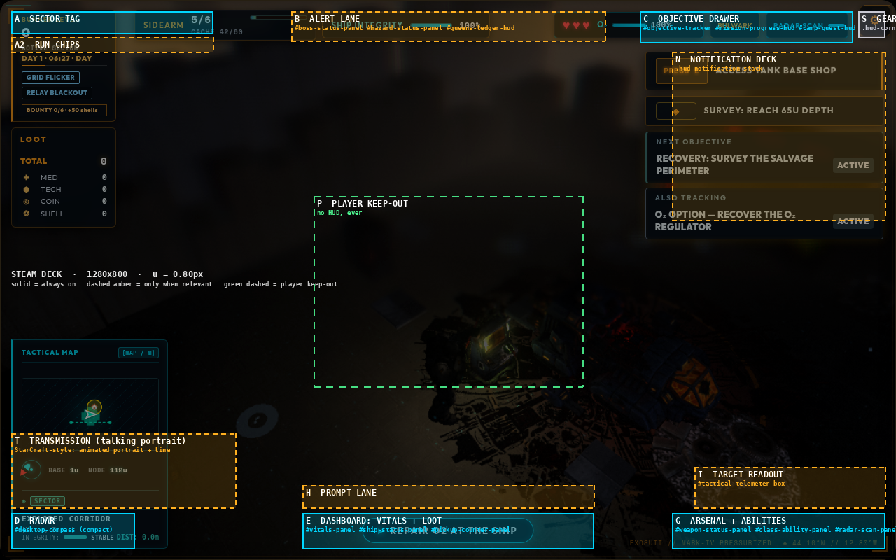
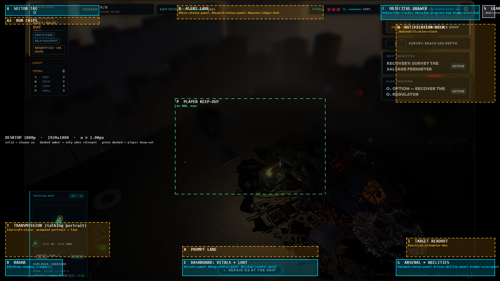

# HUD Lower Dock — Layout Plan (expanded)

> Expands the Gemini draft `ui_redesign_layout_plan.md` (2026-09-25, Antigravity brain
> `6b5e702e…`). The owner likes the **lower dock** direction
> (`ui_concept_lower_dock_1790353433507.jpg`) and asked for **templates that are not as
> big**, laid out on the **real gameplay**. This version:
> - checks every element against the live DOM;
> - fixes the draft's errors;
> - sizes every zone from one rule that works on Deck, 1080p and the owner's PC;
> - lists the engineering traps this repo has already hit;
> - turns each phase into testable acceptance;
> - makes the HUD **one narrow band**, with the same layout for every class (6.8 % of
>   the Deck screen always on, down from 24.3 %);
> - makes the band's **housing the class flavour and the reactive element** (§4A):
>   cracks, dents, sparks, blood splats that dry after a fight, a console that freezes
>   up, frost, fog, and wear over time;
> - adds **StarCraft-style talking portraits** for the operators and NPCs, rendered in
>   Blender with one portrait light rig and composited on shared backgrounds (§4B);
> - adds **event housings** for transformations such as the Act 2 infection track and
>   for other characters (§4C).

---

## 0. Goals, non-goals, success measures

**Goals**
1. Put the numbers you read in a fight (hearts, O₂, ammo, ability readiness) in one low
   band near the operator. Today they sit in three different screen edges.
2. Keep the upper and centre screen clear for corridors, enemies and lighting, which
   the restored post-processing and suit-light shadows now show off.
3. Show things only when they matter: boss bar, hazards, prompts, notifications and
   run chips appear on demand instead of holding space permanently.
4. Work equally on **Steam Deck 1280×800 handheld**, **1080p**, and the **owner's
   2304×1440 @125%** PC, with controller glyphs on Deck and rebindable keys on PC.

**Non-goals (this plan)**
- Menus, Armory, Foundry, terminal modal and the full-screen tactical map `[M]` are out
  of scope. The unified Foundry hub is its own plan.
- No new gameplay information, except a co-op teammate chip, which is an open decision
  in §9.

**Success measures** (all checked by the Phase 0 layout spec, §7)

| Measure | Today (measured) | Target |
| :--- | ---: | ---: |
| Screen covered by always-on HUD, Deck 1280×800 | **24.3 %** (11 boxes, from the Deck capture) | **≤ 7 %** |
| Same, 1080p | ~17 % (estimated) | **≤ 6 %** |
| HUD inside the player keep-out (centre 30 % × 34 %) | 0 | 0 |
| Overlapping HUD boxes at any supported resolution | several on Deck (objective stack vs prompt card) | 0 |
| Smallest HUD text on Deck | 9 px (bounty chip) | ≥ 11 px |
| Per-frame layout (style/layout) cost added by the HUD | — | ≤ 0.3 ms on Deck; no `backdrop-filter` over the canvas |

---

## 1. Corrections to the draft

| Draft said | Reality in the code | Consequence |
| :--- | :--- | :--- |
| Class ability is `[SPACE]` | Ability is **F**; **Space is dash** (`DEFAULT_KEY_BINDINGS`, `main.js` / `threeGame.js`). All keys are **rebindable** (`hunker_key_bindings`). | Tiles must render the live binding, and on Deck the controller glyph (`getControllerGlyphLabel`, `src/inputGlyphs.js`). No hard-coded key text. |
| Objectives live in `#camp-quests-hud` | No such element. Objectives are split across `#objective-tracker`, `#mission-progress-hud`, `#camp-quest-hud` and `#loop-step-hud`, plus PRESS-E prompts, all in `.hud-mission-stack`. | The drawer must merge four sources, not move one element. |
| "Auto-collapses during combat" | `this.inCombat` is read in `threeGame.js` but **never assigned**. There is no combat signal. | Phase 6 defines one (§4, zone C). |
| Frosted-glass dock (`backdrop-filter`) | `backdrop-filter` over the WebGL canvas costs GPU every frame on Deck. It also **re-anchors `position: fixed` descendants** (see the "one slot, every screen" block in `style.css`). | Use gradient or solid glass panels. `backdrop-filter` is banned on the dock container. |
| Bottom-centre console at 430×86 | `#loop-step-hud` ("▶ REPAIR O2 AT THE SHIP") already occupies bottom-centre. | A new **Prompt Lane (H)** above the console takes it. |
| HUD elements listed: ~10 | The gameplay HUD has **~30** parts: hazard banner, Queen's Ledger chip, boss bar, 12 `*-hud-prompt`s, radio and tutorial cards, telemeter box, run cards, bounty/event chips, fatigue and cover rows, visor brackets, crosshair, damage vignette. | Full matrix in §5. Nothing is left without a home. |
| Headings numbered "6" twice; Decision 1 names concepts A/B that no longer match the slim/cockpit/split carousel | — | Decisions restated in §9. |

---

## 2. Layout system

### 2.1 One unit, every resolution

All sizes are in **HUD units**:

```css
:root {
  /* 1u = 1px at 1920×1080. Floor 0.8 keeps Deck text legible (plain scaling
     would give 0.67); cap 1.3 stops the HUD ballooning on 1440p+/4K. */
  --hud-u: clamp(0.8px, min(100vw / 1920, 100vh / 1080), 1.3px);
  --hud-scale: 1;             /* user setting, §6.3 */
  --u: calc(var(--hud-u) * var(--hud-scale));
  --hud-margin: calc(20 * var(--u));
}
```

| Screen | u | Notes |
| :--- | ---: | :--- |
| Steam Deck 1280×800 | 0.80 | floor applies |
| 1920×1080 | 1.00 | reference |
| Owner's PC 2304×1440 CSS px (@125 %) | 1.20 | |
| 2560×1440 | 1.30 | cap |
| 3440×1440 ultrawide | 1.30 | the dock stays centred; wings pin to the safe edges |

### 2.2 Zones (computed, not hand-placed)

Every box below comes from one spec script, `docs/planning/assets/hud-lower-dock/hud_zones.py` (kept with the plan
assets). It renders the overlays in §3 from real captures, so the numbers and
pictures cannot drift apart.

| Zone | Name | Size (u) | Anchor | Kind | Deck px (u = 0.8) | 1080p px |
| :--- | :--- | :--- | :--- | :--- | :--- | :--- |
| **A** | Sector tag | 360 × 40 | top-left | always on | 288×32 @ 16,16 | 360×40 @ 20,20 |
| **A2** | Run chips (run cards, bounty, event) | 360 × 26 | under A | when present | 288×21 @ 16,53 | 360×26 @ 20,66 |
| **B** | Alert lane (boss, hazard, Queen's Ledger) | 560 × 52 | top-centre | only when relevant | 448×42 @ 416,16 | 560×52 @ 680,20 |
| **C** | Objective drawer (collapsed) | 380 × 56 | top-right, left of gear | always on, 1 line | 304×45 @ 914,16 | 380×56 @ 1462,20 |
| **N** | Notification deck (radio, tutorial) | 380 × ≤300 | under C | only when relevant | 304×240 @ 960,74 | 380×300 @ 1520,92 |
| **S** | Settings gear | 48 × 48 | fixed corner slot | unchanged | 38×38 @ 1226,16 | 48×48 @ 1852,20 |
| **D** | Radar (compact) | 220 × 64 | band, left | always on | 176×51 @ 16,733 | 220×64 @ 20,996 |
| **E** | Dashboard: hearts, O₂, hull, loot | 520 × 64 | band, centre | always on | 416×51 @ 432,733 | 520×64 @ 700,996 |
| **G** | Arsenal + abilities | 380 × 64 | band, right | always on | 304×51 @ 960,733 | 380×64 @ 1520,996 |
| **H** | Prompt lane (loop step, PRESS-E, world prompts) | 520 × 40 | above E | only when relevant | 416×32 @ 432,693 | 520×40 @ 700,946 |
| **I** | Target readout (telemeter) | 340 × 72 | above G | on hover/aim | 272×58 @ 992,667 | 340×72 @ 1560,914 |
| **T** | Transmission: animated talking portrait + line (§4B) | 400 × 132 | above D | only while someone talks | 320×106 @ 16,619 | 400×132 @ 20,854 |
| **P** | Player keep-out | 30 % × 34 % of screen | centre, y = 52 % | **no HUD ever** | 384×272 @ 448,280 | 576×367 @ 672,378 |

**One narrow band.** D, E and G are the same 64 u height: 51 px on the Deck (6.4 % of
the screen height), 64 px at 1080p. Loot folds into the dashboard. Everything above
the band appears only when needed.

Always-on coverage: **6.8 %** (Deck), **5.3 %** (1080p), down from 24.3 % today. No
zone overlaps another or the keep-out at either resolution.

**Same layout for every class.** Every class uses the identical geometry and the same
instrument positions. The class sets only the **skin**: `data-class` on the band swaps
the housing art (§4A). Muscle memory carries between classes and co-op partners.

### 2.3 Why these positions (not only "Hades does it")

- **The camera frames the operator near screen centre.** So the lower band is
  the shortest eye trip from the character. The top band holds only things you read
  rarely (sector, objective) or that interrupt you on purpose (alerts).
- **Tilt-shift/DOF blurs the top and bottom bands.** HUD over blurred,
  low-detail pixels reads cleanly, and the sharp middle stays the play space.
- **Left wing is navigation, right wing is action.** On Deck, the left stick and
  D-pad sit under the left thumb (moving, map on D-pad up); the face buttons and
  triggers are on the right (fire, reload, ability, dash). Each wing mirrors the
  hand that uses it.
- **One band, nothing stacked on it permanently.** The band never grows. Prompts,
  the target readout and transmissions rise above it only while they matter, then
  go away, so the lower corridors stay visible.

### 2.4 Benchmarks (from the draft)

| Game archetype | Layout paradigm | What makes it work |
| :--- | :--- | :--- |
| **Hades / Hades II** | Lower dual corners | Health and boons bottom-left, weapons and calls bottom-right; the top ~85 % stays clear for combat. |
| **StarCraft / C&C / Frostpunk** | Unified command dock | One grounded console consolidates minimap, telemetry, actions and resources; eye scanning follows one horizontal line. |
| **Dead Space / Alien: Isolation** | Diegetic suit telemetry | Readings feel built into the suit or visor, not floating web cards. This is why the dock reuses the visor brackets. |
| **Helldivers 2 / Risk of Rain 2** | Minimal floating ribbons | Combat info sits low or near the reticle; meta info collapses into one-line breadcrumbs, as zones A and C do here. |

---

## 3. The layout on the real game

Overlays are drawn on the Gemini captures at native size. Solid = always on;
dashed amber = only when relevant; dashed green = player keep-out.





Concept references (look only, not layout authority):
- Slim ribbon: `ui_concept_slim_dock_1790353835137.jpg`. This is the direction to
  build: thin frames, open centre.
- Cockpit console: `ui_concept_lower_dock_1790353433507.jpg`. The owner's favourite
  look. Borrow its **visual language** at slim size: the bracketed tech frame,
  cyan hearts, curved O₂ arc, orange arsenal accent, and the ammo-over-reload-arc
  treatment. Drop the armoured bezel height.
- Split wings: `ui_concept_split_wings_1790353615005.jpg`.

**Recommended look: "slim cockpit".** Zone sizes as in §2.2. The three modules
keep the cockpit concept's structure: radar module, exosuit dashboard and weapon
dock, joined by struts. The housing around them is the **class-bespoke,
reactive element** (§4A), slimmed to the zone sizes, not the concept's full-height
bezel. The instruments inside are shared across classes: the concept's hearts row,
curved O₂ arc, hull line, orange weapon silhouette, large tabular ammo and reload arc.
The `.hud-visor-bracket` corners stay as the screen-level frame.

**Template comparison (from the draft, sizes updated to the computed spec)**

| Design parameter | Cockpit console (owner's favourite look) | Slim cockpit (recommended) |
| :--- | :--- | :--- |
| Bottom band height at 1080p | ~180 px (16.6 %) | **one 64 u band (5.9 %); 5.3 % total always-on coverage** |
| Bezel | Heavy armoured casing | **Hairline frame + visor corner brackets, gradient glass (no `backdrop-filter`)** |
| Centre | Console bulk over the floor | **Dashboard 520 u wide in a 64 u band; prompts only when needed** |
| Steam Deck 1280×800 | Tight vertical fit | **51 px band; 6.8 % always-on coverage; 0.8 u floor keeps text ≥ 11 px** |
| Feel | Simulation / immersion | **Action-roguelike readability, cockpit styling kept** |

---

## 4. Zone specifications

States used below: **Idle** (exploring), **Engaged** (combat signal on, see C),
**Critical** (heart ≤ 1, O₂ ≤ 25 %, hull ≤ 25 %, or hazard active).

**A — Sector tag.** One line: `SECTOR 09 · DAY 1 · 06:21 · DAY`, built from
`.level-indicator`: level, `#biome-label`, `#campaign-day-indicator`, and the
cycle track as a 2u underline. The biome name crossfades on change. The
`EXOSUIT // MARK-IV` visor telemetry moves here as a hover tooltip; its current
spot collides with G.

**A2 — Run chips.** `#hud-run-cards`, `#hud-bounty-chip` and `#hud-event-chip` in
one horizontal row that wraps to 2 lines at most. When there are no chips there is
no row, and A2 takes no space.

**B — Alert lane.** One banner at a time, by priority:
1. Boss: `#boss-status-panel`, name and HP bar.
2. Hazard: `#hazard-status-panel`, with its countdown.
3. Queen's Ledger: `#queens-ledger-hud`, Act 2 and later only.

A lower-priority item waits and shows when the higher one clears. Entry is a 180 ms
slide-down (transform only); exit is a fade. Critical hazards pulse the border
only, not the text.

**C — Objective drawer.**
- Collapsed: the single primary objective, with a small counter showing more
  (`+2`).
- Sources, in priority order: the `#objective-tracker` primary, then
  `#mission-progress-hud`, then `#camp-quest-hud`.
- Expanded: up to 3 rows. Expand with a PC click, or with the **tactical map open**
  on Deck (the map already has focus; no new binding). The drawer never becomes a
  focus root (§6.2).
- Auto-collapse when Engaged. The **combat signal**, new in Phase 6, is on when any
  of these happened in the last 4 s:
  - an enemy targeted the player (`canEnemyTargetPlayer` true while aggroed);
  - the player took damage;
  - the player fired at a hostile.

  It clears after 4 s quiet. Assign it to `this.inCombat`, which existing callers
  already read and currently always get `false`.

**N — Notification deck.** The existing `.hud-notification-stack` card deck
(`updateHudNotificationDeck`, priority sort, `--deck-index`) keeps its logic, anchored
under C. The `.hud-mission-stack` it pushes down (`is-below-notifications`) goes away
as a right-side column; its children move to C and H.

**S — Settings gear.** It keeps its fixed corner slot (`--corner-settings-*`). The
dock must never contain it (§6.1).

**D — Radar (compact).** `#desktop-compass` becomes a 56 u radar disc with the
direction arrow and radar blips (`#hud-blueprint-canvas` drawn round), plus base
distance and node distance as two short readouts beside it and the `[M]` / D-pad-up
glyph. `#hud-map-info` (sector, coordinates, integrity) moves to the full map `[M]`;
its 3 lines are the main reason today's map panel is 300 px tall on Deck.

**E — Dashboard (vitals + loot).**
- Left two-thirds:
  - Hearts row (`#vitals-hearts`): holds 1–6 hearts without resizing; PvP uses the
    4-heart contract.
  - The O₂ bar (`#vitals-o2-bar`, `#vitals-o2-pct`), with hull (`#ship-status-panel`)
    as a thin line under it.
- Right third: loot as a 2 × 2 chip grid: `✚ MED · ⬢ TECH · ◎ COIN · ✪ SHELL`
  (`#pickup-count-*`, `renderShellCounter`).
  - Chips sit at **60 % opacity when idle** and pulse to 100 % for 300 ms on a gain.
  - The TOTAL line is dropped; it only duplicates the sum.
- Fatigue (`#vitals-fatigue-row`) and cover (`#vitals-cover-row`) appear only when
  non-nominal, as a small tag.
- Critical: the affected meter pulses (opacity); `#damage-vignette-layer` stays the
  screen-level cue.
- The status lamps (§4A) sit in the housing bezel.

**G — Arsenal + abilities.**
- Weapon silhouette and name, big tabular `06 / 18`, cache under it.
- `#weapon-reload-bar` as a thin arc under the ammo.
- Two ability tiles with their live key/glyph: class ability (`#class-ability-panel`,
  F / Deck glyph) and radar scan (`#radar-scan-panel`, Q / Deck glyph).
- Cooldown sweeps use a conic-gradient pseudo-element (no layout).

**T — Transmission.** A StarCraft-style talking-head window that slides up above the
radar whenever someone speaks during play: radio, suit barks, the Mothership, NPCs on
comms. It shows the speaker's animated portrait (§4B), their name, and the current
line typing out, then slides away 1.5 s after the line ends. Only one is on screen at
a time; queued lines wait. It replaces the radio cards' portrait-less text in N.

**H — Prompt lane.** One line at a time, by priority:
1. Interaction prompt: `PRESS E / Ⓐ ACCESS TANK BASE SHOP`, from the 12
   `*-hud-prompt` elements (biome, lore, console, O₂ generator, turret, foundry,
   scientist, Mayor Tina, black box, hole, mouse-look, telemeter action).
2. Loop-step guidance: `#loop-step-hud`, "▶ REPAIR O2 AT THE SHIP".
3. Tutorial prompt: `#tutorial-prompt`, when not carded into N.

It sits straight under the player's feet, the shortest trip from the character.

**G — Arsenal + abilities.**
- Weapon silhouette and name, big tabular `06 / 18`, with the cache underneath.
- Reload arc: `#weapon-reload-bar` restyled as an arc.
- Two ability tiles, each with its live key/glyph:
  - Class ability (`#class-ability-panel`, F / Deck glyph).
  - Radar scan (`#radar-scan-panel`, Q / Deck glyph).
- Tiles show a cooldown sweep (conic-gradient on a pseudo-element, transform-free).

**I — Target readout.** `#tactical-telemeter-box` (name, type tag, integrity,
coordinates), anchored above G. It shows only while aiming at something and hides
in 150 ms.

**Unchanged:**
- `#gameplay-crosshair`, `#damage-vignette-layer`.
- In-world nameplates (co-op/PvP), killstreak/XP popups (near the operator,
  outside the keep-out).
- The full-screen tactical map `[M]`.

---

## 4A. The living class housing (the DOOM-face idea, redone for a camera above)

Owner, 2026-09-25: take the cockpit concept
(`ui_concept_lower_dock_1790353433507.jpg`: radar module, exosuit dashboard, weapon
dock, joined by armoured struts) and make **its background, the physical housing
itself, the reactive element, bespoke to each class.** The camera looks down on the
operator, so during play the suit's condition shows on the **hardware the player looks
through**, not on a face in the HUD. Faces live in the transmission window and in
conversations (§4B).

**Same layout, different flavour:** the band's geometry is identical for every class
(§2.2). A class changes only the housing art and its small signature details.

### One housing per class

The housing is the metal and glass around the three modules (D, E, G). Everything
drawn inside it (hearts, O₂ arc, ammo, radar) stays the same readable instrument
set for every class. Only the housing changes.

| | SCOUT: recon rig | TANK: bulwark plate | ENGINEER: field bench |
| :--- | :--- | :--- | :--- |
| Silhouette | Thin angular carbon frame; sensor fins and a small antenna mast on the radar module; the lightest struts | Thick riveted armour slabs, hazard chevrons, hydraulic pistons as struts, heavy corner bolts | Open chassis with exposed circuit boards, cable looms, clamp brackets and a tool rail along the struts |
| Material | matte composite, stealth-dark | scuffed gunmetal, painted edges | brushed alloy, green PCB, copper |
| Accent | cyan (radar-forward: the radar module is the largest) | amber (armour-forward: the dashboard is the largest) | green (tool-forward: the weapon/ability dock carries a turret/fabricator status strip) |
| Signature detail | antenna sweep LED ticks with the radar scan cooldown | shield-emitter ring around the hearts glows with Bulwark | turret status lamps on the right strut (one per deployed turret) |

Sizes stay the §2.2 zones. The housing is a 9-slice frame plus a few fixed
decorations (fins, pistons, clamps) that sit **in the margin between modules**,
never over numbers.

### The housing reacts (overlays stack; they heal and accumulate)

| Game signal (already in the code) | SCOUT | TANK | ENGINEER | Shared |
| :--- | :--- | :--- | :--- | :--- |
| **Blood after a fight** (`player-damaged` during combat; enemy type from `reason`) | splatter decals land on the housing glass and metal with each hit taken: ~8 splat shapes, random placement in the housing margins, never over instruments. Colour follows the attacker: red for human, acid green for alien and hive, blue-grey ichor for snails. They **dry and darken** over ~30 s once combat ends, stay for the rest of the expedition, and are wiped at the bunker or by a heal station. | | | a real "after the fight" record on the console |
| **Console freezing** (cryo biome, `player-cold-exposed`, freeze stacks; `STATUS_IDS.FREEZE` at threshold) | ice crust grows across the glass from the edges; at a full freeze the band **locks up**: needles stick and the backlight stutters for the freeze duration, then cracks free. The numbers stay readable through the ice. | | | pairs with the shared frost overlay below |
| Hearts lost (`player-damaged` hp / maxHp), 3 tiers | glass panels **crack**, then shatter | armour **dents and gouges**, a slab hangs loose | boards **spark**, a cable arcs, one gauge dies | persists until healed; a heal plays a 400 ms repair (seal, hammer-flat, re-solder) |
| Hit direction (**new**: `sourceX/sourceZ` on `player-damaged`) | the module on the side facing the hit flashes and jolts for 600 ms: the DOOM "glance", as the hardware flinching toward the threat | same | same | screen-relative left / centre / right from the camera |
| Cold (`player-cold-exposed`, freeze stacks) | frost creeps from the corners in every class; coverage follows exposure / stacks | | | thaws when warm |
| Low O₂ (< 25 %, `distress-mode`) | the dashboard glass fogs; its warning lamp strobes | | | O₂ arc red |
| Toxin / caustic / bio (`player-poisoned`, `STATUS_IDS`) | stains spread across the housing and drip down the struts | | | |
| Corrosion (`STATUS_IDS.CORROSION`) | pitting and rust bloom on bare metal (heaviest on TANK's plate) | | | |
| Relay blackout / grid flicker run cards | scan-line static and a flickering backlight | | | CSS only |
| Fatigue stage (`fatigue.js`, across expeditions) | grime, scuffs and tape repairs build up; a rest resets them | | | the suit ages over the campaign |
| Boss fight visible | beacon lamps on the struts rotate red | | | |
| Kill streak | accent-colour pulse runs along the struts | | | 1 s |
| Night | backlights dim to night-cyan | | | |
| Dead | backlights die module by module, left to right; cracks max out | | | final |

**Status lamps: the at-a-glance mood during play.** Each housing carries a short row
of physical indicator lamps on the dashboard bezel (visible top-left of the concept's
centre module): SUIT, O₂, HULL, THERMAL, TOX. They are the at-a-glance mood of the
suit.
- green: nominal
- amber: warning
- red: critical
- blinking: getting worse

It is the same one-look read DOOM's face gives, built into the console, so the
narrow band doesn't need a portrait slot.

### Art list

| Asset | Count | Format | Notes |
| :--- | ---: | :--- | :--- |
| Housing 9-slice per module (D, E, G) + strut pieces | 3 modules + 2 struts, × 3 classes | WebP, ≤ 512 px long edge | from the concept, slimmed to §2.2; class material/shape per the table |
| Class decorations (fins, pistons, clamps, lamps) | ~4 per class | WebP alpha | margin-only placement |
| Damage tiers | 3 × 3 classes | WebP alpha | crack (SCOUT), dent (TANK), spark/burn (ENGINEER) |
| Blood splats | ~8 shapes (shared) | WebP alpha, greyscale | tinted per attacker in CSS; a "dry" variant via filter-free overlay darkening |
| Ice crust + freeze lock | 2 (shared) | WebP alpha | the lock-up is CSS (stutter + stuck needles) |
| Shared condition overlays | frost, fog, toxin, corrosion, grime | WebP alpha, tileable edges | intensity via CSS mask position, not per-level art |
| Status lamp sprites | 1 small sheet | WebP | 3 colours × 2 blink frames |

Budget **≤ 4 MB** total, one request per class, preloaded with the HUD.

**Consistency.** Model the housings in Blender and render them orthographically, one
per class, so the metal, bolts and lighting match across modules and classes. Author
the damage tiers as material/geometry variants of the same model (dents, cracked
glass, burnt boards), not as separate paintings. This avoids the drift that sank the
2D sprite pipeline.

### How it runs (no per-frame cost)

- Overlay intensity uses CSS custom properties (`--frost`, `--damage-tier`, `--grime`,
  `--toxin`), written **only when the signal changes** and at most 4 Hz for
  continuous values.
- The hit-direction jolt is a `transform` on one module's housing layer.
- Lamps are class toggles.
- Nothing touches layout. There is no `filter` or `backdrop-filter` on panel roots
  (§6.1, §6.5).
- Overlays never cover numbers: the instrument layer sits above the housing layer.
- With reduced motion or contrast `max`, overlays cap at 40 % opacity and the jolt
  becomes a lamp flash.
- `src/suitCondition.js` (pure, unit-tested): signals in, `{ damageTier, overlays,
  lamps, jolt }` out. `main.js` only applies classes and properties.

---

## 4B. Talking portraits for everyone: StarCraft-style, rendered in Blender

Owner, 2026-09-25: faces **do** belong in conversations and transmissions: rendered in
Blender with a portrait light setup, keyed onto backgrounds each character shares
with others, and **idle-animated like StarCraft unit portraits**, talking when they
speak. This covers the operators and every NPC.

### Who gets one

| Character group | Source model (already in `public/3d`) | Today |
| :--- | :--- | :--- |
| Operators: SCOUT, TANK, ENGINEER | `scouting-scout/Scout.game.glb`, `runtime/tank-rigged.glb`, `runtime/engineer-rigged-gestures.glb`, plus chassis skins (`new3ds/chassis_*`, `skin_*`) | `OPERATOR LINK` lines borrow `survivor_01/02/03.webp` |
| Named NPCs | `new3ds/npc_nahl`, `npc_alien_rhun`, `npc_alien_vey`, `npc_kaelen`, `npc_martha`, `npc_queen`, `npc_aria`, `npc_val`, `npc_civilian_miner`, `npc_civilian_researcher` | static `lore_portraits/*` |
| Boss / transformed forms | `runtime/queen.glb`, `new3ds/boss_corrupted_martha.glb` | static |
| Characters without a model (Mayor Tina, announcer, AURA, Briggs, …) | none | keep the painted portrait with a slow parallax + scan-line idle until a model exists |

### The Blender portrait rig (one rig for every character)

- **Camera:** head-and-shoulders framing, 85 mm equivalent, eye line at the upper
  third, 3/4 turn toward camera-left, fixed for everyone so portraits line up.
- **Light:** 3-point portrait setup.
  - Key: soft box 45° up-left, warm-neutral.
  - Fill: low, cool, ~½ stop under the key.
  - **Rim/accent:** from behind, tinted with the character's colour (SCOUT cyan, TANK
    amber, ENGINEER green; NPC accents set per character).
  - A faint visor/eye emissive where the model has one.
- **Background:** render on a **transparent film** (Blender's clean equivalent of a
  greenscreen: no spill or keying edges). If a render must be keyed, use a
  #00FF00 world with the rim light gelled to stop green spill. Composite in the
  browser over shared **background sets**: mothership bridge, bunker ops, camp
  shanty, hive cavern, cockpit/visor interior, comms static. Characters share sets;
  each has a default.
- **Scripted:** `tools/blender/render_portraits.py` loads a GLB, applies the rig and
  renders every clip. Adding a character is one config entry. It can be driven
  through the Blender MCP bridge used elsewhere in this project.

### Animation clips (StarCraft portrait behaviour)

| Clip | Length | Content |
| :--- | :--- | :--- |
| `idle` (loop) | 4–6 s | breathing, blinks where there are eyes, small head drift, occasional glance or visor flicker; different each loop through 2–3 variants |
| `talk` (loop) | 2 s | jaw/mouth open–close (a shape key added in Blender where the GLB has none), head emphasis; helmeted operators pulse visor voice-bars instead |
| `react` (one-shot) | 0.6–1 s | a flinch for hurt, a look-over for surprise; optional per character |
| operator variants | as needed | `idle` / `talk` re-rendered with frost, damage and infection looks for the §4C stages |

The talk clip plays while a line types out (driven by the existing typing loop, no
audio analysis), then returns to idle.

**Format:** WebM VP9 **with alpha** (Electron/Chromium plays it natively), 256 px for
the HUD window T and 512 px for conversations, ~150–400 KB per clip. Only one or two
portraits play at once. Clips load lazily per conversation and cache after. A
WebP sprite-strip fallback covers any build without VP9 alpha.

### Where portraits play

- **T transmission window** (HUD, during play): radio, Mothership, suit barks, NPCs
  on comms.
- **Conversations:** `dialogue.js` speaker cards, NPC dialogue trees, camp-leader
  talks, encounters. Both sides can show: the NPC and the player's operator.
- **Results / death report:** the operator's final clip (a hurt idle, or a relieved
  idle on extraction).
- **Hero select, lobby roster, co-op:** operator idle loops.

The HUD condition (blood, frost, infection) is composited over the operator's
portrait frame in CSS, so the portrait matches the console.

`getDialogueSpeaker()` returns `{ name, portrait: { clipSet, background, accent } }`
from one `portraitCatalog.js` registry instead of hard-coded image paths. The
registry is the single place a character's clips, set and accent live.

---

## 4C. Unique events: transformations and other characters

The band's layout never changes, but its **whole housing can be replaced** by an
event skin when the operator becomes something else.

| Event (existing state) | Housing | Portrait |
| :--- | :--- | :--- |
| Act 2 infection `latent` (`ACT2_INFECTION_STAGES`) | faint vein pattern under the glass, visible only at low light | none yet |
| `strained` | veins pulse with the heartbeat, one lamp flickers violet | occasional glitch frame |
| `symptomatic` | chitin growths bud from the struts, glass clouds amber, blood splats turn ichor-green | operator portrait shows the infection (new render) |
| `outed` | human camp tags scrawled on the housing: "INFECTED" stencil, hazard tape | same |
| `ascendant` | **full alien housing**: the console is overgrown and organic; hearts render as pulsing organs, O₂ as a spiracle gauge, ammo as a bio-sac. Numbers stay in the same place and stay legible. | alien form clips |
| `cured` | biomass burned off; permanent scorch and scar marks remain on the housing | scarred operator render |
| Playing another character (a future playable NPC, possession, a boss form) | that character's housing set in the same layout (e.g. the Queen's throne chitin) | that character's clips |
| Boss arena, EMP, relay blackout | temporary skins (red-alert strut beacons, EMP dead-glass, static) | — |

Skins are data: `housingSkins.js` maps an event id to its asset set and fallbacks.
`suitCondition` picks the active skin by priority (transformation > event >
class). Each event swaps assets and CSS custom properties only, with no layout change,
so all the §7 layout tests still hold.

---

## 5. Complete migration matrix

| Current element(s) | Today | New zone | Change |
| :--- | :--- | :--- | :--- |
| `.level-indicator` (`#level-num`, `#biome-label`, `#campaign-day-indicator`, cycle track) | top-left box, ~160 px tall on Deck | **A** | one line |
| `#hud-run-cards`, `#hud-bounty-chip`, `#hud-event-chip` | inside the top-left box | **A2** | own row, collapses to 0 |
| `#pickup-counter-panel` (+ `#pickup-count-*`) | left, 5-line box | **E** (right third) | 2 × 2 chips, idle-dim |
| `#desktop-compass` (+ canvas, arrows, distances) | bottom-left, 300 px tall on Deck | **D** | compact 64 u radar |
| `#hud-map-info` | inside the map panel | full map `[M]` | removed from the band |
| `#weapon-status-panel` (clip, cache, reload) | top-centre pill | **G** | big ammo, reload arc |
| `#class-ability-panel`, `#radar-scan-panel` | top-right pills | **G** | tiles with live glyphs |
| `#vitals-panel` (hearts, O₂, fatigue, cover) | top-right pill | **E** | rows; fatigue/cover conditional |
| `#ship-status-panel` | top-centre pill | **E** | thin hull line |
| `#hazard-status-panel` | inside the top pill row | **B** | priority 2 |
| `#queens-ledger-hud` | inside the top pill row | **B** | priority 3 |
| `#boss-status-panel` | floating top | **B** | priority 1 |
| `#objective-tracker`, `#mission-progress-hud`, `#camp-quest-hud` | right column, up to 4 cards | **C** | one line + drawer |
| `#loop-step-hud` | bottom-centre pill | **H** | priority 2 |
| 12 × `*-hud-prompt`, `#telemeter-action-prompt` | right mission stack | **H** | priority 1 |
| `#tutorial-prompt` (cloned cards) | right notification deck | **N** | unchanged logic |
| `#radio-transmission-prompt`, suit barks, Mothership comms | text cards / "> BUNKER:" lines | **T** | animated talking portrait + line |
| `#tactical-telemeter-box` | varies | **I** | anchored above G |
| `.hud-corner-settings` | fixed top-right slot | **S** | unchanged |
| `.hud-visor-bracket` ×4, `.hud-visor-telemetry` | screen corners | brackets stay; telemetry → A tooltip | frees G's corner |
| `#npc-story-tracker` | story overlay | unchanged | out of scope |
| `#gameplay-crosshair`, `#damage-vignette-layer` | — | unchanged | — |
| co-op teammate status | none (nameplates only) | **E** side tab (optional) | decision §9 |

---

## 6. Engineering constraints (traps this repo has already hit)

### 6.1 Fixed-position anchoring
`position: fixed` resolves against the nearest ancestor with `transform`, `filter`,
`backdrop-filter`, `contain: layout/paint` or `container-type`, not the viewport.
The gear slot and advance slot drifted this way before (the "one slot, every screen" block in `style.css`).

**Rules:**
- The dock root has none of those properties.
- Animations use `transform` on the **leaf** panel only.
- The gear and any fixed element stay outside the dock.

### 6.2 Steam Input action set
`syncSteamInputPhase()` pins the Deck to the **menu** action set whenever a
`MENU_FOCUS_ROOT_IDS` surface looks open. An always-mounted element that hides with
CSS instead of `.hidden` kills all native Deck input
(fixed 2026-08-27; guarded by `tests/e2e/steam-input-action-set.spec.js`).

**Rule:** nothing in the dock is ever added to `MENU_FOCUS_ROOT_IDS`. The objective
drawer's expanded state is display-only. Run `tests/e2e/steam-input-action-set.spec.js`
after every phase.

### 6.3 Accessibility
- Honour the existing `hb_contrast` levels (`normal`, `high`, `max`). At high and max,
  panel fills go opaque and hairlines double.
- Honour subtitle size for prompt text in H.
- Add a **HUD Scale** setting (`hb_hud_scale`: 0.85 / 1 / 1.15 / 1.3) feeding
  `--hud-scale`. Deck players on a 7" screen will want 1.15.
- Keep `aria-live` on the elements that have it today: vitals, abilities, hazard
  (`assertive`), bounty.
- Reduced motion: no pulses or slides, only opacity steps. Hook this to the
  existing reduced-pressure/camera-shake family or `prefers-reduced-motion`.

### 6.4 Localisation
Every new or moved label uses `data-i18n` keys in all **7 locales**. Run
`npm run i18n:audit` as a ratchet: it must stay at 0 unlocalised
(the i18n audit ratchet). Short-form labels ("HULL", "O₂") need their own keys,
not truncated long ones. German and Russian run ~35 % longer, so size text boxes
with `min-width`, not fixed width, and test them.

### 6.5 Performance (after the 2026-09-25 quality restore)
- **No `backdrop-filter`** over the WebGL canvas. Use a gradient fill such as
  `linear-gradient(rgba(6,12,18,.78), rgba(6,12,18,.62))`.
- Animate only `transform` and `opacity`. Never animate `width` on bars; use
  `transform: scaleX()`, which the reload bar already can.
- Write text only when the value changes (compare before assigning `textContent`),
  and at most once per frame for per-frame values such as O₂ %. The HUD must not add
  style or layout work to frames that are already CPU-bound
  ([perf report](../reports/perf-quality-restore-2026-09-25.md)).
- Budget: HUD style + layout ≤ 0.3 ms per frame on Deck. Measure with the
  `gameplay-cpu` probe (`tests/e2e/probes/gameplay-cpu.spec.js`).

### 6.6 Controller glyphs and bindings
Key hints come from `state.settings.keyBindings`, and on Deck from
`getControllerGlyphLabel(action, primaryControllerType)`. Refresh them when the
input mode changes (`refreshInteractivePromptKeys` already exists).

---

## 7. Phasing (each phase shippable, behind one flag)

Ship behind `hb_hud_layout = 'dock' | 'classic'` (default `classic` until Phase 5
passes). One-click comparison, instant rollback.

| Phase | Scope | Files | Acceptance |
| :--- | :--- | :--- | :--- |
| **0. Measure first** | Playwright layout spec: boot to gameplay at 1280×800, 1920×1080, 2304×1440, 3440×1440. Collect every HUD element's rect. Assert inside the safe margin, no overlaps, nothing in the keep-out, coverage ≤ budget. Save screenshots. Baseline today's numbers in the report. | `tests/e2e/hud-layout.spec.js` (new), `scripts/hud_zones.py` (moved from assets) | Runs green in `classic` mode with `expectedFailures` for today's overlaps; numbers recorded. |
| **1. Tokens + skeleton** | `--hud-u` / `--u` / `--hud-margin` tokens. Empty `.hud-dock` with left/centre/right wings and a top band, behind the flag. | `src/styles/expeditionHud.css`, `index.html`, `main.js` (flag) | Dock zones match §2.2 within ±2 px at all 4 sizes; gear slot unchanged (existing gear e2e green). |
| **2. E + G** | Move vitals, ship, weapon and both ability tiles; live glyphs; reload arc. | `index.html`, `expeditionHud.css`, `main.js` (render functions keep their IDs) | All existing vitals/weapon/ability tests green; no JS logic changes beyond container lookups; Deck glyph test. |
| **3. D** | Compass into the left wing; map info to expanded state. | same | `[M]` / D-pad-up / click opens the map as today; minimap radar reveal unchanged. |
| **4. Loot + H + T** | Loot chips inside E; transmission window T (static portraits until 6B); prompt lane with the priority queue (interaction > loop step > tutorial). | `main.js` (small `hudPromptLane` module), css | Every `*-hud-prompt` shows in H; only one at a time; `verify_hud_shells` still passes. |
| **5. Top band** | A, A2, B (priority queue), C drawer, N under C. Retire `.hud-mission-stack` as a column. | `main.js`, css | Boss+hazard at once shows boss, then hazard; drawer expands on map-open (Deck) and click (PC); `steam-input-action-set.spec` green. **Flip default to `dock`.** |
| **6. Behaviour** | Combat signal (`this.inCombat`); drawer auto-collapse; loot idle-dim; critical pulses; reduced motion. | `threeGame.js` (signal), `main.js` | Unit tests for the signal (4 s window); visual states captured in the layout spec. |
| **6A. Living class housing** | Class housing skins (same geometry); damage tiers (crack / dent / spark); blood splats that dry; console freeze-lock; shared frost, fog, toxin, corrosion and grime; status lamps; hit-direction jolt (`player-damaged` gains `sourceX/sourceZ`); `suitCondition` module. | `src/suitCondition.js` (+ tests), `main.js`, css, `public/ui/suit/<class>/*` | Unit tests: signal → overlay/lamp/tier; blood dries and clears at the bunker; freeze lock lasts the freeze duration. Layout spec captures Idle / Bloodied / Frozen / Toxic / Critical / Dead for 3 classes with **identical geometry**. HUD ≤ 0.3 ms per frame. |
| **6B. Talking portraits** | Blender rig + `render_portraits.py`; idle/talk clips (WebM alpha) for 3 operators + 10 NPC models; shared background sets; `portraitCatalog.js`; transmission window T; `dialogue.js` speaker cards. | `tools/blender/render_portraits.py`, `src/portraitCatalog.js` (+ tests), `src/dialogue.js`, `main.js` | Every speaker with a model animates (idle, then talk while typing); no operator line uses a stand-in survivor portrait; at most 2 clips decode at once; clips lazy-load. |
| **6C. Event housings** | `housingSkins.js`; Act 2 infection stages → housing + operator renders; `ascendant` alien console; temporary event skins. | `src/housingSkins.js` (+ tests), assets | Each stage renders in the layout spec with unchanged geometry; numbers legible at every stage. |
| **7. Deck, a11y, i18n** | HUD Scale setting; contrast high/max; 7-locale pass with the longest strings; Deck hardware check. | settings UI, locales | `i18n:audit` 0; layout spec green in `de` and `ru`; owner Deck sign-off. |
| **8. Remove classic** | Delete the old layout CSS and the flag after owner sign-off. | css, `main.js` | No dead selectors (grep); bundle CSS smaller. |

---

## 8. Test and review plan

- **Automated each phase:**
  - `npm test`, `npm run lint`, `npm run i18n:audit`;
  - the new `hud-layout.spec.js`;
  - `steam-input-action-set.spec.js`, `controller-focus.spec.js`;
  - the gear/advance-slot specs.
- **Screenshots** for each phase at 4 sizes × 3 states (Idle, Engaged, Critical),
  plus boss, hazard and notification cases, attached to the PR.
- **Performance:** the `gameplay-cpu` probe before/after Phase 2 and Phase 5; the
  HUD's style/layout share must stay ≤ 0.3 ms per frame.
- **Owner hardware pass (Deck + PC):**
  - readability at arm's length on the Deck;
  - hearts, O₂ and ammo readable without looking away from the operator;
  - prompts never hidden;
  - controller glyphs correct;
  - drawer usable on Deck.

---

## 9. Decisions for the owner

1. **Look:** "slim cockpit" (slim-ribbon sizes, with the cockpit concept's frame,
   hearts, O₂ arc and arsenal styling) — **recommended** — or the thinner plain
   ribbon?
2. **Loot chips:** always visible, dimmed when idle and bright on pickup
   (**recommended**), or hidden until a pickup?
3. **Objective drawer on Deck:** expand automatically while the tactical map is open
   (**recommended**, no new button), or give it a button (the View button is free
   in gameplay)?
4. **Co-op teammate chip:** add a small teammate hearts/O₂ tab on the suit console's
   right edge in co-op? Today teammates have only in-world nameplates.
5. **Visor frame:** keep the four corner brackets as the dock's visual language
   (**recommended**) or retire them?
6. **Class housings:** do the directions in §4A (SCOUT recon rig, TANK bulwark plate,
   ENGINEER field bench) match each class? And are the status lamps the right
   at-a-glance readout during play?
7. **Blood:** wipe it at the bunker and at heal stations (**recommended**), or keep it
   for the whole run as a badge?
8. **Portraits (§4B):** start with the 3 operators and the Mothership and camp NPCs
   who talk most (**recommended**), then the rest? And should the portrait rig's
   accent colours follow the class colours as proposed?
9. **Transformations (§4C):** is the `ascendant` alien console the right level of
   takeover, as long as every number stays in place?
10. **Rollout:** ship Phases 1–5 behind the flag for a week of your play before
   making it the default?

---

## 10. Risks

| Risk | Mitigation |
| :--- | :--- |
| Moving elements breaks JS lookups (`#menu .open-settings-btn` happened before) | IDs are kept; only containers change. Phase 2 greps every `getElementById` / `querySelector` for moved IDs. |
| Deck input dies from a focus-root mistake | §6.2 rule + `steam-input-action-set.spec` every phase. |
| Longer locales overflow slim panels | `min-width` sizing; the layout spec runs `de` and `ru`. |
| HUD adds frame time to a CPU-bound game | §6.5 budget, measured by the probe. |
| Several agents edit `main.js` / `expeditionHud.css` at once | Claim phases in the lane table before starting; `git status` first (several agents work this branch). |
