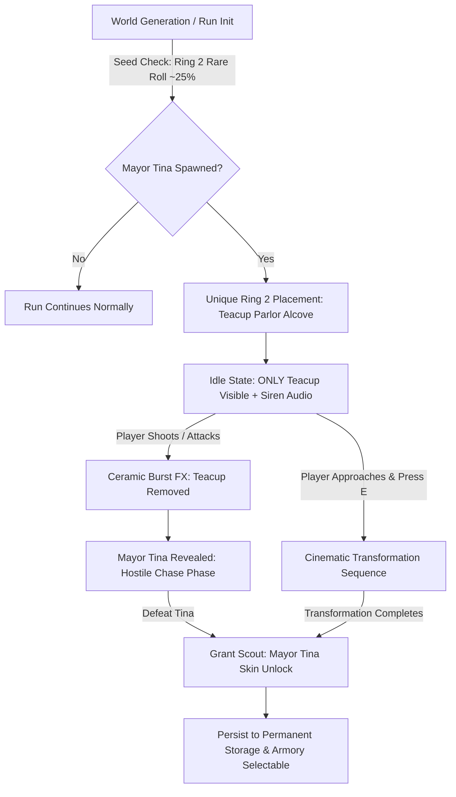

# Mayor Tina Secret Encounter & Unlockable Scout Skin — Implementation Plan

> **Sprint:** Post-Sprint 49 Polish / Secret Encounters  
> **Status:** Completed / Verified  
> **Target Branch:** `dev/sprint-49`  
> **Author:** Antigravity & User  

---

## 1. Overview & Objective

Mayor Tina is an iconic, uncanny secret encounter featuring two user-supplied 3D assets:
1. `teacup-roach.glb`: An ornate porcelain teacup serving as Mayor Tina's lure/bath and siren.
2. `mayor-tina.glb` / `mayor-tina-rigged.glb`: A bespoke character model (already rigged to the Scout Mixamo locomotion skeleton).

### Core Goals
1. **Two-Stage Visual Model Phasing (Teacup First $\to$ Chasing Tina on Hit):**
   - In the initial `idle` state, only the teacup model is visible in the world.
   - When attacked, the teacup shatters with a ceramic particle burst, and Mayor Tina bursts into existence as the grounded, hostile chasing model.
   - Peaceful interaction (`[E]`) triggers the transformation sequence as before.
2. **Ring 2 Rare Spawn in a Unique Area:**
   - Move Mayor Tina out of the hub approach (`CRASH_SITE_CENTER`) and into **Ring 2** (radial depth $\approx 78\text{--}118\text{ m}$, the canyon/crossroads tier).
   - Gate the encounter behind a deterministic rare seed roll ($\approx 20\text{--}25\%$ spawn rate per run).
   - Place the encounter in a dedicated unique Ring 2 area (such as a secluded side-chamber or landmark alcove) with atmospheric practical lighting.
3. **Secret Unlockable Scout Skin:**
   - Register `mayor-tina-rigged.glb` as an official secret Scout chassis skin (`Scout: Mayor Tina`).
   - Default locked (`isUnlockedDefault: false`, `isSecret: true`).
   - Unlock permanently across runs upon resolving the encounter (either via the transformation pact or by surviving/defeating her chasing form).
   - Persist to permanent storage (`hb_item_ownership` / `hb_secret_unlocks_v1`) and make selectable in the Armory.

---

## 2. Technical Architecture & File Plan



### Affected Files

| Component | Target File | Description of Changes |
| :--- | :--- | :--- |
| **Model Phasing & Hostile Burst** | [`src/threeGame.js`](../../src/threeGame.js) | • `setupMayorTinaEncounter`: Set `teacupRoot.visible = true` and `mayorRoot.visible = false` initially.<br>• `onMayorTinaHit`: Spawn ceramic destruction burst, remove teacup, set `mayorRoot.visible = true`, align ground Y, transition to hostile chase.<br>• `updateMayorTinaEncounter`: Anchor proximity prompts & sirens to teacup position when idle. |
| **Ring 2 Rare Placement** | [`src/threeGame.js`](../../src/threeGame.js)<br>[`src/worldProgression.js`](../../src/worldProgression.js)<br>[`src/mazeExpedition.js`](../../src/mazeExpedition.js) | • Compute Ring 2 deterministic spawn condition: `isMayorTinaSpawnEligible(seed)`.<br>• `getMayorTinaEncounterPosition`: Anchor to Ring 2 radial bounds ($\approx 78\text{--}118\text{ m}$) in a unique walkable clearing/alcove instead of Crash Site.<br>• Skip spawning gracefully if seed does not roll Mayor Tina. |
| **Scout Skin Registration** | [`src/data/communitySkins.js`](../../src/data/communitySkins.js)<br>[`src/player3dOverlay.js`](../../src/player3dOverlay.js)<br>[`src/data/classArsenal.js`](../../src/data/classArsenal.js) | • Add `comm_scout_mayor_tina` with `classId: 'scout'`, `rarity: 'legendary'`, `isUnlockedDefault: false`, `isSecret: true`.<br>• Map in `CHASSIS_SKIN_MODELS` and `CLASS_CHASSIS_SKINS.scout`.<br>• Register preview entry in [`src/data/armoryPreviews.js`](../../src/data/armoryPreviews.js). |
| **Permanent Secret Ownership** | [`src/itemOwnership.js`](../../src/itemOwnership.js)<br>[`src/profile.js`](../../src/profile.js) | • Add secret unlock persistence via `hb_secret_unlocks_v1` or `grantSecretUnlock(id)`.<br>• Preserve `hb_secret_unlocks_v1` across new campaign resets in [`src/profile.js`](../../src/profile.js). |
| **Encounter Resolution Hook** | [`src/threeGame.js`](../../src/threeGame.js) | • On completion of transformation or on Tina defeated, trigger unlock banner (`SECRET UNLOCKED: SCOUT - MAYOR TINA`) and record secret ownership. |
| **Unit & Integration Tests** | [`src/threeGame.mayorTinaSecret.test.js`](../../src/threeGame.mayorTinaSecret.test.js)<br>[`src/itemOwnership.test.js`](../../src/itemOwnership.test.js) | • Test teacup-only idle visibility.<br>• Test on-hit ceramic burst & Tina chase activation.<br>• Test Ring 2 spawn bounds & determinism.<br>• Test skin unlock grant and armory equippability. |

---

## 3. Detailed Specification

### 3.1 Visual Model Phasing (Teacup First $\to$ Chasing Tina)

#### Current State
- `setupMayorTinaEncounter()` positions `teacupRoot` at `(x, 0, z)` and `mayorRoot` at `(x, 0.43, z - 0.03)` with both set to `visible = true`. Both models render simultaneously overlapping each other.

#### New Two-Phase Lifecycle
1. **Phase 1 — `idle` (Teacup Only):**
   ```javascript
   teacupRoot.visible = true;
   mayorRoot.visible = false; // Hidden until triggered!
   ```
   - The player discovers an isolated, ornate teacup radiating steam and low hums.
   - The HUD prompt displays `[E] INSPECT TEACUP` or `[E] APPROACH TEACUP`.
   - Teacup siren audio triggers as the player gets within 11 m.
2. **Phase 2 — Attack / Hit Trigger (`onMayorTinaHit`):**
   - If the player fires a projectile or strikes the teacup:
     - Spawn ceramic shatter VFX: `spawnPhysicalBurst(x, z, { color: 0xffffff, count: 24, upward: 0.35 })`.
     - Play sound: `glass_break` or `metal_stress` with pitch modulation.
     - Remove/hide `teacupRoot` immediately.
     - Reveal `mayorRoot`:
       ```javascript
       mayorRoot.visible = true;
       mayorRoot.position.set(teacupPos.x, 0, teacupPos.z);
       mayorRoot.rotation.y = Math.atan2(dx, dz); // Face player immediately
       ```
     - Dispatch dialogue banner: `MAYOR TINA: PUT THAT DOWN. I AM ASKING ONCE.`
     - Enter `phase = 'hostile'` with grounded chase behavior.
3. **Phase 3 — Peaceful Interaction:**
   - If the player interacts with `[E]` without attacking:
     - Initiates the existing cinematic transition.
     - Teacup vanishes during the transformation cut.
     - Operator downs and transforms into Mayor Tina.

---

### 3.2 Ring 2 Rare Spawn in Unique Area

#### Rarity & Eligibility
- **Spawn Chance:** 25% of seeds (e.g. `(hashSeed(seed, 'mayor_tina') % 100) < 25`).
- Seeds that do not qualify cleanly bypass `setupMayorTinaEncounter()`, leaving 0 runtime overhead.

#### Ring 2 Location
- In [`src/mazeExpedition.js`](../../src/mazeExpedition.js), Ring 2 has radii:
  - Ring 1: $\approx 42\text{ m}$ (`camp_meridian`)
  - Ring 2: $\approx 78\text{--}118\text{ m}$ (`camp_tallow`, `hive_suture`, canyon crossing)
  - Ring 3: $\approx 118\text{--}160\text{ m}$ (`camp_vesper`)
- **Placement Algorithm:**
  - Anchor to Ring 2 radial band ($\approx 85\text{--}105\text{ m}$ from center).
  - Select a dedicated walkable clearing or unique room off the primary route (e.g. a secluded alcove in an authored chamber or near a secondary crossing).
  - Guarantee a $3 \times 3$ walkable tile clearance for combat maneuvering.

---

### 3.3 Secret Unlockable Scout Skin: "Scout: Mayor Tina"

#### Skin Metadata
```javascript
{
    id: 'comm_scout_mayor_tina',
    classId: 'scout',
    name: 'Scout: Mayor Tina',
    theme: 'Underground Secret',
    desc: 'The uncanny, charismatic municipal authority of the deep subterranean tunnels. Tea not included.',
    glbUrl: '/3d/runtime/secrets/mayor-tina-rigged.glb',
    actionKey: 'femaleWalk',
    actionLabel: 'Mayoral Strut',
    rarity: 'legendary',
    isUnlockedDefault: false,
    isSecret: true
}
```

#### Unlock Mechanisms
The player unlocks the skin permanently by resolving the encounter through either pathway:
1. **The Diplomatic Path:** Complete the Mayor Tina transformation sequence (`finishMayorTinaTransformationSequence`).
2. **The Combat Path:** Survive and defeat Mayor Tina's hostile form (`onMayorTinaHit` killed outcome).

#### Persistence
- Recorded in permanent localStorage under `hb_secret_unlocks_v1` (an array of unlocked secret IDs).
- Included in [`src/profile.js`](../../src/profile.js)'s preserved storage keys across campaign resets.
- Registered in [`src/itemOwnership.js`](../../src/itemOwnership.js) so that `ownership.isOwned('comm_scout_mayor_tina')` returns `true` once earned.
- Appears in the Armory Scout chassis skin carousel with full 3D interactive preview.

---

## 4. Implementation Steps & Verification Plan

### Phase A: Model Phasing & Visual Burst
- [x] Update `setupMayorTinaEncounter` in `src/threeGame.js` to ensure only `teacupRoot` is visible initially.
- [x] Add ceramic burst FX and instant `mayorRoot` reveal on warning hit in `onMayorTinaHit`.
- [x] Add unit tests in `src/threeGame.mayorTinaSecret.test.js` validating:
  - Initial state has `teacupRoot.visible === true` and `mayorRoot.visible === false`.
  - Hit on teacup transitions to hostile, destroys teacup, and makes `mayorRoot.visible === true`.

### Phase B: Ring 2 Rare Spawning
- [x] Implement `isMayorTinaSpawnEligible(seed)` and `getMayorTinaEncounterPosition()` targeting Ring 2 depth ($78\text{--}118\text{ m}$).
- [x] Ensure non-eligible seeds gracefully skip encounter creation without null errors.
- [x] Add unit tests verifying deterministic Ring 2 positioning and seed distribution.

### Phase C: Secret Scout Skin Registration & Unlock
- [x] Register `skin_scout_mayor_tina` in `src/itemOwnership.js` with `isUnlockedDefault: false` and `isSecret: true`.
- [x] Map model in `CHASSIS_SKIN_MODELS` and `CLASS_CHASSIS_SKINS.scout`.
- [x] Implement secret unlock storage and helper in `src/itemOwnership.js` (`grantSecret`, `isSecretUnlocked`).
- [x] Add unlock hook in `finishMayorTinaTransformationSequence` and `onMayorTinaHit` (killed).
- [x] Add unit tests verifying skin unlock on transformation and on victory.

### Phase D: Quality Gates
- [x] Run full test suite: `npx vitest run` (565/565 test files, 5019 tests passing).
- [x] Run documentation link audit: `npm run audit:docs` (0 link errors).
- [x] Run 500-seed world generation sweep: `node scripts/world-seed-portfolio-report.js --sweep-only --sweep=500` (0 failures).
