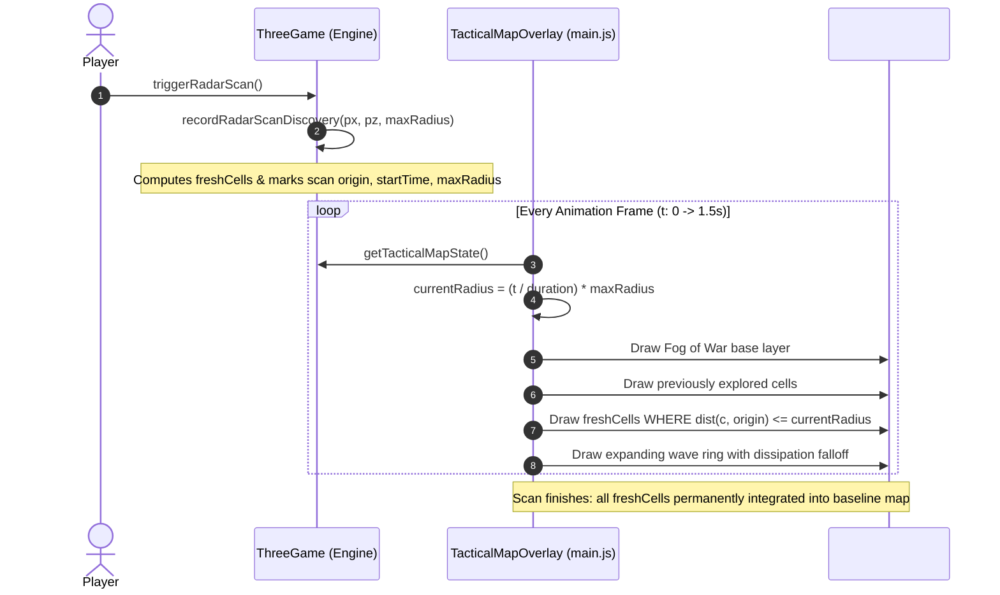

# Minimap Radar Scan, Fog of War, & Edge Dissipation Technical Architecture & Plan

**Document ID:** `PLAN-HUD-MAP-2026-09-24`  
**Status:** In-Review / Engineering Spec  
**Target Milestone:** `v2.4.12-beta` / Sprint 47 Track D  
**Associated Codebases:** [`main.js`](file:///home/caveman/Desktop/icecave/hunker-bunker/main.js), [`src/threeGame.js`](file:///home/caveman/Desktop/icecave/hunker-bunker/src/threeGame.js), [`src/mapReveal.js`](file:///home/caveman/Desktop/icecave/hunker-bunker/src/mapReveal.js), [`src/styles/expeditionHud.css`](file:///home/caveman/Desktop/icecave/hunker-bunker/src/styles/expeditionHud.css)  
**Evidence Baseline:** Session Log [`hunker-bunker-session-2026-09-24T21-11-38-478Z-mug11pto-kmzk.json`](file:///home/caveman/Desktop/icecave/hunker-bunker/logs/hunker-bunker-session-2026-09-24T21-11-38-478Z-mug11pto-kmzk.json), Vitest Suite (475 files, 4233 tests passing)

---

## 1. Executive Summary & Problem Analysis

Player telemetry and active gameplay review identify three related friction points in how the tactical minimap (`#hud-blueprint-canvas`) handles scanning and fog of war:

1. **Instantaneous Discovery on Scan Trigger (Lack of Wavefront Progression):**
   - *Current Code Behavior:* In [`src/threeGame.js:22512`](file:///home/caveman/Desktop/icecave/hunker-bunker/src/threeGame.js#L22512), calling `triggerRadarScan()` invokes `recordRadarScanDiscovery(px, pz, maxRadius)` immediately. This adds every floor tile and room inside `maxRadius` into `discoveredMapCellKeys` and sets `_detailedChunksDirty = true` on Frame 0. In [`main.js:11767`](file:///home/caveman/Desktop/icecave/hunker-bunker/main.js#L11767), `drawTacticalMapOverlay` paints all chunk cells immediately.
   - *Issue:* Even though a 3D circle and a 2D canvas sweep line animate outward over 1200ms, the entire geometry pops in instantly at $t=0$, breaking the sensory illusion of an expanding sensor sweep.

2. **Abrupt Line Cutoff at Edges (Missing Fade-Off / Completion):**
   - *Current Code Behavior:* In [`main.js:11804`](file:///home/caveman/Desktop/icecave/hunker-bunker/main.js#L11804), the canvas radar sweep circle is drawn only while `sweep < 1`:
     ```javascript
     if (sweep < 1) {
         ctx.arc(center.x, center.y, sweep * radarScan.radius * cellSize, 0, Math.PI * 2);
         ctx.stroke();
     }
     ```
   - *Issue:* At the exact millisecond when `sweep` reaches 1.0 (the maximum scan perimeter), the circle vanishes abruptly in a single frame. Additionally, when the expanding circle collides with the rectangular edges of the HUD canvas (300×180 px), it truncates against the canvas boundaries without a smooth perimeter falloff, radial bezel mask, or dissipation tail.

3. **Indistinct Fog of War and Scanned Area Separation:**
   - *Current Code Behavior:* Unrevealed canvas space uses `getMapFogPattern()` ([`main.js:11634`](file:///home/caveman/Desktop/icecave/hunker-bunker/main.js#L11634)) with dark `#070d14` and 0.09-opacity diagonal lines. Once revealed, both walked cells and scanned cells are painted identically in plain fill colors (`mapPrimary` or `mapSecondary`).
   - *Issue:* The map lacks clear tactical demarcation: there is no obvious visual distinction between:
     - Unsurveyed deep Fog of War (active radar static/shroud),
     - Surveyed / scanned terrain (tactical phosphor blueprint),
     - Player's active line of sight / immediate local perimeter.
     - Furthermore, the border between scanned terrain and fog forms an unpadded, jagged staircase where tiles abruptly cut off.

---

## 2. Requirements & Desired State

| ID | Requirement | Current Behavior | Desired Behavior |
|:---|:---|:---|:---|
| **REQ-1** | **Progressive Wavefront Reveal** | All tiles up to `maxRadius` appear on minimap at $t=0$. | Cells newly uncovered by an active radar pulse reveal progressively as the expanding wave circle passes their world distance from the player. |
| **REQ-2** | **Smooth Edge Dissipation & Completion** | Scan ring abruptly disappears at $sweep = 1.0$ and hard-clips at canvas edges. | The scan ring completes its outward expansion with a graceful dissipation phase (soft alpha decay, radius expansion tail, gradient edge fade) so it dissolves naturally. |
| **REQ-3** | **Clear Fog of War vs Scanned Area** | Unrevealed space is near-pitch-black; scanned space has no perimeter boundary. | Unexplored space features a distinct CRT radar static/grid texture; scanned space displays a subtle phosphor footprint with an explicit survey boundary / perimeter glow. |
| **REQ-4** | **Seamless Cache & Performance Continuity** | `_cachedDetailedChunks` rebuilds when dirty. | Progressive reveal operates cleanly without incurring per-frame WFC re-computation or GC stutter, adhering to Steam Deck 60 FPS budgets. |

---

## 3. Technical Architecture & Implementation Plan

### Phase 1: Progressive Radar Sweep Masking ([`main.js`](file:///home/caveman/Desktop/icecave/hunker-bunker/main.js))
Rather than mutating permanent world discovery per sub-frame, the rendering pipeline in `drawTacticalMapOverlay` will evaluate active radar sweeps:
- When a radar scan is active (`now - scan.at < scan.duration + dissipationDuration`):
  - Any cell belonging to `radarScan.freshCells` is only rendered if its Euclidean distance from the scan origin $(x_0, z_0)$ is $\le \text{currentSweepRadius} + \delta_{\text{lead}}$.
  - As `currentSweepRadius = (age / duration) * maxRadius` expands from 0 to `maxRadius`, cells dynamically reveal in an organic outward wavefront.
  - When a cell is first crossed by the wavefront, it triggers a brief high-luminance phosphor flash before settling to normal brightness.
  - Once the scan duration finishes, all cells in the scan remain permanently revealed.



### Phase 2: Edge Completion & Wave Dissipation ([`main.js`](file:///home/caveman/Desktop/icecave/hunker-bunker/main.js) & [`src/threeGame.js`](file:///home/caveman/Desktop/icecave/hunker-bunker/src/threeGame.js))
1. **Minimap Wave Dissipation Window:**
   - Extend the scan line life-cycle beyond `sweep < 1`. Introduce a 350ms dissipation tail:
     ```javascript
     const totalScanDuration = radarScan.duration; // 1200ms
     const dissipationDuration = 350; // ms
     const elapsed = now - radarScan.at;
     if (elapsed < totalScanDuration + dissipationDuration) {
         if (elapsed <= totalScanDuration) {
             // Main outward expansion
             const sweep = elapsed / totalScanDuration;
             const r = sweep * radarScan.radius * cellSize;
             const alpha = 0.85 * (1 - 0.3 * sweep);
             drawScanRing(ctx, center, r, alpha, 2);
         } else {
             // Edge completion & soft fade-off
             const fadeT = (elapsed - totalScanDuration) / dissipationDuration;
             const r = (radarScan.radius + fadeT * 1.5) * cellSize;
             const alpha = 0.6 * (1 - fadeT) * (1 - fadeT); // Quadratic fade
             drawScanRing(ctx, center, r, alpha, 2 * (1 + fadeT * 0.5));
         }
     }
     ```
2. **Minimap Radial Vignette / Edge Softening:**
   - In `#hud-blueprint-canvas`, apply a subtle radial gradient mask around the outer bounds of the canvas so that scan waves and peripheral tiles reaching the canvas edge fade out softly rather than hitting a sharp scissor cut.

### Phase 3: Tactical Fog of War & Scanned Area Visual Hierarchy ([`main.js`](file:///home/caveman/Desktop/icecave/hunker-bunker/main.js) & [`src/styles/expeditionHud.css`](file:///home/caveman/Desktop/icecave/hunker-bunker/src/styles/expeditionHud.css))
1. **Unexplored Fog of War Layer:**
   - Upgrade `getMapFogPattern` with a sharper, atmospheric tactical CRT styling:
     - Deep slate/void backdrop (`#050b12`),
     - High-tech micro-scanlines and 12px coordinate grid pips (`rgba(0, 229, 255, 0.08)`),
     - Reads unmistakably as *"unmapped tactical sensor dark zone"*.
2. **Scanned Territory Demarcation:**
   - Render a distinct faint phosphor ambient wash (`rgba(0, 210, 255, 0.05)`) over the bounding convex/grid hull of scanned areas.
   - Outline the perimeter horizon of scanned tiles with a subtle dashed or semi-transparent tactical boundary line so players can clearly read where their scanner reached and where unknown territory begins.
3. **Contrast Hierarchy:**
   - **Active Zone (Player & Flashlight Cone):** Full brightness, high saturation.
   - **Surveyed Zone (Scanned Blueprint):** Medium-contrast blueprint lines (`mapPrimary` / `mapSecondary`).
   - **Unsurveyed Zone (Fog of War):** Dark tactical grid with scanlines.

---

## 4. Verification & Testing Matrix

| Test Scope | Verification Method | Pass Criteria |
|:---|:---|:---|
| **Progression Timing** | Automated Vitest in `src/mapReveal.test.js` & `src/threeGame.mappingMission.test.js` | Tiles beyond `currentSweepRadius` are not marked visible until `age >= dist / speed`. |
| **Edge Dissipation** | Headless Playwright capture via `scripts/verify-map-patch-refresh.mjs` | Capture canvas pixel buffers at $t = 1100\text{ms}, 1250\text{ms}, 1450\text{ms}$; prove no 1-frame opacity cliff. |
| **Contrast / Readability** | Visual artifact & color delta check across all 8 HUD themes ([`src/hudThemes.js`](file:///home/caveman/Desktop/icecave/hunker-bunker/src/hudThemes.js)) | Fog pattern, scanned blueprint, and active player icon maintain WCAG AA contrast ratio (> 4.5:1). |
| **Performance Envelope** | Frame profiler snapshot in `scripts/analyze-session-logs.mjs` | Minimap redraw remains within $\le 0.4\text{ms}$ CPU time per frame; zero GC allocation spikes. |

---

## 5. Next Steps

1. Implement the progressive radial reveal logic in [`main.js`](file:///home/caveman/Desktop/icecave/hunker-bunker/main.js).
2. Implement the edge dissipation tail and radial boundary falloff.
3. Enhance the Fog of War CRT grid pattern and scanned phosphor styling.
4. Run regression test suites (`npm test`, `verify-map-patch-refresh.mjs`) to validate full stability.
