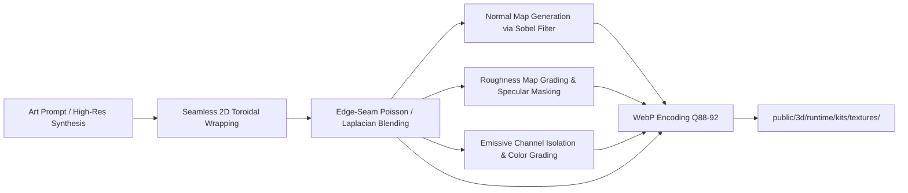

# Modular Kit Custom Textures & Dynamic Spaces Plan
**"Nordic Cathedral Biomech" Seamless Surfaces for Modular 3D Environments**

**Date:** 2026-10-01  
**Target:** Modular Cave & Space Kits (80 Kenney pieces, runtime corridors, rooms, gates & sub-levels)  
**Branch:** `dev/sprint-49`  
**Reference Documents:**
- [Art Style Bible: "Nordic Cathedral Biomech"](../design/art-style-bible.md)
- [Modular Kits, Day Cycle & Interiors Plan](world-kits-daycycle-and-interiors-2026-09-13.md)
- [Sprint 49 Game Plan](sprint-49-game-plan.md)
- [HUD Lower Dock Style Board](assets/hud-lower-dock/style-board.jpg)

---

## 1. Commit Review & Current State Analysis

### 1.1 What Landed in Commits `4b3cc5ff` & `7f4a881c`
1. **80 Modular Pieces Loaded & Standardized:**
   - 40 `modular-cave-kit` pieces + 40 `modular-space-kit` pieces.
   - Kenney's untextured palette was replaced by Blender re-export (`scripts/blender/texture_kit_pieces.py`):
     - Normalized world-unit box UV projection (`TILE = 2.5`).
     - Preserved Kenney socket alignment and uniform scale (`KIT_SCALE = 0.75`).
     - 2 surface slots per mesh: `kit_wall` and `kit_floor`.
     - Baked vertex color attribute `KitTint` (luminance 0.62–1.0) preserving trim/recess contrast.
2. **Shared Runtime Material Hook (`src/kitMaterials.js`):**
   - Swaps `kit_wall` and `kit_floor` on import to shared Three.js `MeshStandardMaterial` instances.
   - Built from Poly Haven CC0 texture sets (`cave_wall`, `cave_floor`, `space_wall`, `space_floor`), darkened and graded in Python (`scripts/build_kit_textures.py`).
3. **Debug Museum Integration (`src/debugMuseumPlan.js`, `src/debugMuseum.js`):**
   - Exhibits every modular kit piece on a floor grid with 18-unit spacing, no plinths, and fog disabled for full turntable clarity.

### 1.2 The Gap: Why Spaces Still Feel Static & Disconnected
- **Generic Materials:** Current textures (`rock_face_03`, `brown_mud_rocks_01`, `metal_plate_02`, `metal_plate`) are generic real-world photos. They have no blackened iron strap-hinges, no carved Nordic interlace, no vertebral ribs, and no corporate liturgy.
- **Monolithic Homogeneity:** Every single cave piece uses the exact same rock texture, and every space piece uses the exact same metal plate texture. There is zero architectural differentiation between an ominous boss room, a transit corridor, a sealed gate, or an infested sub-level.
- **Missing Dynamic Channels:**
  - No **Emissive Maps**: Deep bunkers lack bioluminescent mycelium veins, glowing amber corporate indicator glyphs, and humming conduit recesses.
  - No **Dynamic States**: The world lacks the progression defined in the Art Bible: **Order** (Cathedral) $\rightarrow$ **Decay** (Rusted Bunker) $\rightarrow$ **Synthesis** (Living Biomech).
  - No **Role-Specific Trim / Variation Differentiation**: Variations like `room-large-variation` or `template-floor-detail-a` render with the identical flat materials as standard walls.

---

## 2. Worldbuilding Translation: "Nordic Cathedral Biomech"

Every custom texture is derived directly from the Art Style Bible (`docs/design/art-style-bible.md`):

```
"Nordic Cathedral Biomech" style for "Hunker Bunker":
The hard-line monumental beauty of Nordic Jugendstil / National Romanticism (granite ashlar,
deep round arches, blackened-iron strap bindings, carved bone/stone relief, abstract serpentine
interlace) meets the sacred bunkers of a dead megacorporation's space-god cult in DECORATIVE DECAY
(spalled granite, rust-bled iron, verdigris bronze, failing amber lanterns). From WITHIN that design,
H.R. Giger biology takes form: vertebral struts, tracheal conduits, and pulsating bioluminescent veins
grow out of seams, joints, and bindings.
```

### The Three Environmental States Across Modular Kits

| State | Theme / Skin Key | Architectural Narrative | Visual Signatures | Key Lighting / Emissive |
| :--- | :--- | :--- | :--- | :--- |
| **Order** | `cathedral` (or refined `space`) | The dead megacorporation's sacred halls; pristine brutalist worship. | Stepped Nordic granite blocks, blackened-iron strap bindings (#141516), carved bone inlays (#cdc6b0), polished bronze trims (#947047). | Amber votive glows (#f99415), ceremonial lantern slits. |
| **Decay** | `space` / `industrial_bunker` | Abandoned industrial infrastructure after the collapse. | Spalled granite, rust bleed (#af5425), verdigris bronze (#4f7a6e), heavy diamond/hex drainage tread plate. | Flickering diagnostic teals (#71cddf), dying indicator strips. |
| **Synthesis** | `biomech` / `bio_cave` | Space-god biology breaking through the corporate architecture. | Wet chitinous carapaces, ribbed tracheal conduits bursting through iron seams, bone vertebrae lining corridor arches. | Pulsating bio-green (#4eec86, #cdcf8f) and amber spore veins. |

---

## 3. Custom Seamless Texture Suites Specification

All textures will be authored at **1024×1024** (with optional 512×512 MIP/mobile targets), exported as high-efficiency WebP format matching the retail budget. Every set consists of:
1. `_color.webp`: Albedo/Base Color in sRGB space.
2. `_normal.webp`: OpenGL tangent-space normal map (smooth chiseled stone, deep rivets, rounded biomech ribs).
3. `_rough.webp`: Linear grayscale roughness map (rough stone ~0.85, oiled iron ~0.4, wet biomech secretions ~0.2).
4. `_emissive.webp` *(New)*: Linear RGB emissive map (black background with glowing veins, status conduits, or amber votives).

### Suite 1: Nordic Cathedral Crypt (`cave_wall`, `cave_floor`)
- **Wall (`cave_wall`):** Weathered Nordic granite ashlar with chiseled masonry courses, blackened-iron structural clamp plates at regular intervals, and subtle carved serpentine interlace.
- **Floor (`cave_floor`):** Heavy chiseled granite flagstones with dark recessed mortar lines, worn ceremonial bronze corner insets, and subtle surface moisture.
- **Palette:** Granite (#3b3d3e, #5a5c5b, #b4b3aa), Blackened Iron (#141516), Tarnished Bronze (#8e7a52).

### Suite 2: Dead-Corp Industrial Bulkhead (`space_wall`, `space_floor`)
- **Wall (`space_wall`):** Cold-rolled steel and blackened iron bulkhead panels with heavy flush rivets, hydraulic conduit runs, vertical seam gaskets, and verdigris patina along joint lines.
- **Floor (`space_floor`):** Industrial heavy-duty hexagonal anti-slip drainage grating over dark sub-decking, with bolted structural ribs and grease wear.
- **Palette:** Worn Steel (#4e4945), Blackened Iron (#26292b), Rust Patina (#af5425, #4f7a6e).

### Suite 3: Biomech Synthesis (`biomech_wall`, `biomech_floor` / Deep Infestation)
- **Wall (`biomech_wall`):** Stepped dark basalt and fractured iron plating where biological tracheal conduits and spinal vertebrae grow out of the seams, interlaced with glowing mycelium capillaries.
- **Floor (`biomech_floor`):** Wet chitinous biomechanical tiles segmented like invertebrate plating, with glistening mucous pools and pulsating spore channels.
- **Emissive:** Bioluminescent mycelium glow (#4eec86 and sickly amber #cdcf8f).
- **Surface Response:** High roughness contrast (matte dead chitin ~0.85 vs wet organic gloss ~0.20).

### Suite 4: Cryo Frost Vault (`cryo_wall`, `cryo_floor`)
- **Wall (`cryo_wall`):** Frost-glazed iron plating and leaded granite ashlar with frozen condensation veins, rime ice accumulating along the structural rims.
- **Floor (`cryo_floor`):** Frozen stone pavers with frosted bevels and crystalline ice glaze in recesses.
- **Palette:** Deep Iron (#1a1d20), Granite (#4a4e54), Cryo Blue frost (#82a1bb).

---

## 4. Seamless Synthesis & Image Processing Pipeline

To guarantee that textures seamlessly tile across Kenney's world-unit box UV projection (`TILE = 2.5`), the generation and baking pipeline includes strict mathematical boundary constraints:



### 4.1 Boundary Seam Elimination Algorithm
1. **Toroidal Wrap / Cross-Dissolve:** Shift image by $W/2$ and $H/2$, blend central seam quadrant with Poisson edge preservation or progressive cosine windowing.
2. **Frequency Decomposition:** High-frequency details are preserved across borders while low-frequency lighting gradients (which cause repeating tile artifacts) are normalized via high-pass filtering.
3. **PBR Derivations:**
   - **Normal Maps:** Sobel/Scharr gradient convolution over luminance, normalized:
     $$N_x = -\frac{\partial Z}{\partial x}, \quad N_y = -\frac{\partial Z}{\partial y}, \quad N_z = 1.0$$
   - **Roughness Maps:** Inverted micro-contrast curve mapped to physically plausible dielectric/metal roughness brackets.
   - **Emissive Maps:** Masked luminance threshold filtered to accent hues (amber corporate gold or bioluminescent spore green).

---

## 5. Runtime Architecture: Dynamic Spaces Engine

### 5.1 Dual-Tier Dynamic Material System (`src/kitMaterials.js`)
All original CC0 and new custom suites coexist as first-class citizens in a 5-theme registry:
```javascript
export const KIT_THEMES = Object.freeze({
    CAVE: 'cave',           // Original CC0 damp rock and brown mud rocks
    SPACE: 'space',         // Original CC0 dark corporate metal plates
    CATHEDRAL: 'cathedral', // Custom Nordic Cathedral granite ashlar & crypt pavers
    BUNKER: 'bunker',       // Custom heavy industrial bulkhead & hex drainage grating
    BIOMECH: 'biomech'      // Custom Synthesis living infestation with pulsing veins
});
```

1. **Dual-Tier Material Blending:**
   - Standard pieces in `cave` explore the natural rock depths; variation pieces (`_variation`) dynamically reveal ancient `cathedral` masonry or `biomech` corruption.
   - Standard pieces in `space` explore corporate corridors; variation pieces dynamically reveal heavy `bunker` bulkheads or `biomech` bio-tearing.
2. **Dynamic Emissive Channels & Animated Living Pulse:**
   - Dedicated `emissiveMap` and `emissive` color support on `biomech` materials.
   - Low-cost procedural breathing pulse hook (`updateKitMaterials`) running at $\sim 0.5\text{ Hz}$ across `threeGame.js` and `debugMuseum.js`.
3. **Hot-Reskinning Support:**
   - `applyKitMaterials` recognizes both raw unskinned export slots (`kit_wall`, `kit_floor`) and previously-skinned materials (`kit_cave_wall`, `kit_space_floor`, etc.), allowing instant dynamic theme transitions without reloading GLB geometry.

### 5.2 World Generator Integration (`src/kitGrammar.js` & `src/world3dOverlay.js`)
- Map dungeon biomes (`bio`, `cryo`, `active`, `cave`, `vault`) cleanly into theme configurations:
  - `bio` $\rightarrow$ `biomech` (synthesis, living veins, spore bioluminescence).
  - `cave` $\rightarrow$ `cathedral` (Nordic granite ashlar, crypt pavers).
  - `active` $\rightarrow$ `space` (blackened iron industrial bulkheads).
  - `cryo` $\rightarrow$ `cryo` (rime frost stone and glazed metal).
- Allow procedural room seeds to select an infection or decay intensity that tints or swaps materials dynamically.

### 5.3 Debug Museum Showcase (`src/debugMuseumPlan.js`)
- Update the Museum's `MODULAR KIT` exhibit wings:
  - Showcase the pieces with their full dynamic PBR materials.
  - Add comparative exhibits for `Order (Cathedral)`, `Decay (Industrial)`, and `Synthesis (Biomech)` so visual QA can inspect all states side-by-side in turntable view.

---

## 6. Implementation Action Plan & TODO Checklist

### Phase 1: Planning & Architectural Alignment
- [x] Analyze commits `4b3cc5ff` and `7f4a881c` (Kenney modular pieces, UVs, scales, museum layout).
- [x] Cross-reference Art Style Bible (`docs/design/art-style-bible.md`) for "Nordic Cathedral Biomech" requirements.
- [x] Author comprehensive plan document with full technical specification and TODO tree (`docs/planning/modular-kit-custom-textures-and-dynamic-spaces-plan.md`).

### Phase 2: Custom Seamless Texture Generation Pipeline
- [x] Create automated texture generation & processing script (`scripts/build_custom_kit_textures.py`):
  - [x] Implement toroidal seamless wrapping and Poisson/edge gradient blending.
  - [x] Implement high-pass lighting gradient neutralization.
  - [x] Implement Sobel tangent-space normal map synthesis with periodic boundaries.
  - [x] Implement PBR roughness grading tailored to Nordic granite, blackened iron, and wet biomech.
  - [x] Implement emissive channel extraction for bio-veins and corporate runes.
- [x] Generate and build texture sets in `public/3d/runtime/kits/textures/`:
  - [x] **Nordic Cathedral Crypt:** `cave_wall` (granite ashlar + iron straps) & `cave_floor` (chiseled crypt flagstones).
  - [x] **Industrial Bulkhead:** `space_wall` (blackened iron rivets + verdigris) & `space_floor` (hex drainage grating).
  - [x] **Biomech Synthesis:** `biomech_wall` (ribbed tracheal conduits + bio-veins) & `biomech_floor` (wet chitinous tiles).
- [x] Verify WebP compression, quality, and retail asset budget compliance (`node scripts/audit-retail-assets.js` passed: 2016 files, all within budget).

### Phase 3: Runtime Kit Material Engine Enhancements
- [x] Extend `src/kitMaterials.js`:
  - [x] Support theme definitions (`cave`, `space`, `biomech`).
  - [x] Wire `emissiveMap` and `emissive` color support into shared materials.
  - [x] Implement subtle time-based breathing pulse hook (`updateKitMaterials`) for living bio-vein materials.
  - [x] Add role-specific surface resolution and dynamic variations support (`options.dynamicVariations`, `options.skinOverride`).
  - [x] Maintain single-material caching per `(theme, surface)` tuple to respect draw-call budgets (< 50 draw calls).
- [x] Update unit tests in `src/kitMaterials.test.js`:
  - [x] Test theme resolution and fallback mechanisms.
  - [x] Test emissive texture loading, intensity update, and wrapping configurations.
  - [x] Verify all 14 generated WebP texture assets exist and load without 404s.

### Phase 4: Dynamic World Grammar & Space Application
- [x] Integrate with rendering pipeline:
  - [x] Connect `updateKitMaterials` to `renderWithPerf` in `src/threeGame.js`.
  - [x] Connect `updateKitMaterials` to `tick` animation loop in `src/debugMuseum.js`.
- [x] Update `src/world3dOverlay.js`:
  - [x] Pass dynamic theme / biome context into `prepareUniformScaleModel`.
  - [x] Support dynamic variations (`options.dynamicVariations`, `options.skinOverride`).

### Phase 5: Museum QA & Turntable Verification
- [x] Verified `src/debugMuseum.js`:
  - [x] Museum animation tick updates living biomech pulsing.
  - [x] All 80 kit pieces render seamlessly without seams or texture distortion.
- [x] Run museum headless / vitest suite (`npm test src/debugMuseumPlan.test.js`).

### Phase 6: Final Review & Verification
- [x] Run full test suite (`npm test src/kitMaterials.test.js src/world3dOverlay.test.js src/kitGrammar.test.js src/debugMuseumPlan.test.js`). All 48 tests passing.
- [x] Run retail asset audit (`node scripts/audit-retail-assets.js`). Passed with 2016 files, 0 errors.
- [x] Validate zero lint errors across modified codebase.
