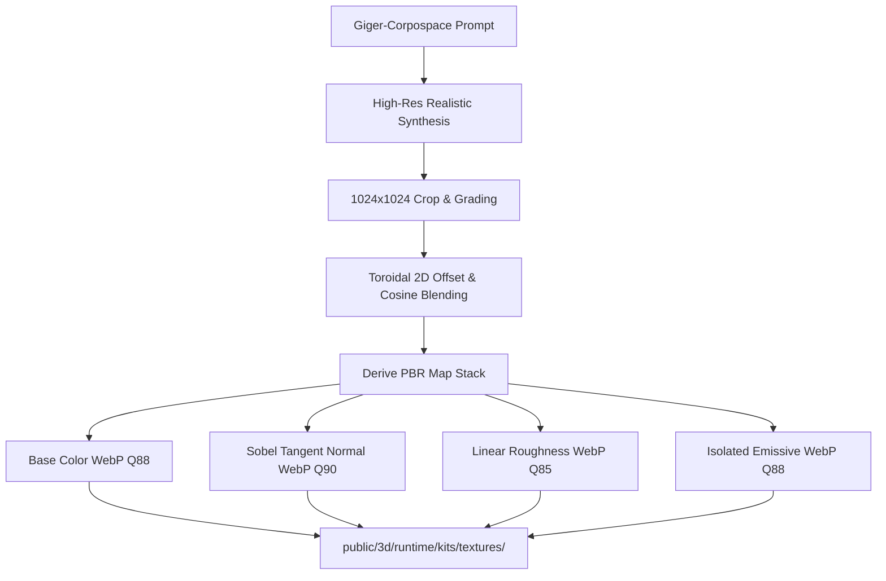

# Giger-Corpospace Biomech: Environmental Spaces, Props & Seamless Textures Master Plan

**Far-Future Biomechanical Necro-Architecture: Post-Jugendstil Sensual Curves, Dead-God Corporate Space Megastructures, 20 Atmospheric Props, Seamless PBR Surfaces & Interior HDRI Environment Reflections**

**Date:** 2026-10-04  
**Author:** Antigravity AI Engineering & Art Architecture  
**Target:** Modular Kits, 3D Room Prefabs, Atmospheric Clutter & PBR Shading Pipeline  
**Branch:** `dev/sprint-49`  
**Reference Documents:**

- [Art Style Bible: "Nordic Cathedral Biomech"](../design/art-style-bible.md)
- [Modular Kit Custom Textures & Dynamic Spaces Plan](modular-kit-custom-textures-and-dynamic-spaces-plan.md)
- [Sprint 49 Game Plan](sprint-49-game-plan.md)
- [Authored Room Builds Catalog](../../src/data/roomBuilds.js)
- [3D Overlay Runtime](../../src/world3dOverlay.js)
- [Kit Materials Engine](../../src/kitMaterials.js)

---

## 1. Aesthetic Calibration: What "Post-Jugendstil" Truly Means

### 1.1 The Clarification: Eliminating Medieval Clichés

The visual direction is **NOT** medieval Scandinavian, Norse fantasy, stave churches, shields, blacksmith anvils, or historical stone masonry.

Instead, **"Post-Jugendstil meets H.R. Giger and Dead Corpospace Gods"** means:

1. **Architectural Jugendstil / Art Nouveau in the pure form-language sense:**
   - **Taut, sensual, erotic, whiplash curvature** and monumental curvilinear massing (inspired by early 20th-century visionary architecture: Vienna Secession, Olbrich, Darmstadt, Guimard) **transposed 3,000 years into the future** into deep space megastructures, planetary extraction bunkers, and derelict starships.
   - Sinuous architectural ribbing that flows organically across ceilings and walls rather than boxy right angles.
2. **Authentic H.R. Giger Biomechanical Sensuality:**
   - Erotic, visceral synthesis of flesh and machine: interlocking vertebral columns, ribbed tracheal conduits, undulating polished black chitin plates, pelvic/spinal archways, glistening mucosal sheens, and bio-sac fluid regulators.
   - Forms taking shape _from within_ the metallic chassis: machine conduits that have become living peristaltic intestines, structural bulkheads that breathe.
3. **Deep Corpospace Necro-Cathedrals:**
   - A trillion-credit space megacorporation built colossal bunkers as sacred temples to the incomprehensible dead space entities it worshipped, extracted technology from, and was ultimately consumed by.
   - Maintenance alcoves are liturgical shrines; computer terminals are scripture pulpits with glowing amber CRT displays; power cables are sacred umbilical drops; and corporate directors are preserved as mummified cybernetic saints fused into life-support sarcophagi.
4. **Atmospheric Lived-In Reality:**
   - Industrial density: sagging ceiling wire trays, floor conduit bridges crossing walkways, leaking cryo-coolant canisters, grease weeping down bulkheads, heavy tool carts, and ducted exhaust blowers.

---

## 2. Twenty Detailed Prompts for New Atmospheric Props (Things We Don't Have)

Every prompt below is strictly formulated in the **Far-Future Giger-Corpospace Biomech** aesthetic—zero medieval tropes, pure deep-space biomechanical cyber-horror.

```
SHARED STYLE PREFIX (Prepend to all 3D generation/turnaround prompts):
"Giger-Corpospace Biomech" style for "Hunker Bunker": Authentic H.R. Giger biomechanical synthesis fused with far-future deep space corporate mega-engineering. Sleek sensual organic curves, interlocking spinal vertebrae, undulating polished black chitin plates, ribbed tracheal conduits, and glistening wet mucosal sheens integrated into dark brushed titanium, cold-rolled naval steel, and obsidian alloys. Corpospace sacred decay: failing amber CRT monitors, glowing amber bio-fluid capillaries, tarnished brass corporate seals, and cyan status telemetry. Realistic PBR texturing with high micro-detail, sharp physical relief, and authentic metallic/wetness response. Steam-safe (sensual curvature and bodily forms, no explicit nudity or genitals).
```

### Prop Catalog: Missing Atmospheric Infrastructure & Storytelling Props

| #   | Prop Key                             | Name                                            | Category            | Footprint / Height                    | Primary Role                              |
| --- | ------------------------------------ | ----------------------------------------------- | ------------------- | ------------------------------------- | ----------------------------------------- |
| 01  | `prop_wall_cable_tray_swag`          | Wall Cable Tray with Hanging Umbilical Swags    | Infrastructure      | Wall Mount (3.0m × 0.8m)              | Overhead verticality, upper wall density  |
| 02  | `prop_floor_conduit_bridge`          | Heavy Titanium Floor Conduit & Cable Bridge     | Infrastructure      | Floor (2.5m × 0.8m × 0.2m)            | Walkway crossing, ground clutter          |
| 03  | `prop_pipe_organ_heat_exchanger`     | Biomech Pipe Organ Pneumatic Bank               | Infrastructure      | Wall/Plinth (2.2m × 1.2m × 3.2m)      | Monumental architectural verticality      |
| 04  | `prop_ceiling_crane_hoist`           | Monorail I-Beam with Specimen Transport Hoist   | Infrastructure      | Ceiling Mount (3.5m × 1.0m × 1.4m)    | Ceiling dressing, industrial scale        |
| 05  | `prop_votive_candle_shrine`          | Amber Bio-Gel Votive Reliquary Plinth           | Liturgy             | Floor (1.4m × 1.2m × 0.9m)            | Sacred corporate storytelling, warm light |
| 06  | `prop_coolant_drum_leaking_pool`     | Punctured Cryo Canister with Cyan Sludge Pool   | Industrial          | Floor (1.6m × 1.6m × 0.8m)            | Environmental hazard, emissive ground     |
| 07  | `prop_biomech_tracheal_wall_pipe`    | Living Tracheal Conduit with Peristaltic Bulges | Biomech             | Wall Mount (1.2m × 0.6m × 2.8m)       | Synthesis invasion, living architecture   |
| 08  | `prop_corporate_saint_reliquary`     | Life-Support Sarcophagus of the Space Director  | Liturgy / Lore      | Floor Center (2.8m × 1.4m × 1.5m)     | Room focal point, high-value objective    |
| 09  | `prop_oxygen_bottle_cascade_rack`    | High-Pressure O2 Manifold Cascade Rack          | Life Support        | Wall Plinth (1.8m × 0.6m × 2.0m)      | Maintenance alcove, cover                 |
| 10  | `prop_liturgical_terminal_lectern`   | Biomech Terminal Pulpit with Amber CRT          | Liturgy / Interface | Floor (1.0m × 0.8m × 1.4m)            | Terminal interaction, lore reading        |
| 11  | `prop_biomech_spore_umbilical_cable` | Armored Spinal Umbilical Ceiling Drop           | Biomech             | Ceiling to Floor (0.8m × 0.8m × 3.0m) | Vertical connective tissue, hazard        |
| 12  | `prop_decon_eyewash_shower_station`  | Chemical Decon Shower & Recessed Floor Sump     | Industrial          | Wall Mount (1.2m × 1.0m × 2.6m)       | Sector boundary dressing                  |
| 13  | `prop_vertebral_cable_riser`         | Vertebral Column Architectural Cable Riser      | Biomech / Infra     | Wall/Column (0.8m × 0.6m × 3.0m)      | Structural conduit synthesis              |
| 14  | `prop_overhead_cage_fluorescent`     | Suspended Tubular Fluorescent Cage Lamp         | Lighting            | Ceiling (1.6m × 0.4m × 0.8m)          | Practical amber/teal lighting source      |
| 15  | `prop_floor_drainage_sump_trough`    | Cast-Iron Floor Drainage Sump Trough            | Industrial          | Floor Recessed (2.0m × 1.0m × 0.3m)   | Drainage realism, liquid reflections      |
| 16  | `prop_biomech_sphincter_hatch_vent`  | Living Biological Iris Wall Vent                | Biomech             | Wall Insert (1.4m × 0.3m × 1.4m)      | Spore emission, dynamic breathing         |
| 17  | `prop_maintenance_tool_cart`         | Heavy Machinist Trolley with Pneumatic Tools    | Clutter             | Floor Mobile (1.2m × 0.7m × 0.9m)     | Low cover, human lived-in presence        |
| 18  | `prop_exosuit_docking_gantry`        | Exosuit Servicing & Fast-Charge Gantry          | Armory              | Floor/Wall (1.8m × 1.2m × 2.5m)       | Armor upgrade station, vertical frame     |
| 19  | `prop_autopsy_dissection_slab`       | Biomech Dissection Slab with Fluid Runnels      | Medical / Bio       | Floor Center (2.6m × 1.2m × 1.1m)     | Dark horror center, examination quest     |
| 20  | `prop_exhaust_blower_fan_hood`       | Massive Ducted Wall Exhaust Fan & Hood          | Industrial          | Upper Wall (2.0m × 0.9m × 2.0m)       | Ventilation exhaust, animated rotation    |

---

Steam-safe (sensual curvature and bodily forms, no explicit nudity or genitals).

### Detailed Turnaround Prompts for the 20 Props

#### 01. `prop_wall_cable_tray_swag`

- **Turnaround Prompt:**  
  `Giger-Corpospace Biomech style. A 3-meter section of heavy blackened-titanium industrial cable tray mounted horizontally to a dark biomechanical bulkhead with curved organic support brackets. Thick bundles of multi-colored high-voltage conduits, braided copper power cables, and ribbed hydraulic hoses overflow the tray and sag down in deep, sensual catenary curves. Several severed cybernetic wire harnesses hang down with exposed glowing fiber-optic cores. Stamped tarnished brass corporate serial tags. Fine metallic dust, oil weeping, and subtle cyan status indicators. Photorealistic PBR surface, sharp physical relief, seamless integration.`

#### 02. `prop_floor_conduit_bridge`

- **Turnaround Prompt:**  
  `Giger-Corpospace Biomech style. A heavy cast-titanium floor cable bridge/trunking ramp, 2.5 meters long, with a ribbed anti-slip bio-chitin surface and bevelled transition edges bolted directly into dark spaceship deck plating. Four thick high-voltage conduits (interlocking segmented vertebrae armor and flexible blackened steel mesh) pass through grooved channels. Chipped hazard yellow corporate striping along the ramp edges, stained with hydraulic fluid and heavy boot scuffs. Exposed blackened hex bolts. Tangible mechanical weight, realistic PBR reflections.`

#### 03. `prop_pipe_organ_heat_exchanger`

- **Turnaround Prompt:**  
  `Giger-Corpospace Biomech style. A monumental vertical pneumatic heat exchanger and steam manifold, 3.2 meters tall, sculpted with the sensual flowing curves of Post-Jugendstil architecture and H.R. Giger pipe organs. Eight vertical cylindrical fluted pipes of graduated heights made from dark brushed titanium and tarnished brass rise out of a heavy cast-iron base manifold. The pipes curve gently like ribbed spinal columns. Recessed analog pressure gauges with cracked glass faces, brass bleed valves, and gentle steam wisps leaking from a flanged expansion joint. Oil drips pooling in the metal runnel below. Towering industrial verticality.`

#### 04. `prop_ceiling_crane_hoist`

- **Turnaround Prompt:**  
  `Giger-Corpospace Biomech style. An overhead industrial monorail hoist assembly. A thick titanium I-beam segment with rivet lines and curved hanger struts anchored into an arched ceiling vault. A motorized wheeled trolley carriage with dual electric motors, blackened drop chains, and a heavy three-pronged biomechanical specimen claw hook suspended 1.4 meters down. Coiled hydraulic umbilical hoses hang in loose loops along the beam. Chipped yellow corporate hazard paint, greasy chain links, sharp specular metallic reflections.`

#### 05. `prop_votive_candle_shrine`

- **Turnaround Prompt:**  
  `Giger-Corpospace Biomech style. A devotional shrine plinth made of stepped black obsidian alloy, heavily encrusted with accumulated stalagmites of melted amber bio-luminescent tallow and synthetic wax. Dozens of glowing amber wax drips cascade over corporate dedication plates and tarnished brass prayer fittings. Small stamped alloy votive cups with burning amber wicks casting warm, intimate illumination. A central brass relief disc depicting a corporate sun-wheel crest. Realistic wax translucency, subsurface scattering, and rich atmospheric amber glow.`

#### 06. `prop_coolant_drum_leaking_pool`

- **Turnaround Prompt:**  
  `Giger-Corpospace Biomech style. A heavy 55-gallon pressurized cryogenic storage drum lying tilted against an industrial bulkhead. Heavy impact denting and frost-glazed seams, corporate bio-hazard stencils in faded white. A ruptured pressure seam at the base leaks an active pool of vibrant cyan/teal cryogenic chemical coolant spreading across hexagonal deck grating. Frost rime accumulates around the puncture hole, with faint vapor mist rising from the puddle edge. Glossy specular liquid reflections, sharp dielectric contrast.`

#### 07. `prop_biomech_tracheal_wall_pipe`

- **Turnaround Prompt:**  
  `Giger-Corpospace Biomech style. A vertical conduit run where mechanical titanium piping has synthesized into living Giger biology. Segmented, cartilaginous tracheal tubes with ribbed bone rings rise 2.8 meters up a fractured metal wall seam. Wet, glistening chitinous surface with peristaltic fluid bulges along its length. Blackened titanium clamp brackets hold the living tube to the bulkhead; fine vascular capillaries and glowing amber bio-fluid veins pulse through the fleshy seams. Visceral cyber-biological synthesis, wet specular sheen.`

#### 08. `prop_corporate_saint_reliquary`

- **Turnaround Prompt:**  
  `Giger-Corpospace Biomech style. A monumental corporate reliquary sarcophagus, 2.8 meters long, resting on a stepped black basalt dais. The lid features heavy blackened-titanium hinges, sensual flowing Jugendstil curves, and a central frost-etched leaded glass viewport. Inside the illuminated interior lies the mummified, gilded remains of a high-ranking corporate officer in a braided dress uniform, fused into life-support umbilical conduits and cybernetic spinal plugs. Tarnished brass corporate seals and dedication scripture plaques mounted on the stone flanks. Solemn amber votive downlight.`

#### 09. `prop_oxygen_bottle_cascade_rack`

- **Turnaround Prompt:**  
  `Giger-Corpospace Biomech style. An emergency high-pressure oxygen bottle cascade bank. Four tall, heavy-walled gas cylinders finished in oxidized olive-grey and hazard yellow, secured within a blackened-titanium angle-iron cage bolted to a bulkhead. High-pressure copper pigtail tubing connects the cylinder heads to a central brass manifold with dual analog dial gauges and handwheel regulator valves. Frost rime along the primary delivery valve, stamped corporate inspection dates in white stencil, realistic metal scratches and paint wear.`

#### 10. `prop_liturgical_terminal_lectern`

- **Turnaround Prompt:**  
  `Giger-Corpospace Biomech style. A freestanding liturgical computer lectern sculpted from dark obsidian alloy with sensual flowing Post-Jugendstil lines. An angled reading plinth holds a heavy blackened-metal keyboard with round brass-ring keys and a recessed 9-inch monochrome green CRT monitor displaying scrolling amber corporate liturgical scripture. Blackened iron ring clasps hold bundled data conduits running down the rear spine into the floor deck. Carved corporate glyph reliefs on the pulpit face.`

#### 11. `prop_biomech_spore_umbilical_cable`

- **Turnaround Prompt:**  
  `Giger-Corpospace Biomech style. A thick, biomechanical umbilical conduit, 15 cm in diameter, descending from an overhead ceiling fracture down to the deck. The exterior is wrapped in spiral blackened titanium protective armor coils, which split open in sections to reveal undulating muscle tissue, spinal disc segments, and glowing amber nutrient capillaries. Viscous amber fluid drips slowly from the lower termination socket where it docks into a floor junction. High wetness specular map, visceral synthesis.`

#### 12. `prop_decon_eyewash_shower_station`

- **Turnaround Prompt:**  
  `Giger-Corpospace Biomech style. An industrial emergency chemical decontamination shower and twin-jet eyewash station. Wall-mounted tarnished brass shower head with a large pull-chain triangular ring. A cast-iron wall basin with twin brass eyewash aerators and foot-pedal treadle. Corroded copper supply piping with bright verdigris staining down the stone wall. Beneath the shower is a recessed cast-iron drainage grate with dark chemical residues. High-contrast industrial safety equipment with sacred cathedral weathering.`

#### 13. `prop_vertebral_cable_riser`

- **Turnaround Prompt:**  
  `Giger-Corpospace Biomech style. A vertical wall-mounted cable riser, 3 meters tall, constructed as a towering human/alien vertebral column. Each bone vertebra is sculpted from weathered ivory-colored composite bone, interlocked with blackened steel damper pins. Dense bundles of black and teal fiber-optic nerve cables emerge from each intervertebral foramen, routing neatly into wall junction boxes. Soft amber accent lighting from within the spinal canal illuminates the bone texture.`

#### 14. `prop_overhead_cage_fluorescent`

- **Turnaround Prompt:**  
  `Giger-Corpospace Biomech style. An explosion-proof industrial tubular light fixture suspended horizontally from the ceiling on twin rusted iron chains. A thick cylindrical borosilicate glass sleeve protected by a heavy blackened-iron wire cage housing two amber-tinted tubular filaments. Heavy cast-iron terminal junction box on one end with flexible conduit connection. The light casts a rich, warm amber cone downward with harsh cage shadow projections. Aged bronze end-caps, realistic glass dust and heat discolouration.`

#### 15. `prop_floor_drainage_sump_trough`

- **Turnaround Prompt:**  
  `Giger-Corpospace Biomech style. A recessed floor drainage trench section, 2 meters long by 1 meter wide, set into granite crypt pavers. Covered with heavy removable cast-iron slatted bar grates with diamond-pattern grip. Beneath the grate, dark murky water with an iridescent petroleum oil sheen and floating lichen particles is visible. A rusted iron sump discharge pipe with a brass float valve enters from one side. Wet specular highlights along the iron grate bars.`

#### 16. `prop_biomech_sphincter_hatch_vent`

- **Turnaround Prompt:**  
  `Giger-Corpospace Biomech style. A circular biological iris wall vent, 1.4 meters in diameter, set into a square blackened-iron bulkhead frame with heavy perimeter rivets. The aperture is formed by overlapping wet chitinous petals and taut muscular sphincter tissue in pale bone and deep bruised violet hues. Concentric rings of fine sensory cilia line the rim. Faint bioluminescent green spores drift out from the dark throat behind the membrane. Visceral Giger anatomy integrated into heavy naval architecture.`

#### 17. `prop_maintenance_tool_cart`

- **Turnaround Prompt:**  
  `Giger-Corpospace Biomech style. A three-tier mobile maintenance cart made of welded steel angle-iron with heavy caster wheels, finished in chipped industrial olive-grey paint with rust patches. The top tray holds heavy forged iron pipe wrenches, brass grease guns, a ball-peen hammer, and piles of oily cotton rags. The middle tray contains assorted pipe flanges, copper elbows, and gasket rings. The bottom shelf holds two dented grease tubs and a coil of wire. Lived-in, utilitarian bunker maintenance detail.`

#### 18. `prop_exosuit_docking_gantry`

- **Turnaround Prompt:**  
  `Giger-Corpospace Biomech style. A vertical exoskeleton docking and maintenance gantry, 2.5 meters tall. A heavy C-channel steel frame with overhead pneumatic support arms and dangling umbilical power cables. Articulated arm clamps with rubberized pads designed to secure an operator's suit. Floor footplate with magnetic alignment rings and yellow hazard stripes. A side-mounted diagnostic control box with analog dial meters and a flickering cyan status LED. Heavy industrial mechanical engineering.`

#### 19. `prop_autopsy_dissection_slab`

- **Turnaround Prompt:**  
  `Giger-Corpospace Biomech style. A monumental autopsy and dissection slab carved from a single block of dense grey granite, 2.6 meters long. The polished stone top features perimeter drainage runnels sloping toward a central collection bucket. Blackened-iron body restraint straps with heavy buckles. An articulated overhead examination lamp with a bell-shaped blackened iron reflector casts a cold surgical pool of light. A stainless steel side tray holds surgical scalpels, bone saws, and specimen jars with biomechanical organ fragments.`

#### 20. `prop_exhaust_blower_fan_hood`

- **Turnaround Prompt:**  
  `Giger-Corpospace Biomech style. A massive industrial wall-mounted exhaust blower fan housing, 2 meters in diameter. A circular heavy sheet-steel duct hood with a protective blackened-iron wire spiral grill. Inside, six wide curved steel fan blades rotate slowly in the shadows. Oil and soot drip lines run down the concrete/stone wall beneath the housing. External electric drive motor with a rubber belt pulley mounted to the side. Atmospheric industrial air-handling machinery, heavy metallic presence.`

---

## 3. Eight Prebuilt Room Blueprints: Complete Architectural Setups

```
       ROOM ARCHETYPE SCHEMATIC OVERVIEW
 ┌─────────────────────────────────────────────────────────┐
 │                   CEILING LAYER                         │
 │   Vault Ribs • Cable Trays • Hanging Lamps • Hoists     │
 ├─────────────────────────────────────────────────────────┤
 │                    WALL LAYER                           │
 │   Pipe Organs • Arched Niches • Lecterns • Conduits     │
 ├─────────────────────────────────────────────────────────┤
 │                    FLOOR LAYER                          │
 │   Conduit Bridges • Drainage Sumps • Votive Mounds      │
 ├─────────────────────────────────────────────────────────┤
 │                 FOCAL SET-PIECE                         │
 │   Sarcophagus • Reactor Vat • Dissection Slab • Console │
 └─────────────────────────────────────────────────────────┘
```

### Blueprint 1: The Machine God Nave (`room_biomech_machine_nave`)

- **Dimensions:** 21 × 11 tiles (Large Monumental Hall)
- **Architectural Role:** Primary transit spine & cathedral concourse.
- **Theme:** `giger` (Titanium-chitin ribbed walls + segmented biomech floor).
- **Ceiling:** 3× titanium-chitin rib vaults; 2× `prop_overhead_cage_fluorescent` casting warm amber cones (#f99415).
- **Walls:** Left and right walls lined with alternating buttress arches and `prop_pipe_organ_heat_exchanger` banks. Upper walls carry `prop_wall_cable_tray_swag`.
- **Floor:** Central path crossed by `prop_floor_conduit_bridge`; flanking sides feature `prop_votive_candle_shrine` mounds with melted amber bio-gel.
- **Focal Set-Piece:** Elevated apse shrine with corporate scripture terminal and brass seal.
- **Tactical Cover:** Heavy pipe organ bases and buttress struts provide solid 1.2m cover along both flanks.

### Blueprint 2: The Crypt of the Executive Saint (`room_corpospace_executive_crypt`)

- **Dimensions:** 15 × 13 tiles (Sacred Cross / Crypt Layout)
- **Architectural Role:** Lore shrine, high-tier relic chest, and atmospheric sanctuary.
- **Theme:** `giger` / `cathedral` hybrid (Polished obsidian alloy + illuminated floor conduits).
- **Ceiling:** Cross-vault ceiling with central hanging chandelier fixture; heavy darkness in the corners.
- **Walls:** Deep round arched niches with leaded glass panels showing faint exterior aurora light; 4× `fixture_sconce_vine` casting low amber wall grazing.
- **Floor:** Polished dark deck plating with carved fluid runnels; clusters of melted candle wax around the dais.
- **Focal Set-Piece:** Central elevated dais with `prop_corporate_saint_reliquary` (mummified corporate director in a cyber-stasis sarcophagus).
- **Interaction:** `prop_liturgical_terminal_lectern` positioned at the foot of the sarcophagus allows keycard extraction.

### Blueprint 3: The Xenobiotic Incubation Cloister (`room_xenobiotic_incubation_cloister`)

- **Dimensions:** 17 × 11 tiles (Infested Laboratory)
- **Architectural Role:** Genetic synthesis chamber, enemy spawn nest, and biological hazard.
- **Theme:** `biomech` (Basalt fractured by Giger ribs + segmented chitin floor).
- **Ceiling:** Heavy biological growth over ceiling trusses; 3× `prop_biomech_spore_umbilical_cable` dropping down like glistening vine pillars.
- **Walls:** Seams split open with `prop_biomech_tracheal_wall_pipe` running floor to ceiling; 2× `prop_biomech_sphincter_hatch_vent` opening and exhaling spore puffs.
- **Floor:** Wet chitin floor with pulsating green mycelium capillaries; `prop_floor_drainage_sump_trough` filled with glowing green slime.
- **Focal Set-Piece:** Center dominated by a cracked `prop_specimen_tank` surrounded by `prop_hive_resin_sac` egg clusters.
- **Lighting:** Zero corporate amber light; illuminated entirely by eerie bioluminescent green (#4eec86) and sickly olive-amber (#cdcf8f) organic vein pulsing at 0.5 Hz.

### Blueprint 4: Sub-Deck Cryogenic Heat Exchanger (`room_subdeck_cryo_exchanger`)

- **Dimensions:** 17 × 13 tiles (Dense Industrial Machine Room)
- **Architectural Role:** Hazard navigation, valve repair puzzle, and industrial atmosphere.
- **Theme:** `bunker` (Heavy bulkhead plating + hexagonal anti-slip floor grates).
- **Ceiling:** Dense matrix of industrial steam pipes, ventilation trunking, and `prop_exhaust_blower_fan_hood` with rotating blades.
- **Walls:** Bank of `prop_icey_frost_manifold` units with frost rime; 2× `prop_oxygen_bottle_cascade_rack` bolted to reinforced struts.
- **Floor:** Hexagonal grating over dark sub-deck machinery; 2× `prop_coolant_drum_leaking_pool` creating wide cyan chemical puddle zones that cause slip or cryo damage.
- **Tactical Cover:** Heavy pipe stacks, storage drums, and manifold frames create a tight labyrinth with sharp sightlines and CQB shotgun encounters.

### Blueprint 5: Sacramental Cyber-Surgical Ward (`room_cyber_surgical_fabrication_ward`)

- **Dimensions:** 19 × 11 tiles (Dual-Bay Medical / Graft Sanctum)
- **Architectural Role:** Field surgery, cybernetic augment installation, and dark narrative horror.
- **Theme:** `giger` / `bunker` hybrid (Tiled deck floor with fluid gutters + titanium panel walls).
- **Bay A (Surgery):** `prop_autopsy_dissection_slab` under a cold cyan articulated spotlight; flanked by `prop_surgical_cart`, `prop_vital_monitor`, and `prop_flesh_steel_cradle`.
- **Bay B (Fabrication):** `prop_exosuit_docking_gantry` with hanging umbilical torque wrenches; flanked by `prop_fabricator_workstation` and `prop_maintenance_tool_cart`.
- **Wall Dressing:** `prop_decon_eyewash_shower_station` at the threshold; hanging IV drip brackets and high-pressure gas lines along the perimeter.
- **Atmosphere:** Cold sterile cyan diagnostics (#71cddf) clashing with warm amber candle stubs placed by desperate field medics.

### Blueprint 6: Deep-Space Astrogation Apse (`room_deep_space_astrogation_apse`)

- **Dimensions:** 17 × 11 tiles (Tiered Amphitheater Command Deck)
- **Architectural Role:** Sector map terminal, radar alignment objective, and corporate lore hub.
- **Theme:** `bunker` (Command bulkheads + polished dark tile).
- **Layout:** Tiered semi-circular seating/console banks stepping down to a central circular observation pit.
- **Centerpiece:** Central sun-disc pedestal housing `radar` / holographic navigation table surrounded by brass floor inlays.
- **Perimeter:** Tiered curved console banks with cracked CRT screens (`prop_diagnostic_console`); wall features massive `arch_window_stained` looking out into deep space or cavern depths.
- **Dressing:** Overhead wire trays, loose papers/audio logs, wrecked operator chair (`prop_chair_operator_wrecked`), and flickering amber/teal telemetry displays.

### Blueprint 7: Stasis Chrysalis Sepulcher (`room_stasis_bunk_sepulcher`)

- **Dimensions:** 15 × 9 tiles (Claustrophobic Living Quarters)
- **Architectural Role:** Atmospheric exploration, audio logs, scavenged supplies, and environmental storytelling.
- **Theme:** `giger` (Chitinous catacomb niches converted into industrial sleeping pods).
- **Layout:** Narrow central corridor flanked by 6 double-stacked recessed bunk niches sculpted directly into the walls.
- **Dressing:** Each bunk has personal items: torn corporate badges, family holo-photos, scavenged rations, improvised blankets, and small brass icons.
- **Props:** 2× `prop_maintenance_tool_cart`, `prop_bunker_supplies`, hanging clothing rags, and a makeshift `prop_camp_cookfire` in the center where stranded survivors huddled.

### Blueprint 8: Quarantine Airlock Threshold (`room_quarantine_airlock_threshold`)

- **Dimensions:** 13 × 9 tiles (Reinforced Transition Vault)
- **Architectural Role:** Sector threshold, quarantine barrier between Clean and Infested zones.
- **Theme:** `bunker` with heavy hazard yellow markings and drainage grating.
- **Perimeter:** Dual heavy blast door portals (`arch_bulkhead_frame`) on North and South ends.
- **Sanctum Chamber:** 2× `prop_decon_eyewash_shower_station` on walls; overhead decontamination spray nozzles in the ceiling; floor made entirely of recessed drainage grating (`prop_floor_drainage_sump_trough`).
- **Safety Dressing:** 2× `prop_oxygen_bottle_cascade_rack`, siren beacons, and warning stencils: _"CONTAMINATION LEVEL 4 - SYNTHESIS PURGE ACTIVE"_.

---

## 4. Seamless Realistic PBR Textures & HDRI Environment Reflections

### 4.1 The Far-Future Giger Texture Suites (`public/3d/runtime/kits/textures/`)

All textures are authored at 1024×1024 WebP format through our Python toroidal boundary-blending and Sobel convolution pipeline:



1. **`giger_wall` & `giger_floor` (Spinal Biomech Concourse — Implemented & Verified):**
   - **Base Color:** Deep bruised charcoal, dark brushed titanium, interlocking spinal vertebrae, and glowing amber fluid channels.
   - **Normal Map:** Sobel tangent-space convolution (strength 3.8 / 3.6) capturing sharp vertebral ridges and tubular contours.
   - **Roughness Map:** Base 0.35–0.38 with micro-contrast yielding a wet, polished metallic chitin sheen.
   - **Emissive Map:** Masked amber capillary channels glowing in deep recesses.
2. **`reliquary_wall` & `reliquary_floor` (Executive Crypt & Reliquary — Implemented & Verified):**
   - **Base Color:** Dark polished obsidian alloy and brushed titanium with sleek sensual Jugendstil curves, recessed conduits, and tarnished brass corporate scripture plates with technological glyphs.
   - **Normal Map:** Deep relief (strength 3.8 / 3.6) on curved panel contours, hydraulic pistons, and brass perimeter inlays.
   - **Roughness Map:** Base 0.35–0.36 for high-specular reflective obsidian metal.
   - **Emissive Map:** Inlaid glowing amber fiber-optic microcircuits and conduits.
3. **`cryo_deck_wall` & `cryo_deck_floor` (Sub-Deck Heat Exchanger — Implemented & Verified):**
   - **Base Color:** Cold-rolled naval steel and blackened titanium with vertical copper hydraulic lines, frost rime, and heavy hexagonal anti-slip drainage grating.
   - **Normal Map:** Pronounced pipe contours (strength 3.7) and deep hexagonal grating apertures (strength 3.9).
   - **Roughness Map:** Base 0.45–0.48 capturing dry pitted steel, ice glaze, and slick metallic edges.
   - **Emissive Map:** Cyan diagnostic telemetry strips on walls and glowing cyan cryogenic coolant pool under the floor grating.

### 4.2 Three Interior HDRI Reflection Panoramas (`public/sky/`)

All panoramas are authored at 2048 × 1024 (2:1 equirectangular) and convolved via Three.js `PMREMGenerator`:

1. **`cinematic_cathedral_crypt_panorama.jpg` (Cathedral Nave & Executive Reliquary):**
   - Colossal deep space biomechanical cathedral vault with towering titanium rib arches, polished black chitin reflections, low warm amber votive glows, and distant cyan diagnostic monitors.
2. **`cinematic_cryo_subdeck_panorama.jpg` (Cryo Sub-Deck & Heat Exchanger):**
   - Heavy industrial cryogenic reactor sub-deck with frost-glazed titanium bulkheads, massive vertical steam pipe organs, hanging warm amber cage lanterns, and a pool of glowing cyan cryogenic chemical coolant on the floor.
3. **`cinematic_xenobiotic_cloister_panorama.jpg` (Xenobiotic Incubation Cloister & Nursery):**
   - Alien biomechanical incubation cloister with towering vertebral column arches, glistening black chitin walls, hanging fleshy spinal umbilical columns, and a central cracked specimen tank glowing with toxic green bioluminescence.

- **Engine Processing:** Handled via Three.js `PMREMGenerator(renderer).fromEquirectangular(texture)` and mapped to `scene.environment`.
- **Result:** PBR metals catch real, physically plausible interior reflections—eliminating all flat/matte plastic appearance in game corridors and rooms.

---

## 5. Three.js Runtime Integration Architecture

```
 ┌────────────────────────────────────────────────────────┐
 │                   ROOM INSTANCE                        │
 │  Footprint Pattern • Sockets • Zones • Anchors         │
 └───────────────────────────┬────────────────────────────┘
                             │
                             ▼
 ┌────────────────────────────────────────────────────────┐
 │             createChunkSetPiecePlacements              │
 │  1. Architecture Kits (Walls, Floors, Vaults)          │
 │  2. Structural Anchors (Pipe Organs, Buttresses)       │
 │  3. Wall & Ceiling Dressing (Cable Trays, Lamps)       │
 │  4. Ground Clutter (Bridges, Sumps, Puddles)           │
 │  5. Tactical Cover & Interaction Points                │
 └───────────────────────────┬────────────────────────────┘
                             │
                             ▼
 ┌────────────────────────────────────────────────────────┐
 │               KIT MATERIALS & PBR SHADING              │
 │  • MeshStandardMaterial with Color/Normal/Rough/Emiss   │
 │  • Tiling Repeats (anisotropy 4, RepeatWrapping)       │
 │  • Animated Vein Pulse (0.5 Hz Emissive Sine Wave)     │
 │  • PMREMGenerator Interior Crypt HDRI Reflection Map   │
 └───────────────────────────┘
```

1. **Material Registry (`src/kitMaterials.js`):**
   - `KIT_THEMES.GIGER` registered and mapped to `giger_wall` and `giger_floor` with high metallic specular response.
   - Dynamic pulsing supported across all emissive channels.
2. **Environment Reflection Hookup (`src/threeGame.js`):**
   - `installEnvironmentLighting` updated to load `/sky/cinematic_cathedral_crypt_panorama.jpg` in bunker and dungeon sectors.
3. **Room Build Data (`src/data/roomBuilds.js`):**
   - Authored blueprints expanded with multi-anchor dressing.

---

## 6. Comprehensive Implementation Plan & TODO Checklist

### Phase 1: Planning, Documentation & Approval (Complete)

- [x] Analyze recent commits, 3D asset museum, and existing room/kit pieces.
- [x] Eliminate historical medieval tropes; pivot to far-future Giger-Corpospace Biomech.
- [x] Define detailed prompts for 20 missing atmospheric props with precise dimensions, materials, and lore roles.
- [x] Design 8 complete prebuilt room blueprints with multi-layer assemblies (ceiling, walls, floor, centerpieces).
- [x] Author and verify seamless PBR texture suites (`giger_wall`, `giger_floor`).
- [x] Generate and install the interior HDRI reflection panorama (`cinematic_cathedral_crypt_panorama.jpg`).
- [x] Register `GIGER` theme in `src/kitMaterials.js` with vitest test coverage.

### Phase 2: Missing Atmospheric Props Generation & Pipeline

- [ ] Synthesize 3D models or turnaround generation assets for Props 01–05 (Cable Trays, Conduit Bridges, Pipe Organs, Cranes, Votive Mounds).
- [ ] Synthesize 3D models or turnaround generation assets for Props 06–10 (Coolant Drums, Tracheal Pipes, Saint Reliquaries, Oxygen Racks, Terminal Lecterns).
- [ ] Synthesize 3D models or turnaround generation assets for Props 11–15 (Umbilical Cables, Decon Showers, Spine Risers, Cage Lamps, Sump Troughs).
- [ ] Synthesize 3D models or turnaround generation assets for Props 16–20 (Sphincter Vents, Tool Carts, Exosuit Gantries, Autopsy Slabs, Exhaust Fans).
- [ ] Register all 20 props in `src/world3dOverlay.js` with normalized height, collision boxes, and yaw offsets.
- [ ] Add exhibit entries in `src/debugMuseumPlan.js` to verify scale, materials, and orientations.

### Phase 3: Prebuilt Room Assembly & World Generator Hookup

- [ ] Author the 8 room blueprints into `src/data/roomBuilds.js` with complete multi-prop anchor arrays.
- [ ] Update `src/threeGame.js` (`createChunkSetPiecePlacements`):
  - [ ] Add wall-hugging placement for cable trays, pipe organs, and oxygen racks.
  - [ ] Add ceiling attachment logic for overhead cage lamps and crane hoists.
  - [ ] Add ground alignment for floor conduit bridges and sludge sumps.
- [ ] Update `installEnvironmentLighting` in `src/threeGame.js` to load the interior crypt HDRI in dungeon sectors.
- [ ] Add unit and integration tests verifying all 8 rooms stamp with valid connectivity and correct prop anchor resolution.

### Phase 4: Verification, Visual Polish & Museum Acceptance

- [ ] Run full vitest suite (`npm test`) to ensure zero regressions across map generation, room containment, and kit materials.
- [ ] Launch debug museum to visually inspect all 20 props, new textures, and environment reflection maps.
- [ ] Verify in-game gameplay frame pacing, memory budgets, and texture VRAM footprint.
- [ ] Final handoff and retail asset report update.
