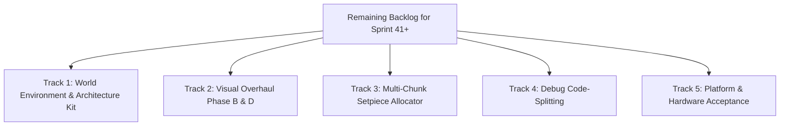

# Sprint 41: 10-Sprint Retrospective Audit (Sprints 31–40) & Development Roadmap

**Date:** 2026-09-16  
**Active Branch:** `dev/sprint-41`  
**Current Version:** `2.4.5-beta` (developing from `v2.4.4-beta` baseline `e017b06`)  
**Status:** Active Sprint Planning & Backlog Definition  

---

## 1. Executive Summary

Over the course of Sprints 31 through 40, Hunker Bunker underwent a massive transformation from an early beta prototype into a feature-complete, deep-localized, multi-ending tactical survival roguelike. The automated test suite expanded from 2,152 tests to **3,548 tests across 392 files** (100% passing), alongside **9/9 automated Playwright end-to-end browser tests** across 7 languages.

This document serves two purposes:
1. **Audits the last 10 sprints (Sprints 31–40)** to establish an exact historical accounting of delivered features versus deferred items.
2. **Catalogs all remaining work** across the codebase to establish the prioritized development backlog for Sprint 41 (`v2.4.5-beta`) and release readiness.

---

## 2. 10-Sprint Retrospective Audit (Sprints 31–40)

| Sprint | Baseline / Tag | Core Focus & Deliveries | Carried / Deferred Work |
|---|---|---|---|
| **Sprint 31** (Late Aug 2026) | `v2.3.1-beta` | **Multiplayer Authority & Telemetry**: Server-authoritative PvP damage reporting, co-op log review (logs 18/19), memory profiling, and Steam backend connection audit. | Physical 2-account Steam co-op verification; cross-region discovery constraints. |
| **Sprint 32** (Early Sep 2026) | `v2.3.2-beta` | **Astra Plan & Operator Cosmetics**: Astra boss review and initial integration, 3D operator chest patches with front-face culling, and startup UI scaling. | Packaged Linux/Deck asset load stall investigation. |
| **Sprint 33** (Sep 9, 2026) | `v2.4.0-beta` | **Expedition Coherence**: Depth contract O2 director relief, 79 transparent 3D model previews in Armory, reset-order bug fixes, and procedural 3D visual FX. | Real hardware-bound frame pacing sign-off. |
| **Sprint 34** (Sep 10, 2026) | `v2.4.0-beta` | **Weapon Cosmetics & Diorama VFX**: Two-tier weapon finish pipeline, Season 0 & Sprint 34 catalog registration, real-time tilt-shift diorama bokeh, shared co-op events, and 3D armory calibration. | Multi-chunk setpiece allocator; theme matrix holes. |
| **Sprint 35** (Sep 11, 2026) | `v2.4.1-beta` | **Retail Payload & Steam Review Remediation**: Reclaimed 10.5 MB by removing duplicate assets, disabled priced Vault Store for browser/non-prod builds to prevent unauthorized mock purchases, and updated store art packet for Valve re-review. | Valve store asset approval; Steamworks developer-only Cloud toggle. |
| **Sprint 36–37** (Sep 12–14, 2026) | `v2.4.2-beta` / `v2.4.3-beta` | **Master Deep-Play Audit (DP-01 through DP-52)**: 52 stability passes including Mayor Tina hostility, aim controls, live terminal objective journal, full-stage armory navigation, tactical map hazards, survivor cycles & identities, QA museum isolation, and repeatable Steam beta QA. | Architecture kit GLB routing (`arch_*`); un-isolating 21 faction props; 4 theme matrix holes. |
| **Sprint 38** (Sep 14, 2026) | `v2.4.3-beta` | **Stabilization & PR #67**: Merged PR #67, resolved edge-case regressions, stabilized test suite, and established baseline for ending cinematic renders. | Final video/audio muxing for all 10 endings. |
| **Sprint 39** (Sep 15, 2026) | `v2.4.3-beta` | **Ending Cinematics & Visual Overhaul Spec**: Rendered all 10 Blender ending scene blocks, generated procedural audio beds, and drafted the reflective HDR house style specification (AgX tone mapping, IBL reflections, selective bloom). | Phase B surface depth (derived normal/roughness maps); Phase C/D post grade. |
| **Sprint 40** (Sep 16, 2026) | `v2.4.4-beta` | **Deep Localization & Voice Pack Personas**: Full 7-locale translation sweep (0 unlocalized DOM sinks, `<html lang>` sync, coverage ratchet), Alternate Radio Voice Banks (Soviet Sub-Commander & AURA with 104 slots / 208 takes), persona HUD cards in intro cutscene, opening crash dialogue, AgX tone mapping & IBL reflections, and complete CodeQL remediation. | Commercial hardware/account acceptance; architecture kit routing. |

---

## 3. Current Product State as of `v2.4.4-beta`

- **Localization**: English (`en`), German (`de`), Latin American Spanish (`es-419`), Japanese (`ja`), Brazilian Portuguese (`pt-BR`), Russian (`ru`), Simplified Chinese (`zh-CN`). 0 unlocalized DOM sinks in runtime UI. Live in-session switching without reload.
- **Voice Packs**: Unlocked Soviet Sub-Commander (`4148`) and AURA (`4149`) with 52 cue slots each (104 slots, 208 high-quality takes). Auditionable in Armory; customized intro cutscenes and opening crash dialogue.
- **Cinematics**: All 10 game endings rendered end-to-end with Blender motion passes and mixed audio beds.
- **Rendering**: AgX tone mapping, PMREM deep-space environment map reflections on 94 PBR materials, and selective bloom.
- **Code Quality & CI**: 100% green across 392 test files (3,548 tests), zero ESLint warnings, all 7 presubmit audits clean, zero CodeQL security alerts, and bumped to `github/codeql-action@v4.38.0`.

---

## 4. Comprehensive Gap Audit: What Remains to Be Done

From auditing `docs/planning/`, `docs/reports/`, and the current codebase, the remaining work falls into five distinct engineering tracks:

### Track 1: World Environment & Architecture Kit Routing (High Priority)
*Evidence: `docs/planning/next-steps-handoff-2026-09-12.md` §1*
1. **Architecture Kit In-World Rendering**:
   - 24 GLB models (`arch_*`, `state_*`, `fixture_*`) exist and are registered in `WORLD_3D_MODELS`, but render nothing in-world because `createScatterSprite` in `src/threeGame.js` requires a `prop_` prefix and checks for a 2D sprite material.
   - **Fix**: Route 3D-only prefixes (`arch_`, `state_`, `fixture_`) directly to the 3D model path without requiring a 2D sprite material check. Add an in-world placement test.
2. **Faction Prop Accessibility**:
   - 21 faction props (Meridian radio, Tallow still, Vesper turret, hive structures, graves, laundry) in `CAMP_DRESSING_MODELS` are currently isolated to `camp.js:1024` and cannot be placed by room builds or set-piece modules.
   - **Fix**: Make faction dressing models addressable from room definitions and setpiece templates.
3. **Theme Matrix Holes**:
   - Four themes currently lack dedicated entries: `bio/medical`, `bio/security`, `bio/engineering`, and `active/storage`.
   - Example impact: Ring 2 hospital currently falls back to generic bio-resin rather than reading as a clinical/medical facility.

### Track 2: Visual Overhaul Phase B & D (Surface Depth & Grade)
*Evidence: `docs/planning/visual-overhaul-reflective-hdr-2026-09-13.md`*
1. **Derived Normal Maps (B1)**:
   - Generate normal maps from texture luminance so riveted plates, frost seams, and bone structures exhibit true surface relief under moving point/directional lights.
2. **Roughness Break-Up (B2)**:
   - Procedural noise-driven roughness variation to prevent uniform plastic sheens (low roughness for wet biomech, high for frost, mixed for worn metal plate).
3. **Emissive Maps (B3)**:
   - Separate glowing vascular circuitry into explicit `emissiveMap` assets so they interact with the bloom and tone mapping pipeline.
4. **Compositor Post-Processing (Phase D)**:
   - Match the in-game post stack with the Blender cinematic compositor (restrained chromatic aberration, subtle analog film grain).

### Track 3: Multi-Chunk Set Piece Allocator & Run Variance
*Evidence: `docs/planning/authored-setpieces-crash-site-and-run-building-plan-2026-09-12.md`*
1. **Setpiece Allocator Integration**:
   - `src/setpieceBuilds.js` and `crossing_valley_bridge_v1` exist. Connect the multi-chunk allocator into the main world plan so large authored set pieces spawn deterministically without breaking run viability.
2. **Room Vocabulary Expansion**:
   - Expand authored room archetypes from 8 toward ~40 rooms to break procedural monotony and ensure each run feels structurally distinct.

### Track 4: Architecture & Bundle Code-Splitting
*Evidence: `docs/planning/next-steps-handoff-2026-09-12.md` §0*
1. **Debug Tool Lazy-Loading**:
   - Approximately 3,300 lines of developer-only tools ship in the production bundle:
     - `debugConsole.js` (1,452 lines)
     - `debugTileGrid.js` (616 lines)
     - `debugShowroom.js` (606 lines)
     - `debugMuseum.js` (449 lines)
     - `debugBossArenas.js` (213 lines)
     - `debugCampSimulator.js` (199 lines)
   - **Fix**: Move behind dynamic `await import()` gated by `isDevMode` so production bundles omit debug tooling cleanly.

### Track 5: Commercial Steam Launch Readiness & Hardware Acceptance
*Evidence: `PRODUCT_STATE.md` and `docs/steam-review-resubmission-status-2026-09-11.md`*
1. **Two-Account Co-op Expedition Proof**:
   - Code is complete; requires witnessed test of two real Steam accounts completing a full expedition on the production relay.
2. **Physical Steam Deck Sign-off**:
   - Verify frame pacing, controller navigation, suspend/resume, and haptics on physical Steam Deck hardware.
3. **Steam Cloud Two-Machine Conflict Testing**:
   - Machine A → Machine B → Machine A save round-trip test.
4. **Steamworks Dashboard Actions**:
   - Ensure "Cloud support for developers only" toggle is disabled.
   - Confirm Valve approval on resubmitted graphical assets (Capsule, Header, Logo).

---

## 5. Sprint 41 Development Roadmap (`v2.4.5-beta`)

### Milestone Targets:
- [x] **Sprint 41.1**: Fix Architecture Kit GLB routing in `threeGame.js` (`arch_*`, `state_*`, `fixture_*`) and add placement regression test.
- [x] **Sprint 41.2**: Wire faction dressing models to room builders and close the 4 theme-matrix holes (`bio/medical`, `bio/security`, `bio/engineering`, `active/storage`).
- [x] **Sprint 41.3**: Implement Visual Overhaul Phase B (derived normal maps and roughness variation break-up) and Phase D (analog film grade).
- [x] **Sprint 41.4**: Integrate multi-chunk setpiece allocator into the world generator.
- [x] **Sprint 41.5**: Code-split debug tools into isolated bundle chunk (`debug-tools`), reducing player index bundle from 1,874 kB to 847 kB.
- [ ] **Sprint 41.6**: Execute physical hardware and two-account Steam acceptance testing.
