# Sprint 49 Implementation Game Plan: Hanging Systems & Features

**Author:** Antigravity Engineering  
**Target Branch:** `dev/sprint-49`  
**Prerequisites:** Sprint 48 Baseline (`v2.4.12-beta-f0676af38196`)  
**Scope:** Actionable implementation plans, code designs, required assets, and verification criteria for all hanging gameplay, networking, world, and presentation features.

---

## Domain 1: Co-op Multiplayer Authority & Networking

### 1.1 Companions in Co-op
- **Current State:** Companions follow and assist in solo play via `updateCompanions(delta)` in `src/threeGame.js:34722`. Co-op currently has a temporary exclusion gate (`1dd8056`) preventing companions in multiplayer.
- **Architectural Design:**
  - The **Host** owns companion simulation: pathfinding (`stepCompanionAlongPath`), target acquisition, weapon cooldowns, and assist triggers.
  - The **Host** broadcasts companion state inside the 30Hz snapshot:
    ```javascript
    // In broadcastEnemyStateSnapshot / multiplayer payload:
    companions: this.companions.map(c => ({
        id: c.id,
        wandererId: c.wanderer?.id,
        x: c.instance3d?.root?.position.x ?? c.sprite.position.x,
        z: c.instance3d?.root?.position.z ?? c.sprite.position.z,
        yaw: c.instance3d?.root?.rotation.y ?? 0,
        anim: c.instance3d?.currentClipName ?? 'idle',
        isFiring: c.isFiring ?? false,
        targetId: c.targetId ?? null
    }))
    ```
  - **Guests** receive the snapshot in `handleEnemyStateSnapshot`, lerping remote companion position/rotation and playing synced muzzle flash and projectile bursts without running independent A* or damage calculations.
- **Required Code Edits:**
  - `src/threeGame.js`: Lift `isCoop` guard in `spawnCompanion()` and `updateCompanions()`.
  - `server/relaySocket.js`: Ensure `companionSync` or snapshot packet payload carries companion arrays.
  - `src/threeGame.coopBossSync.test.js`: Add paired host/guest companion synchronization tests.
- **Resources Needed:** None (reuses existing Wanderer 3D assets and snail sprites).

---

### 1.2 Host-Authoritative Ring 1 Events & Bounties
- **Current State:** Ring 1 events (False Distress Signal, Unstable Vault) and arrival fights are rolled client-side. In co-op, clients could desync on event choices or reward drops.
- **Architectural Design:**
  - When a player interacts with a Ring 1 beacon or triggers a bounty, the client emits `requestWorldEvent({ eventId, siteKey })`.
  - The **Host** resolves RNG rolls and outcome:
    ```javascript
    // In ThreeGame.js:
    handleHostResolveEvent(eventData) {
        if (!this.isHost) return;
        const outcome = rollEventOutcome(eventData.eventId, this.runEntropy);
        this.netSocket.emit('worldEventResolved', {
            siteKey: eventData.siteKey,
            eventId: eventData.eventId,
            outcome
        });
        this.applyWorldEventOutcome(outcome);
    }
    ```
  - Both players display the modal simultaneously; in linchpin decisions, both players must confirm before resolution.
- **Required Code Edits:**
  - `src/coopTransitions.js`: Add `worldEvent` message schemas.
  - `src/threeGame.js`: Wire event triggers to socket emits when `this.isMultiplayer && !this.isHost`.
- **Resources Needed:** Locale strings in `src/locales/*.json` for partner choice prompts.

---

### 1.3 Tactical Context Pings v1
- **Current State:** No contextual ping system exists.
- **Architectural Design:**
  - Add action `TACTICAL_PING` to `src/inputActions.js` (Key: `MiddleClick` / `T` / Gamepad `D-Pad Left` or `R3`).
  - Raycast against world geometry under aim cursor:
    - If hit actor is enemy: `kind = 'enemy'`, target ID.
    - If hit actor is scrap/item: `kind = 'item'`, item name.
    - If hit terrain: `kind = 'point'`.
  - Broadcast via `netSocket.emit('tacticalPing', { x, y, z, kind, textKey, peerId })`.
  - Render an animated 3D beacon marker in the world with screen-edge clamp telemeter for 6 seconds and play localized UI ping SFX.
- **Required Code Edits:**
  - `src/inputActions.js`: Bind `ping` action.
  - `src/tacticalMap.js` & `src/threeGame.js`: Implement `spawnTacticalPingMarker(x, y, z, kind)` and telemeter HUD badge.
- **Resources Needed:**
  - Audio: `public/audio/sfx/ui_ping_context.wav` (tactical ping ping-in sound).
  - 2D Icon/Reticle: `public/icons/ping_enemy.png`, `public/icons/ping_item.png`, `public/icons/ping_caution.png`.

---

## Domain 2: Companion Systems (Solo & Co-op)

### 2.1 Escort-to-Camp (Settlement System)
- **Current State:** Companions follow indefinitely until run end; camps are resting/shop sites without residents.
- **Architectural Design:**
  - When the player enters a safe camp radius (`Math.hypot(player.x - camp.x, player.z - camp.z) < CAMP_RADIUS`) with a recruited companion, trigger an interaction prompt: `PRESS E TO SETTLE COMPANION AT CAMP`.
  - On settlement:
    - Companion detached from `this.companions` and added to `camp.residents`.
    - Stationed near campfire or camp tent with idle warmth/salute animation.
    - Adds ambient one-liner dialogue triggers and grants passive camp amenity (e.g. +10% repair efficiency or free medical patch).
- **Required Code Edits:**
  - `src/camps.js` & `src/threeGame.js`: Implement `settleCompanionAtCamp(companion, camp)`.
  - Unit test in `src/camps.test.js`.
- **Resources Needed:**
  - Dialogue strings for each settled Wanderer in `src/locales/*.json`.

---

### 2.2 Companion Active Assist Abilities
- **Current State:** Wanderers currently only fire a basic weapon shot every 12–25 seconds.
- **Architectural Design:**
  - Archetype-specific abilities:
    - **Scout Companion (Zephyr)**: *Spotlight Hologram* (reveals stealth enemies, opens weakpoints for 4s).
    - **Tank Companion (Grizzly)**: *Kinetic Bastion Barrier* (deploys forward 180° energy shield absorbing up to 10 incoming projectiles).
    - **Engineer Companion (Tesla)**: *Arc Stun Coil* (deploys micro-turret zapping up to 3 hostiles with 2s stun).
  - Triggered automatically when player drops below 40% HP or manually via tactical ping.
- **Required Code Edits:**
  - `src/wandererSystem.js`: Define `assistAbility` cooldowns and payload functions.
  - `src/threeGame.js`: Execute ability in `updateCompanions()` under assist condition.
- **Resources Needed:**
  - Sound effects for barrier deploy and coil zap in `public/audio/sfx/`.

---

## Domain 3: Gameplay, Combat & Narrative Mechanics

### 3.1 Actions Raise Infection Load
- **Current State:** `src/act2.js` has complete math for `s.infectionLoad` and `s.humanity`, but few combat actions feed into it.
- **Architectural Design:**
  - Wire concrete infection increments in `src/threeGame.js`:
    - Biomechanical/caustic spit damage: `+2` infection load per hit.
    - Walking through active fungal spore vents: `+5` infection load per 2 seconds.
    - Picking up and carrying Alien Eggs aboard: `+1` per 10 seconds carried.
    - Consuming bio-salve / unpurified rations: `+8` infection.
  - Call `this.act2?.addInfection(delta)` directly in `takeDamage()` when damage type is caustic or bio.
- **Required Code Edits:**
  - `src/threeGame.js`: In `takeDamage(damage, source, x, z)`, inspect `source` (`spore`, `bio_acid`, `hive_claw`) and invoke `this.act2.addInfection(...)`.
  - `src/act2.test.js`: Add tests verifying combat damage raises infection.
- **Resources Needed:** Screen-edge bio-vignette shader parameter `uInfectionVignette`.

---

### 3.2 Formation Damage Multiplier Integration (Lane 2)
- **Current State:** `scripts/combat-encounter-report.js` calculates coordinated-role coverage (anchor, suppressor, flanker, controller, support), but combat damage currently uses flat single-enemy tables.
- **Architectural Design:**
  - In `ThreeGame.updateScatter()`, compute active nearby enemy roles in player combat zone.
  - If anchor + suppressor are engaged simultaneously in crossfire, apply the coordinated formation damage multiplier (1.25x damage or increased projectile speed) as modeled in the combat report.
- **Required Code Edits:**
  - `src/threeGame.js`: In `fireEnemyProjectile` / `dealDamageToPlayer`, query `getActiveFormationBonus()`.
- **Resources Needed:** None.

---

### 3.3 Hive Queen Communion (`GAP-ST-01`) & Divergence Warnings (`GAP-ST-02`)
- **Current State:** `src/storyLinchpins.js` contains `joined` state mutation (`-30` humanity, lock `CLEAN_ESCAPE`), but lacks in-game interactive trigger and HUD notifications.
- **Architectural Design:**
  - **Chamber Trigger:** When entering Queen's sanctum with Mayor Tina, spawn interactive communion altar.
  - **Prompt:** Dual-choice dialog: `PURGE INFECTED LEADER` vs `COMMUNE WITH HIVE MIND`.
  - **Consequence:** Invokes `resolveStoryLinchpin('mayor_tina', 'joined')`.
  - **HUD Alert (`GAP-ST-02`):**
    - High-priority banner across screen: `CRITICAL TIMELINE DIVERGENCE`.
    - Subtext: `HUMAN RESISTANCE BONDS BROKEN // CLEAN ESCAPE ROUTE LOCKED`.
    - Triggers audio sting `window.AudioManager?.play('timeline_divergence')`.
- **Required Code Edits:**
  - `src/storyLinchpins.js` & `src/threeGame.js`: Wire trigger and HUD warning event.
  - `src/storyLinchpins.test.js`: Unit test coverage.
- **Resources Needed:**
  - Audio: Dramatic chord sting `public/audio/sfx/timeline_divergence_sting.wav`.

---

## Domain 4: Foundry & Crafting Systems (Slice 2)

### 4.1 Native Foundry Hub Panel Restyling
- **Current State:** `src/foundryHub.js` provides the unified tab skeleton, but embeds old legacy sub-panels into tabs.
- **Architectural Design:**
  - Re-skin Stash, Loadout, Fabricate, and Trade-up with the shared design system tokens:
    - Scout: Cyan `#22d3ee` / `#0891b2`.
    - Tank: Amber `#f59e0b` / `#d97706`.
    - Engineer: Brass `#f97316` / `#c2410c`.
  - Use unified 64px item cards (`src/itemCard.js`) across all tabs.
- **Required Code Edits:**
  - `style.css`: Clean up `.foundry-hub-content` scoped classes.
  - `src/foundryHub.js`: Direct DOM rendering rather than wrapping old containers.
- **Resources Needed:** None.

---

### 4.2 In-Expedition Field Workbench (Invisible Essentials Phase 6)
- **Current State:** Crafting only happens at the Bunker Foundry before deployment.
- **Architectural Design:**
  - Place a Field Workbench prop at Safe Camps.
  - Approaching it prompts `PRESS E TO ACCESS FIELD WORKBENCH`.
  - Restrict recipe catalog to field-relevant items: ammo conversion, suit condition repair kits, medical patches, and weapon mods.
- **Required Code Edits:**
  - `src/camps.js` & `src/fieldWeapon.js`: Add workbench interactable and filtered crafting modal.
- **Resources Needed:**
  - 3D Model: `public/3d/runtime/prop_field_workbench.glb`.

---

## Domain 5: HUD & Visual Presentation Polish

### 5.1 Tactical Map Radar Ring & Dock Ability Slots
- **Current State:** Radar scan line is separate from the map disc; ability cooldowns sit inside a standard slot.
- **Architectural Design:**
  - Draw the radar sweep directly into the circular compass bezel of the lower dock map (`#dock-map-disc`).
  - Add dedicated visual housings for Dash Stamina gauge and Melee Smash charge meter on the Arms panel.
- **Required Code Edits:**
  - `style.css` & `src/hudInformationArchitecture.js`: Update canvas draw routines and CSS grid placement.
- **Resources Needed:** Bezel sprite mask `public/ui/dock_radar_bezel_mask.png`.

---

### 5.2 Talking Radio Portraits
- **Current State:** Radio voice lines show text-only subtitle boxes.
- **Architectural Design:**
  - Add character portrait container to `#mothership-dialogue`:
    - Commander: Gritty veteran with cybernetic eyepatch.
    - AURA: Glitching holographic AI waveform.
    - Mayor Tina: Human/corrupted split portrait depending on Act.
  - Animate mouth/waveform subtly using Web Audio analyzer node when VO audio is actively playing.
- **Required Code Edits:**
  - `index.html`, `style.css`, and `main.js`: Add `#dialogue-portrait` element and audio analyzer hook.
- **Resources Needed:**
  - 2D Portrait Assets: `public/ui/portraits/commander.png`, `public/ui/portraits/aura.png`, `public/ui/portraits/tina_human.png`, `public/ui/portraits/tina_corrupted.png`.

---

## Domain 6: 3D Art & Character Models

### 6.1 Missing Achievement Cosmetics (5 GLBs)
- **Assets Required:**
  1. `chassis_scout_ghost_runner.glb` (sleek stealth scout chassis with carbon-fiber accents).
  2. `skin_scout_chrono_drifter.glb` (scout suit with glowing temporal harness).
  3. `skin_tank_bunker_bastion.glb` (reinforced tank armor plates with hydraulic shoulder guards).
  4. `skin_engineer_archival_constructor.glb` (heavy tool harness and utility visor).
  5. `skin_engineer_hive_weaver.glb` (biomechanical chitin-infused engineer suit).
- **Target Specifications:**
  - Poly count: 12,000–18,000 triangles.
  - Textures: 1024×1024 metallic-roughness PBR (baseColor, normal, metallicRoughness, emissive).
  - Bones/Rig: Fully weighted to standard character armature (`spine`, `upper_arm`, `lower_arm`, `pelvis`, `thigh`, `calf`).

---

### 6.2 Key Enemy 3D Meshes (6 GLBs)
- **Assets Required:**
  1. `sentinel.glb` (hovering patrol drone with searching spotlight eye).
  2. `alien_proto_crawler.glb` (quadrupedal bio-crawler with mandibles).
  3. `bio_charger.glb` (massive armored brute with hardened ramming carapace).
  4. `boss_corrupted_scout.glb` (fallen operative scout with twin pulse smgs).
  5. `boss_corrupted_tank.glb` (heavy seismic operative with shockwave hammer).
  6. `boss_corrupted_engineer.glb` (corrupted operative with arc deployer backpack).
- **Target Specifications:**
  - Optimized GLB exports with Dracro compression disabled for runtime performance.
  - Built-in animations: `idle`, `walk`/`run`, `attack`, `hurt`, `death`.

---

## Domain 7: Engine Performance & Draw-Call Optimization

### 7.1 Chunk-Mount Pacing (`syncVisibleChunks`)
- **Bottleneck:** Mounting 4–6 neighboring bunker rooms on a single frame can take 40–60ms of CPU time creating Three.js geometries and materials.
- **Architectural Solution:**
  - Implement a **time-sliced chunk mount queue**:
    ```javascript
    mountChunkSlice(deadlineMs = 8) {
        const start = performance.now();
        while (this._chunkMountQueue.length > 0 && performance.now() - start < deadlineMs) {
            const chunk = this._chunkMountQueue.shift();
            this.buildChunkMesh(chunk);
        }
    }
    ```
  - Mount maximum 1 chunk per frame during combat, or defer chunk decoration to background requestIdleCallback.

---

### 7.2 Instanced Pickups & Props
- **Bottleneck:** 1,000+ individual Three.js sprites/meshes for scrap bolts, ammo clips, and debris lead to excessive draw calls.
- **Architectural Solution:**
  - Replace individual `Mesh` objects for scrap pickups with `THREE.InstancedMesh`.
  - Maintain dynamic instance matrices and color buffers.
  - Single draw call handles up to 500 scrap pieces across the entire bunker floor.
- **Required Code Edits:**
  - `src/threeGame.js`: Implement `ScrapInstanceManager` using `THREE.InstancedMesh`.
- **Expected Gain:** 1,500 fewer draw calls; 30–45% frame-time reduction on Steam Deck.

---

## Recommended Sprint 49 Execution Order

```mermaid
graph TD
    subgraph Phase 1 [Phase 1: Core Multiplayer & Companions]
        A["1.1 Companions in Co-op"] --> B["1.2 Host-Authoritative Ring 1 Events"]
        B --> C["1.3 Tactical Pings v1"]
    end

    subgraph Phase 2 [Phase 2: Gameplay Depth & Narrative]
        D["2.1 Escort-to-Camp"] --> E["3.1 Actions Raise Infection"]
        E --> F["3.3 Queen Communion (GAP-ST-01/02)"]
    end

    subgraph Phase 3 [Phase 3: Engine Optimization & Polish]
        G["7.1 Chunk-Mount Pacing"] --> H["7.2 Instanced Pickups"]
        H --> I["5.1 Map Radar Ring & Dock Slots"]
        I --> J["4.1 Native Foundry Hub Restyle"]
    end

    subgraph Phase 4 [Phase 4: Asset Ingestion]
        K["6.1 5 Achievement GLBs"] --> L["6.2 6 Enemy GLBs"]
    end
```


