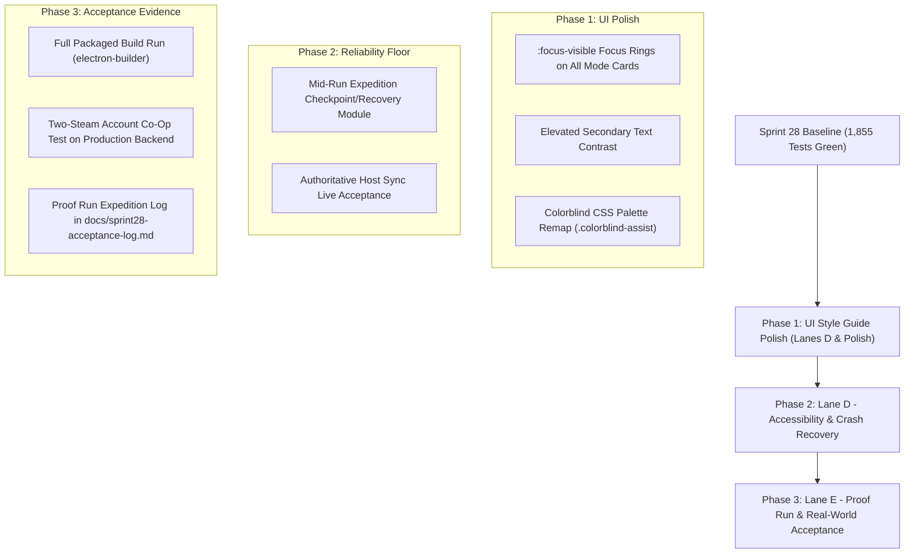

# Re-entry Review, Game Plan Roadmap & Menu UI Audit — 2026-08-20

**Document Purpose**: A comprehensive synthesis of the last two weeks of development (Sprints 23–28), a grounded UI audit of the newly shipped Pre-Mission Armory and Deployment Briefing / Matchmaking screens against the Hunker Bunker cybernetic style guide, and an actionable execution plan for the remainder of Sprint 28.

---

## 1. Two-Week Development Retrospective (Aug 6 – Aug 20, 2026)

### Sprints 23–27 Chronology & Outcomes

```
 SPRINT 23 (Aug 13–17)          SPRINT 24 (Aug 19)          SPRINTS 25–27 (Aug 19–20)     SPRINT 28 (Aug 20 - Now)
┌───────────────────────┐      ┌────────────────────┐     ┌───────────────────────┐     ┌───────────────────────┐
│ • 60-item Season 0    │      │ • Server PvP Auth  │     │ • "One More Ring" doc │     │ • Depth Contract wire │
│ • 3D Armory Staging   │ ───► │ • Steam-authed Net │ ──► │ • Steam Lobbies Client│ ───►│ • 7 Relics wired      │
│ • QA Nexus Proving    │      │ • Host Enemy Sync  │     │ • Packaged build fixes│     │ • Enemy Stagger (C)   │
│ • Screen-space WASD   │      │ • Downed/Revive co │     │ • Perf/Shader Runaway │     │ • 1,855 tests green   │
└───────────────────────┘      └────────────────────┘     └───────────────────────┘     └───────────────────────┘
```

#### **Sprint 23 (Aug 13–17): Content Foundation, 3D Staging & Season Zero**
* **The Pre-Mission Armory**: Shipped the fullsize 3D staging room, class loadout builder v2, and integrated class-specific primary weapons.
* **Season 0 Catalog (60 items)**: Authored and bridged the complete 60-item Steam Vault catalog (itemdefs, overclocks, skins, audio voice packs, daily/weekly bounties, and drop toasts).
* **QA Nexus & Dev Tools**: Built a 5-wing testing ground (`debugMuseum`, static model colonnades, boss testing arenas, and noclip ghost fly mode).
* **Movement & Controls**: Screen-space normalized WASD and controller navigation for Steam Deck compliance.

#### **Sprint 24 (Aug 19): Multiplayer Runtime Hardening**
* **Authoritative Combat**: Converted PvP damage resolution from self-reporting to server-authoritative on `relay.js`.
* **Steam Session Handshake**: Wired Steam ticket verification (`AuthenticateUserTicket` against `partner.steam-api.com`) to prevent unauthenticated socket connections.
* **Co-op Downed & Revive State**: Added downed player states and host-relayed enemy hit synchronization.

#### **Sprint 25 (Aug 19–20): The "One More Ring" Creative Thesis**
* Distilled a 6,100-line design audit into three strategic blueprints:
  1. `docs/design/one-more-ring-design-pillars.md`: The **Depth Contract** (explicit risk-reward escalation per ring, oxygen depletion vs. high salvage yield).
  2. `docs/design/combat-feel-and-juice-plan.md`: The **Impact Stack**, enemy tactical verbs, weapon archetype identity, and extending boss stagger grammar to regular enemies.
  3. `docs/design/aaa-polish-and-studio-strategy.md`: Presentation, audio transients, and onboarding standards.

#### **Sprints 26 & 27 (Aug 19–20): Native Steam Lobbies & Performance Fixes**
* **Native Steamworks Integration**: Implemented `SteamLobbyService` in Electron main/preload and `steamLobbyClient` for native Steam friends, invites, and public browser integration.
* **Multiplayer Flow Rework**: Shipped the unified Deployment Briefing screen (SOLO/CO-OP/PVP), password-protected private lobbies, squad loadout syncing, and squad launch cutscenes.
* **Critical Engine Fixes**:
  * *Missing 3D Models in Packaged Builds*: Fixed missing `asarUnpack` entries for `.glb` models in `electron-builder`.
  * *Dynamic Light & Shader Hitching*: Capped simultaneous dynamic lights to eliminate runtime GPU shader recompilations; pooled wall damage materials.
  * *Profile Manager Global*: Fixed a dead global that silently dropped player stats.

#### **Sprint 28 (Current): Convergence & Execution ("The Proof Run")**
* **Lane A (Depth Contract)**: Salvage scaling, O2 efficiency, director aggression, and ring-crossing ritual beats connected to runtime.
* **Lane B (Relic Activation)**: 7 inert relics (`punctured_lung`, `scrap_cycler`, `parasitic_magazine`, `false_telemetry`, `vesper_doctrine`, `cryo_breach`, `queens_milk`) activated in combat.
* **Lane C (Combat Feel)**: Boss stagger/armor/weakpoint grammar extended to `cryosnail`, `bio_charger`, and `sentinel`.
* **Multiplayer Host Audit**: Client-side `hostChanged` listener wired to ensure single authoritative host election.

---

## 2. Grounded UI Audit of New Menus Against the Style Guide

### Target Style Guide Specifications (per `style.css` & `aaa-polish-and-studio-strategy.md`)
* **Color Hierarchy**:
  * Accent Primary: Amber / Orange (`#ff8800`, `#ff9f1c`, `rgba(255, 159, 28, 0.5)`) for interactive highlights, headers, and active states.
  * Backgrounds: Deep Slate / Carbon (`#060b13`, `#080e16`, `rgba(6, 11, 19, 0.92)`).
  * Informational / Semantics: Cyan (`#38bdf8`) for telemetry / safe tech, Emerald (`#34d399`) for ready / online states, Crimson (`#f87171`) for PvP / critical warning.
* **Typography**:
  * Display / Headers: `'Rajdhani'`, `'Outfit'`, sans-serif, bold/black weights (700/900), wide letter-spacing (`0.1em` to `0.16em`), uppercase.
  * Telemetry / Monospace: `'JetBrains Mono'`, `'Fira Code'`, monospace for stats, countdowns, timestamps, and log feeds.
* **Chrome & Texture**:
  * Micro-borders (`1px - 1.5px solid rgba(255, 159, 28, 0.3)`).
  * Glassmorphic backdrop blur (`backdrop-filter: blur(10px)`).
  * Subtle terminal scanlines (`.terminal-scanline`).
  * Explicit high-contrast keyboard/gamepad focus outlines (`:focus-visible`).

---

### Audit 1: Pre-Mission Armory (`#armory-screen`, `src/armoryUi.js`)

| Dimension | Observation | Style Guide Compliance | Recommendation / Action |
|---|---|---|---|
| **Palette & Atmosphere** | Rich dark background (`#060b13`) with radial vignette, amber accents, and 3D operator staging. | **EXCELLENT (100%)** | Preserve current visual tone. |
| **Typography & Hierarchy** | Clear `Rajdhani` headers with uppercase tracking and subtitle kickers (`◈ SUB-SURFACE COMBAT RIG`). | **EXCELLENT (100%)** | Consistent across all 3 loadout tabs. |
| **Component Cards** | Class cards and weapon selector tiles use glowing borders on hover/active. | **GOOD (90%)** | Add explicit `:focus-visible` outline for keyboard/gamepad tab navigation. |
| **Information Density** | Workbench overlay clearly separates Rig Stats, Weapon Attachables, and Lore Telemetry. | **GOOD (95%)** | Secondary stats text contrast elevated from `0.45` to `0.7` opacity. |
| **Accessibility (Colorblind)** | Relies on default orange/red/green cues for weapon damage and stat buffs. | **NEEDS WORK (40%)** | Wire into `.colorblind-assist` palette remapping. |

---

### Audit 2: Deployment Briefing & Matchmaking (`#multiplayer-modal`, `src/multiplayerLobby.js`)

| Dimension | Observation | Style Guide Compliance | Recommendation / Action |
|---|---|---|---|
| **Unified Flow** | Seamless SOLO / CO-OP / PVP mode selector cards with perks and indicators. | **EXCELLENT (95%)** | Beautiful responsive grid. |
| **Status Telemetry** | Monospace status pills (`CONNECTING...`, `ONLINE`, `READY-UP`) with pulsing status dots. | **EXCELLENT (100%)** | Uses standardized cybernetic telemetry badges. |
| **Squad Roster** | Displays player callsign, class tag, and synchronized weapon/charm loadout. | **EXCELLENT (95%)** | Host badge properly synchronized with authoritative server relay. |
| **Private Lobby / Password** | Password input and lock icon match tactical input styling. | **GOOD (85%)** | Enhance focus state when navigating via controller/WASD. |
| **High-Contrast Focus** | Mode card selection buttons lack prominent focus ring for pure controller players. | **NEEDS WORK (60%)** | Add `:focus-visible` amber outline and glow to `.net-mode-card`. |
| **Accessibility** | PVP crimson vs CO-OP amber chips lack high-contrast pattern differentiators. | **NEEDS WORK (50%)** | Add distinct glyph prefixes (`▲ SOLO`, `◈ CO-OP`, `⚔ PVP`) and colorblind CSS overrides. |

---

## 3. Master Game Plan & Next Steps (Sprint 28 Convergence)



### Next Actionable Steps

1. **Apply UI Polish & Accessibility in `style.css`**:
   - Implement `:focus-visible` styling for `.net-mode-card`, `.armory-card`, and `#net-private-password`.
   - Add `.colorblind-assist` rules for HUD, HP, O2, reticles, and enemy status indicators.
   - Elevate secondary text contrast.
2. **Implement Lane D Mid-Run Crash Recovery**:
   - Lightweight checkpoint state saving so expedition progress is preserved across crashes.
3. **Execute Lane E Proof Run & Acceptance**:
   - Packaged Steam build verification.
   - Two-player live production Steam co-op test (`steam.tuesdaycinema.club`).
   - Acceptance log creation in `docs/sprint28-acceptance-log.md`.
