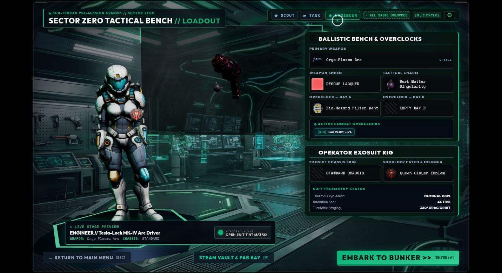
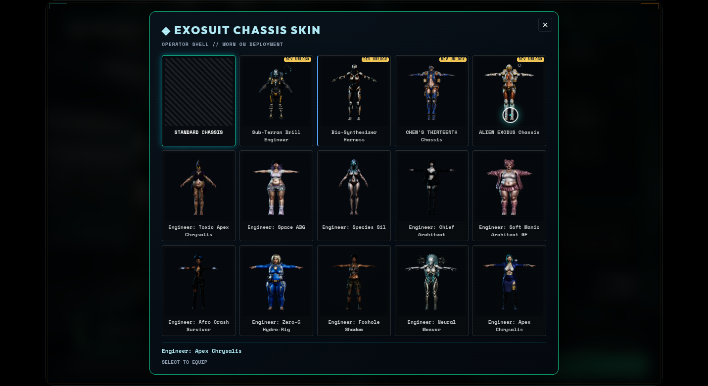
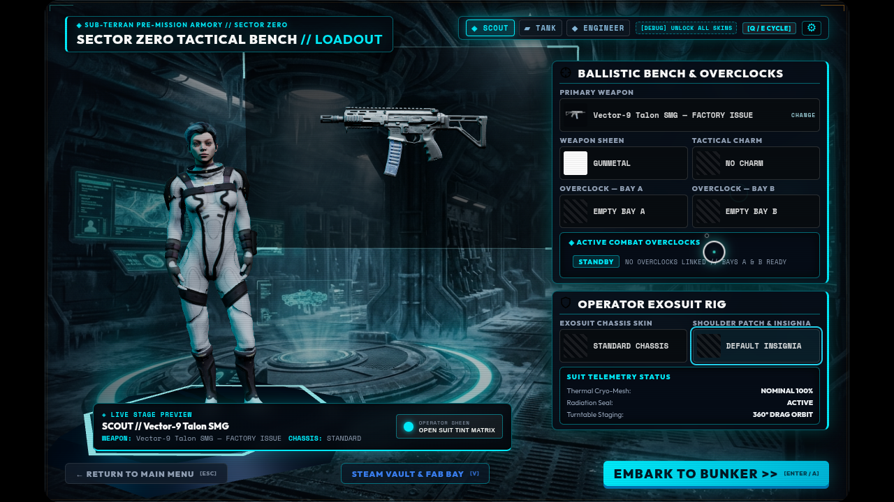

# Armory implementation and verification

Status: verified implementation report | Owner: Codex | Updated: 2026-09-09
Review: next Armory or asset change

Implemented in the game on Mountain, continuing from commit `ea18086` and preserving the recent work already there. The requested Antigravity implementation plan has also been updated at its original location.

## What changed

- **Primary weapon:** one fitted-weapon button opens the weapon grid and selects its frame and model together. Stage and slot labels use item names instead of numeric IDs. Achievement weapon rewards are correctly identified as weapons.
- **Separate sheens:** weapon sheen remains independent of operator sheen. It restores on the bench, follows the weapon into gameplay, and survives reload. Existing achievements/world accomplishments grant the corresponding sheens; future milestone events are connected too. Material copies prevent one weapon's tint from changing another model or its charm.
- **Charms:** a dedicated slot and accurate preview, with the actual charm mounted on both the bench and deployed weapon. Missing charm art leaves a usable weapon. Late Armory loads cannot override the last charm/module selection.
- **Menus:** matching tactical styling, equal cards, unknown scrambled names and blurred/question-mark previews for locked items. Full selected-item names appear below the grid. Keyboard arrows move through cards; Escape returns focus to the fitted slot; Tab stays in the dialog.
- **Layout:** all seven fitted controls remain visible without scrolling. Weapon sheen/charm and chassis/insignia share paired rows. Redundant specification text was removed. The hero and gun remain clear of the sidebar.
- **Previews:** 79 transparent pictures rendered directly from the shipped 3D models, totaling 4,213,332 bytes. Community operators now have distinct pictures. Model renders replace the four green-backed icons. Five rewards without models use their existing achievement emblems.

## Asset inventory

The [generated asset list](armory-asset-gaps.md) covers **100 offered items**: zero missing names, zero missing previews, and zero green-backed Armory previews. It uses the same item lists and preview resolver as the UI and checks model files on disk.

Remaining model work is explicitly listed:

| Item | Work still needed |
| --- | --- |
| GHOST Chassis | Author its unique chassis model. |
| QUICK STUDY Carbine | Author its unique weapon model. |
| HUNKERED Autocannon | Author its unique weapon model. |
| ARCHIVIST Arc Driver | Author its unique weapon model. |
| KIN Arc Driver | Author its unique weapon model. |
| Talon-C Carbine | Replace the existing blockout with finished, textured art. |

Decals are 2D artwork and do not need separate 3D models. Original source artwork was retained; replacing the Armory previews does not remove old images from unrelated screens.

## Verification

| Check | Result |
| --- | --- |
| Full unit suite | 2,620 tests pass across 292 files. |
| Lint | Pass. |
| Documentation audit and diff whitespace check | Pass. |
| Production build and media audit | Pass. |
| Presubmit and generated asset checks | Pass. |
| Menu layout matrix | 84 combinations pass: seven pickers × three classes × four screen sizes. |
| Screen sizes | 1280×800, 1431×781, 1920×1080, 1280×720. |
| Ownership | Locked weapon clicks leave the loadout unchanged. |
| Keyboard | Focus stays in the picker; Escape returns to its slot. |
| Deployment | Cryo-Plasma weapon, RESCUE LACQUER sheen and Dark Matter charm verified on the live weapon. |
| Reload | Selected sheen remains equipped after a full page reload. |
| Browser errors | None in the layout and final deployment runs. |

The final deployed weapon reports `ClassWeapon_tesla_lock_skin4103`, sheen `#ff6262`, and `charmMounted: true`. The [layout evidence](assets/armory-continuation-2026-09-09/verification.json) and [final deployment evidence](assets/armory-continuation-2026-09-09/deployment-verification.json) are separate: the first run exposed the missing gameplay charm hookup, which was then implemented and verified in the second.

The repeatable repository checks are `npm run audit:armory-assets` and `node scripts/verify-armory-ui.mjs` against a running development server. The browser script uses a fresh, isolated profile. Set `ARMORY_PREVIEW_ORIGIN` when using a port other than 5173.

## Screenshots

Fitted Engineer, weapon sheen, charm and named insignia:

Distinct community chassis previews in one grid:

All controls visible at 1280×720:

Changes are saved in Mountain's working tree. No commit, push or release publication was performed. Browser and automated verification do not claim Steam service or hardware acceptance.
