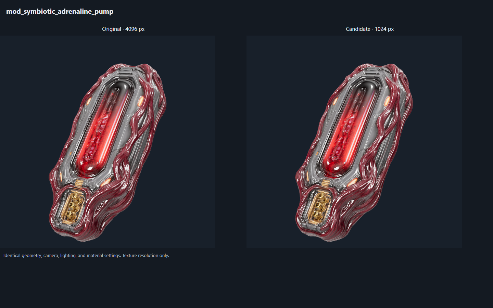
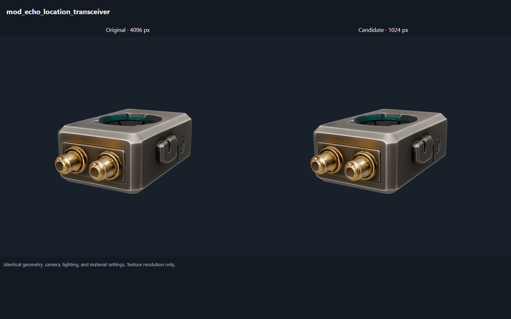
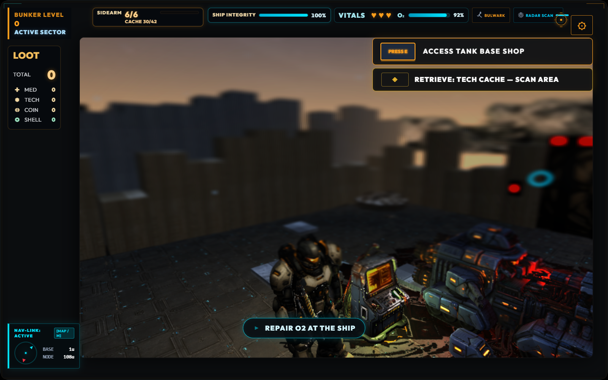

# Hunker Bunker — First Improvement Batch

Status: implementation evidence | Owner: project maintainer + Codex | Updated: 2026-09-08 | Review: before merge and packaged performance capture

## Outcome and scope

The detailed plan and Mayor Tina correction were completed first. After the owner asked to proceed, this batch repaired the failing retail payload gate, corrected misleading performance evidence, and improved the diagnostics needed to investigate the deployment freeze. This is a completed first batch, not completion of the entire improvement program.

Source baseline: `69f31eb`, version `2.3.1-beta`. Working branch: `fix/mayor-tina-and-astra-plan`. Changes remain uncommitted on `mountain`; no remote push, release, or Steam upload was performed.

## Retail payload repair

The public payload was 2,855,028,380 bytes across 1,333 files. It exceeded the unchanged 2,700 MiB limit (2,831,155,200 bytes) by 23,873,180 bytes. Generated asset reports were also stale.

Two small overclock models carried three embedded 4096×4096 PNG textures apiece. Their runtime textures were reduced to 1024×1024 using the texture-only `resize` operation in glTF Transform CLI 4.5.0. No mesh simplification or broad asset deletion was performed.

| Asset | Original bytes | New bytes | Triangles, unchanged |
| --- | ---: | ---: | ---: |
| `mod_symbiotic_adrenaline_pump.glb` | 40,393,748 | 5,478,680 | 50,284 |
| `mod_echo_location_transceiver.glb` | 30,854,568 | 4,479,148 | 49,698 |
| Combined | 71,248,316 | 9,957,828 | 99,982 |

**Saved: 61,290,488 bytes (58.45 MiB).** Final public payload: **2,793,737,892 bytes**, with **37,417,308 bytes (35.68 MiB)** remaining under the existing cap. File count remains 1,333. Regenerated `steam/referenced-assets.json` and `steam/retail-asset-report.json` pass their check mode. The audit reports no missing references or invalid media, 53 unknown assets, and 15 duplicate groups. Existing tolerated codec mismatches and duplicate debt are not claimed fixed.

### Integrity and appearance

- Pre-optimization inputs were retained byte-for-byte under `art/source/3d/astra-texture-budget-2026-09-08/` on mountain. That source directory is ignored by the repository. The original runtime files also remain recoverable from baseline commit `69f31eb`; the derivative change does not remove that history.
- Decoded accessor content was compared by accessor type, component type, count and SHA-256 of actual element bytes, respecting buffer strides. The before/after sets match for both models. Each retains one scene node and one material.
- GLB validation reports zero errors for each candidate. The existing `MESH_PRIMITIVE_GENERATED_TANGENT_SPACE` warning remains on both originals and derivatives; this operation adds no new warning.
- Both versions loaded through the project's Three.js/GLTFLoader in a browser comparison with matched camera, lighting and material settings. No page errors were reported. Silhouette, emissive details, material identity and the visible surface treatment remain coherent at the reviewed display size. Fine texture detail is necessarily reduced; this is not a claim of pixel equality or hardware acceptance.
- Asset provenance records name the derivative process and retained inputs. The original creator/method/redistribution questions remain `needs-review`.





### Reproduction and rollback

For each of the two asset names, starting from its retained pre-optimization input:

```sh
npx --yes @gltf-transform/cli@4.5.0 resize INPUT.glb CANDIDATE.glb --width 1024 --height 1024
```

Inspect and validate the candidate before replacing the corresponding file in `public/3d/runtime/new3ds/`, then regenerate with `npm run audit:retail-assets`. The [official CLI documentation](https://gltf-transform.dev/cli) describes the individual texture resize operation. Preserve the pinned tool version and compare geometry content rather than whole-GLB hashes, since binary layout and image bytes change.

Rollback restores either retained input or its baseline Git blob to the matching runtime path and regenerates the two asset reports. Restoring both originals also restores the known payload-budget failure; do not hide that consequence by increasing the cap.

## Correct performance evidence

The old Log 19 report used its final menu snapshot as evidence for gameplay performance. The following raw facts replace that interpretation; entry numbers are zero-based indices in `docs/logs/log19.json`.

| Evidence | What it actually establishes |
| --- | --- |
| Final state: `appPhase=gameover`, `performance.profile=menu`, drawing buffer 480×480 | App phase and rendering profile differ. The render measurements belong to menu presentation. |
| Final estimated GPU bytes: 346,149,762; texture bytes 329,078,136; geometry bytes 11,689,482 | Estimated menu resources, not measured total driver VRAM or a matched gameplay comparison. |
| Final GPU `averageMs=2.03`, `samples=1900` | Exponential moving average at that moment. Neither an arithmetic session average nor measured FPS. |
| Gameplay contexts in entry 476 | 1,144,131,122 estimated GPU bytes, with smoothed GPU values around 25–27 ms. These contradict interpreting the menu number as a proven gameplay reduction. |
| Long-task entry 216 | Duration 8,574 ms, start 62,733 ms, `lastPhase=null`, empty `activePhases`. The last recorded chunk mount starts at 62,589.7 ms and lasts 30.5 ms, ending before the task. |
| Several nearby GLB completions around 10,271 ms | Correlation and end-to-end elapsed time. They do not prove synchronous fetching occupied the CPU for the 8.574-second task. |

The historical Log 19 analysis and Sprint 31 issue summary now carry corrections instead of the unsupported 68.5% memory reduction, 12× speedup, and synchronous-fetch attribution. `PRODUCT_STATE.md` records the current evidence and caveats. The short co-op session remains useful observation, not a full expedition or Cloud-conflict certification.

## Runtime diagnostics changes

### Keep GPU samples within their rendering profile

`setPerformanceProfile()` resets the GPU timer on an actual menu/gameplay transition. Re-entering the same profile does not reset it. Reset now ends and deletes an active query and discards pending queries before clearing statistics, so delayed results from the previous profile cannot contaminate the new one. Snapshot data explicitly names `averageKind: exponential-moving-average`.

Tests cover late results arriving after reset, a reset during an active query, fresh sampling after reset, idempotent disposal, and both real profile transitions through the ThreeGame method.

### Separate loading latency from synchronous work

The existing bounded phase helper moved into `src/perfPhases.js`. Render/chunk/wall diagnostics keep their previous behavior. `world3dOverlay.js` now records:

1. End-to-end asynchronous template-loading latency, shared/cache requests and failures through the existing asset-load report.
2. Synchronous `world-model:clone` spans with model type and URL.
3. Synchronous `world-model:prepare` spans covering normalization, bounds, material flags and geometry bounds, also with type and URL.

No synchronous phase stays open across `await loadAsync()`. A shared in-flight request still loads once and yields independent scene clones. Failed requests still evict their rejected cache entry so a retry can recover. Exception cleanup and the 64-entry history cap are tested.

These spans improve attribution for work after GLTFLoader resolves. They do not instrument the loader's internal parse/decode stages or prove that texture upload/shader compilation is the freeze cause. Those stages still need a packaged browser CPU trace and matched scene captures.

## Verification

| Check | Result |
| --- | --- |
| Targeted regression suite | 28 tests pass across GPU timing, shared phases, world-model loading/catalog, diagnostics and Tina. |
| Full repository suite | **2,484 tests pass across 277 files**, 20.55 seconds reported by Vitest. |
| Lint | `npm run lint` passes. |
| Generated presubmit checks | All pass: 7 controlled Steam claims / 2 copy files; 39 procedural WAVs; retail asset audit; 71-item catalog; 43-track soundtrack; 72 chroma assets / 0 unapproved. |
| Production web build | Pass, 222 transformed modules; 50 required door/cinematic media assets pass. |
| Documentation audit | Pass: 12 canonical files and 271 current/non-archive Markdown files; Sprint 30 remains the only active sprint. |
| Diff review | Runtime diff reviewed; `git diff --check` passes. |

### Live browser observation

The isolated Windows Chrome session traversed title → callsign → Tank selection → Armory → solo deployment → intro skip → input-enabled gameplay at 1440×900. No page errors or Vite error overlay were reported. This used the Vite dev build over an SSH loopback tunnel, not Steam/Electron, and does not establish packaged frame pacing.

A temporary browser observation wrapper around the existing timer reset recorded 663 menu samples before the real profile transition, followed immediately by zero samples, null latest/average values, and zero pending queries. Gameplay then accumulated fresh samples. The wrapper only captured before/after data and called the original reset normally; it is not part of the game source.

The live asset report recorded 35 world-model loads, 50 cache/shared requests and zero failures. Retained synchronous spans include NPC normalization and Tina/cup cloning and preparation. The gameplay snapshot confirmed `inputActive=true`, profile `gameplay`, and Tina at `(9, -15)` for this run. No debug teleport or invulnerability was used in this batch's startup check.

[Saved diagnostic observation](assets/astra-review-2026-09-08/runtime-diagnostics.json)



## Next evidence required

The deployment freeze remains open. Capture a Steam/Electron CPU trace covering deployment on the previously affected Windows installation, then identify which operation overlaps the stall before selecting a scheduling, decoding, texture-upload or shader fix. Repeat the same gameplay scene, seed, drawing buffer and graphics settings before and after that fix.

The detailed plan also keeps full-run readability/balance, actual quest/depth connections, recovery behavior, two-account expedition/Cloud tests and physical Deck acceptance open. This batch does not claim those later work packages are complete.
