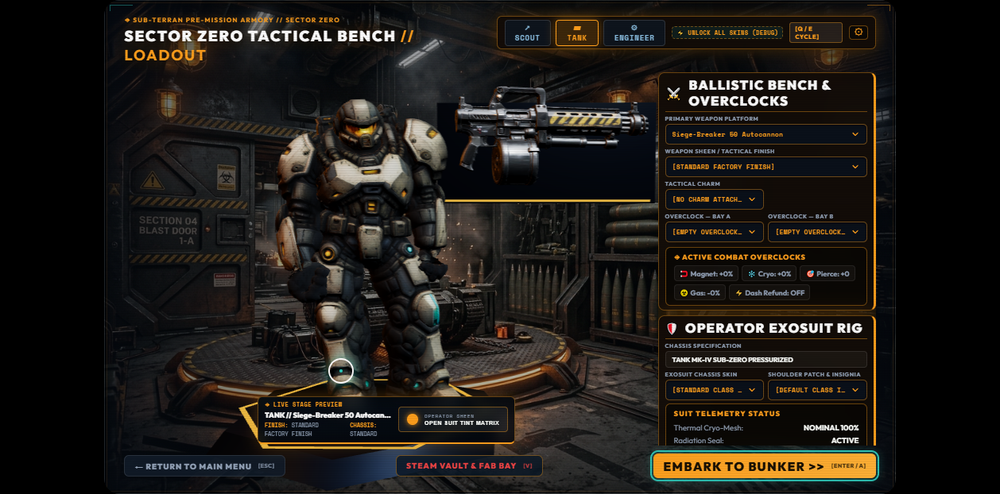
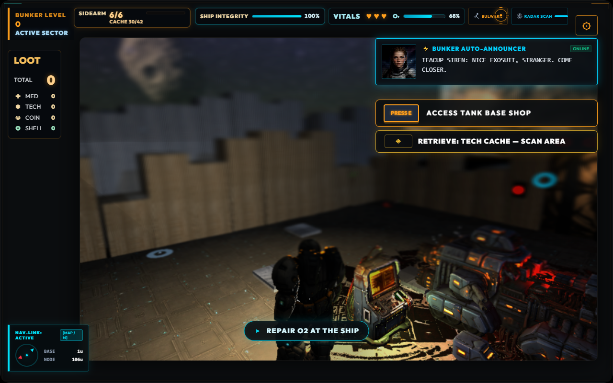
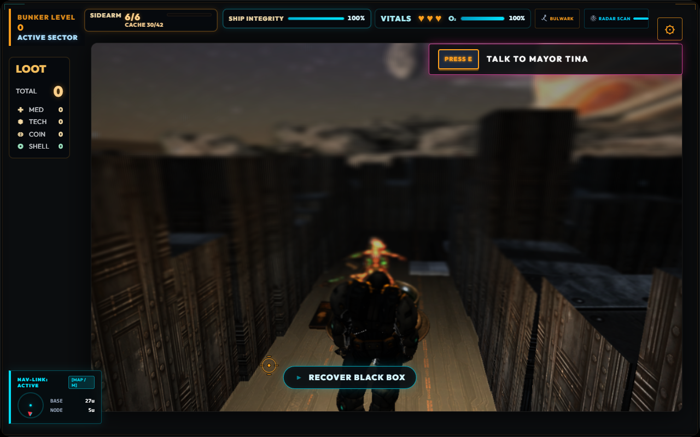
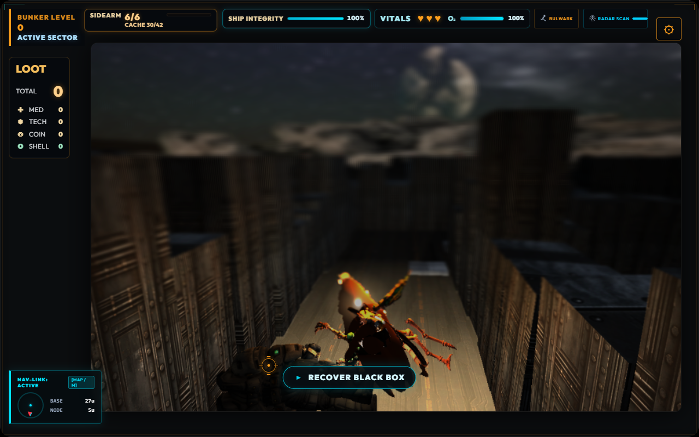

# Hunker Bunker — September 8 Review and Mayor Tina Verification

Status: evidence report | Owner: project maintainer + Codex | Updated: 2026-09-08 | Review: before merge and package promotion

## Scope and baseline

The detailed improvement plan was written and saved before the gameplay edit. It is stored in the repository at `docs/planning/astra-game-improvement-plan-2026-09-08.md`, with a link from `docs/planning/README.md`.

Baseline: `69f31eb`, package `2.3.1-beta`, branch `dev/sprint-catchups`. Work branch: `fix/mayor-tina-and-astra-plan`. This report records the Tina-only batch: encounter placement/facing and its existing test file, plus planning/evidence documents. The owner subsequently authorized the [first broader implementation batch](astra-first-implementation-2026-09-08.md), which repaired the payload gate and improved diagnostics. Remaining work packages stay open in the plan.

## Completed change

- Mayor Tina now appears at X 9 and one of seven seeded Z coordinates from -14 through -20. The reviewed Tank spawn was `(7.4, 11.8)`, making the encounter approximately 26–32 world units away instead of approximately 10.
- The same run seed yields the same location for the model, siren and interaction checks. Fresh runs can choose another point along the opening northbound route.
- Both the Tina and cup outer groups are rotated by PI radians about Y on setup and reset. The source model's child normalization yaw and controlled player rig are unchanged.
- Repeated setup does not accumulate rotation. Reset restores the new facing and the location for the next seed.
- The existing transformation flow still removes the cup/encounter, leaves the discarded operator body, attaches the rigged player model, and restores movement.

## Automated results

| Check | Result | Evidence |
| --- | --- | --- |
| Baseline full suite | Pass | 2,474 tests, 275 files, Node 22.22.1 |
| Changed encounter tests | Pass | 6 tests in `src/threeGame.mayorTinaSecret.test.js` |
| Post-change full suite | Pass | 2,475 tests, 275 files; 20.59 seconds reported by Vitest |
| Lint | Pass | `npm run lint` |
| Production web build | Pass | Vite built 221 modules; `audit:build-media` passed 50 required door/cinematic assets |
| Documentation audit | Pass | Plan and index checked; final evidence document checked after saving |
| Diff whitespace check | Pass | `git diff --check` |
| Presubmit generated-data gate | Existing failure | Stale asset reports and public payload over budget; reproduced before the source edit |

At the end of this Tina-only batch, presubmit stopped at the retail-asset check, so its later item-catalog, soundtrack and chroma checks were not reached in that invocation. The earlier Steam-claims check passed 7 controlled claims/2 copy files; the procedural SFX check verified 39 WAV assets. The subsequent first implementation report records the repaired payload and successful full presubmit; packaged release acceptance remains separate.

## Placement generation probe

A temporary Node probe used the real `generateRadialMazeExpedition()`, `buildWorldPlan()` and `ThreeGame.buildChunk()` with a lightweight runtime fixture based on the existing authored-expedition tests.

- Seeds: `i * 7919` for integer `i` from 0 through 99.
- Chunk: `(0, -1)`, size 49; real crash-seam edge opening, authored plan, tutorial-ring behavior.
- Initial broad check: X 8–10, Z -25 through -1. Seven seeds encountered walls/ledges at the far edge. This rejected the initial wider proposal before editing gameplay.
- Revised check: X 8–10, Z -21 through -1. **100/100 seeds passed** as ordinary `.` floor. Minimum continuous three-wide floor length among the sampled seeds was 23 cells.
- Final placement band: Z -14 through -20, leaving clearance within the verified approach.

This probe validates the sampled generated floor layouts. It is not an exhaustive proof of every possible seed, live prop collision, or future world-generator change. The browser check additionally verified actual occupancy and the local 3×3 floor footprint on a live run.

## Browser verification

Environment: isolated Chrome session on the user's Windows device, visiting a temporary Vite preview on `mountain` through an SSH loopback tunnel. The preview was not a Steam/Electron package. The initial review traversed the real title/callsign/operator/Armory/solo screens; intro skipping was used to reach gameplay. No browser page errors or Vite error overlay were reported during the successful routes.

### Before the change

- Seed `24861469`: Tina `(9, 1.55)`, outer yaw 0, normalized child yaw PI.
- Input-enabled gameplay reached with a visible canvas; the near-spawn siren was already announcing Tina from the crash site.
- Captures showed the Armory, initial gameplay, and 1280×800 HUD. A smaller 1258×622 window showed clipping/competition in the top HUD, which the plan treats as a specific layout investigation rather than a universal display failure.

### After the change

1. Fresh run seed `3004491009`: logical position `(9, -16)`, Tina root `(9, 0.43, -16.03)`, cup `(9, 0, -16)`, both outer yaws PI. At spawn, `lastSirenAt` remained 0.
2. Live 3×3 footprint around `(9, -16)` was ordinary floor; `canOccupyPosition(9, -14)` returned true.
3. During close inspection an enemy killed the idle test player. The test was restarted with temporary invulnerability to isolate appearance and interaction. This was not treated as an encounter regression.
4. Retry seed `3850711674` selected `(9, -19)`, confirming a changed location after reset. The test player was debug-positioned south of the encounter at `(9, -15.2)` and the camera aligned north.
5. A 700 ms movement-input hold moved the player to approximately `(9, -17.08786)`. The Tina prompt changed to visible. This proves the final approach through the actual movement/collision path; it is not a recorded full walk from the crash-room door.
6. Pressing E completed the real transformation/cinematic sequence. Reported state: `phase=transformed`, input enabled, cinematic lock false, cup and static Tina detached, discarded original body attached to the scene, transformed rig attached to the player.
7. Loaded animation actions included idle, walk, run, backward, strafes, fire, reload, hit, fall, land, melee, and injured locomotion variants.
8. A 500 ms backward-input hold moved the transformed player from Z approximately -17.08786 to -15.67164, with input still enabled and cinematic lock false.

The close encounter captures used debug positioning and invulnerability, as stated above. They are appearance/interaction evidence, not a balance playtest, an unassisted discovery test, or hardware performance certification.

## Material whole-game findings carried into the plan

- **Performance report correction:** raw Log 19 entry 476 contains gameplay contexts with 1,144,131,122 estimated GPU bytes and GPU-average snapshots around 25 ms; entry 1744 contains menu contexts with 346,149,762 bytes. A menu snapshot cannot establish equivalent gameplay improvement.
- **Stall evidence:** entry 216 reports an 8,574 ms long task, but active phase attribution is empty. Nearby ~10,271 ms GLB fetch-completion timings do not prove synchronous file fetching caused it; the loader is already asynchronous. The plan calls for causal tracing.
- **Release payload:** 1,333 public files total 2,855,028,380 bytes, exceeding 2,831,155,200 by 23,873,180 bytes. Asset reports are stale. No asset deletion or budget relaxation was performed for this encounter edit.
- **Disconnected promises:** `WandererManager.advanceQuest()` and `rollsElite()` have no non-test runtime callers in the reviewed source. The plan specifies complete producer/state/consumer/reward paths.
- **Save semantics:** the checkpoint is salvage recovery via a crash-recovered black box, not a full world-state resume.
- **Acceptance scope:** recent two-peer package evidence is useful but shorter than a full expedition. Deck, Cloud conflicts, full co-op/extraction and human first-hour comprehension still require their specific environments and routes.

## Screenshots

These images are review evidence from the isolated browser session.

### Existing Armory

### Baseline gameplay at 1280×800

### Tina approached from the south after the change

### Transformation completed

## Delivery and remaining acceptance

The plan and the bounded source fix are ready to review on the work branch. The production web build was refreshed successfully. No Steam upload, package promotion, or store change was performed. The existing presubmit asset failure prevents an unqualified release-ready claim.

Broader improvements are specified in the 6,800+ word plan with priorities, dependencies, owners, implementation steps, acceptance budgets, test routes and completion criteria. Those future items are not marked completed by this source edit.
