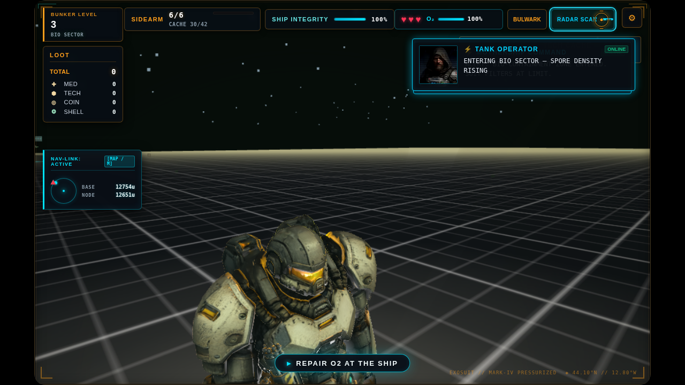

# Debug Museum — Clean QA Space

Status: implementation evidence | Owner: Claude | Updated: 2026-09-09
| Request: maintainer, 2026-09-09 — "in the museum area for testing / debugging I want a clean grid like the hero select area for the ground and no other objects but the game objects loaded, and no walls stopping me from walking around"

## What changed

| Ask | Change |
| --- | --- |
| Clean grid ground like hero select | The floor now uses `createMenuGridTexture()` — the same texture as the hero-select `menuShowroomFloor` — on an unlit material, and the separate `GridHelper` that used to be drawn over a dark metal strip is gone. The pad is square (340×340) instead of a 14-wide corridor, so exhibits can be viewed from any side. |
| No objects but the loaded game objects | `chunkGroups.visible = false` hides the entire generated world — terrain, walls and scatter — the same lever the pocket mechanic uses. The biome sky rig is hidden and the scene background flattened to `0x0b0d0f`, so an exhibit's own silhouette and colour are what you are judging. |
| No walls stopping movement | `setNoclip(true, 1)` — chunk streaming still mounts real terrain at these coordinates and `canOccupyPosition` rejects any `'#'` tile, so noclip is the existing bypass. Speed 1 rather than its 3.5 default, so movement stays normal and only collision goes away. |

`closeDebugMuseum` restores all four: chunk visibility, sky visibility, background colour, and noclip.

## Bug found and fixed: the museum was unreachable

`window.__DEBUG__.openMuseum()` was bound to `teleport('museum')`, and `teleport`
grouped `'museum'` with `'showroom'`/`'gallery'` and called `openDebugShowroom()`.
Every route into the museum — the `museum` console command, the `dev-btn-open-museum`
button, and direct `__DEBUG__` calls — opened the showroom instead. `closeMuseum`
was not defined at all: `debugMuseum.js` self-registers it on `window.__DEBUG__`,
but main.js's `__DEBUG__` object literal replaces that object wholesale, so the
`closemuseum` command called `undefined`.

The only working path was the QA Nexus modal's Wing 1 button, which imports
`openDebugMuseum` directly.

`main.js` now imports `openDebugMuseum`/`closeDebugMuseum` and binds both, and
`teleport` routes `'museum'`/`'colonnade'`/`'wing1'` to the museum.

Unit tests could not have caught this: the wiring lives in main.js's `__DEBUG__`
object literal. `tests/e2e/museum-debug-space.spec.js` now guards it.

## Verification

| Check | Result |
| --- | --- |
| `src/debugMuseum.test.js` | 11 pass (6 pre-existing + 5 new) |
| `src/debugZoneRegistry.test.js` | Pass — the enlarged 340×340 footprint is re-registered and does not collide with `qa-nexus` or `debugShowroom` |
| Full suite | 285 files, 2554 tests pass |
| `npm run lint` / `presubmit` / `build` / `audit:docs` | Pass |
| Browser (Playwright) | `tests/e2e/museum-debug-space.spec.js` passes: grid floor present and square, textured, no `GridHelper`, chunks hidden, sky hidden, noclip on, and the player walks 60 units through where world geometry would be without being stopped |

## Not claimed

A few faint particle sprites and a pale horizon band remain in the capture; those
come from the ambient particle/fog systems, not from chunk geometry or the sky rig.
They were left alone as they do not obscure an exhibit. Not tested on the packaged
Electron build.
