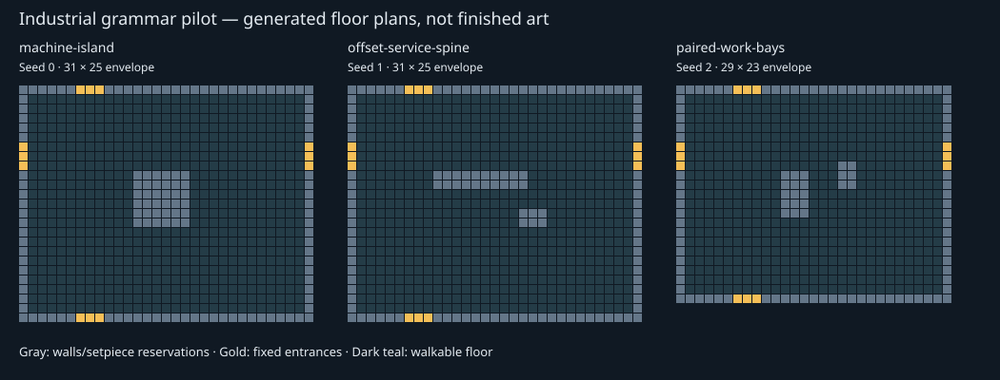

# Room grammar baseline — first measured slice

Command: `node scripts/room-layout-portfolio.js` (read-only JSON output).
240 architectural room-mode samples: seeds 1–16, all 15 nonempty entrance masks,
fixed opening offset 12, current 49-cell chunks. Normalization removes translation
and quarter-turns and treats door glyphs as walkable floor.

| Measurement | Result |
|---|---|
| Distinct room floor shapes | 18 / 240 |
| Walkable room area | 97–169 cells |
| Occupied width / height | 11–13 / 11–13 cells |

This controlled sample isolates interior repetition. It is not the frequency of
rooms in whole expeditions, a claim of disconnected entrances, or a performance
measurement. Corridors outside the room bounds intentionally do not add novelty.

Live routing inspected: `ThreeGame.buildChunk` first attempts authored reservations,
then hallway connectors when appropriate, then `buildMazeChunkStructure`. A legacy
branch still uses architectural generation directly. The measured producer is one
live fallback, not every room seen in play. Its WFC grid is discarded.

Persistence characterization: existing `campaignWorld.test.js` establishes that
terrain remains campaign-stable across deployments/resume while expedition streams
change. A new interior version must not assume a deployment means it may regenerate
persisted terrain. Room dressing currently seeds from room ID, so fixed architectural
IDs also repeat that stream. G2 must explicitly choose/persist interior versions.

Checks: room metrics, chunk structure and campaign-world suites: 38 tests passed.
No runtime behavior or save schema changed.

Remaining G0 evidence: full route-weighted portfolio, travel/clearance distributions,
authored/connector coverage, render budgets and matched visual captures. Next slice:
pure industrial planner with larger envelopes, fixed sockets and bounded motifs.

## G1 pilot implementation

Baseline commit: `73a96f20`. The script now also measures the pure pilot;
`node scripts/room-layout-portfolio.js --sweep` runs 5,000 pilot seeds with alternating
standard/major envelopes and cycling entrance masks. It is not distribution-matched
to the 240-case legacy sample, so the unique counts are not a comparative percentage.

- 209–641 walkable interior cells, excluding boundary doorway cells.
- 866 rotation/translation-normalized variants across three motifs. Small bounded
  setpiece shifts count here; this does not mean 866 distinct architectural concepts.
- Machine island: 1,673; service spine: 1,692; paired bays: 1,635.
- Zero fallback plans for this unconstrained portfolio. A separate forced-reservation
  test exercises the explicit fallback after at most seven candidates.
- 43 tests pass across grammar, metrics, chunk structure and campaign continuity;
  the grammar test includes 960 tier/seed/entrance combinations, independent
  three-cell-clearance traversal, offset entrances and malformed-input rejection.

The diagram shows deterministic major-tier seeds with four entrances. Gray blocks
are wall/setpiece reservations, not instantiated art or destruction targets.
The planner is a bounded motif/offset constraint solver, not a general WFC engine.
It preserves a circulation loop and required anchor approaches; module semantics,
wall attachments, population and final visuals remain future integration work.

Next: G2 adapter must translate local room sockets to actual chunk portals, produce
metadata from the final grid, and persist version/identity choices before live use.
Campaign terrain currently persists between deployments; do not reroll it merely
because an expedition seed changes. No live defaults or save formats changed here.
