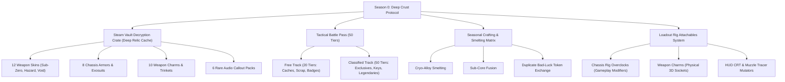

# Season 0: Deep Crust Protocol — Executive Summary & Economy Architecture

## 1. Overview & Vision
**Hunker Bunker Season 0: "Deep Crust Protocol"** is the inaugural seasonal content expansion and monetization ecosystem for *Hunker Bunker*. It bridges subterranean retro-futuristic arcade tactics with a fair, Steam-native inventory economy inspired by the most successful free-to-play (F2P) live-service models (Counter-Strike, Team Fortress 2, Helldivers 2, Hunt: Showdown, and Deep Rock Galactic).

The season introduces a **Dual-Loop Economy**:
1. **In-Game Base Loop (Core Progression)**:
   - 100% gameplay-driven via the **Fabrication Bay**.
   - Players earn Scrap, Salvage, and Biometal in runs to craft base weapons, gadgets, and chassis classes.
   - **Zero real-money paywalls** for core gameplay tools.
2. **Steam Vault Seasonal Loop (Cosmetics & Tactical Attachables)**:
   - Driven by **Deep Relic Caches** (mystery decryption crates), **Seasonal Tactical Battle Pass**, and the **Steam Community Market**.
   - Introduces **Tactical Loadout Attachables** (Weapon Charms, Rig Overclock Modules, HUD Themes, and Radio Voice Packs).
   - Fully backed by Valve's Steam Inventory Service (Steam Itemdef schema).

---

## 2. Industry F2P & Loot Box Benchmark Comparison

| Metric / Dimension | Counter-Strike 2 (Cases & Operations) | Team Fortress 2 (Crates & Campaigns) | Helldivers 2 (Warbonds) | Hunt: Showdown (Battle Passes) | **Hunker Bunker (Season 0 Plan)** |
| :--- | :--- | :--- | :--- | :--- | :--- |
| **Seasonal Item Pool** | 17 weapon skins + rare knives | 15–20 cosmetics/war paints | 20–24 weapons, armors, capes, boosters | 25–35 skins, charms, traits | **60 Items** (Skins, Charms, Rig Overclocks, Reagents) |
| **Loot Box Model** | Mystery crate + $2.49 Key | Mystery crate + $2.49 Key | Direct medal purchase (No loot boxes) | Direct progression & shop bundles | **Deep Relic Cache + Relic Key ($1.99 / bundle discounts)** |
| **Drop Rate Disclosures** | Mandatory 5-tier published odds (Common 79.9% to Gold 0.26%) | Tiered rarity disclosure | N/A (Guaranteed pick) | N/A | **Published Steam Odds Matrix** (55% Uncommon, 28% Rare, 12% Epic, 5% Legendary) |
| **Battle Pass Tiers** | 100 Star Track | Contract Book (20–30 contracts) | 3-page Warbond (~24 tiers) | 50 Levels (Free + Premium) | **50 Tiers (Free Dossier vs Classified Pass)** |
| **Gameplay Affecting Items** | Purely Cosmetic | Weapons sidegrades with distinct stats | Weapons, Armors, Boosters | Custom Ammo, Traits | **Rig Overclock Modules (balanced tactical sidegrades, +5% radius, pull magnet)** |
| **Marketplace Tradeability**| 100% Steam Marketable | 100% Steam Marketable | Account-bound only | Account-bound only | **100% Steam Marketable & Tradeable** (Decoupled from runtime saves) |

---

## 3. Season 0 Content Pillar Matrix

---

## 4. Key Pillars of Player Trust & Fair Play

1. **Strict No-Pay-To-Win Boundary**:
   - All Rig Overclock Modules socketed in loadouts offer **utility sidegrades** (e.g., *+15% scrap vacuum magnet, +5% Cryo slow, -10% Spore gas damage*) rather than raw DPS inflation.
   - Every gameplay-affecting overclock can also be forged in-game via the **Deep Smelter** using seasonal crafting reagents.
2. **Transparent Odds & Duplicate Safeguards**:
   - Explicit percentage disclosure in both the game UI and Steam store page.
   - Pity counter: Opening 10 caches without an Epic or Legendary guarantees an upgraded roll on cache 11.
   - Duplicate unboxings award **Deep Core Shards**, redeemable directly for any catalog item.
3. **Steam Deck & Offline Resiliency**:
   - Cached local inventory manifests allow offline loadout persistence, syncing seamlessly upon reconnecting to Steam.
