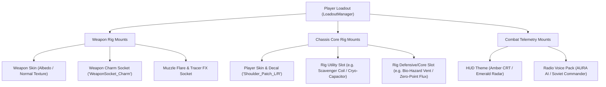

# Season 0: Tactical Attachables & Gameplay Modifiers Architecture

## 1. Overview & Loadout Extension
Season 0 introduces **Tactical Attachables** as a new primary inventory class. Unlike purely cosmetic skins or full chassis replacements, Attachables are modular upgrades equipped onto designated **Chassis Rig Sockets** and **Weapon Mounts**.

The system divides attachables into three distinct categories:
1. **Weapon Charms (Physical 3D Danglers)**: Visual trinkets mounted to weapon receivers with dynamic secondary spring physics.
2. **Rig Overclock Modules (Tactical Sidegrade Mutators)**: Socketed chips that inject passive perks, radar tweaks, or elemental boosts into the player's runtime state.
3. **Cosmetic Mutators (Audio, Tracer, & HUD FX)**: Visual and acoustic customization that personalizes combat telemetry.

---

## 2. Loadout Rig Architecture & Socketing Model



### Data Contract (`src/loadout.js` Extension)
```javascript
export interface PlayerLoadoutState {
  classId: 'scout' | 'heavy' | 'assault' | 'engineer';
  skinId: string | null;           // e.g. "4113" (Cryo-Vanguard)
  decalId: string | null;          // e.g. "4124" (Cyber-Skull)
  weaponSkinId: string | null;     // e.g. "4103" (Cryo-Plasma)
  weaponCharmId: string | null;    // e.g. "4130" (Mini Cryo-Core)
  rigModule1: string | null;       // e.g. "4141" (Magnetic Scavenger)
  rigModule2: string | null;       // e.g. "4146" (Symbiotic Adrenaline)
  tracerFxId: string | null;       // e.g. "4152" (Emerald Void)
  voicePackId: string | null;      // e.g. "4149" (AURA AI)
  hudThemeId: string | null;       // e.g. "4150" (Amber CRT)
}
```

---

## 3. 3D Weapon Charm Sockets & Spring Physics

### Bone Attachment Contract (`WeaponSocket_Charm`)
1. **Parent Bone**: Attached as a direct child of the weapon chassis mesh (`Sidearm.glb`, `Carbine.glb`, `Shotgun.glb`).
2. **Anchor Transform**:
   - Location: Positioned on the left rear receiver / accessory rail (visible in first/third-person aim perspectives).
   - Local Offset: `(x: -0.04m, y: +0.02m, z: -0.01m)`.
3. **Physics & Dangle Dynamics**:
   - Uses a lightweight **Verlet integration rope/chain sim** with 2 nodes (ring link + charm body).
   - Gravity, player velocity inertia, and weapon recoil impulse apply realistic jiggle and sway.
   - Constrained angular pitch/roll limits (`max 45 deg`) to avoid clipping into the gun receiver.

---

## 4. Rig Overclock Modules: Gameplay Calculation Hooks

Rig Overclocks are executed inside core simulation systems in `src/threeGame.js` via modifier dispatchers. All modifiers are balanced as **utility sidegrades** to preserve competitive fairness.

### Modifier Implementation Specifications

```javascript
/**
 * Resolves active loadout overclock multipliers for runtime systems.
 */
export function getActiveLoadoutModifiers(loadoutState) {
  const mods = {
    cryoDurationMultiplier: 1.0,
    scrapMagnetRadiusBonus: 0.0,
    gasDamageReduction: 0.0,
    kineticPierceBonus: 0,
    shieldRechargeDelayMultiplier: 1.0,
    hiddenRoomDetectionRange: 0,
    lowHpSpeedBoostActive: false,
    dashRefundOnMultiKill: false
  };

  const activeIds = [loadoutState?.rigModule1, loadoutState?.rigModule2].filter(Boolean);

  for (const id of activeIds) {
    switch (id) {
      case '4140': // Cryo-Capacitor Overclock
        mods.cryoDurationMultiplier += 0.08;
        break;
      case '4141': // Magnetic Scavenger Coil
        mods.scrapMagnetRadiusBonus += 0.20; // +20% radius
        break;
      case '4142': // Bio-Hazard Filter Vent
        mods.gasDamageReduction += 0.12; // 12% resistance
        break;
      case '4143': // Kinetic Impact Bushing
        mods.kineticPierceBonus += 1; // +1 penetration target
        break;
      case '4144': // Thermal Heat Exchanger
        mods.shieldRechargeDelayMultiplier -= 0.10;
        break;
      case '4145': // Echo-Location Transceiver
        mods.hiddenRoomDetectionRange = 15; // 15 meters
        break;
      case '4146': // Symbiotic Adrenaline Pump
        mods.lowHpSpeedBoostActive = true;
        break;
      case '4147': // Zero-Point Flux Overdrive
        mods.dashRefundOnMultiKill = true;
        break;
    }
  }

  return mods;
}
```

### Integration Touchpoints in Game Engine
1. **Scrap Vacuum (`src/threeGame.js:collectDrops`)**:
   - `effectiveMagnetRadius = BASE_MAGNET_RADIUS * (1 + mods.scrapMagnetRadiusBonus);`
2. **Elemental Freeze (`src/threeGame.js:applyStatusEffect`)**:
   - `freezeDuration = baseDuration * mods.cryoDurationMultiplier;`
3. **Acid/Gas Zone Tick (`src/threeGame.js:takeEnvironmentalDamage`)**:
   - `damageTaken = incomingDamage * (1 - mods.gasDamageReduction);`
4. **Radar Scanning (`src/threeGame.js:updateRadar`)**:
   - If `mods.hiddenRoomDetectionRange > 0`, highlight nearby cracked secret walls on the mini-radar with cyan pulse blips.

---

## 5. Audio & Visual FX Mutators

### Voice Packs (`AudioManager.playVoiceLine`)
- Replaces generic combat callouts ("Reloading", "Heavy incoming", "Shield low") with themed voice banks:
  - **`4148` (Soviet Sub-Commander)**: Heavy radio static, authoritative Russian-accented military jargon.
  - **`4149` (AURA AI)**: Smooth synthesized female tactical assistant with sub-harmonic chimes.

### HUD CRT Mutators
- Modifies CSS custom properties on root `#game-container`:
  - Amber Theme: `--hud-primary: #f59e0b; --hud-glow: rgba(245, 158, 11, 0.4); --hud-scanline: #d97706;`
  - Emerald Theme: `--hud-primary: #10b981; --hud-glow: rgba(16, 185, 129, 0.4); --hud-scanline: #059669;`

---

## 6. Amendment (See Doc 07): Armory & Per-Class Loadouts

The `PlayerLoadoutState` contract in §2 above was written against a 4-class roster
(`scout | heavy | assault | engineer`) that was never fully shipped — the live class-select
screen only has **Scout / Tank / Engineer**. [07. The Armory & Weapon Bench](file:///home/caveman/Desktop/icecave/hunker-bunker/docs/season-zero-protocol/07-armory-and-weapon-bench.md)
locks the roster to those 3 shipped classes, moves this section's flat single-loadout shape to a
**per-class `perClass: { scout, tank, engineer }`** shape (so each class remembers its own gun
build), and reframes Rig Overclock Modules as clipping to the *weapon's* accessory rail
(alongside Weapon Charms) rather than a chassis socket — read doc 07 §5 for the authoritative
current data contract; this section's contract is superseded, kept here for socket/physics detail
only.
