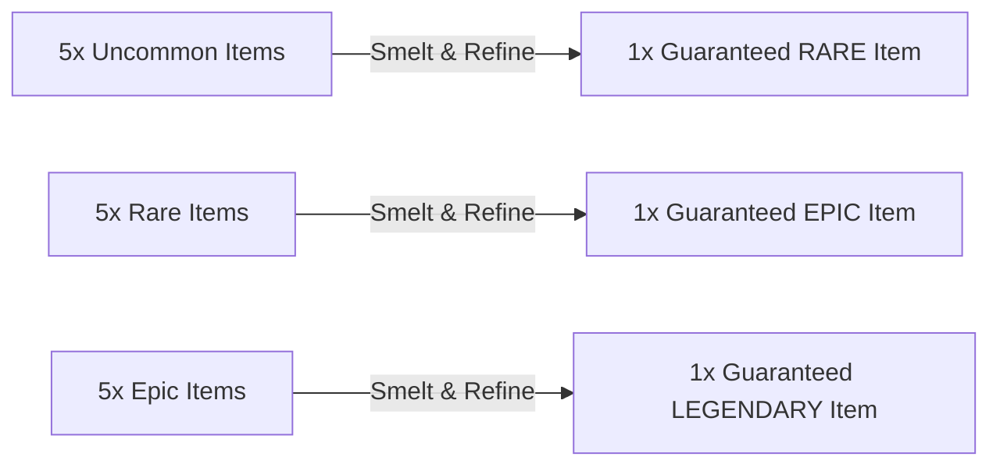

# Season 0: Crafting Matrix, Smelting & Salvage Economy

## 1. Overview & Dual-Currency Architecture
The Season 0 economy provides multiple avenues for players to forge, upgrade, and recycle seasonal inventory items without relying solely on RNG loot box unboxing.

### Currency & Material Taxonomy
1. **Fabrication Scrap (In-Game Common)**: Earned dynamically in dungeon runs; used for base in-game weapons and class unlocks in the Fabrication Bay.
2. **Cryo-Alloy Ingots (Seasonal Metal, Steam Itemdef `4156`)**: Earned via Battle Pass and dungeon milestone crates; used as the foundational catalyst for seasonal forging.
3. **Deep Sub-Core Matrices (High-Tier Reagent, Steam Itemdef `4157`)**: Extracted from boss defeats or synthesized in the Smelter; required for Epic and Legendary overclocks.
4. **Refined Ambergris (Bio-Catalyst, Steam Itemdef `4158`)**: Rare drop from Queen encounters; used for animated Legendary skins.
5. **Deep Core Shards (Duplicate Exchange Tokens, Steam Itemdef `4159`)**: Automatically awarded when decrypting duplicate inventory items.

---

## 2. Trade-Up Smelting Protocol (CS/TF2 Style Contracts)

The **Deep Smelter** allows players to combine lower-tier items from Season 0 into guaranteed higher-tier unboxings:

### Smelting Rules
- **Item Consumption**: Submitting 5 items of the same tier permanently consumes them via Steam Inventory Exchange API (`ExchangeItems`).
- **Output Quality**: The generated output is guaranteed to be from the next rarity tier above the input items.
- **Weighted Selection**: Output items are randomly selected from the higher tier catalog with equal probability.

---

## 3. Deep Core Shard Dispensary (Duplicate Protection)

When opening a Deep Relic Cache via the Steam Vault:
- If the rolled item is already owned in the player's Steam inventory, the player receives the item **plus bonus Deep Core Shards** based on the item's rarity:
  - **Uncommon Duplicate**: `+5 Shards`
  - **Rare Duplicate**: `+15 Shards`
  - **Epic Duplicate**: `+40 Shards`
  - **Legendary Duplicate**: `+100 Shards`

### Dispensary Exchange Rates
Players can directly purchase specific desired catalog items from the **Vault Black Market** using accumulated Shards:

| Target Catalog Item | Shards Required | Equivalent Caches Value |
| :--- | :--- | :--- |
| Any **Uncommon Weapon Skin or Charm** | `25 Shards` | ~5 Caches |
| Any **Rare Weapon Skin, Decal, or Overclock** | `60 Shards` | ~12 Caches |
| Any **Epic Weapon Skin, Chassis, or Charm** | `150 Shards` | ~30 Caches |
| Any **Legendary Exosuit, Weapon, or Key Charm** | `350 Shards` | ~70 Caches |

---

## 4. Quartermaster Seasonal Trade Shop

The **Quartermaster Staging Shop** allows operators to trade their earned in-game **Bunker Scrap** and **Deep Core Shards (DCS)** for raw assembly reagents and seasonal blueprints:

| Trade Item / Catalog Listing | Cost Currency | Availability | Description |
| :--- | :--- | :--- | :--- |
| **Cryo-Alloy Ingot Pack (x10)** | `400x Bunker Scrap` | Unlimited | Foundational metal required for all mechanical assemblies. |
| **Titanium Carabiner Clasp** | `250x Bunker Scrap` | Unlimited | Mounting hardware component for weapon charms. |
| **Micro-Capacitor Circuit Board** | `500x Bunker Scrap` | Unlimited | Component for electronics and rig overclocks. |
| **Deep Sub-Core Matrix (4157)** | `35x Deep Core Shards` | Weekly (Max 3) | High-tier nuclear catalyst for Epic/Legendary gear. |
| **Refined Ambergris Catalyst (4158)**| `50x Deep Core Shards` | Weekly (Max 2) | Exotic bioluminescent compound from the Queen Hive. |
| **Class Weapon Blueprint Pack** | `1,500x Bunker Scrap` | One-Time Purchase | Unlocks Vector-9, Siege-Breaker, and Tesla-Lock modding. |
| **Relic Decryption Key (4154)** | `75x Deep Core Shards` | Weekly (Max 1) | Free-to-play earned key for Deep Relic Caches. |

---

## 5. Tactical Weapon Charm Assembly Matrix (Combining)

Players combine 3 hardware reagents + 1 blueprint to forge physical 3D weapon charms:

| Output Charm | Component 1 | Component 2 | Component 3 | Assembly Cost |
| :--- | :--- | :--- | :--- | :--- |
| **Mini Cryo-Core Charm (4130)** | 10x Cryo-Alloy Ingots | 1x Titanium Clasp | 1x Micro-Capacitor | `300x Scrap` |
| **Spent 50-Cal Casing Charm (4131)** | 15x Heavy Brass Shards | 1x Titanium Clasp | 1x Hazard Paint Pack | `250x Scrap` |
| **Sporesnail Pearl Charm (4132)** | 1x Organic Pearl Core | 1x Titanium Claw Mount | 5x Cryo-Alloy Ingots | `400x Scrap` |
| **Trench Whistle Charm (4133)** | 12x Weathered Steel | 1x Ball Bead Chain | 1x Military Stamping Dye | `200x Scrap` |
| **Glitched RAM Card Charm (4134)** | 1x Green PCB Board | 4x Micro LED Diodes | 1x Tactical Lanyard Clip | `350x Scrap` |
| **Geodetic Compass Charm (4135)** | 1x Brass Compass Housing | 1x Phosphor Dial | 1x Swivel Carabiner | `450x Scrap` |
| **Mini Drone Bobble Charm (4136)** | 25x Cryo-Alloy Ingots | 1x Sentry Turret Lens | 1x Micro-Gimbal Motor | `600x Scrap + 15 DCS` |
| **Golden Sub-Bunker Key (4139)** | 50x Solid Gold Leaf | 1x Deep Sub-Core Matrix | 1x Antique Key Cast | `1,200x Scrap + 50 DCS` |

---

## 6. Rig Overclock Module Assembly Matrix

| Output Module | Component 1 | Component 2 | Component 3 | Assembly Cost |
| :--- | :--- | :--- | :--- | :--- |
| **Cryo-Capacitor Overclock (4140)** | 20x Cryo-Alloy Ingots | 1x Micro-Capacitor | 1x Coolant Line | `500x Scrap` |
| **Magnetic Scavenger Coil (4141)** | 25x Cryo-Alloy Ingots | 2x Copper Induction Coils | 1x Hazard Enclosure | `600x Scrap` |
| **Bio-Hazard Filter Vent (4142)** | 40x Cryo-Alloy Ingots | 1x Deep Sub-Core Matrix | 1x HEPA Suture Vent | `800x Scrap` |
| **Kinetic Impact Bushing (4143)** | 40x Cryo-Alloy Ingots | 1x Deep Sub-Core Matrix | 1x Tungsten Rod Core | `800x Scrap` |
| **Thermal Heat Exchanger (4144)** | 50x Cryo-Alloy Ingots | 1x Deep Sub-Core Matrix | 1x Radiator Matrix | `900x Scrap` |
| **Echo-Location Transceiver (4145)**| 80x Cryo-Alloy Ingots | 2x Deep Sub-Core Matrices | 1x Sonar Transducer | `1,200x Scrap + 20 DCS` |
| **Symbiotic Adrenaline Pump (4146)**| 80x Cryo-Alloy Ingots | 2x Deep Sub-Core Matrices | 1x Refined Ambergris | `1,500x Scrap + 30 DCS` |
| **Zero-Point Flux Overdrive (4147)**| 150x Cryo-Alloy Ingots | 5x Deep Sub-Core Matrices | 2x Refined Ambergris | `2,500x Scrap + 75 DCS` |

