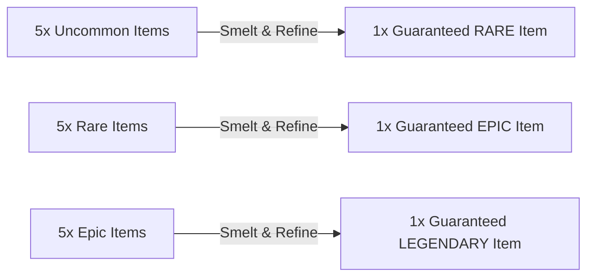

# Season 0: Crafting Matrix, Smelting & Salvage Economy

## 1. Overview & Dual-Currency Architecture
The Season 0 economy provides multiple avenues for players to forge, upgrade, and recycle seasonal inventory items without relying solely on RNG loot box unboxing.

### Currency & Material Taxonomy
1. **Fabrication Scrap (In-Game Common)**: Earned dynamically in dungeon runs; used for base in-game weapons and class unlocks in the Fabrication Bay.
2. **Cryo-Alloy Ingots (Seasonal Metal, Steam Itemdef `4156`)**: Earned via Battle Pass and dungeon milestone crates; used as the foundational catalyst for seasonal forging.
3. **Deep Sub-Core Matrices (High-Tier Reagent, Steam Itemdef `4157`)**: Extracted from boss defeats or synthesized in the Smelter; required for Epic and Legendary overclocks.
4. **Refined Ambergris (Bio-Catalyst, Steam Itemdef `4158`)**: Rare drop from Queen encounters; used for animated Legendary skins.
5. **Deep Core Shards (Duplicate Exchange Tokens, Steam Itemdef `4159`)**: Automatically awarded when decrypting duplicate inventory items.

---

## 2. Trade-Up Smelting Protocol (CS/TF2 Style Contracts)

The **Deep Smelter** allows players to combine lower-tier items from Season 0 into guaranteed higher-tier unboxings:

### Smelting Rules
- **Item Consumption**: Submitting 5 items of the same tier permanently consumes them via Steam Inventory Exchange API (`ExchangeItems`).
- **Output Quality**: The generated output is guaranteed to be from the next rarity tier above the input items.
- **Weighted Selection**: Output items are randomly selected from the higher tier catalog with equal probability.

---

## 3. Deep Core Shard Dispensary (Duplicate Protection)

When opening a Deep Relic Cache via the Steam Vault:
- If the rolled item is already owned in the player's Steam inventory, the player receives the item **plus bonus Deep Core Shards** based on the item's rarity:
  - **Uncommon Duplicate**: `+5 Shards`
  - **Rare Duplicate**: `+15 Shards`
  - **Epic Duplicate**: `+40 Shards`
  - **Legendary Duplicate**: `+100 Shards`

### Dispensary Exchange Rates
Players can directly purchase specific desired catalog items from the **Vault Black Market** using accumulated Shards:

| Target Catalog Item | Shards Required | Equivalent Caches Value |
| :--- | :--- | :--- |
| Any **Uncommon Weapon Skin or Charm** | `25 Shards` | ~5 Caches |
| Any **Rare Weapon Skin, Decal, or Overclock** | `60 Shards` | ~12 Caches |
| Any **Epic Weapon Skin, Chassis, or Charm** | `150 Shards` | ~30 Caches |
| Any **Legendary Exosuit, Weapon, or Key Charm** | `350 Shards` | ~70 Caches |

---

## 4. Seasonal Crafting Recipes Matrix

| Output Item | Recipe Ingredients Required |
| :--- | :--- |
| **Cryo-Capacitor Overclock (4140)** | 20x Cryo-Alloy Ingots + 500x Scrap |
| **Magnetic Scavenger Coil (4141)** | 25x Cryo-Alloy Ingots + 600x Scrap |
| **Bio-Hazard Filter Vent (4142)** | 40x Cryo-Alloy Ingots + 1x Deep Sub-Core Matrix |
| **Kinetic Impact Bushing (4143)** | 40x Cryo-Alloy Ingots + 1x Deep Sub-Core Matrix |
| **Echo-Location Transceiver (4145)**| 80x Cryo-Alloy Ingots + 2x Deep Sub-Core Matrices + 1,000x Scrap |
| **Symbiotic Adrenaline Pump (4146)**| 80x Cryo-Alloy Ingots + 2x Deep Sub-Core Matrices + 1x Refined Ambergris |
| **Zero-Point Flux Overdrive (4147)**| 150x Cryo-Alloy Ingots + 5x Deep Sub-Core Matrices + 2x Refined Ambergris |
