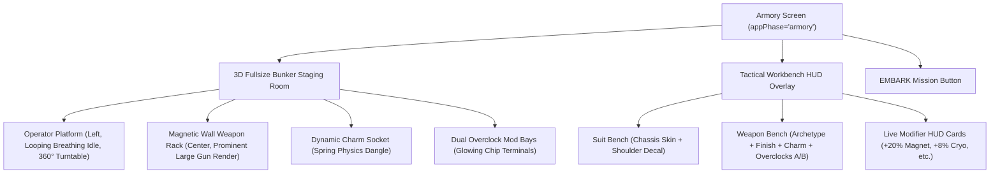

# Season 0: The Armory — Pre-Run Weapon Bench & Class Gun System

## 0. Why This Document Exists

Season 0's economy (docs 02–06) defines 60 sellable/craftable items — but investigation of the
live codebase (2026-08-17) found two gaps that block all of it from actually mattering in
gameplay:

1. ~~No weapon is ever rendered~~ **CORRECTED same day.** This was true only for the state as of
   2026-07-26. A real held-weapon pipeline shipped 2026-08-03 (`b2e976c`, "cosmetic Mixamo Scout
   overlay") and was extended to all 3 classes shortly after — `src/player3dOverlay.js` loads a
   rigged Mixamo body per class and parents a weapon mesh onto its right-hand bone
   (`createGg1Weapon()`, `player3dOverlay.js:40-65`). **The gap that remains: it's one hardcoded
   model (`public/3d/GG.1.glb`) shared by all 3 classes**, not class-unique, and not wired to
   `LoadoutManager` at all — whatever's equipped in the (nonexistent) Armory has zero effect on
   what actually renders. Read the full corrected picture, contracts, and task board in
   [`docs/armory-and-class-weapons-worklog.md`](file:///home/caveman/Desktop/icecave/hunker-bunker/docs/armory-and-class-weapons-worklog.md)
   before starting any build work — it supersedes this section's original framing and §6/§7 below
   on asset location specifically (real convention is `public/3d/runtime/`, not
   `public/models/weapons/`).
2. **Cosmetic equip is split across two disconnected systems.** `LoadoutManager`
   (`src/loadout.js`, key `hb_loadout_v1`) defines `equipCharm`/`equipDecal`/`equipSkin`/
   `equipRigModule` setters, but no UI calls them. The Steam Vault modal (`src/steamVaultUi.js`)
   actually equips cosmetics through **separate raw `localStorage` keys**
   (`hb_equipped_patch`, `hb_equipped_decal`, `hb_equipped_weapon_finish`) that `LoadoutManager`
   never sees. Still an open gap — confirmed unchanged as of 2026-08-17.

**The Armory is the fix for both remaining gaps.** It's a new mandatory pre-run screen where the
player gears up a physical, rendered, class-unique gun, and the single UI surface that reads/writes
one unified loadout record that actually drives what `player3dOverlay.js` renders. This document
defines the flow, the data model, the class/gun/skin mapping, and the (superseded-on-location, see
above) asset list. The worklog doc is the authoritative build-sequencing and current-state tracker
going forward; this doc stays the design-intent reference.

**A note on scope (superseded 2026-08-17):** the two specs linked below were written 2026-07-26
proposing a *pixel-snapped offscreen-render-to-sprite-texture* approach for a held weapon — that
approach was **not** what got built. What actually shipped 2026-08-03 is a full 3D Mixamo body
overlay drawn directly in-scene (sprite hidden once the overlay loads), with the weapon parented
onto its hand bone — a different, already-working mechanism. Treat those two spec docs as
historical context for the abandoned approach, not as the current plan; the worklog doc is
authoritative on what's actually live. The Armory *screen* (UI, data model, bench layout) can
still be built and playtested independently of the weapon-model work — see the worklog's task
board for the current dependency graph, which replaces §7 below.

[`docs/superpowers/specs/2026-07-26-player-chassis-3d-vertical-slice-design.md`](file:///home/caveman/Desktop/icecave/hunker-bunker/docs/superpowers/specs/2026-07-26-player-chassis-3d-vertical-slice-design.md) ·
[`docs/superpowers/specs/2026-07-26-cosmetics-and-loadout-system-design.md`](file:///home/caveman/Desktop/icecave/hunker-bunker/docs/superpowers/specs/2026-07-26-cosmetics-and-loadout-system-design.md)

---

## 1. Roster Correction (Read This First)

Doc 03's data contract and doc 02's catalog were written against a **4-class roster**
(`scout | heavy | assault | engineer`) that was never fully shipped. The live class-select screen
(`index.html`, `.char-card[data-type]`) only offers **three** classes:

| Shipped classId | Card label |
| :--- | :--- |
| `SCOUT` | Scout |
| `TANK` | Tank |
| `ENGINEER` | Engineer |

This document locks Season 0's weapon/class system to the shipped 3-class roster. Every
`assault`-flavored catalog reference (mostly "Assault Carbine" weapon skins) is reassigned below
rather than left dangling. No new class is being added by this doc — if a 4th class ships later,
it gets its own gun archetype and its own skin allocation pass, not a retrofit of this mapping.

---

## 2. Where the Armory Sits in the Run-Start Flow

Confirmed current flow (`main.js`): `title/splash → appPhase='menu'` (the "Briefing Console" —
class-select cards + hub buttons, all one screen) `→` clicking **INITIALIZE** or **DAILY OPS**
jumps straight to `appPhase='gameplay'` and fires the cinematic chain
(`runMissionIntroSequence`: class intro → cutscene → Mothership dialogue → tutorial → gameplay).

**The Armory becomes a new `appPhase='armory'` screen inserted between them:**

```
title/splash → menu (class select, unchanged)
            → [INITIALIZE or DAILY OPS] → appPhase='armory'  (NEW)
            → [EMBARK] → appPhase='gameplay' → existing runMissionIntroSequence chain (unchanged)
```

- **INITIALIZE and DAILY OPS both route through the Armory gate.** A run always starts with a
  loadout check — that's the point of the step.
- **Act 2 continuation** (`isAct2RunActive()`) bypasses the Armory exactly as it already bypasses
  the Mothership dialogue handshake today (`main.js:6591-6594`) — you don't re-gear mid-campaign
  for a boss-continuation run.
- **First-time profiles**: the Roster modal's existing `mode:'new_game'` auto-open
  (`main.js:11803`) is superseded by an Armory first-visit callout ("Bench is empty — equipping
  your starting Vector-9 Talon") rather than a separate modal layered on top.
- This is a **full new screen** (`#armory-screen`, sibling to `#menu`), not a modal over the
  Briefing Console — matching the "new step in the process" framing rather than a hub button
  players can ignore.

---

## 3. Fullsize 3D Armory Staging Room & Bench Layout

The Armory is a **fullsize 3D subterranean staging environment** rendered via Three.js (`src/armoryScene.js`), illuminated by bunker industrial lighting, ceiling floodlamps, and diagnostic terminal screens.

### A. Spatial & Visual Composition
```
+---------------------------------------------------------------------------------------------------+
|  HUNKER BUNKER // PRE-MISSION ARMORY [SECTOR ZERO]                            OPERATOR: AGENT-07  |
+---------------------------------------------------------------------------------------------------+
|                                                                                                   |
|    [SUIT STAGING PLATFORM - LEFT]               [MAGNETIC WEAPON WALL BENCH - CENTER/FOREGROUND]  |
|                                                                                                   |
|    +---------------------------------------+    +--------------------------------------------+    |
|    |                                       |    |                                            |    |
|    |     3D OPERATOR EXOSUIT MODEL         |    |        3D CLASS WEAPON MODEL (LARGE)       |    |
|    |     • Looping Idle / Breathing Stance |    |        • Prominently Mounted on Wall Rack  |    |
|    |     • 360° Turntable Orbit Inspection |    |        • Real-time Socket & Skin Swaps     |    |
|    |     • Decal / Patch Projection        |    |        • Charm Secondary Physics Dangle    |    |
|    |                                       |    |                                            |    |
|    +---------------------------------------+    +--------------------------------------------+    |
|                                                                                                   |
|    CHASSIS:  [Cryo-Vanguard Scout]              GUN FRAME:    [Vector-9 Talon SMG]                |
|    PATCH:    [Sub-Zero Pioneer Seal]            WEAPON FINISH:[Sub-Zero Frostbite v1]             |
|                                                 CHARM SOCKET: [Mini Cryo-Core 3D]                 |
|    SUIT TELEMETRY:                              MOD SLOT A:   [Cryo-Capacitor Overclock]          |
|    • Class: SCOUT (Thermal Camo)                MOD SLOT B:   [Magnetic Scavenger Coil]           |
|    • Status: Pressurized                                                                          |
|                                                 ACTIVE COMBAT MODIFIERS:                          |
|                                                 • +20% Scrap Magnet Pull Radius                   |
|                                                 • +8% Cryo Freeze Duration                        |
|                                                 • Dynamic Charm Spring Physics Active             |
+---------------------------------------------------------------------------------------------------+
|  [< BACK TO CLASS SELECT]          [QUARTERMASTER DISPENSARY]             [EMBARK TO BUNKER >>]   |
+---------------------------------------------------------------------------------------------------+
```

### B. Live Real-Time Visual Reaction
1. **Prominent Wall-Mounted Weapon**: The class weapon is displayed prominently on the magnetic rack in the foreground. When the player clicks on a Weapon Skin, Charm, or Mod Chip, the 3D model immediately updates in place with PBR materials, emissive glows, and physical socket attachment.
2. **Operator Looping Idle Animation**: The active class operator stands on the left hexagonal staging platform, playing a subtle procedural breathing/weight-shift idle loop.
3. **Socket Highlight & Focus**: Selecting a socket (e.g. Charm rail or Mod bay) dynamically triggers a subtle camera focus nudge and an acoustic confirmation sound (`sfx_overclock_socket.wav` or `sfx_charm_clink_light.wav`).
4. **Per-Class Saved State**: Every class (`SCOUT`, `TANK`, `ENGINEER`) maintains its own isolated weapon and socket loadout in `LoadoutManager` (`hb_loadout_v1`), switching instantly when navigating between classes.



---

## 4. Class Gun Archetypes & Skin Reassignment

Each class gets one named base gun archetype (a real `.glb`, see §6). Scout additionally unlocks a
second archetype mid-pass, which is how the 4 orphaned "Assault Carbine" skins get a home without
inventing a 4th class:

| Class | Base Archetype | Secondary (tier-unlocked) | Skins Assigned (Itemdef) |
| :--- | :--- | :--- | :--- |
| **Scout** | **Vector-9 Talon** SMG/Sidearm — skeletonized magnesium receiver, top rail, collapsible wire stock; 840 RPM, low recoil, 1.2s reload | **Talon-C Carbine** *(unlocks Tier ~11, same weapon family, extended barrel/stock)* | Talon: `4100`, `4105` · Talon-C: `4101`, `4104`, `4108`, `4110` |
| **Tank** | **Siege-Breaker 50** Autocannon — reinforced dark-steel barrel shroud, hazard placards, dual pneumatic recoil dampers; heavy kinetic impact, high armor stagger, wide cone | — | `4102`, `4106` |
| **Engineer** | **Tesla-Lock MK-IV** Arc Driver — copper induction rings, glass vacuum amplifier tube, rear battery pack; continuous arc beam links between close-range targets | — | `4103`, `4107`, `4109`, `4111` |

Charm socket placement is archetype-specific (matches the physical geometry): Talon/Talon-C mount
on the forward Picatinny rail, Siege-Breaker on the carrying-handle rear eyelet, Tesla-Lock on the
battery-bay locking latch. All three still resolve to the same `WeaponSocket_Charm` bone contract
(§6) so charm meshes are archetype-agnostic — only the anchor transform differs per `.glb`.

Notes:
- This reassigns the Tier 50 dual-legendary capstones from doc 04: `4110` (Queen's Carapace
  Carbine, free track) becomes Scout's Carbine legendary; `4111` (Solar Flare Antimatter Rifle,
  premium track) becomes Engineer's Arc legendary. No tier numbers or reward gating changes — only
  which gun mesh each skin textures.
  - Doc 04's Tier 50 row should be read with this mapping going forward; not re-editing that table
    here to avoid duplicating numbers that can drift out of sync.
- Skin counts land 6/2/4 across Scout/Tank/Engineer. That's intentional, not an error: Tank and
  Engineer each have one fixed silhouette all season, while Scout's two-archetype kit gives that
  class more season-long skin chase content. If that asymmetry is unwanted, the fix is moving 2 of
  Scout's Carbine skins to Tank — flag it and it's a one-line table edit, not a re-architecture.
- Weapon skins remain a pure texture/material swap on the class's fixed mesh (per doc 06's
  existing PBR spec) — they do not change hitbox, fire rate, or any stat. No pay-to-win exposure
  is introduced.

---

## 5. Data Model: Unifying `LoadoutManager`

Replace the two divergent persistence paths with one. `LoadoutManager` (`src/loadout.js`,
`hb_loadout_v1`) becomes the single source of truth; `steamVaultUi.js`'s raw
`hb_equipped_patch` / `hb_equipped_decal` / `hb_equipped_weapon_finish` keys are retired and
migrated in on first load.

```javascript
// src/loadout.js — extended state shape
export interface PlayerLoadoutState {
  version: 2,
  perClass: {
    scout:    ClassLoadout,
    tank:     ClassLoadout,
    engineer: ClassLoadout,
  },
  // suit slots are NOT per-class — a patch/skin earned on your exosuit
  // follows the operator, not the gun
  suit: {
    chassisSkinId: string | null,   // e.g. "4113" (Cryo-Vanguard Scout)
    decalId: string | null,         // e.g. "4124" (Cyber-Skull Tactical Pin)
  },
  hudThemeId: string | null,        // now actually wired (was dead field pre-Armory)
  voicePackId: string | null,       // now actually wired (was dead field pre-Armory)
}

interface ClassLoadout {
  archetypeId: string;              // 'talon' | 'talon_c' | 'siege_breaker' | 'tesla_lock' (§6)
  weaponSkinId: string | null;      // must match archetypeId's assigned itemdefs (§4)
  charmId: string | null;
  mod1Id: string | null;            // Rig Overclock, itemdefs 4140-4147
  mod2Id: string | null;
}
```

Migration on load: if `hb_loadout_v1` (old shape) or the legacy `hb_equipped_*` keys are present,
one-time transform them into `hb_loadout_v2` under the player's currently-saved class, then delete
the old keys. `getActiveModifiers()` (`src/loadout.js:117-162`) already aggregates `mod1/mod2` into
gameplay multipliers for `threeGame.js` — that function's contract doesn't change, it just reads
from `perClass[currentClass]` instead of flat top-level fields.

**Validation rule the Armory UI must enforce:** `weaponSkinId` can only be set to an itemdef whose
`Applicable Weapon` matches the class's current `archetypeId` (§4's table). Prevents a Tank skin
from being equippable on a Scout Sidearm.

---

## 6. New Assets Required

> **Superseded on file location and socket mechanics** — see
> [`docs/armory-and-class-weapons-worklog.md`](file:///home/caveman/Desktop/icecave/hunker-bunker/docs/armory-and-class-weapons-worklog.md)
> §2. Real convention: assets go under `public/3d/runtime/`, not `public/models/weapons/` (that
> path doesn't exist in this repo). Real socket mechanism: weapons parent directly onto the
> character's Mixamo `RightHand` bone at runtime (`player3dOverlay.js`'s existing
> `createGg1Weapon`/hand-lookup code) — there is no separate `WeaponSocket_Charm` bone baked into
> a bespoke gun rig as described below; that bone name is reused as a *logical* attach-point
> concept inside the weapon mesh itself (a child empty/node the charm parents to), not a skeleton
> bone on the character. The naming, polygon budgets, and per-archetype flavor below are still
> accurate — only *where the files live* and *how attachment works at runtime* changed.

Extends doc 06's asset manifest — same polygon/texture budgets, new entries:

### Class Gun Meshes (`public/models/weapons/*.glb`)
| `archetypeId` (§5) | Display Name (§4) | File | Notes |
| :--- | :--- | :--- | :--- |
| `talon` | Vector-9 Talon | `scout_talon.glb` | Base Scout loadout — skeletonized SMG/sidearm |
| `talon_c` | Talon-C Carbine | `scout_talon_c.glb` | Tier ~11 unlock, same family, extended barrel/stock |
| `siege_breaker` | Siege-Breaker 50 | `tank_siege_breaker.glb` | Base Tank loadout — autocannon |
| `tesla_lock` | Tesla-Lock MK-IV | `engineer_tesla_lock.glb` | Base Engineer loadout — arc driver |

- Polygon budget: `2,500 – 4,000 triangles` (higher than charms/mods since these render
  full-screen in the Armory bench view and, once the held-weapon pipeline lands, in third-person).
- Must expose a `WeaponSocket_Charm` accessory-rail bone (already specified in doc 03 §3) and two
  generic mod-chip mount points, so existing charm/mod assets attach without per-archetype rework.
- Rendering path: same offscreen `WebGLRenderTarget` + `NearestFilter` pixel-snap approach as the
  chassis vertical-slice spec, so the Armory bench preview visually matches the in-run look once
  weapons render in-game.

### Bench Environment (new, Armory-specific)
- `public/models/armory/workbench.glb` — the physical bench/table dressing behind the gun render.
  Budget: `1,500 – 2,500 triangles`, single texture atlas, matches the game's riveted-industrial
  art direction (doc 06 §1 palette).

No changes to charm (`public/models/charms/*.glb`) or mod (`public/models/mods/*.glb`) specs —
those attach to the new gun meshes' existing socket contract unchanged.

### Bone/Socket Hierarchy

Standardized rig contract every class gun and chassis conforms to, so charm/mod/patch assets stay
archetype-agnostic:

```
[Character_Rig_Root]
  └── [Spine_Chest]
        ├── [Bone_LeftShoulder]  -> [ChassisSocket_Patch_L]
        ├── [Bone_RightShoulder] -> [ChassisSocket_Patch_R]
        ├── [Bone_Backpack_Rig]
        │     ├── [RigModule_Socket1]   (Mod Slot A)
        │     └── [RigModule_Socket2]   (Mod Slot B)
        └── [Bone_RightHand]
              └── [Weapon_Root]                     (per-archetype .glb, §6)
                    ├── [Weapon_Mesh]                (class-specific geometry & skin shader)
                    └── [WeaponSocket_Charm]         (anchor transform varies per archetype, §4)
                          └── [Physics_Spring_Anchor]
                                └── [Charm_Mesh]      (Verlet spring sway, doc 03 §3)
```

Charm sway uses the damped-spring model from doc 03 §3: on fire/run/turn, the charm's node
computes `a = -(k/m)(x - x0) - c·v + a_recoil`, letting it swing naturally on its chain without
clipping into the weapon body — unchanged from doc 03, just now anchored to a real weapon mesh
instead of a socket with nothing attached to it.

---

## 7. Build Sequencing

> **Superseded** — the worklog's task board (§3) is the live, authoritative sequencing and status
> tracker. The list below is kept for the original reasoning but step 4 in particular is stale:
> held-weapon rendering already exists (§0), it just isn't class-unique or loadout-driven yet.

1. **Data model migration** (`src/loadout.js` v1→v2, retire `steamVaultUi.js` raw keys) — no
   visual dependency, can land first and be verified against the current (gun-less) game.
2. **Armory screen shell** (`appPhase='armory'`, bench layout, slot UI, EMBARK routing into the
   existing `launchStandardRun`/cinematic chain) — can ship against a *static* class gun image or
   placeholder mesh, unblocked by the full chassis pipeline.
3. **Class gun meshes** (§6) — art/pipeline task, parallelizable with #1 and #2.
4. **Held-weapon in-run rendering** — depends on the chassis vertical-slice's independent
   torso/aim-yaw work (flagged as a prerequisite in the cosmetics-loadout-system spec, not yet
   started). This is what makes the Armory's choices visible *during combat*, not just on the
   bench — sequence it last, but the Armory itself doesn't block on it.

Steps 1–3 deliver a fully functional Armory (gear up, see your gun, mods affect gameplay via
`getActiveModifiers()`) even before step 4 ships.
