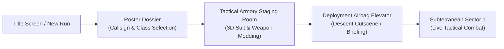

# Season 0: Pre-Mission Armory Staging Room & Class-Unique Weapons

## 1. Executive Summary & Gameplay Flow

The **Pre-Mission Armory Staging Room** introduces a critical tactical preparation phase between operator class selection and the subterranean bunker descent. Rather than instantly dropping into combat, operators enter an atmospheric 3D bunker workshop where they inspect their character model, configure their exosuit modifications, and attach tactical charms to their class-unique firearms.



---

## 2. The Armory Staging Room Interface

The Armory presents a split-focus 3D interactive staging area with two primary workstations:

```
+---------------------------------------------------------------------------------------+
|  HUNKER BUNKER // ARMORY STAGING BAY [SECTOR ZERO]               OPERATOR: AGENT-07   |
+---------------------------------------------------------------------------------------+
|                                           |                                           |
|  [STATION 1: EXOSUIT MODIFICATION]        |  [STATION 2: WEAPON WORKBENCH]            |
|                                           |                                           |
|  +-------------------------------------+  |  +-------------------------------------+  |
|  |                                     |  |  |                                     |  |
|  |     3D OPERATOR EXOSUIT MODEL       |  |  |       3D CLASS WEAPON MODEL         |  |
|  |      (Full 360 Turntable View)      |  |  |      (Pivot on Receiver & Rail)     |  |
|  |                                     |  |  |                                     |  |
|  +-------------------------------------+  |  +-------------------------------------+  |
|                                           |                                           |
|  EQUIPPED CHASSIS: [Cryo-Vanguard Mk-II]  |  EQUIPPED WEAPON: [Vector-9 Talon SMG]    |
|  SHOULDER PATCH:   [Sub-Zero Pioneer]     |  WEAPON SKIN:     [Hazard Stripe v2]      |
|  RIG OVERCLOCK #1: [Magnetic Scavenger]   |  WEAPON CHARM:    [Mini Cryo-Core 3D]     |
|  RIG OVERCLOCK #2: [Cryo-Capacitor TCX]   |  CHARM PHYSICS:   [SPRING / DAMPED ACTIVE]|
|                                           |                                           |
|  ACTIVE MODIFIERS:                        |  BALLISTIC TELEMETRY:                     |
|  • +20% Scrap Magnet Pull Radius          |  • Fire Rate: 840 RPM                     |
|  • +8% Cryo Freeze Duration               |  • Kinetic Pierce: Standard (1 Target)    |
|  • Secondary Spring Physics Active        |  • Socket Anchor: Upper Picatinny Rail    |
|                                           |                                           |
+---------------------------------------------------------------------------------------+
|  [< SWITCH CLASS]            [QUARTERMASTER / CRAFTING]         [CONFIRM & DEPLOY >>]  |
+---------------------------------------------------------------------------------------+
```

---

## 3. Class-Unique Moddable Weapon Frames

Each of the three playable operator classes features a distinct primary firearm engineered with physical mounting points for **Tactical Charms** and **Cosmetic Finishes**:

### A. Scout Class: *Vector-9 Talon SMG*
- **Archetype**: Ultra-compact burst-fire submachine gun designed for rapid hit-and-run tactics.
- **Visual Design**: Skeletonized magnesium receiver, top accessory rail, collapsible wire stock, translucent polymer magazine with visible glowing kinetic rounds.
- **Charm Socket**: `WeaponSocket_Charm` located on the right forward Picatinny mounting rail.
- **Default Base Stats**: High fire rate (840 RPM), low recoil bloom, fast reload time (1.2s), moderate armor penetration.

### B. Tank Class: *Siege-Breaker 50 Autocannon*
- **Archetype**: Heavy micro-missile rotary cannon with integrated recoil shock-absorbers.
- **Visual Design**: Heavy reinforced dark steel barrel shroud, stamped hazard caution placards, overhead carrying handle, dual pneumatic recoil dampers.
- **Charm Socket**: `WeaponSocket_Charm` forged directly into the rear eyelet of the top carrying handle.
- **Default Base Stats**: Heavy kinetic impact, high stagger against armored mollusks, wide cone dispersion, extended wind-up spin time.

### C. Engineer Class: *Tesla-Lock MK-IV Arc Driver*
- **Archetype**: Directed high-voltage electromagnetic arc emitter and structural field welder.
- **Visual Design**: Copper induction rings, insulated rubber grip, glass vacuum amplifier tube with arcing electric plasma, rear high-voltage battery pack.
- **Charm Socket**: `WeaponSocket_Charm` mounted to the side battery-bay locking latch.
- **Default Base Stats**: Continuous electrical beam linking between multiple close-range enemies, high efficiency against bio-shields and spider-webs.

---

## 4. 3D Socket Hierarchy & Physics Integration

All 3D models conform to standardized Three.js bone/dummy hierarchies:

```
[Character_Rig_Root]
  └── [Spine_Chest]
        ├── [Bone_LeftShoulder] -> [ChassisSocket_Patch_L]
        ├── [Bone_RightShoulder] -> [ChassisSocket_Patch_R]
        ├── [Bone_Backpack_Rig]
        │     ├── [RigModule_Socket1] (Slot 1 Overclock Module)
        │     └── [RigModule_Socket2] (Slot 2 Overclock Module)
        └── [Bone_RightHand]
              └── [Weapon_Root]
                    ├── [Weapon_Mesh] (Class-specific geometry & skin shader)
                    └── [WeaponSocket_Charm]
                          └── [Physics_Spring_Anchor]
                                └── [Charm_Mesh] (Secondary Verlet spring sway & recoil kick)
```

### Secondary Spring Physics
- When the player fires, runs, or turns, the attached weapon charm calculates spring acceleration:
  $$\mathbf{a}_{\text{charm}} = -\frac{k}{m}(\mathbf{x} - \mathbf{x}_0) - c\mathbf{v} + \mathbf{a}_{\text{recoil}}$$
- The charm swings naturally on its chain or carabiner link without clipping through the weapon body.

---

## 5. UI Integration & State Transitions

1. **Modal Entry**: Invoked after confirming operator dossier (`renderRosterModal`) or by pressing `[ARMORY]` from the bunker staging hub.
2. **Persistence**: Saves active selections to `LoadoutManager` (`hb_loadout_v1`):
   - `equippedWeaponId`
   - `equippedSkinId`
   - `equippedDecalId`
   - `equippedCharmId`
   - `equippedRigModule1`
   - `equippedRigModule2`
3. **Deployment Bridge**: Clicking `[CONFIRM & DEPLOY]` activates the descent elevator sequence, passing all active modifiers into `threeGame.js` combat simulation.
