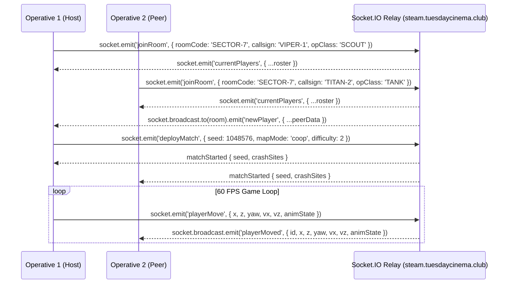

# 02. Multiplayer & Socket.IO Relay Guide

Hunker Bunker includes a low-latency **Socket.IO relay architecture** ([`server/relay.js`](../../server/relay.js) and [`src/multiplayerLobby.js`](../../src/multiplayerLobby.js)) supporting cooperative campaigns and PVP arena matches.

---

## 1. Network Topology & Relay Architecture



---

## 2. Server Deployment & Endpoint Resolution

### Production Backend
- **Public Relay URL**: `https://steam.tuesdaycinema.club`
- **WSS Endpoint**: `wss://steam.tuesdaycinema.club/socket.io/`
- **Reverse Proxy**: Caddy handles TLS termination, WebSocket connection upgrading, and forwards traffic to `hunker-bunker-backend:3001`.

### Local Development Server
- When running locally via `npm run dev` or `node server/index.js`, the relay runs on:
  - `http://localhost:3001` (WebSocket port `3001`)

### Client URL Resolution Logic ([`src/multiplayerLobby.js`](../../src/multiplayerLobby.js))
```javascript
export function resolveRelayUrl() {
    if (typeof window === 'undefined') return 'http://localhost:3001';
    if (window.HB_RELAY_URL) return window.HB_RELAY_URL;
    const origin = window.location?.origin || '';
    if (origin.includes('localhost') || origin.includes('127.0.0.1') || origin.includes(':5173')) {
        return 'http://localhost:3001';
    }
    if (origin.startsWith('http://') || origin.startsWith('https://')) {
        return origin;
    }
    // Packaged Electron or file:// protocol fallback to live production backend
    return 'https://steam.tuesdaycinema.club';
}
```

---

## 3. Protocol & Packet Specification

All packets are rate-limited and sanitized server-side in [`server/relay.js`](../../server/relay.js) to prevent float overflow and flooding.

| Event Name | Direction | Payload Schema | Description |
| :--- | :--- | :--- | :--- |
| **`joinRoom`** | Client $\rightarrow$ Server | `{ roomCode: string, callsign: string, opClass: string }` | Registers socket in named room. If first, marks as host. |
| **`playerMove`** | Client $\rightarrow$ Server | `{ x: number, z: number, yaw: number, vx: number, vz: number, animState: string }` | Broadcasts transform at up to 60Hz. Rate-limited to $\ge 16\text{ms}$. |
| **`fireWeapon`** | Client $\rightarrow$ Server | `{ x: number, z: number, dirX: number, dirZ: number, weaponType: string, damage: number }` | Triggers synced projectile spawn on all peers. Capped at 25 shots/sec. |
| **`playerHit`** | Client $\rightarrow$ Server | `{ targetId: string, damage: number, attackerId: string, isHeadshot: boolean }` | Deals damage to peer in PVP mode or registers friendly fire. |
| **`requestRevive`** | Client $\rightarrow$ Server | `{ downedPlayerId: string, x: number, z: number }` | Emits emergency squad beacon on teammate HUDs. |
| **`executeRevive`** | Client $\rightarrow$ Server | `{ downedPlayerId: string, reviverId: string, healthGranted: number }` | Restores downed teammate to active combat. |
| **`openTradeOffer`**| Client $\rightarrow$ Server | `{ targetId: string, offerItems: Array, requestedItems: Array }` | Initiates peer-to-peer barter window. |
| **`acceptTradeOffer`**| Client $\rightarrow$ Server| `{ tradeId: string, senderId: string, receiverId: string }` | Finalizes atomic inventory swap. |
| **`syncGameState`** | Host $\rightarrow$ Server | `{ worldSeed: number, doorsOpened: Array, bossesDefeated: Array }` | Synchronizes world progression across joiners. |

---

## 4. Multiplayer Modes & Co-Op Crash Planning

When a match deploys:
1. **Co-Op Mode (`coop`)**:
   - Both operatives spawn at coordinated adjacent drop-pod crash sites planned by [`src/multiplayerCrashPlanner.js`](../../src/multiplayerCrashPlanner.js).
   - Shared objective tracking, shared camp unlock progress, and teammate revive mechanics.
2. **PVP Arena Mode (`pvp`)**:
   - Operatives spawn in opposing sectors of the ring maze.
   - Snail hostiles remain active as ambient hazards.
   - First operative to eliminate rival or claim the central Bunker Core wins the match.

---

## 5. Troubleshooting & Diagnostics

### Connection Status Pill Codes
- **`CONNECTING...`**: Attempting WebSocket handshake with relay server.
- **`ONLINE [4/4]` (Emerald)**: Connected to live room with full squad roster.
- **`LOCAL FALLBACK` (Amber)**: Relay server unavailable; running local simulated sandbox squad.

### Quick Checklist
- **If connecting to localhost fails**: Ensure `npm run server:dev` or `docker compose up` is active on port `3001`.
- **If remote connection fails in Steam Deck Gaming Mode**: Confirm device has Wi-Fi connectivity and port 443 outbound is open.
