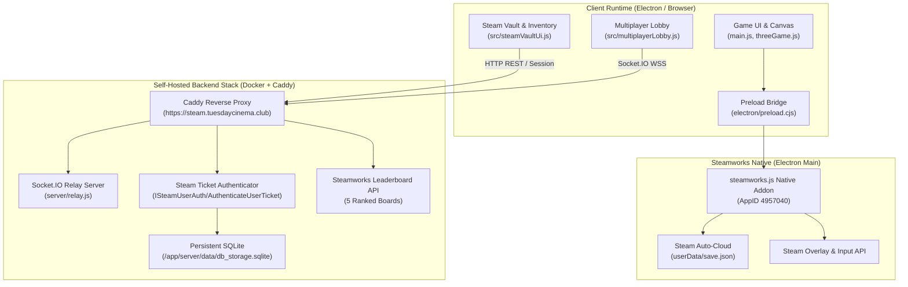

# Steamworks, Multiplayer Relay & Live Economy Integration Guide

**App ID**: `4957040` (Hunker Bunker)  
**Relay Backend**: `https://steam.tuesdaycinema.club` / `http://localhost:3001`  
**Current Branch / Target**: `dev/sprint23` / Packaged Desktop & Web Builds  

---

## 1. Overview & System Sitemap

This directory contains the definitive, production-grade documentation for running, connecting, debugging, and verifying Hunker Bunker's **Steamworks SDK**, **Multiplayer Socket.IO Relay**, and **Steam Inventory Economy** in both live Steam runtime and dev demo environments.

---

## 2. Documentation Index

1. [`01-steamworks-connection-and-runtime-architecture.md`](01-steamworks-connection-and-runtime-architecture.md)
   - Steam App ID configuration and native binary initialization via `steamworks.js`.
   - IPC Context Bridge security model (`window.electronAPI`).
   - Steam Auto-Cloud save synchronization contract.
   - Steam Input API action sets (`menu`, `gameplay`, `archive`).
   - Live Steam runtime vs. sandbox offline fallbacks.

2. [`02-multiplayer-and-socket-io-relay-guide.md`](02-multiplayer-and-socket-io-relay-guide.md)
   - Real-time multiplayer architecture (`server/relay.js`).
   - Local (`http://localhost:3001`) vs. Remote (`https://steam.tuesdaycinema.club`) deployment.
   - Room code negotiation, match deployment, and position/ballistics interpolation.
   - Peer-to-peer trading and cooperative revive protocols.
   - Troubleshooting CORS, firewalls, and network latency.

3. [`03-steam-economy-inventory-and-trading-guide.md`](03-steam-economy-inventory-and-trading-guide.md)
   - The 71-item Deep Crust Protocol catalog ($11 \text{ base} + 60 \text{ season}$).
   - Steam Inventory Schema (`steam/inventory_schema_hunker_bunker.json`), itemdefs, and drop recipes.
   - Sandbox dev grants vs. Steam microtransaction purchase flows (no real money charged in dev/demo).
   - In-game integration across Steam Vault, Fabricator, Trade-Ups, and Armory Bench.

4. [`04-developer-runbook-and-demo-verification.md`](04-developer-runbook-and-demo-verification.md)
   - Step-by-step developer and QA runbook for verifying Steam connection, multiplayer lobbies, and inventory sync.
   - Verification commands, dev console cheats, and telemetry diagnostics.
