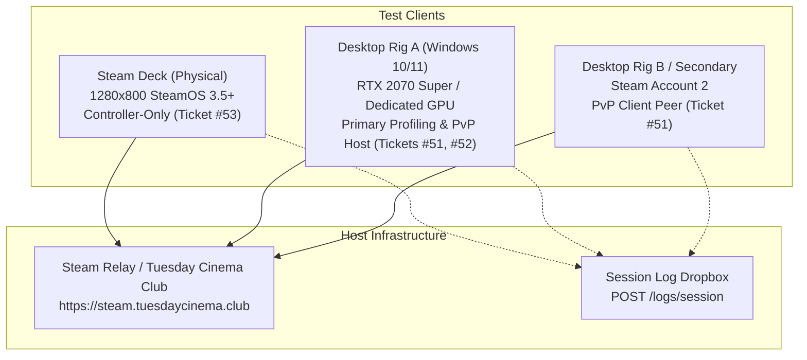
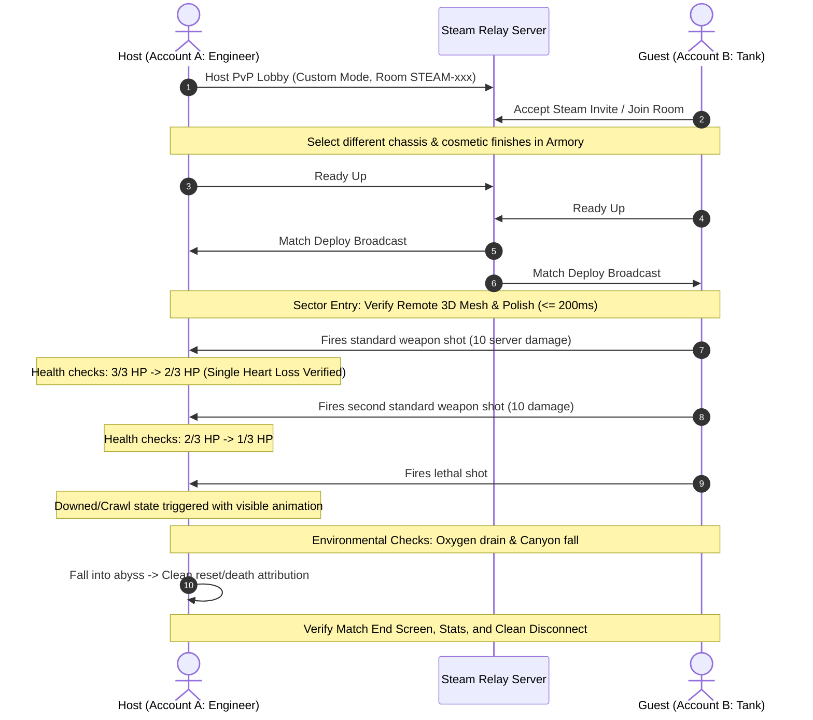
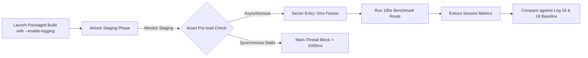
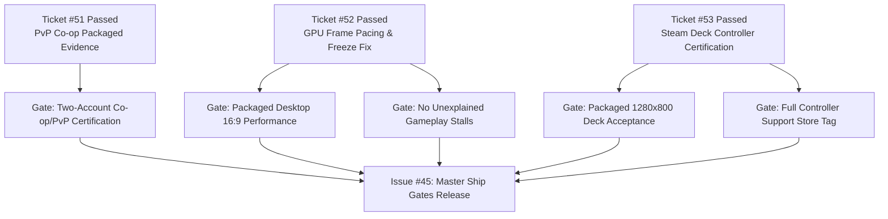

# Acceptance Testing Plan: Tickets #45, #51, #52, and #53

Comprehensive physical and packaged verification protocol for closing open Steam release blocker tickets on **Hunker Bunker** (`2.4.0-beta` / Sprint 31+).

---

## 1. Overview and Scope

This document defines the actionable, repeatable testing protocol required to resolve and close the four active release-gate issues:

| Issue | Title | Primary Focus | Required Environment |
| :--- | :--- | :--- | :--- |
| **[#51](https://github.com/grounded-play/hunker-bunker/issues/51)** | Certify Sprint 31 PvP fixes with two packaged Steam accounts | Proportional PvP damage, 3D avatar & polish sync, squad-wipe / match lifecycle | 2 physical Steam accounts on Steam relay |
| **[#52](https://github.com/grounded-play/hunker-bunker/issues/52)** | Profile and remediate packaged GPU and frame-pacing regression | Main-thread sector staging stalls, draw calls, GPU memory, frame pacing | Packaged Desktop build on physical GPU |
| **[#53](https://github.com/grounded-play/hunker-bunker/issues/53)** | Complete physical Steam Deck controller-only acceptance | 1280×800 UI readability, Steam Input action sets, suspend/resume, thermals | Physical Steam Deck in Gaming Mode |
| **[#45](https://github.com/grounded-play/hunker-bunker/issues/45)** | Ship gates: acceptance backlog for premium Steam release | Umbrella release certification, Steam review compliance, Cloud round-trip | Multi-environment master acceptance |

> [!IMPORTANT]
> In accordance with repository policy, **no issue checkbox may be marked as resolved based solely on code review or automated unit tests**. Checkboxes must be backed by dated evidence reports stored under `docs/reports/` with build SHA, telemetry log, and exact hardware specs.

---

## 2. Test Environment and Device Matrix



### Required Hardware and Software Configuration

1. **Physical Steam Deck (LCD or OLED):**
   - SteamOS 3.5 or newer, Gaming Mode (no Desktop Mode, no keyboard/mouse attached).
   - Display: Native 1280×800 resolution, 60Hz (optional 40Hz test sweep).
2. **Primary Desktop Rig (Windows 10/11):**
   - Physical discrete GPU (NVIDIA GeForce RTX 2070 Super or equivalent AMD Radeon GPU).
   - Display: 1920×1080 native 16:9 display.
   - Primary Steam account (Account A: `BUNKER-1`).
3. **Secondary Rig / Steam Account:**
   - Laptop or desktop running Steam client with secondary paid Steam account (Account B: `RAVEN-7`).
4. **Backend Services:**
   - Active relay container and Caddy proxy reachable at `https://steam.tuesdaycinema.club`.

---

## 3. Test Plan for Ticket #51: Two-Account Packaged PvP Certification

### Objective
Certify that proportional PvP combat damage (10 server points = 1 heart loss, preventing 1-shot kills), remote 3D chassis and locomotion synchronization, and match end-state resolution function correctly across two distinct, real Steam accounts in a packaged Steam build.

### Pre-conditions
- Build packaged via `npm run steam:package` from the latest `dev/sprint-34` / `mothership` commit.
- Account A and Account B are Steam friends, both logged into Steam.
- Ensure backend relay is reachable (`https://steam.tuesdaycinema.club/health`).

### Step-by-Step Test Procedure



### Detailed Test Cases

| Case ID | Verification Target | Execution Action | Expected Result |
| :--- | :--- | :--- | :--- |
| **51-TC01** | Lobby & Avatar Handshake | Account A hosts; Account B joins via Steam overlay. Select different chassis classes and weapon polish. | Both players appear in roster; loadout and chassis sync without placeholder fallback. |
| **51-TC02** | Remote 3D Model & Locomotion | Both players deploy into Sector 1. Observe peer while moving, sprinting, and turning. | Full 3D model upgrades in under 200ms; walk/run cycles sync smoothly without micro-teleportation. |
| **51-TC03** | Damage Scaling (Anti-One-Shot) | Player B fires a single primary shot hitting Player A. | Player A loses exactly 1 heart (3/3 &rarr; 2/3). Does **not** trigger an instant death or 3-heart wipe. |
| **51-TC04** | Downed State & Attribution | Player B continues firing until Player A hits 0 HP. | Player A enters downed state with crawl animation. Player B is credited with the down. |
| **51-TC05** | Environmental Damage | Player B stands in hazard / depletes oxygen; Player A jumps into canyon abyss. | Oxygen starvation ticks 1 heart progressively; canyon fall causes instant death with attribution `chasm-fall`. |
| **51-TC06** | Match Cleanup & Reconnect | Player A closes game during active match. | Relay handles host migration or clean match termination; Player B receives proper UI exit prompt without hang. |

### Evidence Collection
- Both players open debug console (`~`) and execute `exportlogs` (which automatically uploads the session to `https://steam.tuesdaycinema.club/logs/session` and preserves local fallback).
- Save report as `docs/reports/sprint-31-pvp-certification-<YYYY-MM-DD>.md`.

---

## 4. Test Plan for Ticket #52: Packaged GPU & Frame-Pacing Profiling

### Objective
Profile sustained frame pacing and eliminate the main-thread freeze observed in Log 18/Log 19 on physical desktop GPU hardware.

### Benchmark Route Specification
- **Hardware:** Desktop PC with NVIDIA GeForce RTX 2070 Super (or physical GPU).
- **Settings:** Resolution 1920×1080, Fullscreen, Quality: High, VSync: Off (for uncapped frame profiling).
- **Seed:** Authoritative fixed seed: `SEED-ALPHA-1092` (or fixed Cryo-sector seed).
- **Route:** Title &rarr; Airlock Staging &rarr; Sector 1 Main Corridor &rarr; Combat Encounter (3+ Mycelium Stalkers) &rarr; Ring 1 Gate Crossing (180 seconds total).

### Profiling Procedure



### Measurement Protocol

1. **Pre-Staging Sector Stalls (Root Cause from Log 19):**
   - Monitor the 5 critical GLB assets:
     - `prop_base_defense_turret.glb`
     - `cybersnail_dead.glb`
     - `bunker_junk_rare.glb`
     - `prop_body_human_frozen.glb`
     - `prop_conduit_hub.glb`
   - **Target:** Main-thread pause during sector entry transition must be `< 150 ms` (eliminating the 8,574 ms freeze).
2. **Sustained Gameplay Telemetry:**
   - Collect frame times over 180 seconds:
     - Average FPS: $\ge 60\text{ FPS}$
     - $p50$ frame time: $\le 16.6\text{ ms}$
     - $p95$ frame time: $\le 20.0\text{ ms}$
     - $p99$ frame time: $\le 25.0\text{ ms}$
     - Long tasks ($\ge 100\text{ ms}$): $\le 3$ occurrences throughout the entire run.
     - Peak GPU Memory: $\le 450\text{ MB}$ (geometry + textures).
3. **Adaptive Quality Stability:**
   - Confirm adaptive quality scaler does not drop resolution or disable post-processing under normal 1080p combat.

### Evidence Collection
- Run `exportlogs` from console at run completion.
- Record session duration, memory, and frame stats.
- Commit comparison report to `docs/reports/packaged-gpu-pacing-benchmark-<YYYY-MM-DD>.md`.

---

## 5. Test Plan for Ticket #53: Steam Deck Controller-Only Acceptance

### Objective
Certify that the packaged Steam build runs with 100% controller accessibility at native 1280×800 on physical Steam Deck hardware without touch/mouse assistance.

### Pre-conditions
- Physical Steam Deck in standard Gaming Mode.
- No Bluetooth keyboard, mouse, or touch input used during test execution.
- Steam Input layout set to official *Hunker Bunker Default Gamepad* template.

### Navigation and Gameplay Verification Matrix

| Category | Action / Screen | Verification Procedure | Pass Criteria |
| :--- | :--- | :--- | :--- |
| **Boot & Menus** | Title &rarr; Main Menu | Boot game; press `A` on controller at title prompt. | Focus moves cleanly to menu buttons; active button shows visible neon highlight. |
| **Armory & Loadout** | Operator Selection | Navigate tabs using `LB` / `RB`. Select weapon and polish using D-pad / `A`. | All chassis and item cards focusable; tooltips do not clip off-screen. |
| **Cinematics** | Opening Cutscenes | Trigger intro cinematic. Hold `B` or press `Start` to skip. | Skip gauge fills; skipping immediately frees player controls with no lingering audio or locked camera. |
| **Steam Input Sets** | Action Set Switching | Open pause menu mid-combat (`Start`); close menu (`B`). | Input switches seamlessly between `Gameplay` and `Menu` sets; sticks never freeze or remain pinned to menu mode. |
| **HUD & Readability** | 1280×800 Inspection | Observe vital hearts, oxygen meter, minimap icons, ammo counter, and modal popups. | Fonts are crisp, legible at arm's length (Deck handheld distance), text does not truncate or overlap. |
| **Gameplay Controls** | Core Combat Loop | Move (`Left Stick`), aim (`Right Stick`), fire (`RT`), sprint (`L3`), interact/read log (`X`), reload (`X`), dash/dodge (`B`). | Zero deadzone anomalies; aim sensitivity is responsive with analog smoothing. |
| **Power Lifecycle** | Suspend & Resume | Put Steam Deck to sleep (Power Button) during Sector 1 combat. Wait 30 seconds. Power on. | Game resumes immediately into paused or active state without audio crackle, WebGL context loss, or crash. |
| **Thermals & Battery** | Sustained Play (15 min) | Play continuously through Sector 1 and Sector 2. Monitor SteamOS Performance Overlay (Level 2). | Solid 60 FPS (or 40Hz cap); GPU temp $\le 75^\circ\text{C}$; power draw $\le 15\text{W}$. |

### Evidence Collection
- Export session log via debug console (`exportlogs`).
- Capture 2–3 screenshots showing HUD readability and modal presentation.
- Commit final report to `docs/reports/steam-deck-physical-acceptance-<YYYY-MM-DD>.md`.

---

## 6. Master Ship Gates (#45) Resolution Mapping

Once tickets #51, #52, and #53 pass their respective hardware protocols, issue #45 can be updated and closed according to this dependency mapping:



### Closure Checklist for Issue #45

- [ ] **Two-real-Steam-account packaged co-op certification** &rarr; Verify dated report from Ticket #51.
- [ ] **Real Steam Cloud round trip** &rarr; Verify Save machine A &rarr; Steam Cloud &rarr; Restore Machine B.
- [ ] **Packaged desktop 16:9 visual/performance acceptance** &rarr; Verify dated report from Ticket #52.
- [ ] **Packaged 1280×800 / Steam Deck acceptance** &rarr; Verify dated report from Ticket #53.
- [ ] **No unexplained release-blocking gameplay stalls** &rarr; Verify 8.57s GLB staging freeze is documented resolved in Ticket #52.
- [ ] **Human Proof Run / first-hour acceptance** &rarr; Complete an observed unassisted play session with a fresh player.
- [ ] **Steam Review Compliance:**
  - [ ] Store library hero, capsule, logo match Valve guidance.
  - [ ] AI disclosure questionnaire reflects current assets.
  - [ ] Controller support claims validated by Deck certification.
  - [ ] SteamOS / Linux compatibility verified.

---

## 7. Execution Quick Reference

When executing these verification runs, use the following standardized CLI commands:

```bash
# 1. Package the authoritative build for physical testing
npm run steam:package

# 2. Run local pre-flight checks before distributing build
npm run presubmit
npm test
npm run lint

# 3. Retrieve uploaded test logs from the central server
node scripts/fetch-session-logs.mjs

# 4. In-game: Export and upload session telemetry
# Press `~` to open the console and type:
exportlogs
```
