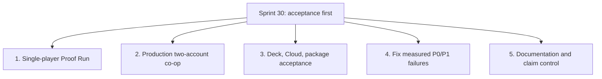

# Hunker Bunker Versioning Strategy & Release Roadmap

**Current Active Sprint:** Sprint 45

**Active Development Branch:** `dev/sprint-45`

**Current Working Version:** `v2.4.10-beta` (`2.4.10-beta` in `package.json`, branch `dev/sprint-45`)

**Latest Tagged Baseline:** `v2.4.4-beta` at Sprint 40 integration on `mothership` (`e017b06`)

**Main Branch:** `mothership`

---

## 1. Versioning Architecture & SemVer Standard

Hunker Bunker follows a structured Semantic Versioning convention:

$$\textbf{v[MAJOR].[MINOR].[PATCH]-[PRE-RELEASE]}$$

- **MAJOR (vX.0.0):** Landmark architectural leaps (e.g. initial public release, massive multiplayer network migrations, engine overhauls).
- **MINOR (v2.X.0):** Major Sprint feature deliverables (e.g. Act 2 story expansion, 3D model conversion & Armory overhaul in v2.3.0-beta).
- **PATCH (v2.3.X):** Iterative feature polish, bug fixes, balancing, optimization, and cosmetic additions within an active sprint lane.
- **PRE-RELEASE TAGS:**
  - `-beta`: Public development and feature sprint builds deployed for testing and verification.
  - `-rc.N`: Release candidates locked for pre-launch validation and Steam depot certification.
  - *(no tag)*: Final production builds published to Steam default branch.

### Standing rules

**The project is in permanent beta.** `-beta` stays on the version until there
is a deliberate decision to ship to the Steam default branch. Do not strip it
because a build is called a "release build" — that phrase means a real,
shippable build, not a production tag. Only `-rc.N` and untagged carry release
semantics, and neither is reached by ordinary sprint work.

**Every PR gets a version bump.** Default to a PATCH bump; that is what nearly
all PRs are. Reserve MINOR for a sprint's headline deliverable (the scale of
v2.3.0-beta's 46 models and Armory rebuild) and MAJOR for engine-level leaps.
Bump `package.json` and `package-lock.json` together (`npm version <v>
--no-git-tag-version`), update the header above, and add a ledger row below.

---

## 2. Release & Sprint History Ledger

| Version | Sprint / Branch | Release Date | PR / Base Commit | Key Deliverables & Milestones |
| :--- | :--- | :--- | :--- | :--- |
| **v2.0.1-beta** | Sprint 16 | 2026-07-28 | `v2.0.1-beta` | Baseline survival loop, basic room generation, initial UI framework. |
| **v2.1.0-beta** | Sprint 21 | 2026-08-03 | `v2.1.0-beta` | Multiplayer runtime prototype, co-op damage sync, network seed dispatch. |
| **v2.2.0-beta** | Sprint 26 (`dev/sprint-26`) | 2026-08-20 | [PR #38](https://github.com/grounded-play/hunker-bunker/pull/38) | Steamworks stats (8/8 synced), Steam Cloud save bridge, self-hosted TLS auth backend (`steam.tuesdaycinema.club`), Depth Contract initial wiring, host failover. |
| **v2.3.0-beta** | Sprint 28 (`dev/sprint-28`) | 2026-08-23 | [PR #40](https://github.com/grounded-play/hunker-bunker/pull/40) (`030a8f9`) | **46 new 3D models** (30 community chassis skins + 16 Season 0 assets), redesigned 3-column Armory with class backgrounds, Wanderer companion system, Steam Deck twin-stick aiming preset, mid-run crash recovery (`runCheckpoint.js`), GPU frame profiler, all 8 transformative relics. |
| **v2.3.1-beta** | Sprint 29 (`dev/sprint-29`) | 2026-08-24 | `959239c` on `mothership` | Presentation telemetry and fixes, 11 optimized runtime models, reward/XP feedback, lighting reports, weapon/charm calibration, locomotion cadence, and chroma-green auditing. |
| **v2.3.2-beta** | `fix/mayor-tina-and-astra-plan` | 2026-09-09 | PR to `mothership` | 3D chest-mounted operator patches snug on breastplate (`mixamorig1Spine2`), high-fidelity transparent RGBA decals (4120, 4121, 4122, 4124, 4125), startup UI scale flash fix, Mayor Tina seeded placement/facing, squad-wipe co-op handling, retail asset payload repair, and full test expansion (2,623 tests across 293 files). |
| **v2.4.0-beta** | Sprint 33 (`dev/sprint-33`) | 2026-09-10 | [PR #61](https://github.com/grounded-play/hunker-bunker/pull/61) | Co-op shared world events and enemy materialization, friendly-fire shove, 21.4 s O₂-build stall removed, post-processing re-enabled, session-log export fixed on PC and Deck. 2,826 tests across 318 files. |
| **v2.4.1-beta** | Sprint 35 (`dev/sprint-35`) | 2026-09-11 | PR to `mothership` | Initial localization sweep and enemy dismemberment pass. 2,989 tests across 330 files. |
| **v2.4.2-beta** | `dev/destructibles` | 2026-09-11 | PR to `mothership` | Destruction pass, prop physics chunks, story linchpins, and Mayor Tina killable. 3,048 tests across 334 files. |
| **v2.4.4-beta** | Sprint 40 (`dev/sprint-40`) | 2026-09-16 | [PR #72](https://github.com/grounded-play/hunker-bunker/pull/72) (`e017b06`) | **Deep localization (7 locales)** with 0 unlocalized DOM sinks and runtime catalogs; **Alternate Radio Voice Banks** (Soviet Sub-Commander & AURA with 104 slots / 208 takes, persona cards, and crash sequences); **10 motion ending cinematics** with audio beds; **Phase A AgX tone mapping & IBL reflections**; 52 playtest stability tickets (DP-01 through DP-52). 3,548 tests across 392 files, 9/9 Playwright E2E browser tests. |
| **v2.4.10-beta (Staged)** | Sprint 45 (`dev/sprint-45`) | 2026-09-23 | Branch commits on `dev/sprint-45` | **Seeded expeditions in a persistent campaign**: 5 conditions with gameplay effects, kill signatures and atmosphere; per-deployment corridor rubble; six-room camp/hive compounds with room title cards and hive encounter profiles; versioned route generation (old saves keep their geography); per-campaign gate challenges; world transformations (canyon bridge deck, fortified perimeters, hive bond/harvest outcomes); scan fog-of-war and grouped hazard zones; HUD overlap fixes; cursor hidden in cinematics; Deck title-screen frost; crossings proven walkable (five gate defects fixed); overnight creep and camp condition with gameplay effects; campaign-rolled O₂ objective packages. 3,948 tests across 429 files. Not verified on Deck hardware, co-op or Cloud. [Release notes](releases/v2.4.10-beta.md). |
| **v2.4.9-beta** | Sprint 43 (`dev/sprint-43`) | 2026-09-22 | Release PR to `mothership` | Playable campaign day cycle (fatigue, scars, bed, overnight sim), seeded ring-gate placement with a variety ratchet, Camp Meridian re-anchoring and unopenable-gate fixes, Steam Deck pointer and Armory navigation fixes. 3,820 tests across 417 files. [Release notes](releases/v2.4.9-beta.md). |
| **v2.4.8-beta** | Sprint 41 (`dev/sprint-41`) | 2026-09-22 | Release PR to `mothership` | Armory layout and typography on game tokens, universal settings-gear anchor, equipment sockets, fatigue ladder and overnight loop, showroom door framing, multiplayer loadout sync. 3,660 tests across 403 files. [Release notes](releases/v2.4.8-beta.md). |
| **v2.4.7-beta (Staged)** | Sprint 41 (`dev/sprint-41`) | 2026-09-18 | Release PR to `mothership` | **Localization closed out on both axes**: markup coverage 52 → 0, content catalogs to 100%, 1,898 keys per locale at exact parity, `alt` made translatable, Steam Vault empty state localized. Visual Overhaul Phases B and D, multi-chunk authored setpiece resolution, debug-tools bundle split, voice unlock and Soviet Commander Russian dialogue, `three` 0.186.0. 3,566 tests across 395 files, 9/9 Playwright E2E across all 7 locales. [Release notes](releases/v2.4.7-beta.md). |

---

## 3. Sprint 30 Roadmap & Iteration Objectives

Sprint 30 deliberately narrows the work to acceptance and the defects that its
end-to-end routes expose. The executable plan is
[`planning/sprint-30.md`](planning/sprint-30.md).



---

## 4. Release Promotion & Verification Workflow

When promoting changes or releasing a version, follow this standard release checklist:

### Step 1: Version Bumping
1. Update `package.json` and `package-lock.json` with the target version.
2. Update `index.html` system tag.
3. Update `PRODUCT_STATE.md` and this ledger.

### Step 2: Full Local Presubmit & Test Gate
Run all audit and test suites to ensure 100% green status:
```bash
npm run lint                  # 0 errors / 0 warnings
npm run presubmit             # Claims, SFX, retail assets, item catalog, soundtrack
npm run audit:dependencies    # Production dependencies mapped
npm run build                 # Vite bundle + audit:build-media
npm run coverage              # Vitest suite (current baseline: 2,152 tests)
```

### Step 3: Branch Pull Request & Review
1. Commit all changes to the active sprint branch.
2. Push that branch to the remote.
3. Open/update PR into `mothership` on GitHub.
4. Verify automated CI/CD checks pass on GitHub Actions.

### Step 4: Merge & Release Publication
1. Merge PR into `mothership`.
2. Generate/update release notes in `docs/releases/vX.Y.Z-beta.md`.
3. Create annotated git tag: `git tag -a vX.Y.Z-beta -m "Hunker Bunker vX.Y.Z-Beta — Sprint Name"`.
4. Push tag: `git push origin vX.Y.Z-beta`.
5. Create GitHub release: `gh release create vX.Y.Z-beta --title "..." --notes-file docs/releases/vX.Y.Z-beta.md`.
6. Dispatch Steam depot release: `HB_STEAM_BACKEND_URL=https://steam.tuesdaycinema.club npm run steam:upload`.
