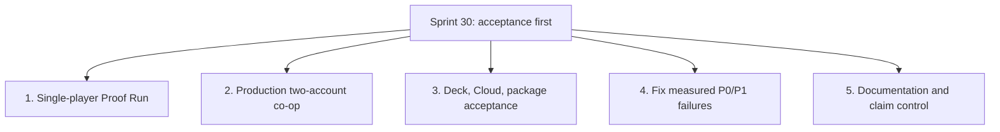

# Hunker Bunker Versioning Strategy & Release Roadmap

**Current Active Sprint:** Sprint 30

**Active Development Branch:** `dev/sprint-30`

**Current Working Version:** `v2.4.0-beta` (`2.4.0-beta` in `package.json`, branch `dev/sprint-33`)

**Latest Tagged Baseline:** `v2.4.0-beta` at Sprint 33 integration on `mothership`

**Main Branch:** `mothership`

---

## 1. Versioning Architecture & SemVer Standard

Hunker Bunker follows a structured Semantic Versioning convention:

$$\textbf{v[MAJOR].[MINOR].[PATCH]-[PRE-RELEASE]}$$

- **MAJOR (vX.0.0):** Landmark architectural leaps (e.g. initial public release, massive multiplayer network migrations, engine overhauls).
- **MINOR (v2.X.0):** Major Sprint feature deliverables (e.g. Act 2 story expansion, 3D model conversion & Armory overhaul in v2.3.0-beta).
- **PATCH (v2.3.X):** Iterative feature polish, bug fixes, balancing, optimization, and cosmetic additions within an active sprint lane.
- **PRE-RELEASE TAGS:**
  - `-beta`: Public development and feature sprint builds deployed for testing and verification.
  - `-rc.N`: Release candidates locked for pre-launch validation and Steam depot certification.
  - *(no tag)*: Final production builds published to Steam default branch.

---

## 2. Release & Sprint History Ledger

| Version | Sprint / Branch | Release Date | PR / Base Commit | Key Deliverables & Milestones |
| :--- | :--- | :--- | :--- | :--- |
| **v2.0.1-beta** | Sprint 16 | 2026-07-28 | `v2.0.1-beta` | Baseline survival loop, basic room generation, initial UI framework. |
| **v2.1.0-beta** | Sprint 21 | 2026-08-03 | `v2.1.0-beta` | Multiplayer runtime prototype, co-op damage sync, network seed dispatch. |
| **v2.2.0-beta** | Sprint 26 (`dev/sprint-26`) | 2026-08-20 | [PR #38](https://github.com/grounded-play/hunker-bunker/pull/38) | Steamworks stats (8/8 synced), Steam Cloud save bridge, self-hosted TLS auth backend (`steam.tuesdaycinema.club`), Depth Contract initial wiring, host failover. |
| **v2.3.0-beta** | Sprint 28 (`dev/sprint-28`) | 2026-08-23 | [PR #40](https://github.com/grounded-play/hunker-bunker/pull/40) (`030a8f9`) | **46 new 3D models** (30 community chassis skins + 16 Season 0 assets), redesigned 3-column Armory with class backgrounds, Wanderer companion system, Steam Deck twin-stick aiming preset, mid-run crash recovery (`runCheckpoint.js`), GPU frame profiler, all 8 transformative relics. |
| **v2.3.1-beta** | Sprint 29 (`dev/sprint-29`) | 2026-08-24 | `959239c` on `mothership` | Presentation telemetry and fixes, 11 optimized runtime models, reward/XP feedback, lighting reports, weapon/charm calibration, locomotion cadence, and chroma-green auditing. |
| **v2.3.2-beta** | `fix/mayor-tina-and-astra-plan` | 2026-09-09 | PR to `mothership` | 3D chest-mounted operator patches snug on breastplate (`mixamorig1Spine2`), high-fidelity transparent RGBA decals (4120, 4121, 4122, 4124, 4125), startup UI scale flash fix, Mayor Tina seeded placement/facing, squad-wipe co-op handling, retail asset payload repair, and full test expansion (2,623 tests across 293 files). |
| **v2.4.0-beta** | Sprint 33 (`dev/sprint-33`) | 2026-09-10 | [PR #61](https://github.com/grounded-play/hunker-bunker/pull/61) | Co-op shared world events and enemy materialization (a host-staged boss was invisible to peers), friendly-fire shove, solo runs no longer inheriting a co-op session; the 21.4 s O₂-build stall removed (two synchronous whole-scene shader recompiles); post-processing re-enabled in the shipped camera; run-card deck variety and inert effect keys resolved; session-log export fixed on PC and Steam Deck with a server drop box; upload endpoint closed and 6 dependency advisories patched; unwired-code audit and detector. 2,826 tests across 318 files. |
| **Next version: undecided** | Sprint 30 (`dev/sprint-30`) | *In progress* | Branch from `959239c` | Choose the version only after accepted Sprint 30 scope is known. |

---

## 3. Sprint 30 Roadmap & Iteration Objectives

Sprint 30 deliberately narrows the work to acceptance and the defects that its
end-to-end routes expose. The executable plan is
[`planning/sprint-30.md`](planning/sprint-30.md).



---

## 4. Release Promotion & Verification Workflow

When promoting changes or releasing a version, follow this standard release checklist:

### Step 1: Version Bumping
1. Update `package.json` and `package-lock.json` with the target version.
2. Update `index.html` system tag.
3. Update `PRODUCT_STATE.md` and this ledger.

### Step 2: Full Local Presubmit & Test Gate
Run all audit and test suites to ensure 100% green status:
```bash
npm run lint                  # 0 errors / 0 warnings
npm run presubmit             # Claims, SFX, retail assets, item catalog, soundtrack
npm run audit:dependencies    # Production dependencies mapped
npm run build                 # Vite bundle + audit:build-media
npm run coverage              # Vitest suite (current baseline: 2,152 tests)
```

### Step 3: Branch Pull Request & Review
1. Commit all changes to the active sprint branch.
2. Push that branch to the remote.
3. Open/update PR into `mothership` on GitHub.
4. Verify automated CI/CD checks pass on GitHub Actions.

### Step 4: Merge & Release Publication
1. Merge PR into `mothership`.
2. Generate/update release notes in `docs/releases/vX.Y.Z-beta.md`.
3. Create annotated git tag: `git tag -a vX.Y.Z-beta -m "Hunker Bunker vX.Y.Z-Beta — Sprint Name"`.
4. Push tag: `git push origin vX.Y.Z-beta`.
5. Create GitHub release: `gh release create vX.Y.Z-beta --title "..." --notes-file docs/releases/vX.Y.Z-beta.md`.
6. Dispatch Steam depot release: `HB_STEAM_BACKEND_URL=https://steam.tuesdaycinema.club npm run steam:upload`.
